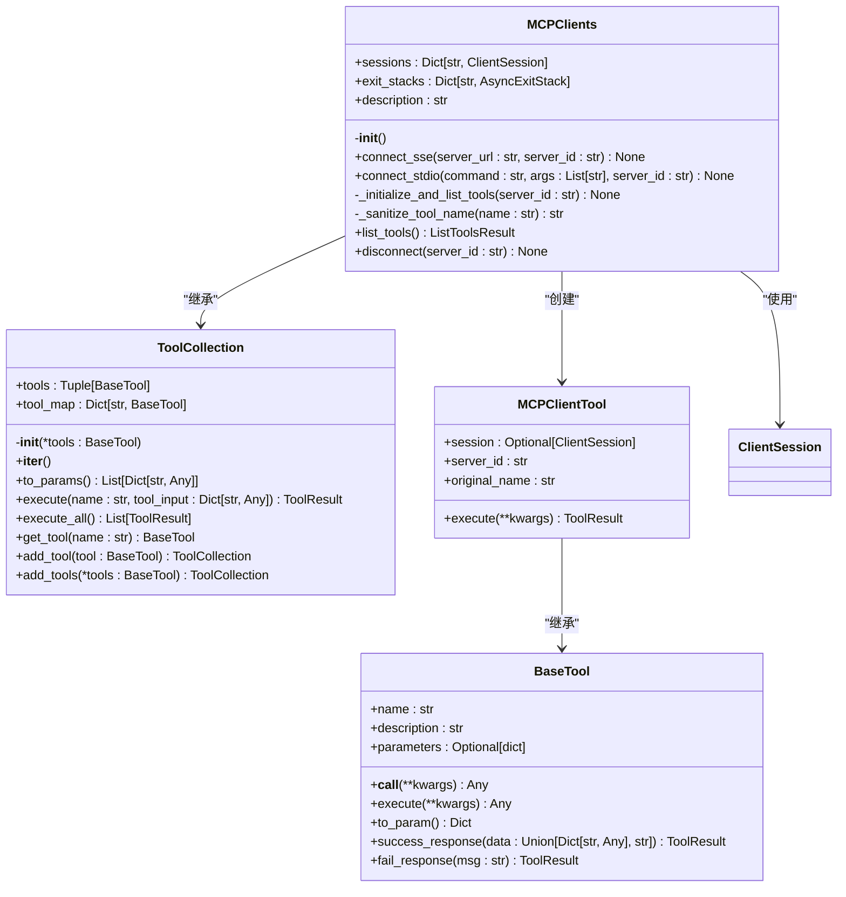
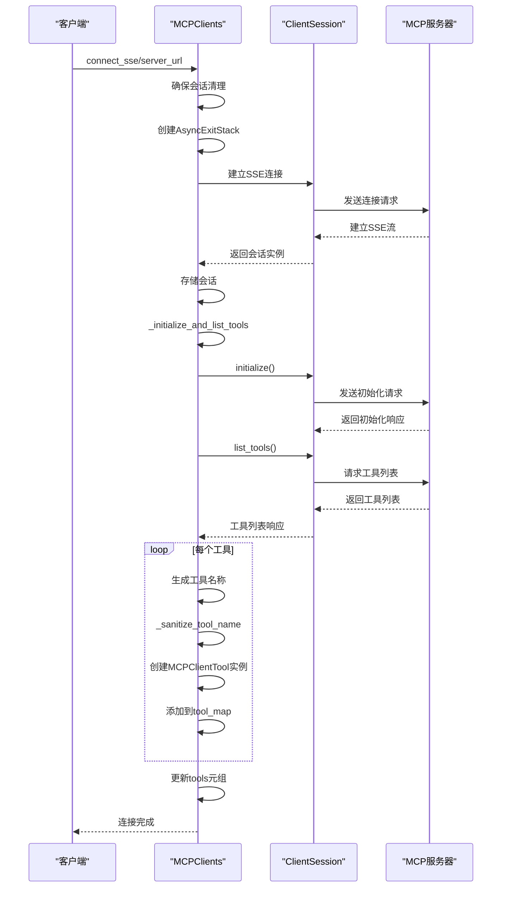
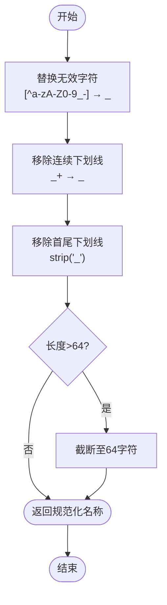
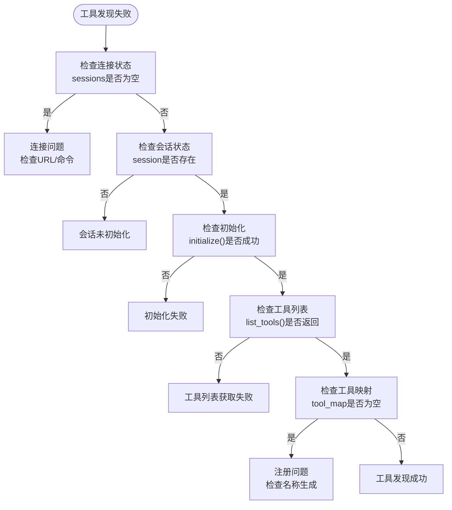

# 工具发现与动态注册

<cite>
**本文档引用的文件**  
- [MCPClients._initialize_and_list_tools](file://app/tool/mcp.py#L96-L125)
- [MCPClients._sanitize_tool_name](file://app/tool/mcp.py#L127-L144)
- [MCPClients.connect_sse](file://app/tool/mcp.py#L49-L68)
- [MCPClients.connect_stdio](file://app/tool/mcp.py#L70-L94)
- [MCPClients](file://app/tool/mcp.py#L36-L193)
- [MCPClientTool](file://app/tool/mcp.py#L13-L33)
- [ToolCollection](file://app/tool/tool_collection.py#L8-L70)
- [BaseTool](file://app/tool/base.py#L77-L172)
- [MCPAgent](file://app/agent/mcp.py#L20-L185)
</cite>

## 目录
1. [工具发现机制概述](#工具发现机制概述)
2. [核心组件分析](#核心组件分析)
3. [工具发现流程](#工具发现流程)
4. [工具命名与规范化](#工具命名与规范化)
5. [工具管理机制](#工具管理机制)
6. [工具模式与发现](#工具模式与发现)
7. [故障诊断与优化](#故障诊断与优化)

## 工具发现机制概述

OpenManus的MCP（Model Context Protocol）工具发现机制实现了从MCP服务器动态获取工具列表并注册为可用工具的功能。该机制通过`MCPClients`类作为核心组件，负责与一个或多个MCP服务器建立连接，获取服务器提供的工具列表，并将这些工具动态注册为`MCPClientTool`实例，使代理能够调用远程服务器上的工具。

工具发现过程主要在建立与MCP服务器的连接后触发，通过`_initialize_and_list_tools`方法实现。该方法首先初始化会话，然后从服务器获取工具列表，为每个工具创建`MCPClientTool`实例，并进行名称规范化处理，最终将工具注册到工具集合中供代理使用。

**Section sources**
- [MCPClients](file://app/tool/mcp.py#L36-L193)
- [MCPAgent](file://app/agent/mcp.py#L20-L185)

## 核心组件分析

### MCPClients 类

`MCPClients`类继承自`ToolCollection`，是MCP工具发现机制的核心。它管理与多个MCP服务器的连接会话，维护工具映射关系，并提供连接、初始化和断开连接的功能。

**Diagram sources**
- [MCPClients](file://app/tool/mcp.py#L36-L193)
- [ToolCollection](file://app/tool/tool_collection.py#L8-L70)
- [MCPClientTool](file://app/tool/mcp.py#L13-L33)
- [BaseTool](file://app/tool/base.py#L77-L172)

**Section sources**
- [MCPClients](file://app/tool/mcp.py#L36-L193)
- [ToolCollection](file://app/tool/tool_collection.py#L8-L70)

### MCPClientTool 类

`MCPClientTool`类继承自`BaseTool`，代表一个可以代理调用的MCP服务器工具。它封装了远程工具调用的逻辑，包括会话管理、参数传递和结果处理。

**Section sources**
- [MCPClientTool](file://app/tool/mcp.py#L13-L33)
- [BaseTool](file://app/tool/base.py#L77-L172)

## 工具发现流程

工具发现流程始于与MCP服务器建立连接，通过`connect_sse`或`connect_stdio`方法实现。连接建立后，系统自动调用`_initialize_and_list_tools`方法完成工具发现和注册。

**Diagram sources**
- [MCPClients.connect_sse](file://app/tool/mcp.py#L49-L68)
- [MCPClients._initialize_and_list_tools](file://app/tool/mcp.py#L96-L125)

**Section sources**
- [MCPClients.connect_sse](file://app/tool/mcp.py#L49-L68)
- [MCPClients.connect_stdio](file://app/tool/mcp.py#L70-L94)
- [MCPClients._initialize_and_list_tools](file://app/tool/mcp.py#L96-L125)

## 工具命名与规范化

### 工具命名规则

工具发现机制采用统一的命名规则来避免命名冲突：`mcp_{server_id}_{original_name}`。这种命名模式包含三个部分：
- `mcp`：前缀，标识这是MCP工具
- `{server_id}`：服务器标识符，确保不同服务器的工具名称隔离
- `{original_name}`：工具在服务器上的原始名称

这种命名策略确保了即使多个MCP服务器提供同名工具，它们在客户端也会被识别为不同的工具。

### 名称规范化处理

`_sanitize_tool_name`方法负责对生成的工具名称进行规范化处理，确保名称符合技术要求。该方法执行以下处理步骤：

**Diagram sources**
- [MCPClients._sanitize_tool_name](file://app/tool/mcp.py#L127-L144)

**Section sources**
- [MCPClients._sanitize_tool_name](file://app/tool/mcp.py#L127-L144)

## 工具管理机制

### tool_map 和 tools 集合

`MCPClients`类使用两种数据结构来管理工具：
- `tool_map`：字典类型，以工具名称为键，`MCPClientTool`实例为值，提供O(1)时间复杂度的工具查找
- `tools`：元组类型，包含所有工具实例，用于批量操作和序列化

工具注册过程首先将工具添加到`tool_map`中，然后更新`tools`元组。这种设计既保证了高效的工具查找，又提供了不可变的工具集合视图。

### 工具生命周期管理

工具的生命周期与服务器连接紧密关联。当调用`disconnect`方法断开连接时，系统会：
1. 关闭会话和资源管理器
2. 从`sessions`和`exit_stacks`中移除相关记录
3. 从`tool_map`中移除该服务器关联的所有工具
4. 重新生成`tools`元组

这种设计确保了工具集合的实时性和一致性。

**Section sources**
- [MCPClients](file://app/tool/mcp.py#L36-L193)
- [ToolCollection](file://app/tool/tool_collection.py#L8-L70)

## 工具模式与发现

工具模式（tool_choices）在工具发现过程中扮演重要角色。`MCPAgent`类通过`_refresh_tools`方法定期检查工具列表的变化，检测工具的添加、移除和模式变更。

当检测到工具模式变化时，系统会：
- 记录日志信息
- 向代理内存添加系统消息通知
- 在极端情况下（所有工具被移除），终止代理执行

这种机制确保了代理能够及时响应MCP服务器端的工具变更，保持工具集合的最新状态。

**Section sources**
- [MCPAgent._refresh_tools](file://app/agent/mcp.py#L100-L140)
- [MCPAgent.think](file://app/agent/mcp.py#L142-L155)

## 故障诊断与优化

### 工具发现失败诊断

当工具发现失败时，可按以下步骤进行诊断：

**Diagram sources**
- [MCPClients._initialize_and_list_tools](file://app/tool/mcp.py#L96-L125)

### 性能优化建议

1. **连接复用**：避免频繁建立和断开连接，重用现有会话
2. **批量操作**：在可能的情况下，批量处理工具调用
3. **缓存策略**：合理设置工具刷新间隔，避免过度频繁的`_refresh_tools`调用
4. **错误处理**：实现优雅的错误恢复机制，避免因单个工具失败影响整体功能
5. **资源管理**：确保`AsyncExitStack`正确管理资源，防止资源泄漏

**Section sources**
- [MCPClients](file://app/tool/mcp.py#L36-L193)
- [MCPAgent](file://app/agent/mcp.py#L20-L185)