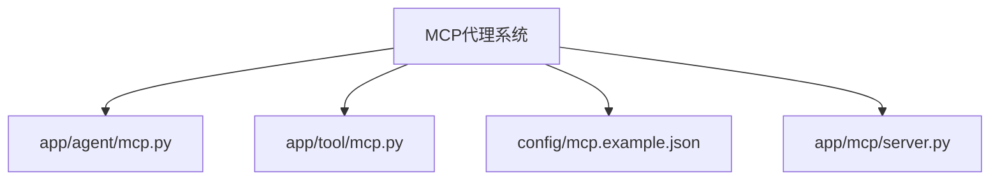
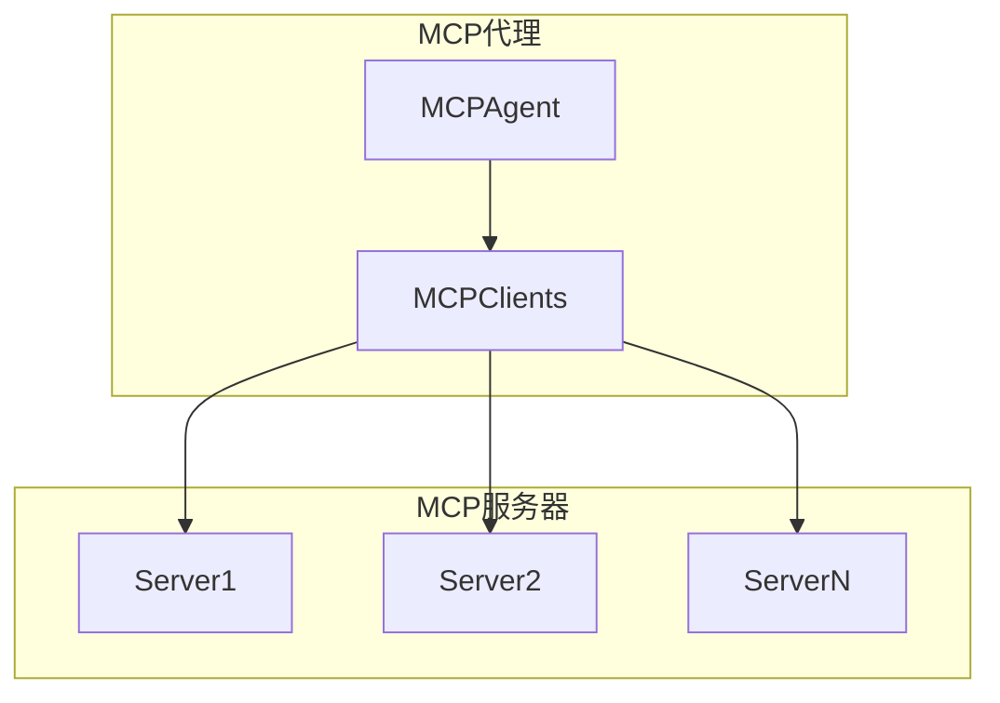
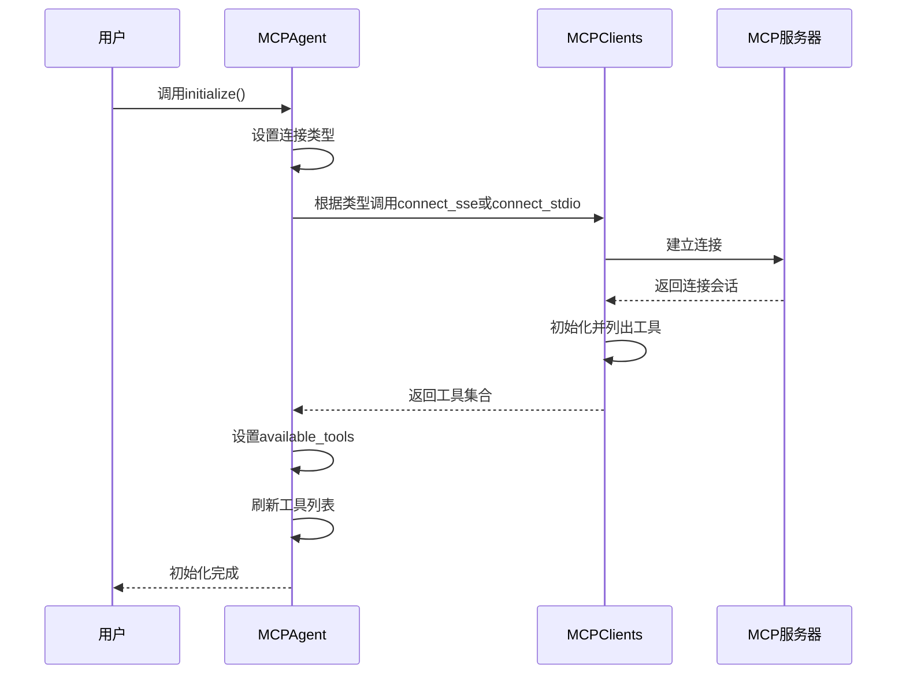
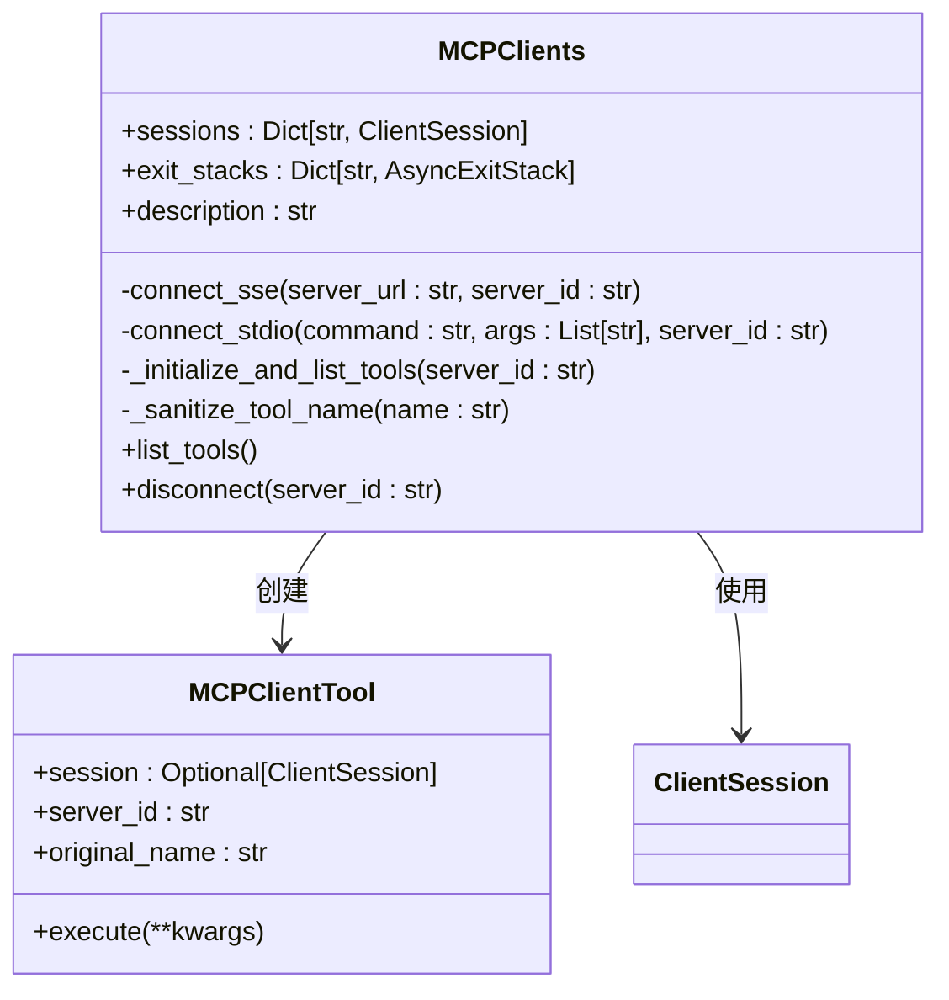
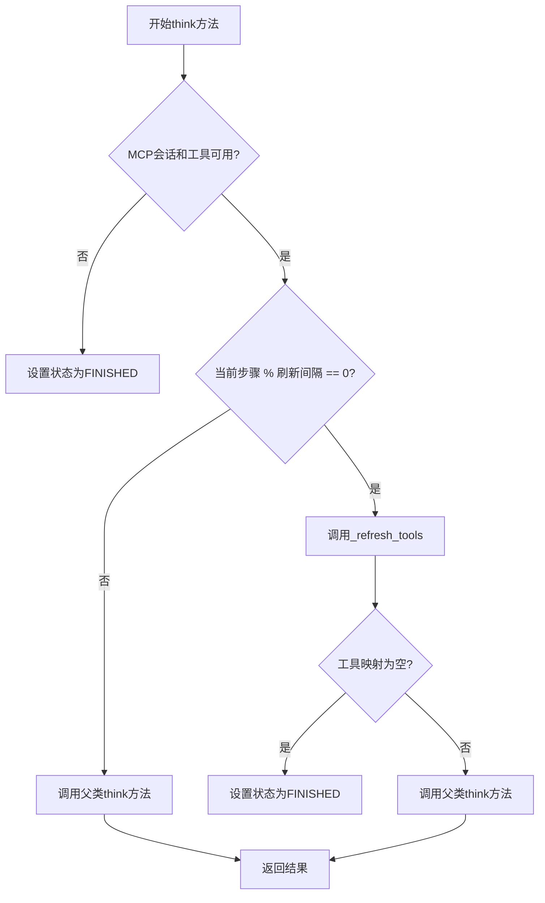
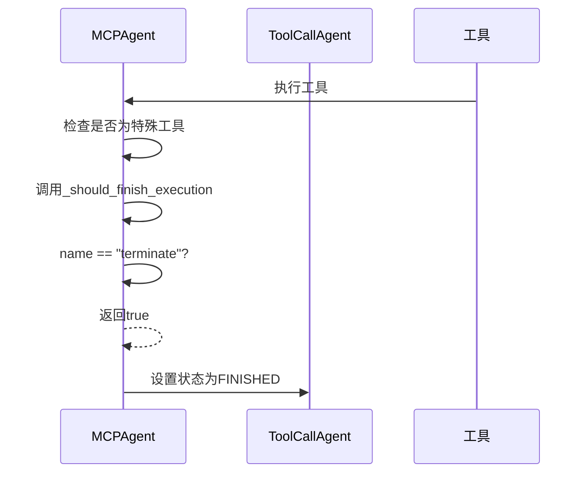
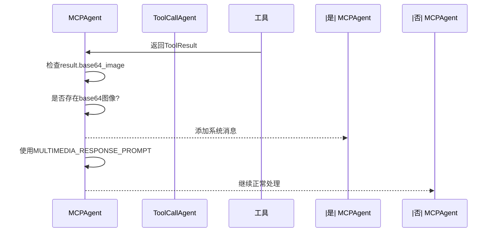
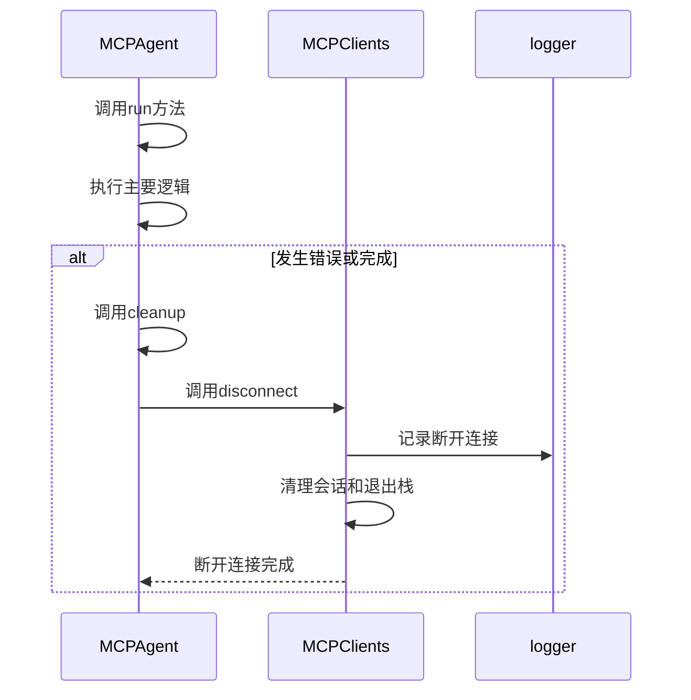
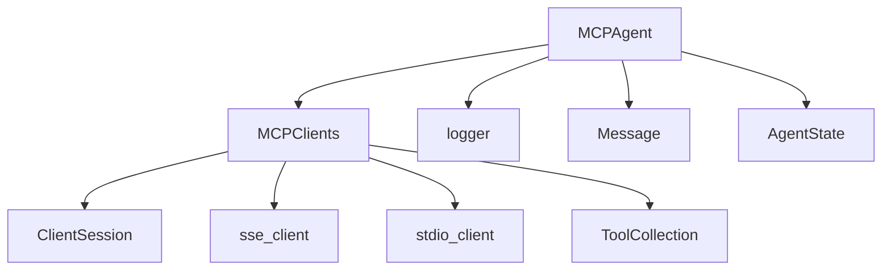

# MCP代理

<cite>
**本文档中引用的文件**  
- [mcp.py](file://app/agent/mcp.py)
- [mcp.py](file://app/tool/mcp.py)
- [mcp.example.json](file://config/mcp.example.json)
- [server.py](file://app/mcp/server.py)
</cite>

## 目录
1. [简介](#简介)
2. [项目结构](#项目结构)
3. [核心组件](#核心组件)
4. [架构概述](#架构概述)
5. [详细组件分析](#详细组件分析)
6. [依赖分析](#依赖分析)
7. [性能考虑](#性能考虑)
8. [故障排除指南](#故障排除指南)
9. [结论](#结论)

## 简介
MCP代理（MCPAgent）是OpenManus系统中的关键组件，负责与MCP（Model Context Protocol）服务器进行交互。该代理通过SSE或stdio传输方式连接到MCP服务器，并利用服务器提供的工具来完成各种任务。本技术文档详细阐述了MCP代理与MCP服务器交互的完整机制，包括连接模式、工具管理、状态控制和错误处理等核心功能。

## 项目结构
MCP代理相关的代码主要分布在`app/agent`和`app/tool`目录下，配置文件位于`config`目录。核心文件包括`app/agent/mcp.py`（代理实现）、`app/tool/mcp.py`（客户端工具集合）和`config/mcp.example.json`（配置示例）。

**图示来源**
- [mcp.py](file://app/agent/mcp.py)
- [mcp.py](file://app/tool/mcp.py)
- [mcp.example.json](file://config/mcp.example.json)
- [server.py](file://app/mcp/server.py)

## 核心组件
MCP代理的核心组件包括MCPAgent类、MCPClients工具集合和MCP服务器实现。这些组件协同工作，实现了与远程MCP服务器的连接、工具发现和执行功能。

**节来源**
- [mcp.py](file://app/agent/mcp.py)
- [mcp.py](file://app/tool/mcp.py)

## 架构概述
MCP代理采用分层架构设计，上层是MCPAgent代理类，中层是MCPClients工具集合，底层是MCP服务器。代理通过MCPClients与一个或多个MCP服务器建立连接，动态发现可用工具，并在执行过程中定期刷新工具列表。

**图示来源**
- [mcp.py](file://app/agent/mcp.py)
- [mcp.py](file://app/tool/mcp.py)

## 详细组件分析

### MCP代理初始化
MCP代理的初始化过程支持两种连接模式：SSE和stdio。通过`initialize`方法配置连接参数，建立与MCP服务器的连接。

**图示来源**
- [mcp.py](file://app/agent/mcp.py#L39-L84)
- [mcp.py](file://app/tool/mcp.py#L49-L94)

### 工具管理机制
MCPClients工具集合负责管理与MCP服务器的连接和工具发现。它通过`connect_sse`和`connect_stdio`方法建立连接，并通过`_initialize_and_list_tools`方法初始化会话和填充工具映射。

**图示来源**
- [mcp.py](file://app/tool/mcp.py)

### 工具刷新设计
MCP代理每5个步骤自动刷新工具列表的设计原理是通过`_refresh_tools_interval`参数控制的。在`think`方法中，通过检查`current_step % _refresh_tools_interval`来决定是否刷新工具。

**图示来源**
- [mcp.py](file://app/agent/mcp.py#L133-L151)
- [mcp.py](file://app/agent/mcp.py#L86-L131)

### 终止机制
特殊工具名称如'terminate'通过`_should_finish_execution`方法触发代理终止状态。当工具名称为'terminate'时，该方法返回true，导致代理状态设置为FINISHED。

**图示来源**
- [mcp.py](file://app/agent/mcp.py#L166-L169)
- [mcp.py](file://app/agent/toolcall.py#L220-L222)

### 多媒体响应处理
多媒体响应处理机制通过`_handle_special_tool`方法实现。当工具结果包含base64图像时，该方法将系统消息添加到内存中，通知用户收到了多媒体响应。

**图示来源**
- [mcp.py](file://app/agent/mcp.py#L153-L164)
- [mcp.py](file://app/prompt/mcp.py)

### 错误处理与连接清理
错误处理和连接清理通过`cleanup`方法实现。该方法在代理运行结束后或发生错误时被调用，确保MCP连接被正确关闭。

**图示来源**
- [mcp.py](file://app/agent/mcp.py#L171-L175)
- [mcp.py](file://app/tool/mcp.py#L154-L193)

## 依赖分析
MCP代理依赖于多个核心组件，包括MCPClients工具集合、MCP服务器、日志记录器和消息系统。这些依赖关系确保了代理能够正常运行并与外部系统交互。

**图示来源**
- [mcp.py](file://app/agent/mcp.py)
- [mcp.py](file://app/tool/mcp.py)

## 性能考虑
MCP代理的性能主要受工具刷新频率、连接模式和网络延迟的影响。建议根据实际使用场景调整`_refresh_tools_interval`参数，平衡工具更新的及时性和性能开销。

## 故障排除指南
常见问题包括连接失败、工具不可用和多媒体响应处理异常。检查连接参数、服务器状态和网络连接是解决这些问题的关键步骤。

**节来源**
- [mcp.py](file://app/agent/mcp.py)
- [mcp.py](file://app/tool/mcp.py)

## 结论
MCP代理是OpenManus系统中实现与MCP服务器交互的核心组件。通过SSE和stdio两种连接模式，动态工具管理和定期刷新机制，以及完善的错误处理和清理功能，MCP代理为系统提供了灵活可靠的远程工具调用能力。