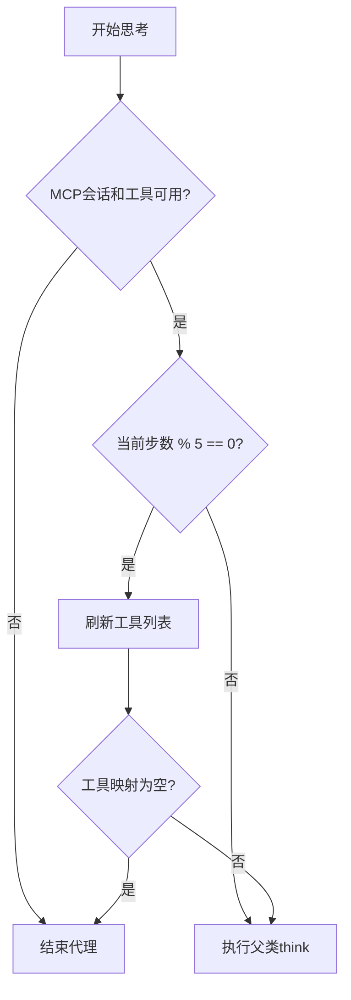
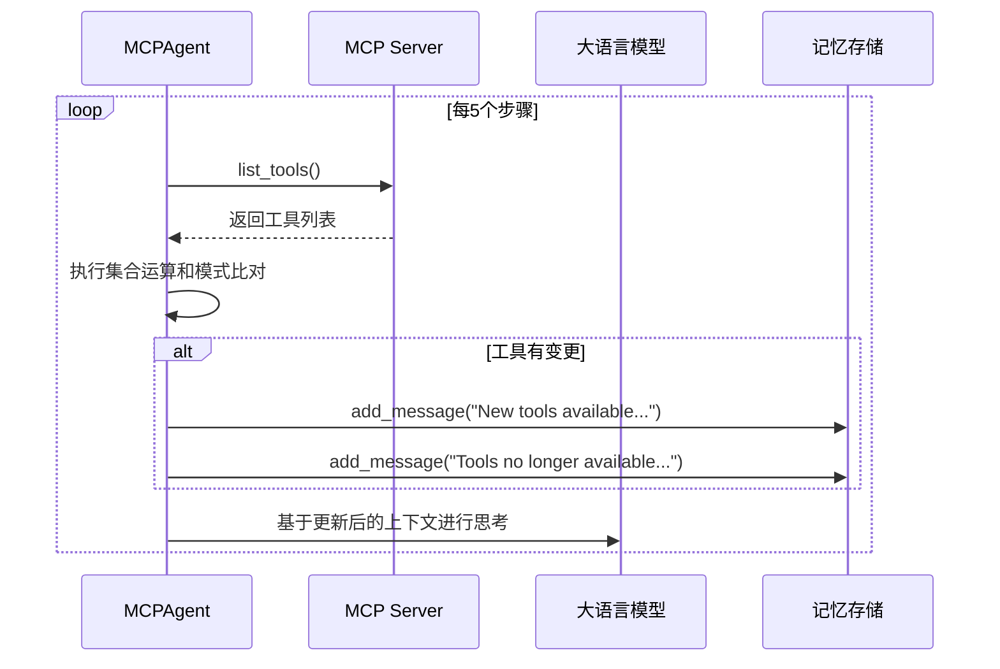
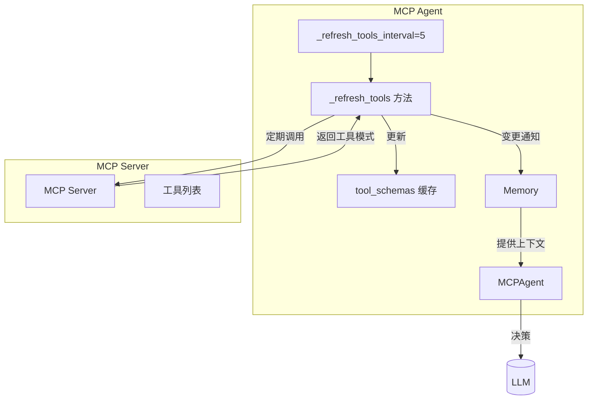

# 动态刷新

<cite>
**本文档引用的文件**
- [mcp.py](file://app/agent/mcp.py)
- [tool_collection.py](file://app/tool/tool_collection.py)
- [base.py](file://app/agent/base.py)
</cite>

## 目录
1. [简介](#简介)
2. [核心机制分析](#核心机制分析)
3. [工具刷新与代理状态管理](#工具刷新与代理状态管理)
4. [变更检测算法详解](#变更检测算法详解)
5. [系统消息通知机制](#系统消息通知机制)
6. [架构流程图](#架构流程图)

## 简介
本文档详细阐述OpenManus MCP代理的动态工具列表刷新机制。该机制通过每5个执行步骤自动检测工具集合的变化，确保代理能够实时感知外部MCP服务端的工具增删改操作。文档重点分析了_refresh_tools_interval参数的设计原理、_refresh_tools方法的变更检测逻辑、三类变更（added_tools、removed_tools、changed_tools）的处理策略，以及工具变化与代理终止条件之间的关联逻辑。

## 核心机制分析

`MCPAgent`类实现了动态刷新机制的核心功能。通过设置`_refresh_tools_interval = 5`，系统能够在每个第5步（current_step % 5 == 0）自动触发工具列表的同步检查。这一设计平衡了实时性与性能开销，避免了过于频繁的网络请求。

`_refresh_tools`方法是整个刷新机制的核心，负责从MCP服务器获取最新的工具列表，并与本地缓存的`tool_schemas`进行比对，识别出新增、删除和修改的工具。该方法在`think`函数中被周期性调用，构成了代理感知外部环境变化的关键环节。

**本节来源**
- [mcp.py](file://app/agent/mcp.py#L34-L34)
- [mcp.py](file://app/agent/mcp.py#L86-L131)

## 工具刷新与代理状态管理

工具刷新机制与代理的生命周期管理紧密耦合。在`think`方法中，系统首先检查MCP会话和工具映射的可用性。如果会话或工具映射为空，则立即终止代理执行。

关键的终止逻辑在于：当周期性刷新后发现`mcp_clients.tool_map`为空时，表明所有工具均已被移除，这通常意味着MCP服务已关闭。此时，系统会将代理状态设置为`AgentState.FINISHED`，从而优雅地结束整个代理的运行。这种设计确保了代理不会在失去所有可用工具的情况下继续无效运行。

**本节来源**
- [mcp.py](file://app/agent/mcp.py#L133-L151)
- [mcp.py](file://app/agent/mcp.py#L86-L131)

## 变更检测算法详解

`_refresh_tools`方法采用了一套高效的集合运算和模式比对算法来检测工具变化：

1.  **集合运算**：通过将当前工具名集合`current_names`与之前工具名集合`previous_names`进行差集运算，快速识别出`added_tools`（新增）和`removed_tools`（删除）。
2.  **模式比对**：对于名称未变的工具，通过遍历交集`current_names.intersection(previous_names)`，逐个比较其`inputSchema`是否发生变化。如果模式不一致，则将其加入`changed_tools`列表。

该算法的时间复杂度为O(n)，其中n为工具总数，具有良好的性能表现。它不仅能检测工具的增删，还能精确捕捉到工具参数模式的变更，为LLM提供了更准确的上下文信息。

**本节来源**
- [mcp.py](file://app/agent/mcp.py#L98-L108)

## 系统消息通知机制

当检测到工具变更时，系统会通过向代理的`memory`中添加`system_message`来通知LLM上下文已更新。这是一种关键的上下文同步机制：

- **新增工具**：发送"New tools available: {tool_name}"消息，提示LLM有新的能力可用。
- **删除工具**：发送"Tools no longer available: {tool_name}"消息，防止LLM尝试调用已不存在的工具。
- **变更工具**：发送"Changed MCP tools: {tool_name}"日志，虽然未直接通知LLM，但为调试提供了重要信息。

这些系统消息被添加到对话历史中，确保LLM在后续的决策中能够基于最新的工具集进行规划，从而保证了代理行为的准确性和适应性。

**本节来源**
- [mcp.py](file://app/agent/mcp.py#L110-L125)
- [base.py](file://app/agent/base.py#L120-L125)

## 架构流程图

下图展示了MCP代理动态刷新机制的整体架构和数据流。

**图表来源**
- [mcp.py](file://app/agent/mcp.py#L86-L131)
- [base.py](file://app/agent/base.py#L120-L125)