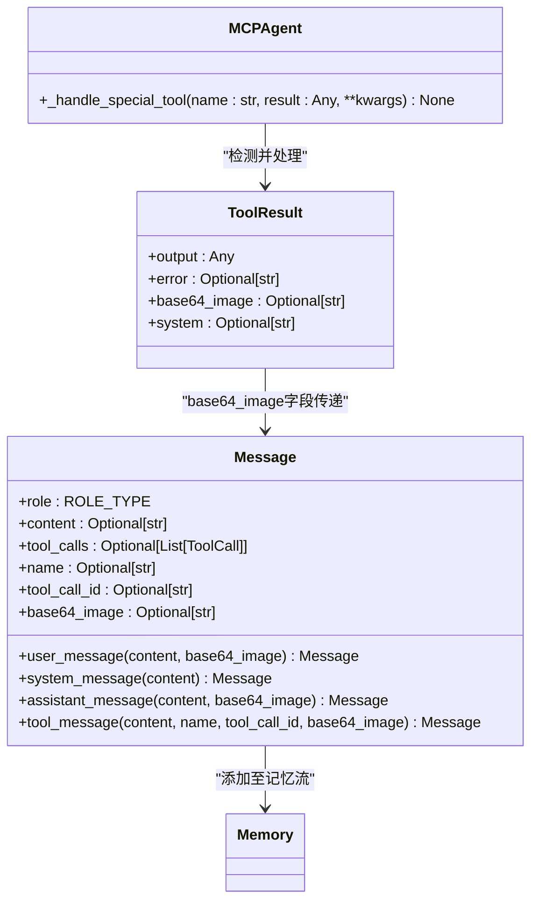
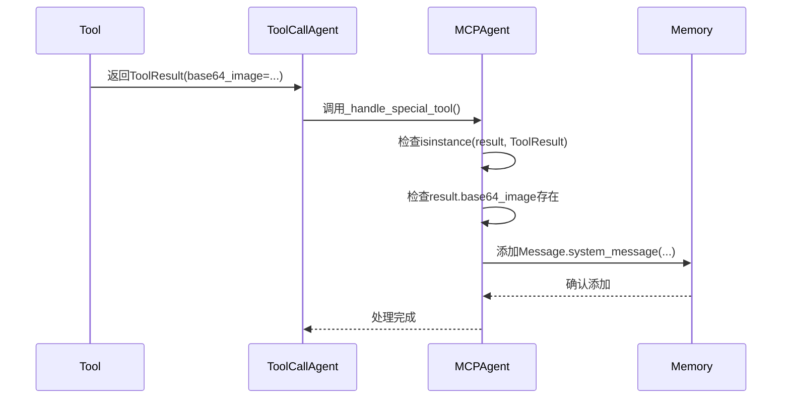
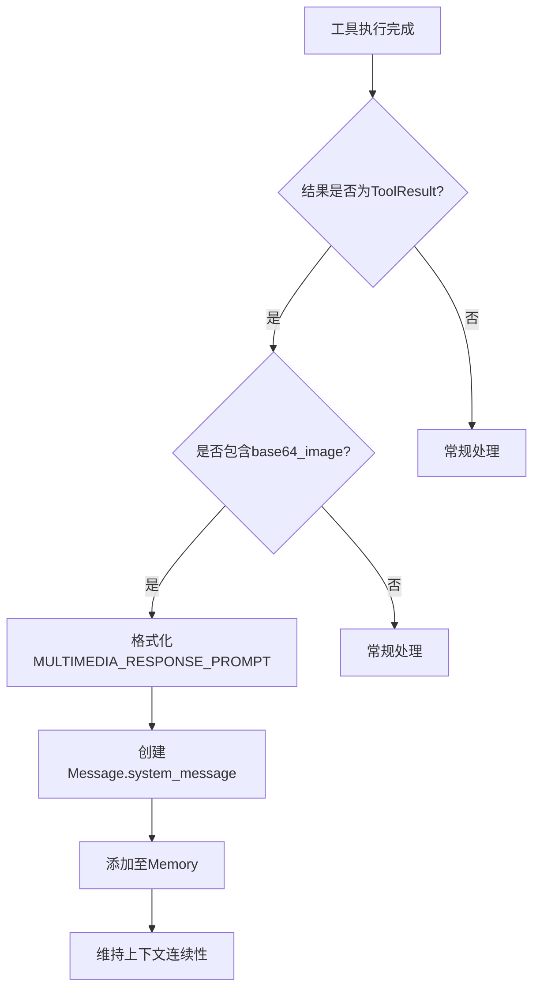

# 多媒体处理

<cite>
**本文档中引用的文件**  
- [mcp.py](file://app/agent/mcp.py)
- [toolcall.py](file://app/agent/toolcall.py)
- [base.py](file://app/tool/base.py)
- [mcp.py](file://app/prompt/mcp.py)
- [schema.py](file://app/schema.py)
</cite>

## 目录
1. [引言](#引言)
2. [核心机制分析](#核心机制分析)
3. [多媒体响应处理流程](#多媒体响应处理流程)
4. [系统消息注入与上下文连续性](#系统消息注入与上下文连续性)
5. [典型应用场景](#典型应用场景)
6. [安全与性能最佳实践](#安全与性能最佳实践)
7. [结论](#结论)

## 引言
OpenManus MCP代理具备处理多媒体数据的能力，特别是在工具调用过程中支持base64编码图像的传递与响应。该机制允许代理在执行视觉相关任务时接收图像输出，并将其无缝集成到对话流中。本文档详细阐述了这一多媒体处理机制的技术实现，重点分析`_handle_special_tool`方法如何拦截包含`base64_image`的`ToolResult`，并通过`MULTIMEDIA_RESPONSE_PROMPT`模板生成系统消息以维持上下文连续性。

## 核心机制分析

OpenManus的多媒体处理机制建立在`ToolResult`数据结构和`Message`类的基础上，通过MCPAgent的特殊工具处理逻辑实现图像数据的传递与展示。

**图示来源**  
- [base.py](file://app/tool/base.py#L37-L74)
- [schema.py](file://app/schema.py#L53-L155)
- [mcp.py](file://app/agent/mcp.py#L153-L164)

**本节来源**  
- [base.py](file://app/tool/base.py#L37-L74)
- [schema.py](file://app/schema.py#L53-L155)

## 多媒体响应处理流程

当工具执行返回包含`base64_image`字段的`ToolResult`对象时，MCPAgent会触发特殊的处理逻辑。该流程始于`execute_tool`方法对工具结果的检查，并最终由`_handle_special_tool`方法完成系统消息的注入。

**图示来源**  
- [toolcall.py](file://app/agent/toolcall.py#L209-L217)
- [mcp.py](file://app/agent/mcp.py#L153-L164)
- [schema.py](file://app/schema.py#L158-L186)

**本节来源**  
- [toolcall.py](file://app/agent/toolcall.py#L209-L217)
- [mcp.py](file://app/agent/mcp.py#L153-L164)

## 系统消息注入与上下文连续性

为了保持对话上下文的连续性，MCPAgent在检测到多媒体响应时，会使用预定义的`MULTIMEDIA_RESPONSE_PROMPT`模板生成一条系统消息并注入记忆流。这种设计确保了语言模型能够意识到图像内容的存在，并据此进行后续推理。

`MULTIMEDIA_RESPONSE_PROMPT`的内容为："您已收到工具'{tool_name}'的多媒体响应（图像、音频等）。此内容已被处理并为您描述。请使用此信息继续任务或向用户提供见解。"

该机制通过`Memory.add_message()`方法将系统消息持久化，确保后续的`think()`调用能够访问完整的上下文历史。

**图示来源**  
- [mcp.py](file://app/agent/mcp.py#L153-L164)
- [mcp.py](file://app/prompt/mcp.py#L27-L42)
- [schema.py](file://app/schema.py#L158-L186)

**本节来源**  
- [mcp.py](file://app/agent/mcp.py#L153-L164)
- [mcp.py](file://app/prompt/mcp.py#L27-L42)

## 典型应用场景

该多媒体处理机制适用于多种需要视觉反馈的场景：

### 可视化结果返回
当执行数据分析或图表生成工具时，代理可返回生成的图表图像，帮助用户直观理解数据模式。

### 截图反馈
在执行浏览器自动化或UI操作时，代理可通过截图提供操作结果的视觉确认。

### 视觉内容分析
结合OCR或图像识别工具，代理可分析上传的图像内容，并将关键信息整合到对话中。

### 调试与验证
开发者可通过查看代理生成的图像输出来验证工具执行的正确性。

这些场景均依赖于`base64_image`字段在`ToolResult`和`Message`之间的正确传递，以及系统消息对上下文的恰当补充。

**本节来源**  
- [mcp.py](file://app/agent/mcp.py#L153-L164)
- [toolcall.py](file://app/agent/toolcall.py#L209-L217)

## 安全与性能最佳实践

在使用多媒体处理功能时，应遵循以下最佳实践：

### 数据大小限制
- 对`base64_image`的大小进行限制，避免内存溢出
- 建议设置合理的图像分辨率上限（如1920x1080）
- 在工具实现中压缩图像数据以减少传输开销

### 安全考虑
- 验证`base64_image`内容的MIME类型，防止恶意数据注入
- 在服务端对上传的图像进行安全扫描
- 限制图像存储的生命周期，避免敏感信息长期留存

### 性能优化
- 实现图像缓存机制，避免重复处理相同内容
- 使用流式传输处理大型图像文件
- 在非必要情况下，优先返回文本描述而非完整图像

这些实践有助于确保多媒体功能的稳定性和安全性，同时维持系统的整体性能。

**本节来源**  
- [base.py](file://app/tool/base.py#L37-L74)
- [schema.py](file://app/schema.py#L53-L155)

## 结论
OpenManus MCP代理的多媒体处理机制通过精心设计的`ToolResult`和`Message`数据结构，实现了base64图像在工具调用中的无缝传递。`_handle_special_tool`方法作为核心处理逻辑，能够自动检测多媒体响应并使用`MULTIMEDIA_RESPONSE_PROMPT`模板生成系统消息，从而保持对话上下文的连续性。该机制不仅支持多种视觉反馈场景，还通过合理的架构设计为安全性和性能优化提供了基础。开发者在使用此功能时，应遵循数据大小限制和安全最佳实践，以确保系统的稳定运行。