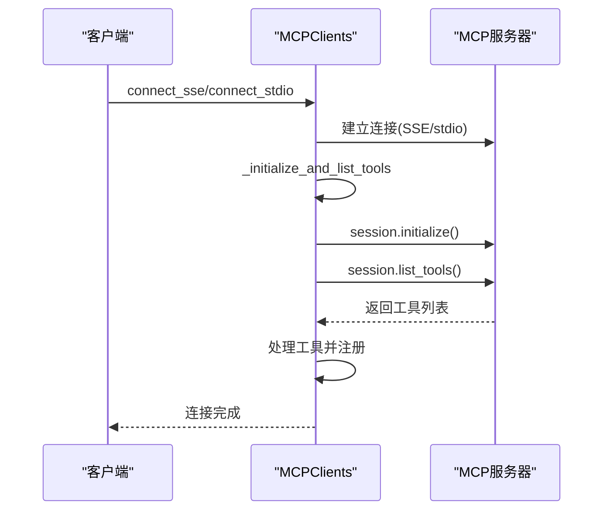
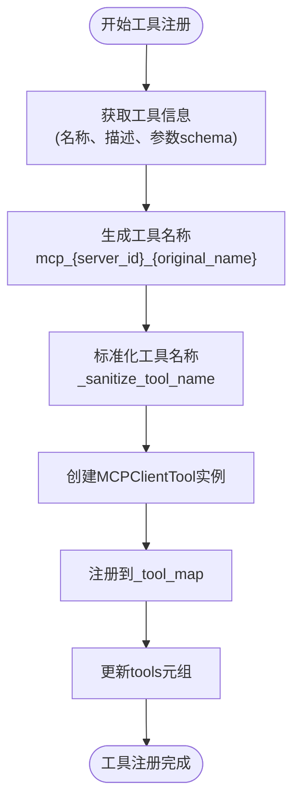
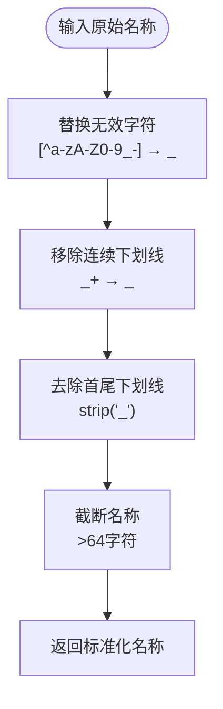
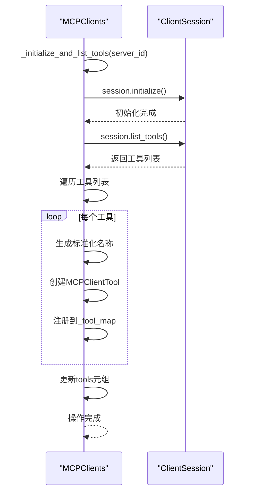
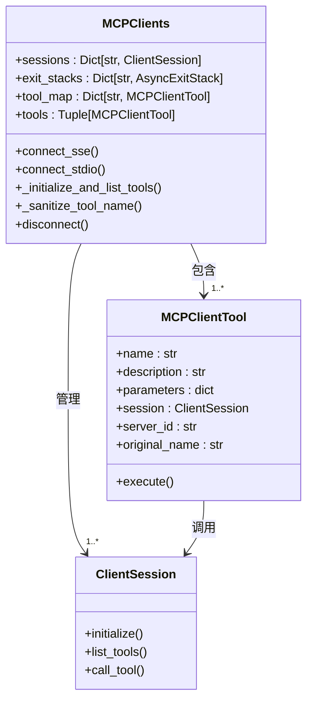
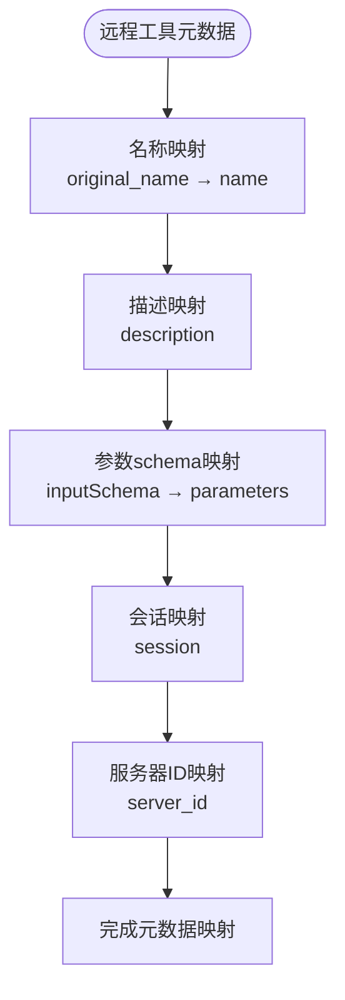
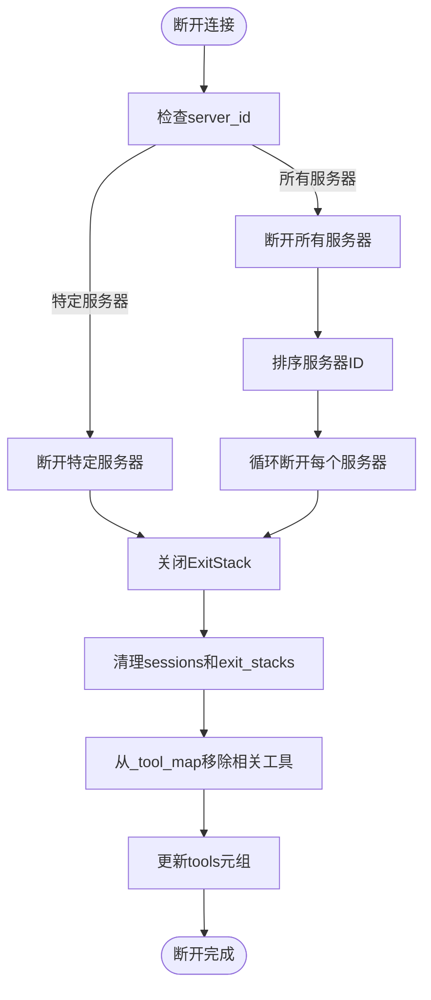

# 工具发现

<cite>
**本文档引用的文件**
- [mcp.py](file://app/tool/mcp.py)
- [server.py](file://app/mcp/server.py)
- [tool_collection.py](file://app/tool/tool_collection.py)
- [mcp.py](file://app/agent/mcp.py)
- [manus.py](file://app/agent/manus.py)
</cite>

## 目录
1. [引言](#引言)
2. [核心组件](#核心组件)
3. [工具发现机制](#工具发现机制)
4. [工具注册与映射](#工具注册与映射)
5. [会话初始化与原子性保证](#会话初始化与原子性保证)
6. [多服务器环境下的命名冲突解决方案](#多服务器环境下的命名冲突解决方案)
7. [工具元数据映射机制](#工具元数据映射机制)
8. [动态工具管理](#动态工具管理)
9. [结论](#结论)

## 引言
OpenManus MCP工具发现机制为系统提供了动态集成远程工具的能力。该机制允许MCPClients通过list_tools接口实现动态工具发现，将远程MCP服务器的工具无缝集成到本地工具调用系统中。本技术文档详细阐述了工具发现、注册、映射和管理的完整流程，重点说明了工具名称标准化处理、服务器隔离策略以及多服务器环境下的命名冲突解决方案。

## 核心组件

OpenManus MCP工具发现机制由多个核心组件构成，这些组件协同工作以实现动态工具发现和管理功能。

### MCPClients类
MCPClients类是工具发现机制的核心，继承自ToolCollection，负责管理与多个MCP服务器的连接和工具注册。

**Section sources**
- [mcp.py](file://app/tool/mcp.py#L36-L193)

### MCPClientTool类
MCPClientTool类代表一个可以代理调用的远程工具，封装了远程工具的执行逻辑。

**Section sources**
- [mcp.py](file://app/tool/mcp.py#L13-L33)

### ToolCollection类
ToolCollection类是工具集合的基础类，提供了工具管理的基本功能。

**Section sources**
- [tool_collection.py](file://app/tool/tool_collection.py#L8-L70)

## 工具发现机制

OpenManus MCP工具发现机制通过list_tools接口实现动态工具发现，允许客户端连接到MCP服务器并获取可用工具列表。

**Diagram sources**
- [mcp.py](file://app/tool/mcp.py#L49-L94)
- [mcp.py](file://app/tool/mcp.py#L96-L125)

**Section sources**
- [mcp.py](file://app/tool/mcp.py#L49-L94)

## 工具注册与映射

工具注册与映射过程是MCP工具发现机制的关键环节，确保远程工具能够被正确识别和调用。

### _tool_map中的工具注册
MCPClients通过_tool_map字典管理所有发现的工具，每个工具在注册时都会经过一系列处理步骤。

#### 工具注册流程

**Diagram sources**
- [mcp.py](file://app/tool/mcp.py#L102-L125)

### 工具名称标准化处理
工具名称标准化处理通过_sanitize_tool_name方法实现，确保工具名称符合系统要求。

#### 标准化处理规则

**Diagram sources**
- [mcp.py](file://app/tool/mcp.py#L127-L144)

**Section sources**
- [mcp.py](file://app/tool/mcp.py#L127-L144)

## 会话初始化与原子性保证

_initialize_and_list_tools方法确保了会话初始化与工具注册的原子性，保证了操作的完整性和一致性。

### 原子性保证机制

**Diagram sources**
- [mcp.py](file://app/tool/mcp.py#L96-L125)

**Section sources**
- [mcp.py](file://app/tool/mcp.py#L96-L125)

## 多服务器环境下的命名冲突解决方案

在多服务器环境下，OpenManus通过服务器隔离策略有效解决了工具命名冲突问题。

### 服务器隔离策略

**Diagram sources**
- [mcp.py](file://app/tool/mcp.py#L36-L193)
- [mcp.py](file://app/tool/mcp.py#L13-L33)

### 命名冲突解决方案
系统通过以下策略解决多服务器环境下的命名冲突：

1. **前缀隔离**: 为每个工具名称添加`mcp_{server_id}_`前缀
2. **服务器ID标识**: 在MCPClientTool中保留server_id字段用于标识来源服务器
3. **原始名称保留**: 保留original_name字段用于远程调用
4. **连接管理**: 通过sessions字典管理不同服务器的连接

当连接到多个服务器时，即使它们有同名工具，也会被注册为不同的本地工具名称，避免了命名冲突。

**Section sources**
- [mcp.py](file://app/tool/mcp.py#L102-L125)
- [mcp.py](file://app/tool/mcp.py#L36-L43)

## 工具元数据映射机制

工具元数据映射机制确保了远程工具的描述信息和参数schema能够正确映射到本地工具系统。

### 元数据映射流程

**Diagram sources**
- [mcp.py](file://app/tool/mcp.py#L102-L125)

### 元数据字段说明
| 字段名称 | 来源 | 用途 | 是否保留原始值 |
|--------|------|------|-------------|
| name | 标准化处理后 | 本地调用标识 | 否 |
| original_name | 远程工具 | 远程调用标识 | 是 |
| description | 远程工具 | 工具描述 | 是 |
| parameters | 远程工具inputSchema | 参数定义 | 是 |
| server_id | 连接参数 | 服务器标识 | 是 |
| session | ClientSession | 远程调用会话 | 是 |

**Section sources**
- [mcp.py](file://app/tool/mcp.py#L102-L125)

## 动态工具管理

OpenManus提供了完整的动态工具管理功能，支持工具的连接、断开和刷新。

### 连接管理
MCPClients支持两种连接方式：
- **SSE连接**: 通过connect_sse方法使用SSE传输
- **stdio连接**: 通过connect_stdio方法使用stdio传输

两种连接方式都遵循相同的处理流程：先确保清理现有连接，然后建立新连接，最后初始化并列出工具。

### 断开连接
disconnect方法支持断开特定服务器或所有服务器的连接，同时清理相关资源和工具注册。

**Diagram sources**
- [mcp.py](file://app/tool/mcp.py#L146-L193)

**Section sources**
- [mcp.py](file://app/tool/mcp.py#L146-L193)

## 结论
OpenManus MCP工具发现机制通过精心设计的架构实现了远程工具的动态发现和管理。该机制的核心优势包括：

1. **动态发现**: 通过list_tools接口实现工具的动态发现
2. **名称标准化**: 通过_sanitize_tool_name方法确保工具名称的合规性
3. **服务器隔离**: 通过前缀和server_id实现多服务器环境下的命名冲突解决
4. **原子性保证**: _initialize_and_list_tools方法确保会话初始化和工具注册的原子性
5. **无缝集成**: 将远程MCP工具无缝集成到本地工具调用系统

这一机制为OpenManus系统提供了强大的扩展能力，使其能够灵活地集成各种远程工具服务，同时保持系统的稳定性和可靠性。