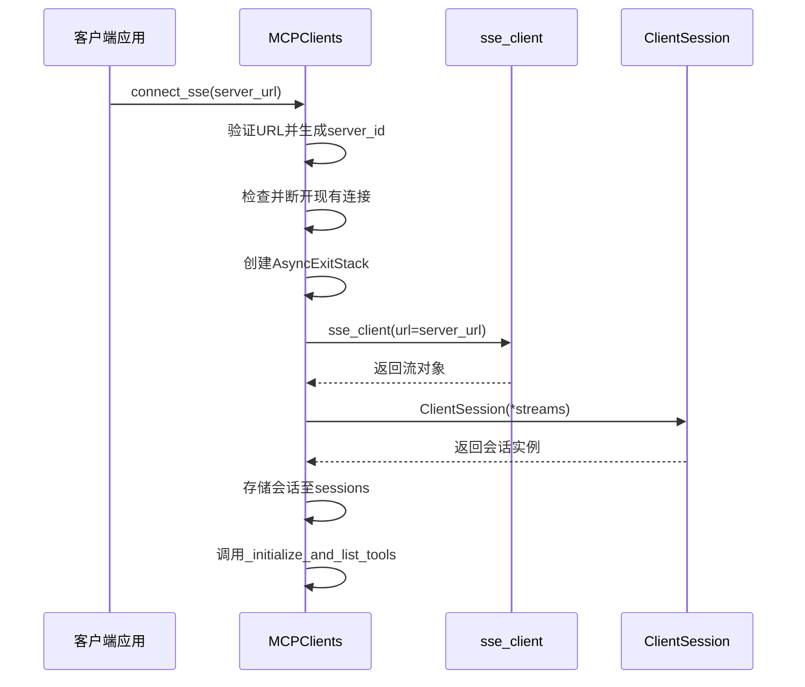
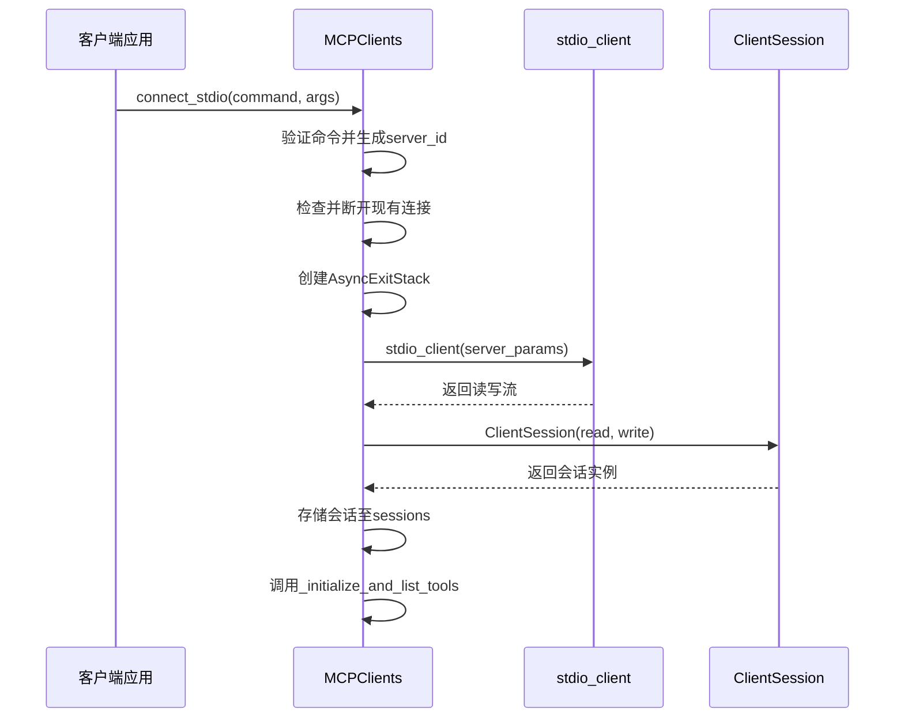
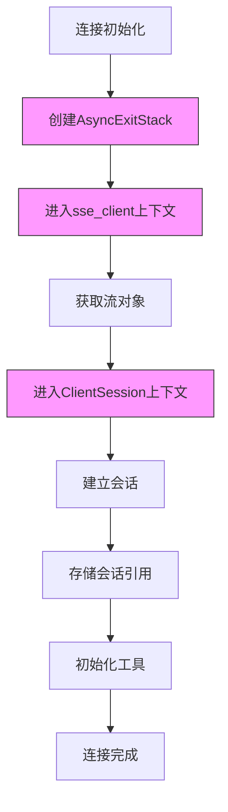
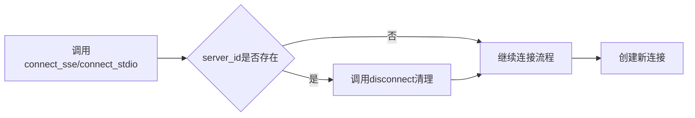
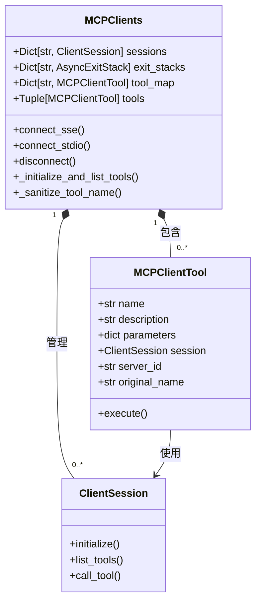
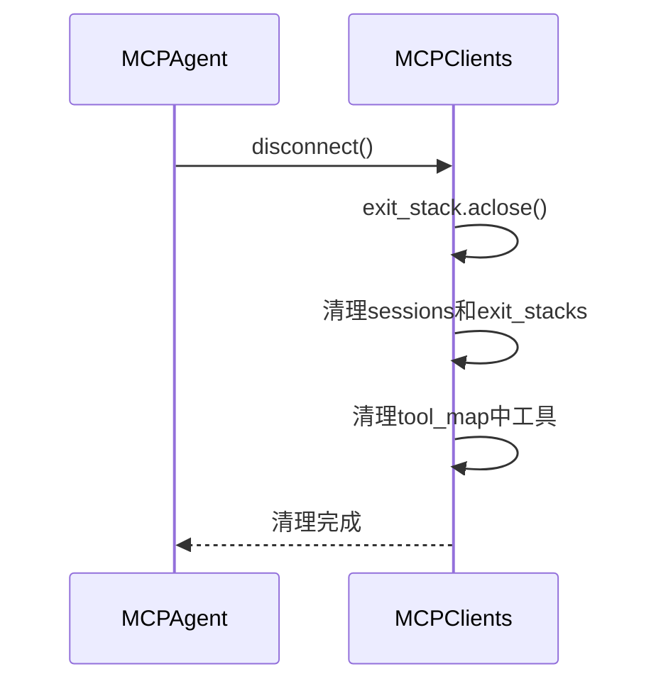

# 连接管理

<cite>
**本文档中引用的文件**  
- [mcp.py](file://app/tool/mcp.py)
- [mcp.py](file://app/agent/mcp.py)
- [base.py](file://app/tool/base.py)
- [tool_collection.py](file://app/tool/tool_collection.py)
- [manus.py](file://app/agent/manus.py)
- [sandbox_agent.py](file://app/agent/sandbox_agent.py)
- [mcp.example.json](file://config/mcp.example.json)
</cite>

## 目录
1. [简介](#简介)
2. [连接初始化流程](#连接初始化流程)
3. [SSE与stdio连接模式](#sse与stdio连接模式)
4. [资源管理与会话上下文](#资源管理与会话上下文)
5. [server_id的作用与连接复用控制](#server_id的作用与连接复用控制)
6. [会话初始化与工具注册](#会话初始化与工具注册)
7. [异常处理与资源清理](#异常处理与资源清理)
8. [连接配置最佳实践](#连接配置最佳实践)
9. [优雅关闭机制](#优雅关闭机制)
10. [总结](#总结)

## 简介
OpenManus MCP代理系统通过`MCPClients`类实现对多个MCP服务器的连接管理，支持SSE（Server-Sent Events）和stdio两种通信模式。该系统为智能体（Agent）提供远程工具调用能力，通过标准化的连接流程、资源管理和错误处理机制确保稳定可靠的通信。本文档详细阐述连接管理的核心机制，包括连接初始化、资源管理、会话建立、异常处理和优雅关闭等关键环节。

## 连接初始化流程
MCP连接的初始化由`MCPClients`类的`connect_sse`和`connect_stdio`方法驱动，遵循统一的初始化模式：参数验证、连接清理、资源分配、会话建立和工具初始化。连接过程通过`AsyncExitStack`进行资源管理，确保异步上下文的正确建立和释放。

**Section sources**
- [mcp.py](file://app/tool/mcp.py#L49-L94)

## SSE与stdio连接模式
OpenManus支持两种MCP服务器连接模式：SSE和stdio，分别适用于不同的部署场景。

### SSE连接模式
SSE（Server-Sent Events）模式通过HTTP长连接实现服务器到客户端的单向事件流，适用于Web服务部署场景。`connect_sse`方法接收服务器URL作为参数，创建基于HTTP的事件流连接。



**Diagram sources**
- [mcp.py](file://app/tool/mcp.py#L49-L68)

### stdio连接模式
stdio模式通过标准输入输出流与本地进程通信，适用于本地工具服务器或容器化部署。`connect_stdio`方法接收命令和参数列表，启动子进程并建立双向通信管道。



**Diagram sources**
- [mcp.py](file://app/tool/mcp.py#L70-L94)

## 资源管理与会话上下文
连接管理采用`AsyncExitStack`作为核心资源管理机制，确保异步资源的正确生命周期管理。

### AsyncExitStack资源管理
`AsyncExitStack`是Python异步上下文管理器，用于管理多个异步资源的生命周期。在连接初始化时，为每个`server_id`创建独立的`AsyncExitStack`实例，存储在`exit_stacks`字典中。



**Diagram sources**
- [mcp.py](file://app/tool/mcp.py#L58-L60)
- [mcp.py](file://app/tool/mcp.py#L84-L86)

### 流式传输上下文建立
连接过程涉及两个关键的异步上下文管理：
1. **传输层上下文**：通过`sse_client`或`stdio_client`建立底层通信流
2. **会话层上下文**：通过`ClientSession`在传输流上建立MCP协议会话

这种分层上下文设计实现了传输机制与协议逻辑的解耦，支持多种传输方式的灵活扩展。

**Section sources**
- [mcp.py](file://app/tool/mcp.py#L61-L66)
- [mcp.py](file://app/tool/mcp.py#L87-L92)

## server_id的作用与连接复用控制
`server_id`是MCP连接管理中的核心标识符，承担多重关键职责。

### 标识作用
`server_id`作为MCP服务器的唯一标识，用于：
- 区分多个MCP服务器实例
- 索引会话和资源栈
- 组织远程工具命名空间
- 跟踪连接状态

当未显式提供`server_id`时，系统自动使用`server_url`或`command`作为默认标识。

### 连接复用控制
系统通过严格的连接复用控制策略避免资源冲突：
1. **连接前清理**：在建立新连接前，检查`server_id`是否已存在会话，若存在则先调用`disconnect`清理
2. **单实例原则**：每个`server_id`在同一时刻只能有一个活跃连接
3. **确定性断开**：`disconnect`方法确保资源的有序释放



**Section sources**
- [mcp.py](file://app/tool/mcp.py#L53-L56)
- [mcp.py](file://app/tool/mcp.py#L78-L81)

## 会话初始化与工具注册
连接建立后，系统自动执行会话初始化和工具注册流程。

### 会话初始化流程
`_initialize_and_list_tools`方法负责会话的最终初始化：
1. 调用`session.initialize()`完成MCP协议握手
2. 调用`session.list_tools()`获取服务器提供的工具列表
3. 为每个远程工具创建本地代理对象`MCPClientTool`
4. 将工具代理注册到`tool_map`中
5. 更新`tools`元组以反映最新工具集

### 工具命名空间管理
为避免工具名称冲突，系统采用命名空间隔离策略：
- 工具名称格式：`mcp_{server_id}_{original_name}`
- 名称规范化：通过`_sanitize_tool_name`方法确保名称符合标识符规范
- 服务器隔离：不同`server_id`的工具即使原名相同也不会冲突



**Diagram sources**
- [mcp.py](file://app/tool/mcp.py#L96-L125)
- [mcp.py](file://app/tool/mcp.py#L127-L144)

## 异常处理与资源清理
系统实现了全面的异常处理和资源清理机制，确保连接的健壮性。

### 运行时错误捕获
连接和通信过程中的异常被分层捕获和处理：
- **参数验证**：在方法入口处验证必要参数，抛出`ValueError`
- **会话状态检查**：在工具执行前检查会话连接状态
- **远程调用异常**：捕获`session.call_tool`的异常并转换为`ToolResult.error`

### 资源清理保障
`disconnect`方法确保连接资源的彻底清理：
1. 关闭`AsyncExitStack`，触发所有上下文管理器的清理
2. 从`sessions`和`exit_stacks`中移除引用
3. 从`tool_map`中移除关联工具
4. 更新`tools`元组

特别处理了`cancel scope`运行时错误，避免因协程取消导致的清理中断。

```mermaid
flowchart TD
A[调用disconnect] --> B{是否有exit_stack}
B --> |是| C[调用aclose()]
C --> D{是否cancel scope错误}
D --> |是| E[记录警告并继续]
D --> |否| F[传播其他异常]
E --> G[清理sessions和exit_stacks]
F --> H[异常处理]
G --> I[清理tool_map中相关工具]
I --> J[更新tools元组]
J --> K[完成清理]
```

**Section sources**
- [mcp.py](file://app/tool/mcp.py#L154-L193)

## 连接配置最佳实践
基于系统设计，推荐以下连接配置最佳实践。

### 配置文件管理
通过`config/mcp.json`文件集中管理MCP服务器配置，支持多服务器定义：

```json
{
    "servers": {
        "browser": {
            "type": "stdio",
            "command": "python",
            "args": ["-m", "browser_mcp_server"]
        },
        "data_analysis": {
            "type": "sse",
            "url": "http://localhost:8001/sse"
        }
    }
}
```

### 初始化模式
在智能体初始化时，根据配置批量建立连接：

```mermaid
flowchart LR
A[Agent.initialize_mcp_servers] --> B[遍历servers配置]
B --> C{type == sse?}
C --> |是| D[connect_sse(url, server_id)]
C --> |否| E[connect_stdio(command, args, server_id)]
D --> F[添加到可用工具]
E --> F
```

**Section sources**
- [manus.py](file://app/agent/manus.py#L66-L88)
- [mcp.example.json](file://config/mcp.example.json#L1-L7)

## 优雅关闭机制
系统通过`exit_stack`确保连接的优雅关闭，实现资源的有序释放。

### 退出栈机制
`AsyncExitStack`作为核心机制，确保：
- 上下文管理器的逆序清理
- 异常情况下的资源释放
- 协程取消时的清理保障

### 清理调用链
优雅关闭通过以下调用链实现：
1. `MCPClients.disconnect()`：主清理入口
2. `exit_stack.aclose()`：触发所有上下文管理器的`__aexit__`
3. `ClientSession`清理：关闭底层传输
4. 引用移除：从所有字典中删除连接相关引用

智能体级别的清理通过`cleanup`方法协调：



**Section sources**
- [mcp.py](file://app/tool/mcp.py#L154-L193)
- [mcp.py](file://app/agent/mcp.py#L166-L184)

## 总结
OpenManus MCP连接管理系统通过精心设计的架构实现了可靠、灵活的多服务器连接管理。系统核心特点包括：
- **双模式支持**：SSE和stdio两种连接模式适应不同部署需求
- **资源安全**：`AsyncExitStack`确保异步资源的正确管理
- **标识清晰**：`server_id`机制实现多服务器的有效隔离
- **健壮异常处理**：全面的错误捕获和资源清理保障
- **优雅关闭**：有序的资源释放机制避免资源泄漏

该系统为OpenManus智能体提供了稳定可靠的工具扩展能力，是整个框架可扩展性的关键基础设施。