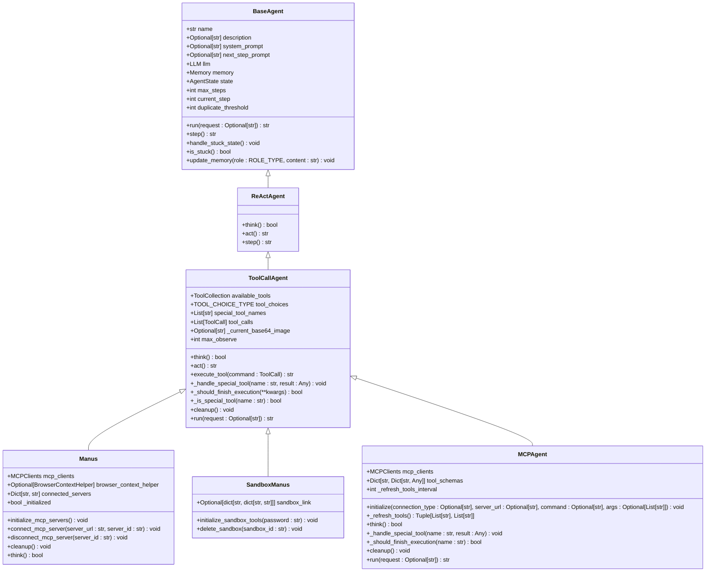
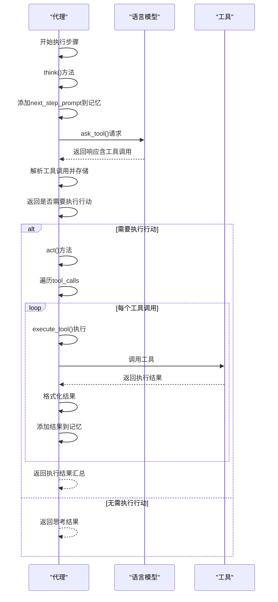
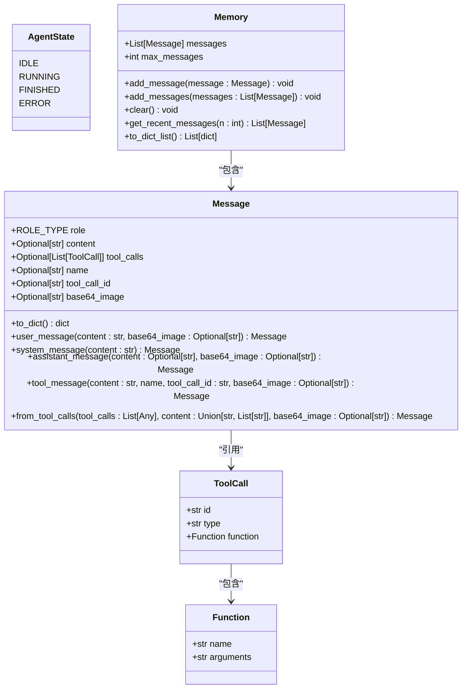
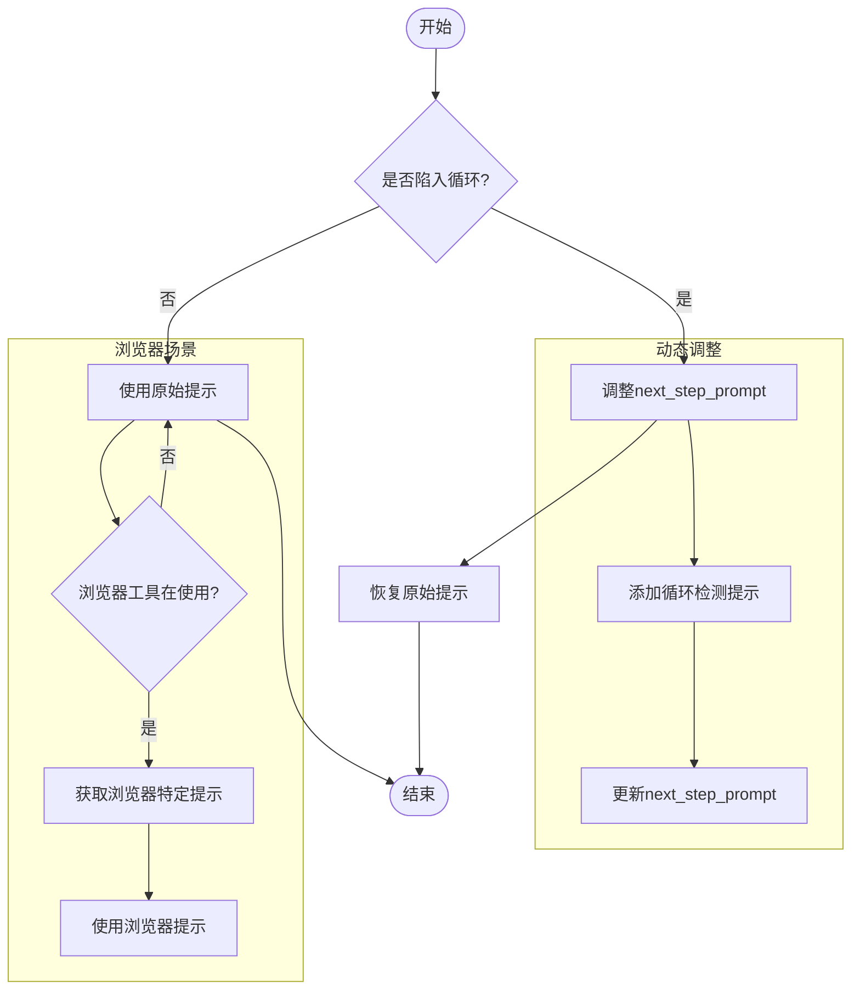
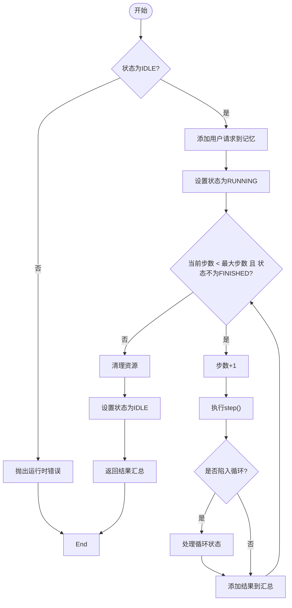

# 代理系统架构

<cite>
**本文档引用的文件**   
- [base.py](file://app/agent/base.py)
- [toolcall.py](file://app/agent/toolcall.py)
- [react.py](file://app/agent/react.py)
- [manus.py](file://app/agent/manus.py)
- [sandbox_agent.py](file://app/agent/sandbox_agent.py)
- [mcp.py](file://app/agent/mcp.py)
- [schema.py](file://app/schema.py)
- [tool_collection.py](file://app/tool/tool_collection.py)
- [terminate.py](file://app/tool/terminate.py)
- [toolcall.py](file://app/prompt/toolcall.py)
- [manus.py](file://app/prompt/manus.py)
</cite>

## 目录
1. [简介](#简介)
2. [核心代理类继承关系](#核心代理类继承关系)
3. [ReAct模式实现](#react模式实现)
4. [代理状态与内存管理](#代理状态与内存管理)
5. [提示词动态调整机制](#提示词动态调整机制)
6. [具体代理实现](#具体代理实现)
7. [代理执行流程](#代理执行流程)
8. [扩展开发指导](#扩展开发指导)

## 简介
OpenManus代理系统是一个基于分层架构的智能代理框架，通过继承和扩展机制实现不同功能的代理。系统以`BaseAgent`为基类，通过`ReActAgent`引入思考-行动模式，最终由`ToolCallAgent`实现工具调用能力。在此基础上，`Manus`、`SandboxManus`和`MCPAgent`等具体代理实现了特定功能，形成了完整的代理生态系统。

## 核心代理类继承关系

OpenManus代理系统采用多层继承架构，从基础功能到高级功能逐层扩展。`BaseAgent`作为所有代理的基类，提供了状态管理、内存存储和执行控制等核心功能。`ReActAgent`继承自`BaseAgent`，引入了ReAct（思考-行动）模式。`ToolCallAgent`进一步扩展了`ReActAgent`，增加了工具调用能力。具体代理如`Manus`、`SandboxManus`和`MCPAgent`则继承自`ToolCallAgent`，实现了特定场景下的功能扩展。

**图源**
- [base.py](file://app/agent/base.py#L12-L195)
- [react.py](file://app/agent/react.py#L10-L37)
- [toolcall.py](file://app/agent/toolcall.py#L17-L249)
- [manus.py](file://app/agent/manus.py#L17-L164)
- [sandbox_agent.py](file://app/agent/sandbox_agent.py#L20-L222)
- [mcp.py](file://app/agent/mcp.py#L12-L184)

**本节来源**
- [base.py](file://app/agent/base.py#L12-L195)
- [react.py](file://app/agent/react.py#L10-L37)
- [toolcall.py](file://app/agent/toolcall.py#L17-L249)

## ReAct模式实现

`ToolCallAgent`通过继承`ReActAgent`实现了ReAct（思考-行动）模式。该模式将代理的执行过程分解为两个核心方法：`think()`和`act()`。`think()`方法负责分析当前状态并决定下一步行动，而`act()`方法则负责执行已决定的行动。

`think()`方法首先将`next_step_prompt`作为用户消息添加到记忆中，然后调用语言模型（LLM）获取响应。LLM的响应可能包含工具调用指令，这些指令会被解析并存储在`tool_calls`属性中。根据`tool_choices`配置的不同模式（NONE、AUTO、REQUIRED），代理会采取不同的处理策略。

`act()`方法负责执行`think()`方法确定的工具调用。它遍历`tool_calls`列表，依次执行每个工具调用，并将执行结果添加到记忆中。执行过程中，代理会处理特殊工具（如终止工具），并根据需要更新状态。

**图源**
- [toolcall.py](file://app/agent/toolcall.py#L38-L128)
- [toolcall.py](file://app/agent/toolcall.py#L130-L163)
- [toolcall.py](file://app/agent/toolcall.py#L165-L207)

**本节来源**
- [toolcall.py](file://app/agent/toolcall.py#L38-L207)

## 代理状态与内存管理

代理系统通过`AgentState`枚举和`Memory`类实现状态和内存管理。`AgentState`定义了代理的四种状态：IDLE（空闲）、RUNNING（运行中）、FINISHED（已完成）和ERROR（错误）。代理在执行过程中会通过`state_context`上下文管理器安全地在不同状态间转换。

`Memory`类负责管理代理的记忆，存储所有对话消息。它包含一个`messages`列表，用于存储`Message`对象。每个`Message`对象包含角色（role）、内容（content）、工具调用（tool_calls）等信息。`Memory`还实现了消息限制功能，当消息数量超过`max_messages`时，会自动删除最旧的消息。

代理通过`update_memory()`方法向记忆中添加新消息。该方法根据消息角色（用户、系统、助手、工具）创建相应的消息对象，并将其添加到记忆中。`messages`属性提供了对记忆中所有消息的访问接口。

**图源**
- [schema.py](file://app/schema.py#L31-L37)
- [schema.py](file://app/schema.py#L158-L186)
- [schema.py](file://app/schema.py#L78-L157)

**本节来源**
- [schema.py](file://app/schema.py#L31-L187)

## 提示词动态调整机制

代理系统通过`system_prompt`和`next_step_prompt`实现提示词的动态调整。`system_prompt`是系统级指令提示，为代理提供基本的行为指导。`next_step_prompt`是下一步行动提示，指导代理如何选择和执行下一步操作。

当代理检测到陷入循环状态时，会通过`handle_stuck_state()`方法动态调整`next_step_prompt`。该方法会在当前提示前添加一段关于避免重复无效路径的提示，促使代理改变策略。`is_stuck()`方法通过检查记忆中是否存在重复的助手消息来判断代理是否陷入循环。

具体代理如`Manus`和`SandboxManus`会根据特定场景动态调整提示词。例如，当检测到浏览器工具正在使用时，`think()`方法会调用`browser_context_helper.format_next_step_prompt()`获取特定于浏览器操作的提示词，然后在思考完成后恢复原始提示词。

**图源**
- [base.py](file://app/agent/base.py#L162-L167)
- [base.py](file://app/agent/base.py#L169-L185)
- [manus.py](file://app/agent/manus.py#L139-L164)
- [sandbox_agent.py](file://app/agent/sandbox_agent.py#L197-L222)

**本节来源**
- [base.py](file://app/agent/base.py#L162-L185)
- [manus.py](file://app/agent/manus.py#L139-L164)
- [sandbox_agent.py](file://app/agent/sandbox_agent.py#L197-L222)

## 具体代理实现

### Manus代理
`Manus`代理是`ToolCallAgent`的具体实现，支持多种本地工具和MCP工具。它通过`mcp_clients`属性管理MCP服务器连接，并通过`available_tools`属性管理可用工具集合。`Manus`代理提供了`initialize_mcp_servers()`、`connect_mcp_server()`和`disconnect_mcp_server()`等方法来管理MCP服务器连接。

### SandboxManus代理
`SandboxManus`代理扩展了`Manus`代理的功能，增加了沙箱环境支持。它通过`initialize_sandbox_tools()`方法创建沙箱环境，并将沙箱工具（浏览器、文件、shell、视觉）添加到可用工具集合中。`SandboxManus`还提供了`delete_sandbox()`方法来清理沙箱资源。

### MCPAgent代理
`MCPAgent`代理专门用于与MCP服务器交互。它通过`initialize()`方法建立与MCP服务器的连接，并通过`_refresh_tools()`方法定期刷新可用工具列表。当检测到工具列表发生变化时，`MCPAgent`会相应地更新其可用工具集合。

**本节来源**
- [manus.py](file://app/agent/manus.py#L17-L164)
- [sandbox_agent.py](file://app/agent/sandbox_agent.py#L20-L222)
- [mcp.py](file://app/agent/mcp.py#L12-L184)

## 代理执行流程

代理的执行流程由`run()`方法驱动，该方法在`BaseAgent`中定义，并在`ToolCallAgent`中被重写以添加清理功能。执行流程从IDLE状态开始，进入RUNNING状态后，代理会循环执行`step()`方法，直到达到最大步数或进入FINISHED状态。

每个步骤由`think()`和`act()`方法协同完成。`think()`方法决定下一步行动，`act()`方法执行该行动。执行过程中，代理会检查是否陷入循环状态，如果是，则调整策略。执行完成后，代理会清理资源并返回结果。

**图源**
- [base.py](file://app/agent/base.py#L115-L153)
- [toolcall.py](file://app/agent/toolcall.py#L244-L249)

**本节来源**
- [base.py](file://app/agent/base.py#L115-L153)
- [toolcall.py](file://app/agent/toolcall.py#L244-L249)

## 扩展开发指导

开发者在扩展OpenManus代理系统时，应遵循以下原则：

1. **继承层次**：新代理应根据功能需求选择合适的基类继承。如果需要工具调用功能，应继承`ToolCallAgent`；如果只需要基本的思考-行动模式，可继承`ReActAgent`。

2. **工具管理**：通过`available_tools`属性管理代理的可用工具。使用`ToolCollection`类来组织和管理工具集合。

3. **状态管理**：利用`state_context`上下文管理器安全地管理代理状态转换，避免在异常情况下状态不一致。

4. **内存管理**：通过`update_memory()`方法向记忆中添加消息，确保所有交互都被正确记录。

5. **提示词设计**：合理设计`system_prompt`和`next_step_prompt`，为代理提供清晰的行为指导。

6. **资源清理**：重写`cleanup()`方法，确保代理使用的资源在执行完成后被正确清理。

7. **特殊工具处理**：通过重写`_handle_special_tool()`和`_should_finish_execution()`方法，自定义特殊工具的处理逻辑。

**本节来源**
- [toolcall.py](file://app/agent/toolcall.py#L228-L242)
- [manus.py](file://app/agent/manus.py#L130-L137)
- [sandbox_agent.py](file://app/agent/sandbox_agent.py#L187-L195)
- [mcp.py](file://app/agent/mcp.py#L171-L175)