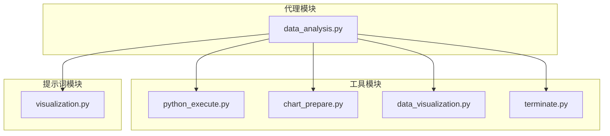
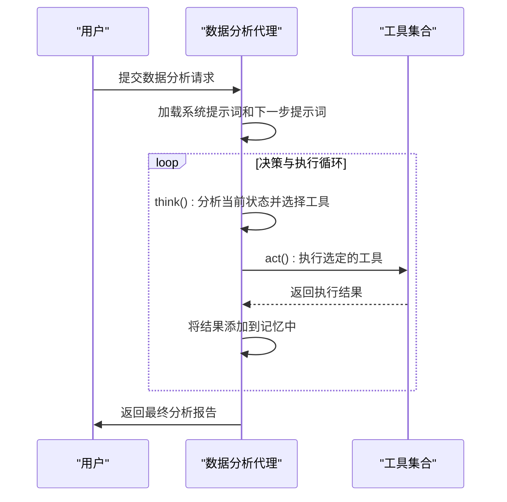
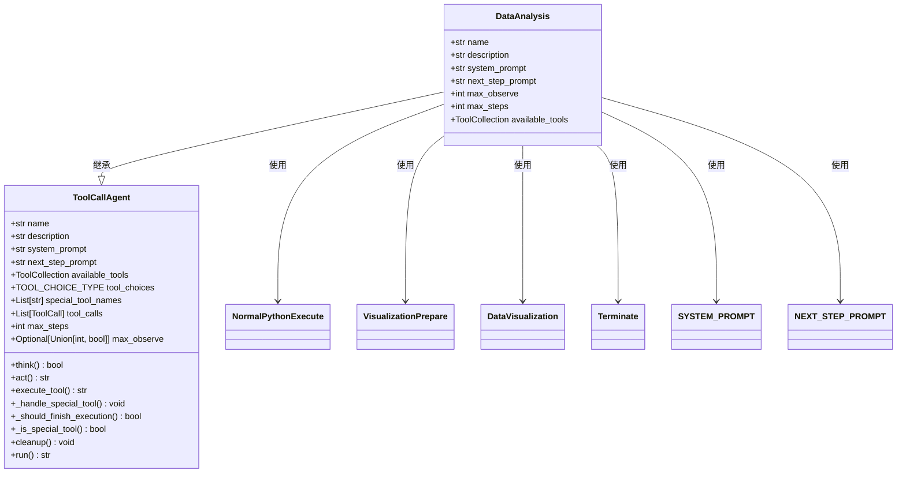
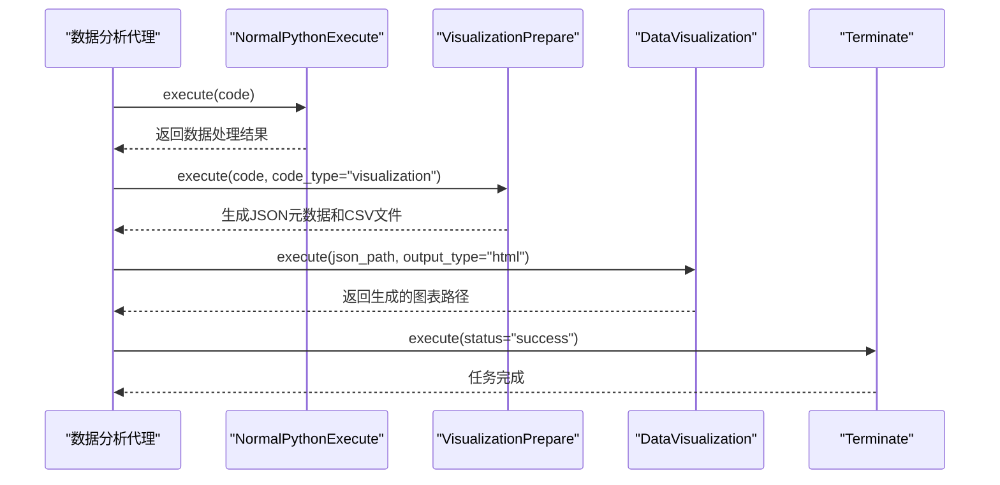
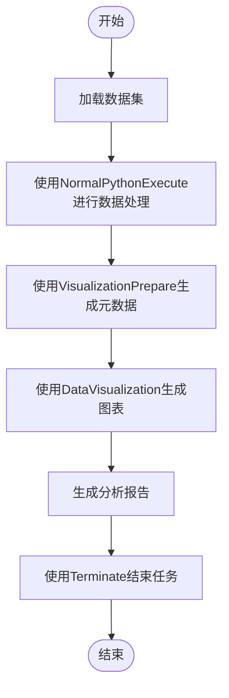
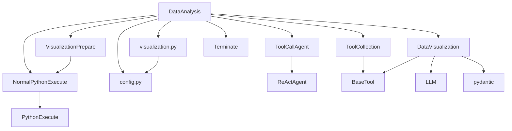

# 数据分析代理

<cite>
**Referenced Files in This Document**   
- [data_analysis.py](file://app/agent/data_analysis.py)
- [visualization.py](file://app/prompt/visualization.py)
- [python_execute.py](file://app/tool/chart_visualization/python_execute.py)
- [chart_prepare.py](file://app/tool/chart_visualization/chart_prepare.py)
- [data_visualization.py](file://app/tool/chart_visualization/data_visualization.py)
- [terminate.py](file://app/tool/terminate.py)
- [tool_collection.py](file://app/tool/tool_collection.py)
- [toolcall.py](file://app/agent/toolcall.py)
</cite>

## 目录
1. [简介](#简介)
2. [项目结构](#项目结构)
3. [核心组件](#核心组件)
4. [架构概述](#架构概述)
5. [详细组件分析](#详细组件分析)
6. [依赖分析](#依赖分析)
7. [性能考量](#性能考量)
8. [故障排除指南](#故障排除指南)
9. [结论](#结论)

## 简介
数据分析代理（DataAnalysis）是OpenManus框架中的一个专门化智能体，专为数据科学任务而设计。该代理通过集成一系列协同工作的工具，能够执行复杂的数据分析和可视化任务。其核心功能包括利用Python执行环境进行数据分析、准备数据可视化元数据、生成统计图表以及最终终止任务。代理通过系统提示词和下一步提示词指导其行为，确保任务的高效执行。特别配置的15000字符观察结果限制使其能够处理大型数据集，为数据科学家提供强大的分析能力。

## 项目结构
数据分析代理位于`app/agent/`目录下，其功能实现依赖于`app/tool/chart_visualization/`目录中的工具模块。代理的提示词配置位于`app/prompt/`目录。这种模块化结构将代理逻辑、工具实现和提示词管理清晰地分离，便于维护和扩展。

**Diagram sources**
- [data_analysis.py](file://app/agent/data_analysis.py)
- [python_execute.py](file://app/tool/chart_visualization/python_execute.py)
- [chart_prepare.py](file://app/tool/chart_visualization/chart_prepare.py)
- [data_visualization.py](file://app/tool/chart_visualization/data_visualization.py)
- [terminate.py](file://app/tool/terminate.py)
- [visualization.py](file://app/prompt/visualization.py)

**Section sources**
- [data_analysis.py](file://app/agent/data_analysis.py)
- [python_execute.py](file://app/tool/chart_visualization/python_execute.py)
- [chart_prepare.py](file://app/tool/chart_visualization/chart_prepare.py)
- [data_visualization.py](file://app/tool/chart_visualization/data_visualization.py)
- [terminate.py](file://app/tool/terminate.py)
- [visualization.py](file://app/prompt/visualization.py)

## 核心组件
数据分析代理的核心组件包括`DataAnalysis`类及其集成的四个关键工具：`NormalPythonExecute`、`VisualizationPrepare`、`DataVisualization`和`Terminate`。这些组件协同工作，形成一个完整的数据处理和可视化流水线。代理继承自`ToolCallAgent`，利用工具调用机制来执行任务。系统提示词和下一步提示词为代理提供了行为指导，而15000字符的观察结果限制则确保了对大型数据集的处理能力。

**Section sources**
- [data_analysis.py](file://app/agent/data_analysis.py)
- [toolcall.py](file://app/agent/toolcall.py)
- [visualization.py](file://app/prompt/visualization.py)

## 架构概述
数据分析代理的架构基于一个清晰的工具调用流水线。用户请求首先由代理接收，然后根据系统提示词和下一步提示词的指导，代理决定调用哪个工具。工作流通常从`NormalPythonExecute`开始进行数据处理，然后使用`VisualizationPrepare`生成可视化元数据，接着由`DataVisualization`工具生成图表，最后通过`Terminate`工具结束任务。整个过程由`ToolCallAgent`的`think`和`act`方法驱动，确保了任务的有序执行。

**Diagram sources**
- [data_analysis.py](file://app/agent/data_analysis.py)
- [toolcall.py](file://app/agent/toolcall.py)
- [tool_collection.py](file://app/tool/tool_collection.py)

## 详细组件分析
### 数据分析代理类分析
`DataAnalysis`类是整个代理的核心，它定义了代理的名称、描述、系统提示词、下一步提示词以及可用的工具集合。该类通过继承`ToolCallAgent`获得了基本的代理功能，并通过重写特定字段来实现数据科学任务的专门化。

#### 类图

**Diagram sources**
- [data_analysis.py](file://app/agent/data_analysis.py#L11-L36)
- [toolcall.py](file://app/agent/toolcall.py#L17-L249)

**Section sources**
- [data_analysis.py](file://app/agent/data_analysis.py#L11-L36)
- [toolcall.py](file://app/agent/toolcall.py#L17-L249)

### 工具协同工作机制
数据分析代理的四个核心工具构成了一个高效的数据处理流水线。`NormalPythonExecute`负责执行通用的Python代码，进行数据处理和分析。`VisualizationPrepare`作为桥梁，将分析结果转化为`DataVisualization`工具所需的元数据。`DataVisualization`是核心可视化引擎，负责生成最终的图表。`Terminate`工具则用于优雅地结束任务。

#### 工具调用序列图

**Diagram sources**
- [python_execute.py](file://app/tool/chart_visualization/python_execute.py#L4-L35)
- [chart_prepare.py](file://app/tool/chart_visualization/chart_prepare.py#L3-L37)
- [data_visualization.py](file://app/tool/chart_visualization/data_visualization.py#L14-L262)
- [terminate.py](file://app/tool/terminate.py#L7-L24)

**Section sources**
- [python_execute.py](file://app/tool/chart_visualization/python_execute.py#L4-L35)
- [chart_prepare.py](file://app/tool/chart_visualization/chart_prepare.py#L3-L37)
- [data_visualization.py](file://app/tool/chart_visualization/data_visualization.py#L14-L262)
- [terminate.py](file://app/tool/terminate.py#L7-L24)

### 数据可视化工作流示例
以下是一个完整的数据可视化工作流示例，展示了从数据准备到图表生成的全过程。

#### 数据可视化工作流流程图

**Diagram sources**
- [python_execute.py](file://app/tool/chart_visualization/python_execute.py#L4-L35)
- [chart_prepare.py](file://app/tool/chart_visualization/chart_prepare.py#L3-L37)
- [data_visualization.py](file://app/tool/chart_visualization/data_visualization.py#L14-L262)
- [terminate.py](file://app/tool/terminate.py#L7-L24)

**Section sources**
- [python_execute.py](file://app/tool/chart_visualization/python_execute.py#L4-L35)
- [chart_prepare.py](file://app/tool/chart_visualization/chart_prepare.py#L3-L37)
- [data_visualization.py](file://app/tool/chart_visualization/data_visualization.py#L14-L262)
- [terminate.py](file://app/tool/terminate.py#L7-L24)

## 依赖分析
数据分析代理的依赖关系清晰且层次分明。它直接依赖于`ToolCallAgent`作为其基类，并依赖于`ToolCollection`来管理其工具集合。四个核心工具各自独立，但通过代理协调工作。提示词模块为代理提供了行为指导，而配置模块则提供了运行时参数。

**Diagram sources**
- [data_analysis.py](file://app/agent/data_analysis.py)
- [toolcall.py](file://app/agent/toolcall.py)
- [tool_collection.py](file://app/tool/tool_collection.py)
- [python_execute.py](file://app/tool/chart_visualization/python_execute.py)
- [chart_prepare.py](file://app/tool/chart_visualization/chart_prepare.py)
- [data_visualization.py](file://app/tool/chart_visualization/data_visualization.py)
- [terminate.py](file://app/tool/terminate.py)
- [visualization.py](file://app/prompt/visualization.py)
- [config.py](file://app/config.py)

**Section sources**
- [data_analysis.py](file://app/agent/data_analysis.py)
- [toolcall.py](file://app/agent/toolcall.py)
- [tool_collection.py](file://app/tool/tool_collection.py)
- [python_execute.py](file://app/tool/chart_visualization/python_execute.py)
- [chart_prepare.py](file://app/tool/chart_visualization/chart_prepare.py)
- [data_visualization.py](file://app/tool/chart_visualization/data_visualization.py)
- [terminate.py](file://app/tool/terminate.py)
- [visualization.py](file://app/prompt/visualization.py)
- [config.py](file://app/config.py)

## 性能考量
数据分析代理的性能主要受其15000字符的观察结果限制（max_observe）影响。这一配置允许代理处理相对较大的数据集，避免了因输出过长而导致的截断问题。然而，这也意味着代理需要智能地管理其输出，优先展示最关键的信息。代理的异步执行模型确保了工具调用的高效性，而`ToolCollection`的实现则优化了工具的查找和执行过程。

**Section sources**
- [data_analysis.py](file://app/agent/data_analysis.py#L25-L25)
- [toolcall.py](file://app/agent/toolcall.py#L39-L39)

## 故障排除指南
当数据分析代理遇到问题时，应首先检查工具执行的返回结果。如果`DataVisualization`工具返回错误，应验证JSON元数据文件的路径和格式是否正确。如果`NormalPythonExecute`工具执行失败，应检查Python代码的语法和逻辑。代理的日志记录功能可以帮助追踪问题的根源。此外，确保工作空间目录配置正确，以便代理能够正确读写文件。

**Section sources**
- [data_analysis.py](file://app/agent/data_analysis.py)
- [toolcall.py](file://app/agent/toolcall.py)
- [data_visualization.py](file://app/tool/chart_visualization/data_visualization.py)
- [python_execute.py](file://app/tool/chart_visualization/python_execute.py)

## 结论
数据分析代理是一个功能强大且设计精良的智能体，专为数据科学任务而优化。通过集成`NormalPythonExecute`、`VisualizationPrepare`、`DataVisualization`和`Terminate`四个核心工具，它能够高效地完成从数据处理到可视化报告生成的全过程。系统提示词和下一步提示词的设计确保了代理行为的可预测性和一致性。15000字符的观察结果限制使其能够处理大型数据集，为用户提供深入的数据洞察。该代理的模块化架构和清晰的依赖关系使其易于维护和扩展，是OpenManus框架中一个关键的组成部分。