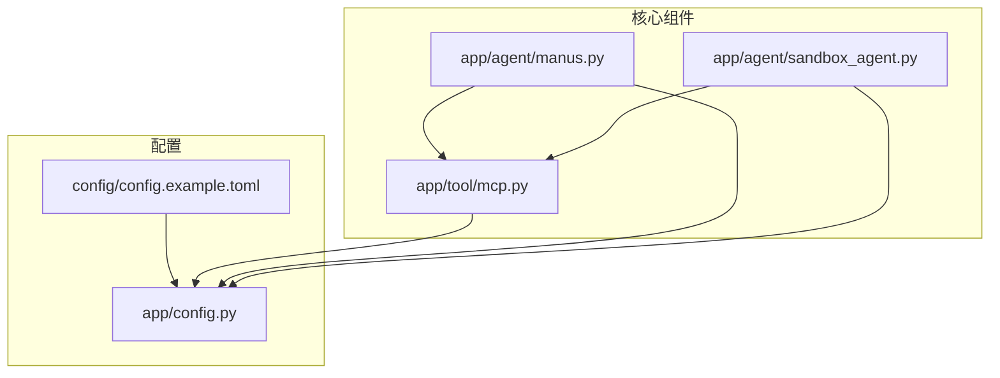
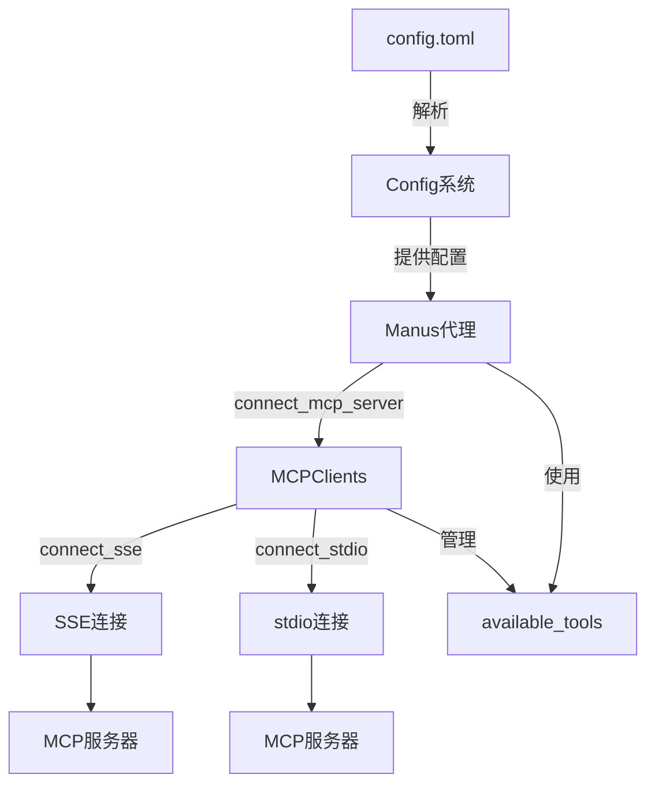
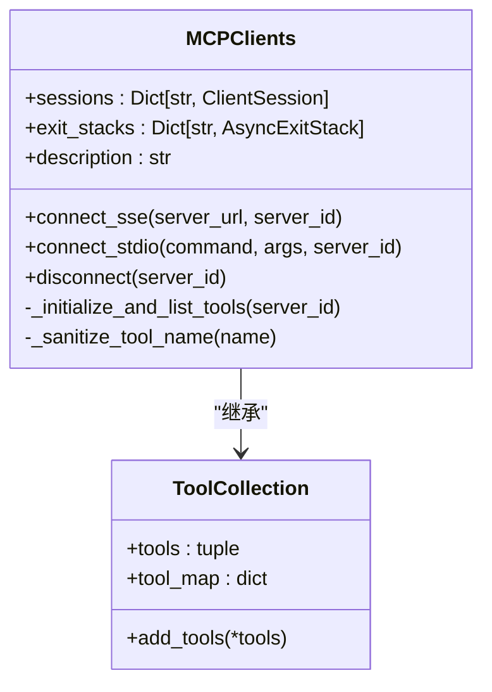
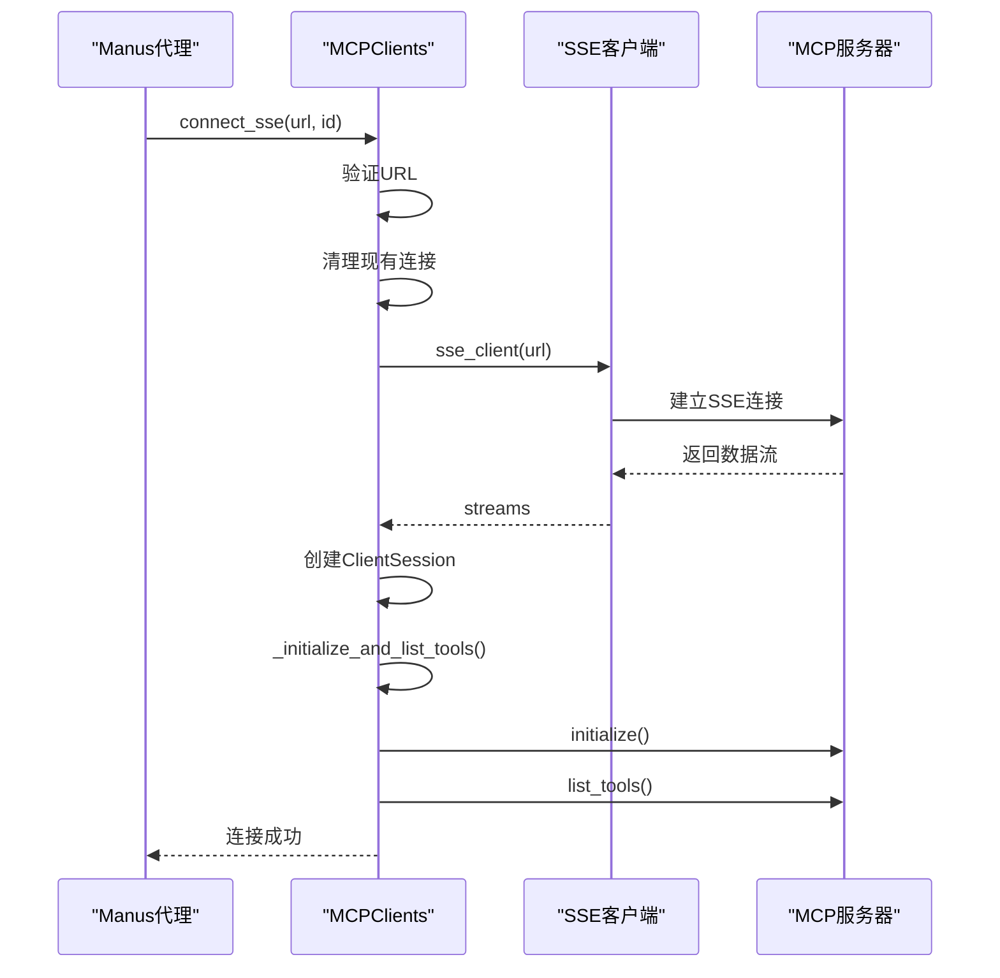
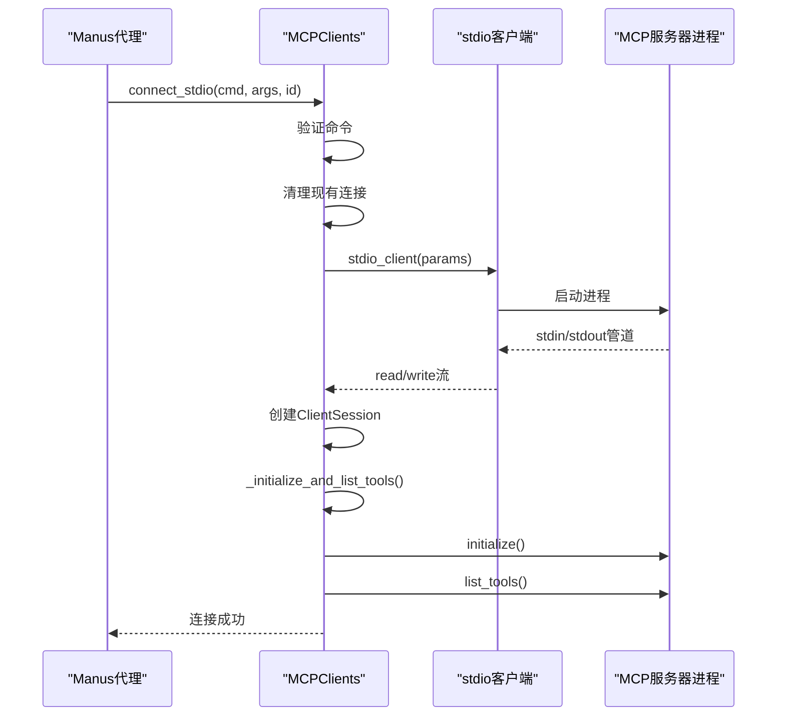
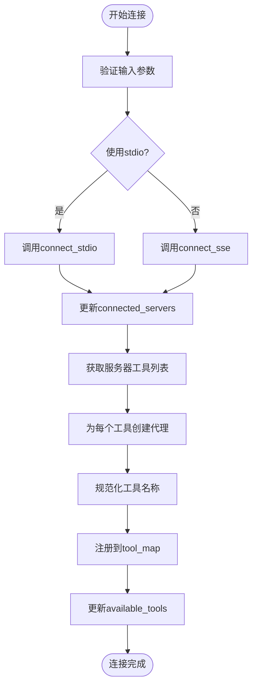
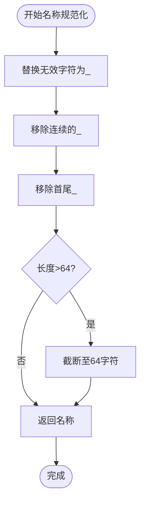
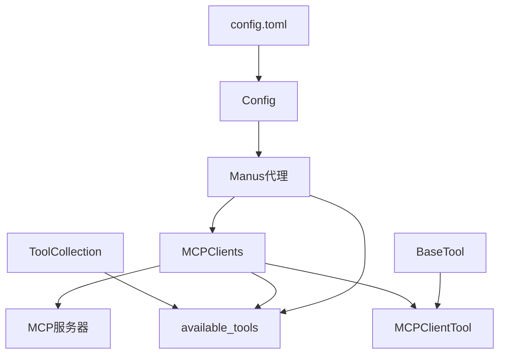

# MCP集成

<cite>
**本文档引用的文件**
- [mcp.py](file://app/tool/mcp.py)
- [manus.py](file://app/agent/manus.py)
- [sandbox_agent.py](file://app/agent/sandbox_agent.py)
- [config.example.toml](file://config/config.example.toml)
- [config.py](file://app/config.py)
</cite>

## 目录
1. [简介](#简介)
2. [项目结构](#项目结构)
3. [核心组件](#核心组件)
4. [架构概述](#架构概述)
5. [详细组件分析](#详细组件分析)
6. [依赖分析](#依赖分析)
7. [性能考虑](#性能考虑)
8. [故障排除指南](#故障排除指南)
9. [结论](#结论)

## 简介
本文档详细阐述了OpenManus项目中MCP（Model Context Protocol）协议的集成机制。重点描述了Manus代理与MCP服务器之间的双向通信，包括SSE和stdio两种连接模式的实现方式。文档详细说明了MCPClients类如何管理远程工具的发现与注册，available_tools工具集合如何动态整合本地与远程工具，connected_servers字典如何跟踪已连接的MCP服务器实例，以及disconnect_mcp_server方法如何安全清理连接资源。

## 项目结构
OpenManus项目的MCP集成主要分布在`app/agent`和`app/tool`目录下。核心的MCP客户端功能实现在`app/tool/mcp.py`中，而代理类如Manus和SandboxManus则在`app/agent`目录下定义。配置文件位于`config/`目录，其中`config.example.toml`提供了MCP服务器配置的示例。

**图示来源**
- [manus.py](file://app/agent/manus.py)
- [mcp.py](file://app/tool/mcp.py)
- [config.example.toml](file://config/config.example.toml)

**本节来源**
- [manus.py](file://app/agent/manus.py)
- [mcp.py](file://app/tool/mcp.py)
- [config.example.toml](file://config/config.example.toml)

## 核心组件
MCP集成的核心组件包括MCPClients类、Manus代理类和配置系统。MCPClients类负责管理与多个MCP服务器的连接，并动态注册远程工具。Manus代理类通过connect_mcp_server方法建立连接，并将远程工具整合到available_tools集合中。connected_servers字典用于跟踪所有已连接的服务器实例。

**本节来源**
- [mcp.py](file://app/tool/mcp.py#L36-L193)
- [manus.py](file://app/agent/manus.py#L90-L128)

## 架构概述
MCP集成采用客户端-服务器架构，Manus代理作为MCP客户端，通过SSE或stdio协议与MCP服务器通信。系统通过分层设计实现了连接管理、工具注册和配置解析的分离。

**图示来源**
- [mcp.py](file://app/tool/mcp.py#L36-L193)
- [manus.py](file://app/agent/manus.py#L90-L111)

## 详细组件分析

### MCPClients类分析
MCPClients类是MCP集成的核心，继承自ToolCollection，负责管理与多个MCP服务器的连接和工具注册。

#### 类图

**图示来源**
- [mcp.py](file://app/tool/mcp.py#L36-L193)

#### 连接模式分析
MCPClients类支持两种连接模式：SSE和stdio。

##### SSE连接序列图

**图示来源**
- [mcp.py](file://app/tool/mcp.py#L49-L68)

##### stdio连接序列图

**图示来源**
- [mcp.py](file://app/tool/mcp.py#L70-L94)

**本节来源**
- [mcp.py](file://app/tool/mcp.py#L36-L193)

### Manus代理分析
Manus代理类负责协调MCP连接的生命周期，包括连接建立、工具整合和连接清理。

#### 连接建立流程

**图示来源**
- [manus.py](file://app/agent/manus.py#L90-L111)
- [mcp.py](file://app/tool/mcp.py#L96-L125)

#### 工具名称规范化流程

**图示来源**
- [mcp.py](file://app/tool/mcp.py#L127-L153)

**本节来源**
- [manus.py](file://app/agent/manus.py#L90-L128)
- [mcp.py](file://app/tool/mcp.py#L127-L153)

## 依赖分析
MCP集成系统涉及多个组件之间的依赖关系，包括配置解析、连接管理和工具注册。

**图示来源**
- [config.py](file://app/config.py)
- [manus.py](file://app/agent/manus.py)
- [mcp.py](file://app/tool/mcp.py)

**本节来源**
- [config.py](file://app/config.py)
- [manus.py](file://app/agent/manus.py)
- [mcp.py](file://app/tool/mcp.py)

## 性能考虑
MCP集成在设计时考虑了性能和资源管理。系统使用AsyncExitStack确保连接资源的正确清理，避免资源泄漏。工具名称的规范化处理包括截断逻辑，防止过长的名称影响系统性能。连接管理中包含了异常处理机制，能够优雅地处理网络中断或服务器不可用的情况。

## 故障排除指南
当MCP连接出现问题时，可以按照以下步骤进行排查：

1. **检查配置文件**：确保`config.toml`中的MCP服务器配置正确
2. **验证连接参数**：确认SSE URL或stdio命令参数有效
3. **检查网络连接**：确保MCP服务器可访问
4. **查看日志信息**：检查系统日志中的错误信息
5. **验证服务器状态**：确认MCP服务器正在运行

**本节来源**
- [mcp.py](file://app/tool/mcp.py#L154-L193)
- [manus.py](file://app/agent/manus.py#L113-L128)

## 结论
OpenManus的MCP集成提供了一套完整的机制，用于管理与MCP服务器的双向通信。通过MCPClients类和Manus代理的协同工作，系统能够灵活地支持SSE和stdio两种连接模式，动态管理远程工具的发现与注册，并安全地处理连接的建立与清理。配置系统使得MCP服务器的设置变得简单直观，为扩展和集成提供了良好的基础。