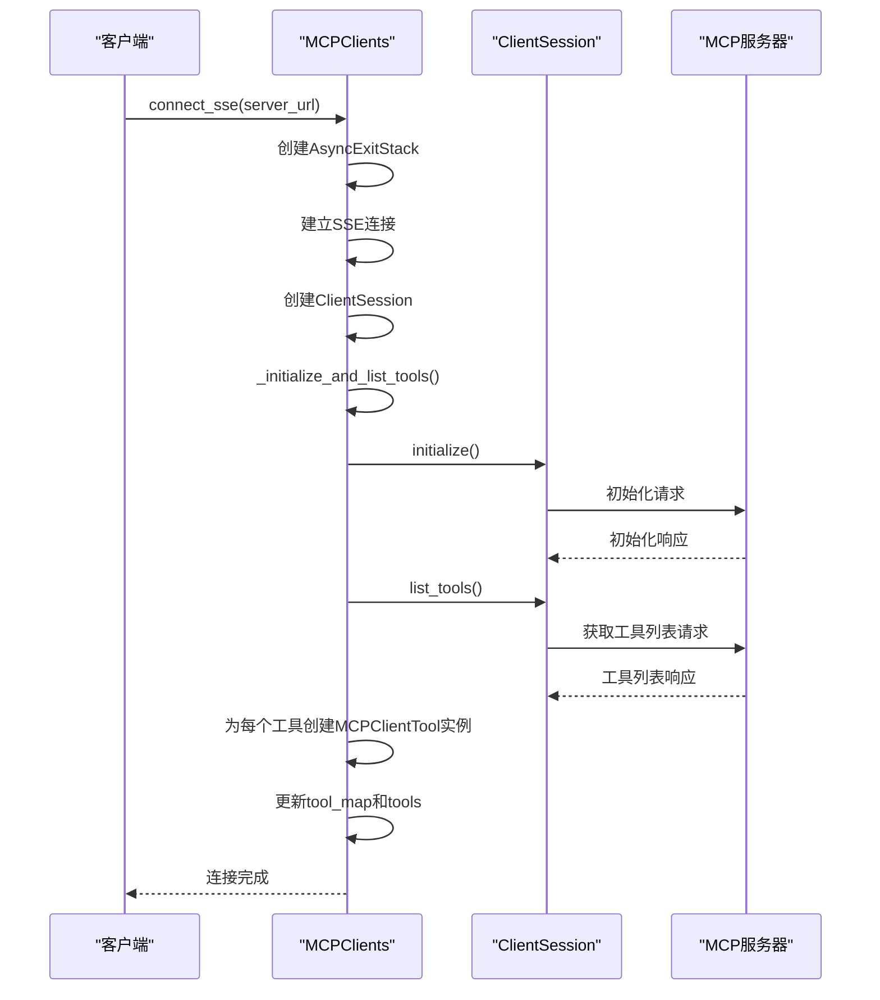
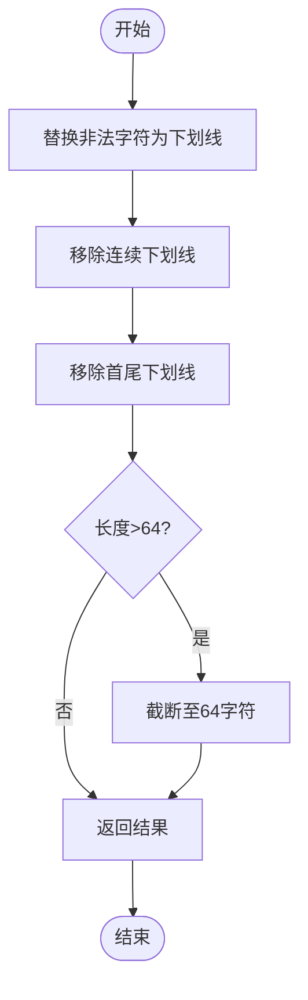
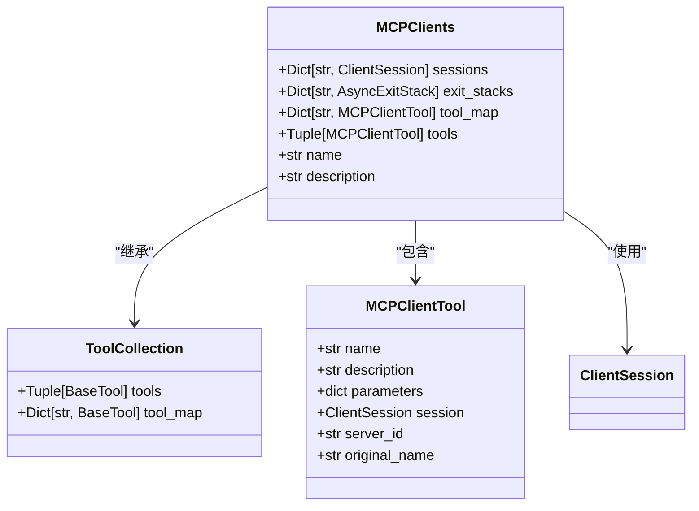
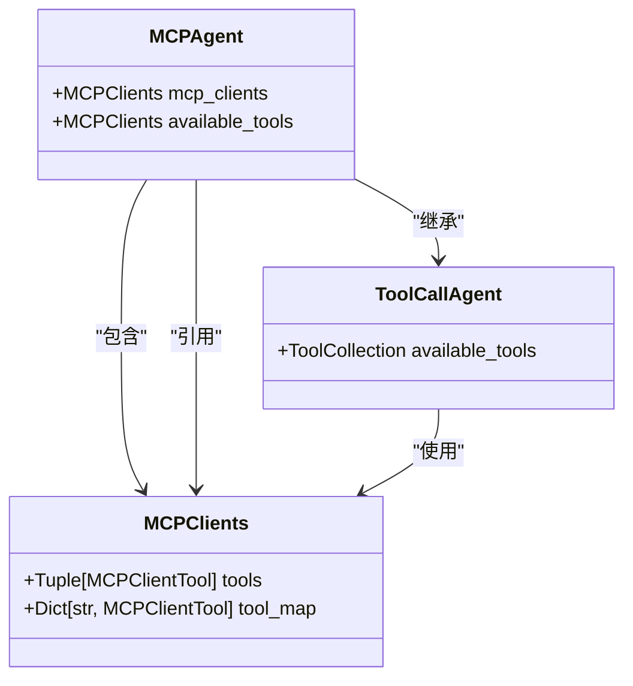
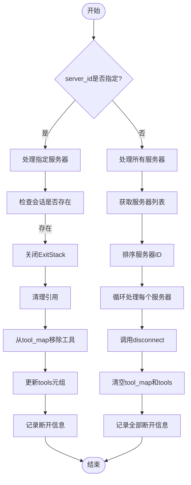
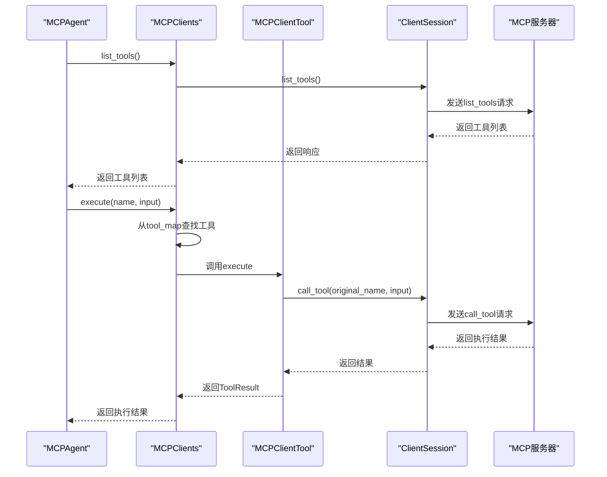
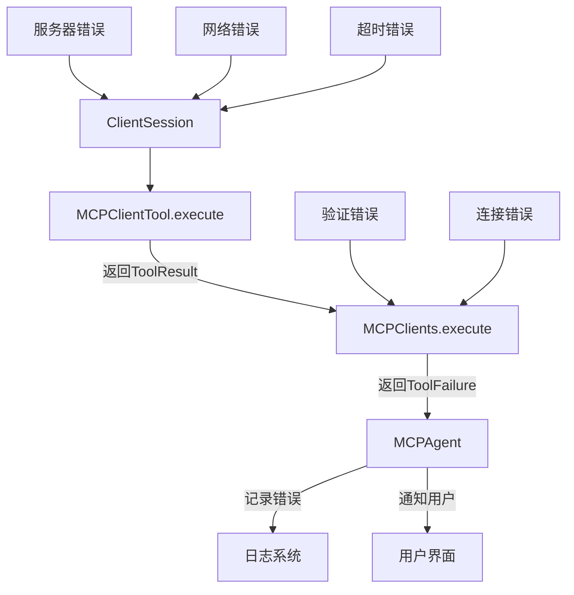

# 工具管理

<cite>
**本文档引用的文件**  
- [mcp.py](file://app/tool/mcp.py)
- [mcp.py](file://app/agent/mcp.py)
- [tool_collection.py](file://app/tool/tool_collection.py)
- [base.py](file://app/tool/base.py)
</cite>

## 目录
1. [简介](#简介)
2. [核心组件](#核心组件)
3. [工具发现与注册](#工具发现与注册)
4. [工具名称规范化](#工具名称规范化)
5. [数据结构与线程安全](#数据结构与线程安全)
6. [工具集合管理](#工具集合管理)
7. [调用链分析](#调用链分析)
8. [错误处理机制](#错误处理机制)

## 简介
本文档详细描述了OpenManus中MCP工具管理系统的实现机制。该系统通过MCPClients类实现对远程MCP服务器的动态连接、工具发现、注册和调用功能。系统支持通过SSE或stdio两种传输方式连接到多个MCP服务器，并为每个远程工具创建代理实例，实现透明的远程调用。文档重点分析了工具发现、名称规范化、数据结构设计和错误处理等关键机制。

## 核心组件

MCP工具管理系统由多个核心组件构成，其中MCPClients类作为主要的工具集合管理器，继承自ToolCollection基类，负责管理所有远程工具的生命周期。MCPClientTool类作为远程工具的代理，封装了具体的调用逻辑。系统通过异步会话管理与MCP服务器的连接，并利用工具映射和集合来组织可用工具。

**Section sources**
- [mcp.py](file://app/tool/mcp.py#L36-L193)
- [tool_collection.py](file://app/tool/tool_collection.py#L8-L70)

## 工具发现与注册

### 工具发现机制
MCPClients类通过`_list_initialize_and_list_tools`方法实现工具的动态发现和注册。当客户端通过`connect_sse`或`connect_stdio`方法连接到MCP服务器后，系统会自动调用此方法初始化会话并获取工具列表。

**Diagram sources**
- [mcp.py](file://app/tool/mcp.py#L49-L94)
- [mcp.py](file://app/tool/mcp.py#L96-L125)

**Section sources**
- [mcp.py](file://app/tool/mcp.py#L49-L125)

### 工具注册流程
工具注册流程包括以下步骤：
1. 通过`session.list_tools()`从服务器获取工具列表
2. 为每个远程工具创建`MCPClientTool`代理实例
3. 使用`_sanitize_tool_name`方法对工具名称进行规范化处理
4. 将代理实例存入`tool_map`字典
5. 更新`tools`元组以反映最新的工具集合

该流程确保了远程工具能够被正确地代理和调用，同时保持了本地工具调用接口的一致性。

## 工具名称规范化

### 规范化策略
`_sanitize_tool_name`方法实现了严格的工具名称规范化策略，确保生成的工具名称符合MCPClientTool的要求。该策略包括以下处理步骤：

**Diagram sources**
- [mcp.py](file://app/tool/mcp.py#L127-L144)

**Section sources**
- [mcp.py](file://app/tool/mcp.py#L127-L144)

### 命名空间隔离
系统通过在工具名称前添加`mcp_{server_id}_`前缀来实现命名空间隔离，防止不同服务器上的同名工具发生冲突。这种命名策略确保了即使多个MCP服务器提供了相同名称的工具，它们在客户端也能被区分开来。

### 非法字符处理
系统使用正则表达式`[^a-zA-Z0-9_-]`识别并替换所有非法字符为下划线。这确保了工具名称只包含字母、数字、连字符和下划线，符合大多数编程语言的标识符命名规则。

### 长度限制
为了防止过长的工具名称导致问题，系统将工具名称限制在64个字符以内。如果规范化后的名称超过此长度，将被截断以满足要求。

## 数据结构与线程安全

### 数据结构设计
MCPClients类采用了两种互补的数据结构来管理工具：

**Diagram sources**
- [mcp.py](file://app/tool/mcp.py#L36-L193)
- [tool_collection.py](file://app/tool/tool_collection.py#L8-L70)

**Section sources**
- [mcp.py](file://app/tool/mcp.py#L36-L193)

### 字典与元组的协同
系统使用`tool_map`字典实现O(1)时间复杂度的工具查找，同时使用`tools`元组提供有序的工具列表。这种设计在保证高效查找的同时，也支持工具的有序遍历。

### 线程安全考虑
虽然Python的GIL保证了字典操作的原子性，但系统在多服务器连接场景下仍需注意线程安全。`tool_map`和`tools`的更新操作在异步方法中执行，确保了在单个事件循环中的操作顺序性。

## 工具集合管理

### available_tools整合机制
MCPAgent类通过`available_tools`属性整合本地与远程工具。在初始化时，`available_tools`被设置为`mcp_clients`实例，从而将远程工具暴露给代理系统。

**Diagram sources**
- [mcp.py](file://app/agent/mcp.py#L26-L27)
- [mcp.py](file://app/tool/mcp.py#L36-L193)

**Section sources**
- [mcp.py](file://app/agent/mcp.py#L26-L27)

### 连接断开时的重建
当MCP服务器连接断开时，系统会自动重建工具集合。`disconnect`方法不仅关闭会话，还会从`tool_map`中移除相关工具，并更新`tools`元组。

**Diagram sources**
- [mcp.py](file://app/tool/mcp.py#L154-L193)

**Section sources**
- [mcp.py](file://app/tool/mcp.py#L154-L193)

## 调用链分析

### 完整调用链
从`list_tools`请求到工具执行的完整调用链如下：

**Diagram sources**
- [mcp.py](file://app/tool/mcp.py#L146-L152)
- [mcp.py](file://app/tool/mcp.py#L20-L33)

**Section sources**
- [mcp.py](file://app/tool/mcp.py#L146-L152)
- [mcp.py](file://app/tool/mcp.py#L20-L33)

### 异步执行流程
系统采用异步执行模型，确保在等待I/O操作时不会阻塞事件循环。所有关键方法都声明为`async`，并通过`await`关键字协调异步调用。

## 错误处理机制

### 错误传播路径
系统的错误处理机制确保了错误信息能够正确地从底层传播到上层：

**Diagram sources**
- [mcp.py](file://app/tool/mcp.py#L20-L33)
- [mcp.py](file://app/tool/mcp.py#L154-L193)

**Section sources**
- [mcp.py](file://app/tool/mcp.py#L20-L33)

### 异常处理策略
系统在`MCPClientTool.execute`方法中捕获所有异常，并将其转换为`ToolResult`对象的`error`字段。这种策略确保了即使远程调用失败，调用方也能获得结构化的错误信息，而不是未处理的异常。

### 连接恢复机制
当连接断开时，系统提供了`connect_sse`和`connect_stdio`方法来重新建立连接。`disconnect`方法中的清理逻辑确保了资源的正确释放，为重新连接做好准备。