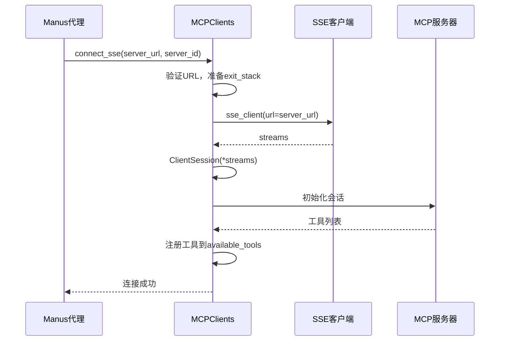
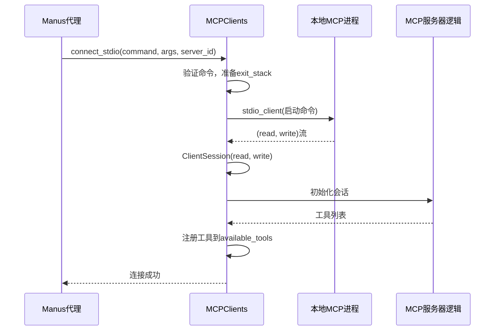
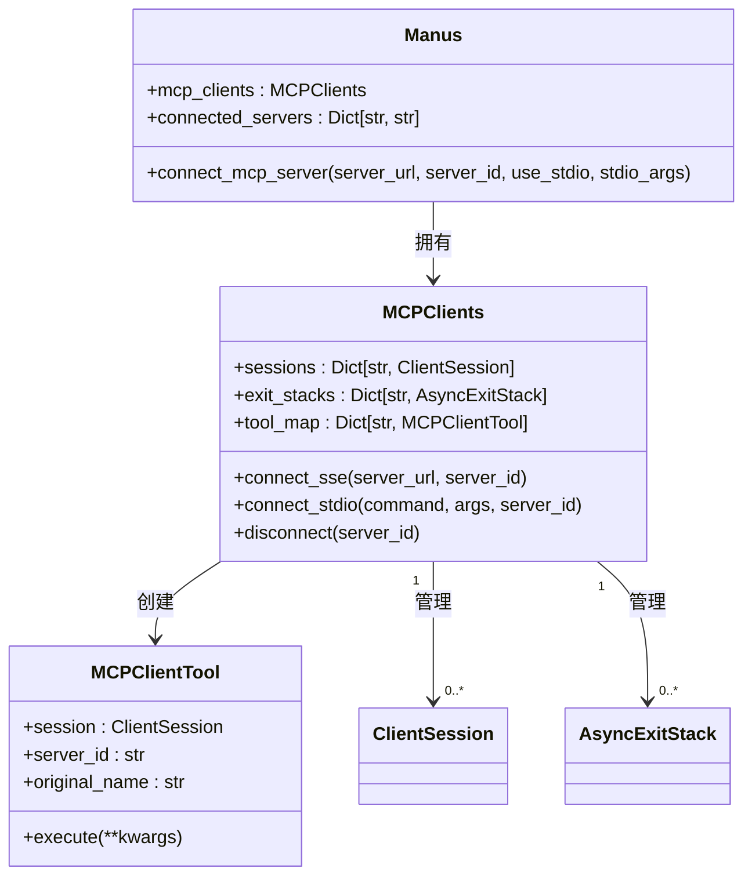

# 连接模式

<cite>
**本文档中引用的文件**   
- [connect_sse](file://app/tool/mcp.py#L49-L68)
- [connect_stdio](file://app/tool/mcp.py#L70-L94)
- [connect_mcp_server](file://app/agent/manus.py#L90-L111)
- [connect_mcp_server](file://app/agent/sandbox_agent.py#L136-L157)
- [MCPServer](file://app/mcp/server.py#L1-L180)
- [MCPClients](file://app/tool/mcp.py#L36-L193)
- [config.py](file://app/config.py#L126-L159)
</cite>

## 目录
1. [引言](#引言)
2. [SSE连接模式](#sse连接模式)
3. [Stdio连接模式](#stdio连接模式)
4. [连接管理机制](#连接管理机制)
5. [异常处理与资源清理](#异常处理与资源清理)
6. [配置与初始化](#配置与初始化)
7. [适用场景分析](#适用场景分析)
8. [结论](#结论)

## 引言
OpenManus中的MCP（Model Context Protocol）协议支持多种连接模式，允许代理与MCP服务器进行通信。本文档重点阐述SSE（Server-Sent Events）和stdio两种核心连接方式的实现机制。SSE模式通过HTTP流式传输建立与远程MCP服务器的持久连接，适用于远程服务集成；而stdio模式通过标准输入输出与本地进程通信，适用于本地工具链调用。文档将详细说明`connect_sse`和`connect_stdio`方法的内部工作原理，解释`server_id`在连接管理中的作用，以及`exit_stack`如何确保资源的安全清理。

**Section sources**
- [MCPClients](file://app/tool/mcp.py#L36-L193)

## SSE连接模式
SSE连接模式通过HTTP长连接实现服务器到客户端的单向实时数据流。`connect_sse`方法是建立此类连接的核心。该方法首先验证服务器URL的有效性，并使用`server_id`或URL本身作为连接的唯一标识。在建立新连接前，会通过`disconnect`方法确保任何已存在的同ID连接被安全断开，防止资源冲突。

连接的核心是`AsyncExitStack`的使用。该上下文管理器负责管理异步资源的生命周期。方法调用`sse_client(url=server_url)`创建一个SSE流上下文，并通过`exit_stack.enter_async_context`将其注册到栈中。随后，`ClientSession(*streams)`利用这些流创建一个会话，该会话同样被注册到`exit_stack`中。这种设计确保了当连接需要断开时，`exit_stack`能够按正确的顺序自动关闭所有相关资源，实现优雅的资源清理。

成功建立会话后，系统会调用`_initialize_and_list_tools`方法，向服务器发起初始化请求并获取其提供的工具列表，将这些远程工具动态注册到本地工具集合中，供代理使用。



**Diagram sources**
- [connect_sse](file://app/tool/mcp.py#L49-L68)
- [MCPClients](file://app/tool/mcp.py#L36-L193)

**Section sources**
- [connect_sse](file://app/tool/mcp.py#L49-L68)

## Stdio连接模式
Stdio连接模式用于与本地运行的MCP服务器进程进行通信。`connect_stdio`方法通过执行指定的命令（如`python -m app.mcp.server`）来启动或连接到一个本地服务器进程。与SSE模式类似，该方法也要求提供一个命令，并使用`server_id`或命令本身作为连接标识。

其核心机制同样是`AsyncExitStack`。方法创建一个`StdioServerParameters`对象来封装要执行的命令和参数，然后调用`stdio_client(server_params)`。该函数会异步启动进程，并返回一对读写流（`read, write`）。这两条流被`enter_async_context`注册到`exit_stack`中，确保进程在连接结束时能被正确终止。接着，`ClientSession(read, write)`利用这些流创建一个会话，完成连接。最后，同样通过`_initialize_and_list_tools`方法获取并注册远程工具。

此模式的优势在于低延迟和高效率，因为它避免了网络开销，直接通过进程间通信（IPC）进行数据交换。



**Diagram sources**
- [connect_stdio](file://app/tool/mcp.py#L70-L94)
- [MCPClients](file://app/tool/mcp.py#L36-L193)

**Section sources**
- [connect_stdio](file://app/tool/mcp.py#L70-L94)

## 连接管理机制
连接管理是MCP协议稳定运行的关键。`server_id`在其中扮演了核心角色，它作为每个MCP服务器连接的唯一键，用于在`MCPClients`类的`sessions`和`exit_stacks`字典中索引和管理会话与资源栈。

`Manus`和`SandboxManus`等代理类通过`connect_mcp_server`方法作为统一的入口来初始化连接。该方法根据`use_stdio`参数的值，决定调用`MCPClients`的`connect_sse`还是`connect_stdio`方法。连接成功后，代理会更新`connected_servers`字典以记录连接状态，并从`MCPClients`的工具集合中筛选出属于该`server_id`的新工具，将其添加到自身的`available_tools`中，从而实现工具的动态加载。



**Diagram sources**
- [connect_mcp_server](file://app/agent/manus.py#L90-L111)
- [connect_mcp_server](file://app/agent/sandbox_agent.py#L136-L157)
- [MCPClients](file://app/tool/mcp.py#L36-L193)

**Section sources**
- [connect_mcp_server](file://app/agent/manus.py#L90-L111)
- [connect_mcp_server](file://app/agent/sandbox_agent.py#L136-L157)

## 异常处理与资源清理
系统设计了完善的异常处理和资源清理机制以确保鲁棒性。`connect_sse`和`connect_stdio`方法在建立连接前会主动调用`disconnect`，这保证了即使之前的连接因异常而未完全释放，也能在新连接尝试前进行清理，避免了“僵尸”连接。

`AsyncExitStack`是资源安全清理的核心。它采用“最后进入，最先退出”（LIFO）的顺序管理所有通过`enter_async_context`注册的异步上下文管理器。当调用`exit_stack.aclose()`时，它会按相反的顺序依次关闭所有资源，例如先关闭`ClientSession`，再关闭底层的SSE流或stdio进程。这种机制确保了依赖关系的正确处理。

在`disconnect`方法中，即使`exit_stack.aclose()`因“cancel scope”等运行时错误而失败，系统也会捕获异常并记录警告，然后继续执行后续的清理步骤，如从字典中移除会话引用和相关工具。这种“尽力而为”的清理策略最大限度地减少了资源泄漏的风险。

**Section sources**
- [MCPClients](file://app/tool/mcp.py#L154-L193)

## 配置与初始化
MCP服务器的连接信息可以通过配置文件进行管理。`config.py`中的`MCPSettings`和`MCPServerConfig`类定义了配置结构，允许在`mcp.json`文件中声明多个服务器，指定其连接类型（`sse`或`stdio`）、URL或启动命令。`Manus`代理的`initialize_mcp_servers`方法会读取此配置，并根据每个服务器的`type`字段自动调用`connect_mcp_server`，传入相应的参数，从而实现连接的自动化初始化。

```mermaid
flowchart TD
A[启动Manus代理] --> B[调用initialize_mcp_servers]
B --> C{遍历mcp_config.servers}
C --> D{server_config.type == "sse"?}
D --> |是| E[调用connect_mcp_server<br/>(server_url, server_id)]
D --> |否| F{server_config.type == "stdio"?}
F --> |是| G[调用connect_mcp_server<br/>(command, server_id, use_stdio=True, stdio_args)]
F --> |否| H[抛出错误]
E --> I[建立SSE连接]
G --> J[建立Stdio连接]
I --> K[注册远程工具]
J --> K
K --> L[初始化完成]
```

**Diagram sources**
- [config.py](file://app/config.py#L126-L159)
- [initialize_mcp_servers](file://app/agent/manus.py#L66-L88)

**Section sources**
- [config.py](file://app/config.py#L126-L159)
- [initialize_mcp_servers](file://app/agent/manus.py#L66-L88)

## 适用场景分析
两种连接模式各有其最佳适用场景：
*   **SSE模式**：适用于**远程服务集成**。当MCP服务器部署在远程主机、云服务或Docker容器中时，SSE提供了通过HTTP协议进行跨网络通信的标准方式。它允许OpenManus代理与位于不同物理位置的服务进行交互，是构建分布式系统的理想选择。
*   **Stdio模式**：适用于**本地工具链调用**。当MCP服务器作为本地Python模块（如`app.mcp.server`）运行时，stdio模式提供了最直接、最高效的通信方式。它避免了网络协议栈的开销，延迟极低，非常适合性能要求高或需要与本地开发环境紧密集成的场景。

**Section sources**
- [connect_sse](file://app/tool/mcp.py#L49-L68)
- [connect_stdio](file://app/tool/mcp.py#L70-L94)

## 结论
OpenManus的MCP协议通过`connect_sse`和`connect_stdio`两种模式，灵活地支持了远程和本地的服务器连接。其核心在于利用`AsyncExitStack`进行可靠的资源生命周期管理，并通过`server_id`实现对多个连接的精确控制。`Manus`代理提供的`connect_mcp_server`方法作为统一入口，简化了连接的初始化过程。结合配置文件，系统能够自动化地建立和管理复杂的工具链。这种设计既保证了系统的健壮性和安全性，又提供了极大的灵活性，能够适应从本地开发到远程部署的各种应用场景。