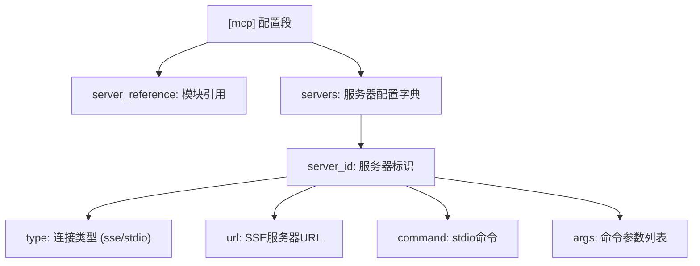
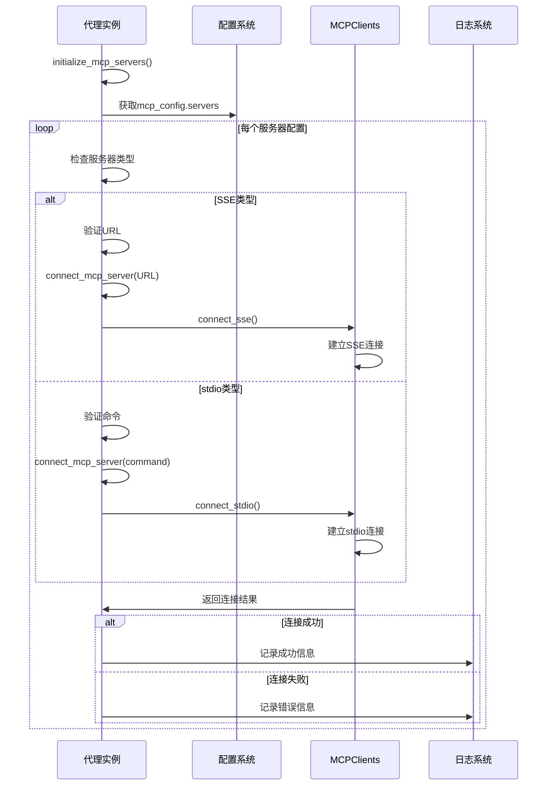
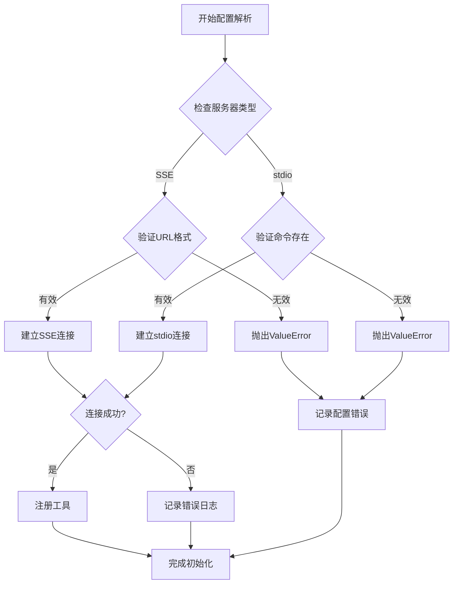

# 配置方法

<cite>
**本文档中引用的文件**  
- [config.example.toml](file://config/config.example.toml)
- [mcp.example.json](file://config/mcp.example.json)
- [config.py](file://app/config.py)
- [manus.py](file://app/agent/manus.py)
- [mcp.py](file://app/tool/mcp.py)
</cite>

## 目录
1. [MCP协议配置机制概述](#mcp协议配置机制概述)
2. [TOML配置文件结构详解](#toml配置文件结构详解)
3. [server_reference模块引用机制](#server_reference模块引用机制)
4. [initialize_mcp_servers初始化流程](#initialize_mcp_servers初始化流程)
5. [SSE与stdio服务器配置示例](#sse与stdio服务器配置示例)
6. [server_id命名规则与连接复用](#server_id命名规则与连接复用)
7. [配置解析与错误处理机制](#配置解析与错误处理机制)
8. [调试建议与最佳实践](#调试建议与最佳实践)

## MCP协议配置机制概述

OpenManus系统通过TOML格式的配置文件实现对MCP（Model Context Protocol）服务器的灵活管理。该机制允许用户在不修改代码的情况下定义和管理多个MCP服务器连接，支持SSE（Server-Sent Events）和stdio两种通信模式。配置系统采用分层结构，通过[mcp]配置段集中管理服务器连接参数，并在代理启动时自动初始化所有配置的服务器连接。

**Section sources**
- [config.example.toml](file://config/config.example.toml#L100-L105)
- [config.py](file://app/config.py#L126-L170)

## TOML配置文件结构详解

MCP服务器配置在TOML文件中通过[mcp]配置段进行定义，该段包含server_reference和servers两个主要配置项。其中servers字段是一个字典结构，每个键值对代表一个MCP服务器配置，键为server_id，值为服务器的具体配置参数。



**Diagram sources**
- [config.example.toml](file://config/config.example.toml#L100-L105)
- [config.py](file://app/config.py#L126-L134)

**Section sources**
- [config.example.toml](file://config/config.example.toml#L100-L105)
- [config.py](file://app/config.py#L126-L134)

## server_reference模块引用机制

server_reference配置项指定MCP服务器的模块引用路径，其默认值为"app.mcp.server"。该配置用于确定MCP服务器的实现模块位置，系统通过此引用动态加载相应的服务器实现。模块引用采用Python的点号分隔路径格式，指向包含MCP服务器类定义的模块。

当系统需要启动MCP服务器或进行服务器间通信时，会根据server_reference的值导入相应的模块并实例化服务器对象。这种设计实现了配置与实现的解耦，允许用户通过修改配置文件来切换不同的服务器实现，而无需修改核心代码逻辑。

**Section sources**
- [config.example.toml](file://config/config.example.toml#L103-L105)
- [config.py](file://app/config.py#L137-L140)

## initialize_mcp_servers初始化流程

initialize_mcp_servers方法在代理启动时自动执行，负责读取配置并建立所有MCP服务器连接。该方法遍历config.mcp_config.servers中的每个服务器配置，根据type字段的值选择相应的连接方式。

对于SSE类型服务器，方法检查url字段的有效性后调用connect_mcp_server建立连接；对于stdio类型服务器，则验证command字段后建立stdio连接。连接成功后，系统会将服务器工具添加到可用工具集合中，并记录连接状态。整个过程包含异常处理机制，确保单个服务器连接失败不会影响其他服务器的初始化。



**Diagram sources**
- [manus.py](file://app/agent/manus.py#L66-L88)
- [mcp.py](file://app/tool/mcp.py#L49-L94)

**Section sources**
- [manus.py](file://app/agent/manus.py#L66-L88)
- [config.py](file://app/config.py#L137-L170)

## SSE与stdio服务器配置示例

以下为完整的MCP服务器配置示例，展示了SSE和stdio两种类型服务器的配置语法：

```toml
[mcp]
server_reference = "app.mcp.server"

# SSE类型服务器配置
[mcp.servers.server1]
type = "sse"
url = "http://localhost:8000/sse"

# stdio类型服务器配置
[mcp.servers.server2]
type = "stdio"
command = "python"
args = ["-m", "my_mcp_server", "--port", "8080"]
```

SSE服务器通过url字段指定服务器端点，适用于HTTP长连接场景；stdio服务器通过command和args字段定义启动命令，适用于本地进程通信场景。两种配置方式都使用server_id作为唯一标识，便于后续引用和管理。

**Section sources**
- [config.example.toml](file://config/config.example.toml#L100-L105)
- [mcp.example.json](file://config/mcp.example.json#L1-L9)

## server_id命名规则与连接复用

server_id作为MCP服务器的唯一标识符，遵循以下命名规则：只能包含字母、数字、连字符和下划线，长度不超过64个字符，且必须以字母开头。系统通过server_id实现连接复用，相同server_id的连接请求会复用现有连接而非创建新连接。

连接复用机制通过connected_servers字典实现，该字典以server_id为键存储连接信息。当需要与特定服务器通信时，系统首先检查connected_servers中是否存在对应连接，若存在则直接复用，否则创建新连接。这种机制有效减少了资源消耗，提高了通信效率。

**Section sources**
- [manus.py](file://app/agent/manus.py#L90-L111)
- [mcp.py](file://app/tool/mcp.py#L36-L193)

## 配置解析与错误处理机制

系统在解析MCP配置时实施严格的验证逻辑。对于SSE服务器，必须提供有效的URL格式；对于stdio服务器，必须指定有效的命令路径。配置解析器会验证这些关键字段的完整性和正确性，发现无效配置时抛出相应异常。

错误处理机制包含多层防护：在连接建立前验证配置参数，在连接过程中捕获网络异常，在工具注册时检查数据完整性。所有错误都会被记录到日志系统，包含详细的错误信息和上下文，便于问题排查。系统设计为容错模式，单个服务器配置错误不会导致整个系统初始化失败。



**Diagram sources**
- [config.py](file://app/config.py#L137-L170)
- [mcp.py](file://app/tool/mcp.py#L49-L94)

**Section sources**
- [config.py](file://app/config.py#L137-L170)
- [mcp.py](file://app/tool/mcp.py#L36-L193)

## 调试建议与最佳实践

建议在配置MCP服务器时遵循以下最佳实践：使用描述性的server_id命名，确保命令路径的可执行性，测试URL端点的可达性。调试时可启用详细日志记录，检查connected_servers字典验证连接状态。

推荐的调试步骤包括：验证配置文件语法正确性，检查服务器进程是否正常运行，确认网络连接可达性，查看日志中的错误堆栈信息。对于复杂问题，可临时简化配置，逐个测试服务器连接，以隔离问题根源。

**Section sources**
- [manus.py](file://app/agent/manus.py#L66-L88)
- [mcp.py](file://app/tool/mcp.py#L36-L193)