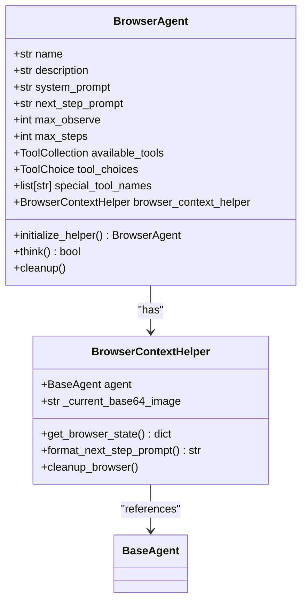
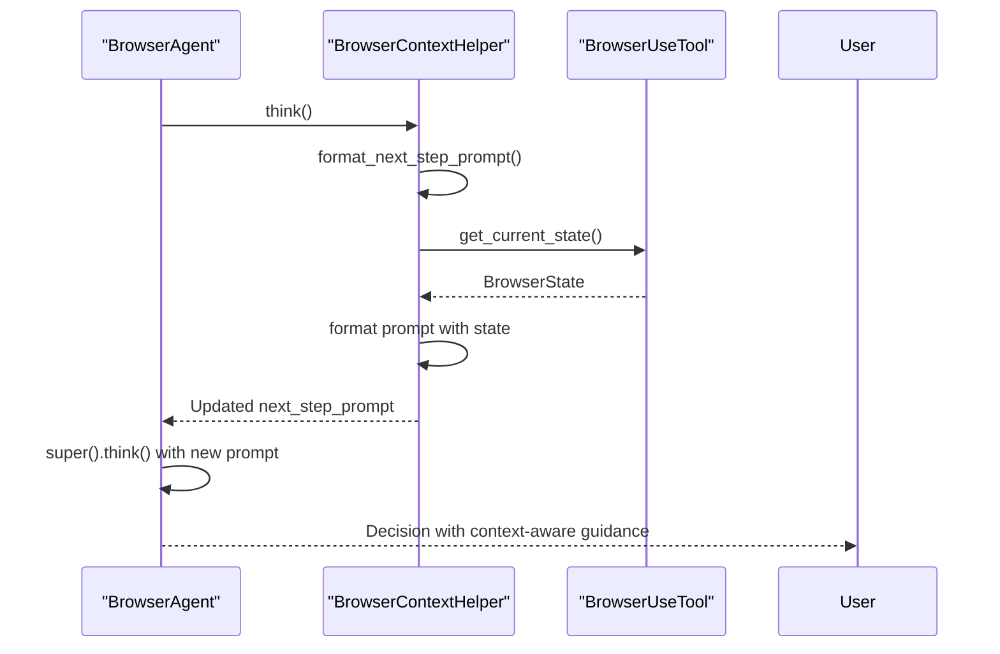
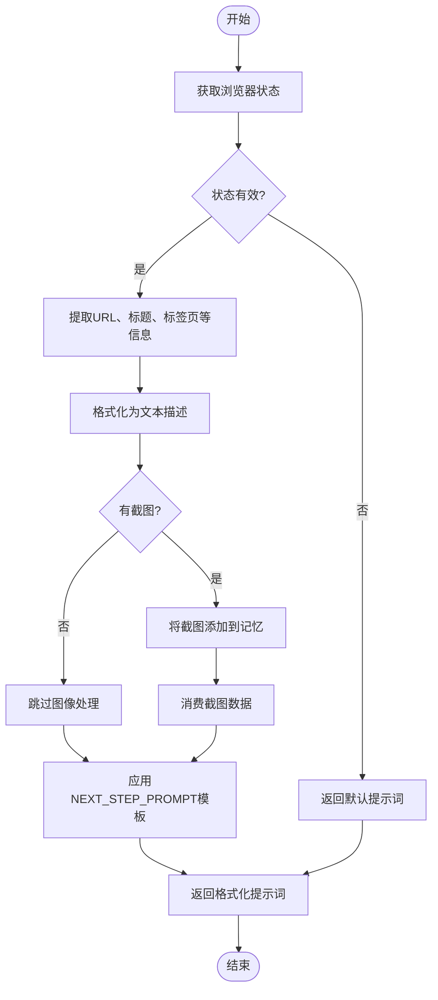

# 浏览器交互

<cite>
**Referenced Files in This Document**   
- [app/agent/browser.py](file://app/agent/browser.py)
- [app/prompt/browser.py](file://app/prompt/browser.py)
</cite>

## 目录
1. [简介](#简介)
2. [核心组件](#核心组件)
3. [BrowserContextHelper初始化](#browsercontexthelper初始化)
4. [上下文感知机制](#上下文感知机制)
5. [动态提示词生成](#动态提示词生成)
6. [实际效果示例](#实际效果示例)

## 简介
本文档详细阐述OpenManus中浏览器交互功能的技术实现，重点分析BrowserContextHelper辅助类如何增强浏览器操作的上下文感知能力。文档将深入解析浏览器上下文辅助类的初始化过程、上下文检测机制、动态提示词切换策略以及特殊提示词生成方法，展示系统如何确保代理在连续浏览器操作中的上下文连贯性。

## 核心组件

本文档主要分析以下两个核心文件中的组件：

- `app/agent/browser.py`：包含BrowserAgent代理类和BrowserContextHelper上下文辅助类的实现
- `app/prompt/browser.py`：包含浏览器操作相关的系统提示词和下一步提示词模板

**Section sources**
- [app/agent/browser.py](file://app/agent/browser.py)
- [app/prompt/browser.py](file://app/prompt/browser.py)

## BrowserContextHelper初始化

BrowserContextHelper是OpenManus中负责管理浏览器上下文状态的核心辅助类。该类在BrowserAgent初始化过程中被创建，通过依赖注入的方式接收代理实例作为参数，建立与代理的双向关联。

初始化过程通过BrowserAgent类的`initialize_helper`方法实现，该方法使用Pydantic的`@model_validator`装饰器在模型验证后自动执行。当BrowserAgent实例化时，系统会自动调用此方法，创建BrowserContextHelper实例并将其赋值给代理的`browser_context_helper`属性。这种设计确保了每个浏览器代理都拥有独立的上下文管理器，实现了状态隔离和资源管理的封装。



**Diagram sources**
- [app/agent/browser.py](file://app/agent/browser.py#L86-L128)

**Section sources**
- [app/agent/browser.py](file://app/agent/browser.py#L115-L117)

## 上下文感知机制

OpenManus的浏览器交互系统通过智能的上下文感知机制来提升操作的准确性和连贯性。该机制的核心在于`think`方法的重写，它在每次决策周期中动态调整代理的行为策略。

`think`方法首先调用BrowserContextHelper的`format_next_step_prompt`方法获取当前浏览器状态，并将结果赋值给代理的`next_step_prompt`属性。这一过程实现了提示词的动态切换，使代理能够根据最新的浏览器状态获得更精准的操作指导。随后，方法调用父类的`think`实现，继续标准的决策流程。

上下文检测的关键在于对消息历史的分析。系统通过检查最近的消息历史中是否包含浏览器工具调用，来判断当前是否处于浏览器操作上下文中。如果检测到相关工具调用，系统会自动激活上下文感知模式，增强对浏览器状态的关注度。



**Diagram sources**
- [app/agent/browser.py](file://app/agent/browser.py#L119-L124)

**Section sources**
- [app/agent/browser.py](file://app/agent/browser.py#L119-L124)

## 动态提示词生成

OpenManus通过`format_next_step_prompt`方法实现动态提示词的生成，确保代理在连续浏览器操作中保持上下文连贯性。该方法首先调用`get_browser_state`获取当前浏览器的完整状态信息，包括URL、页面标题、标签页数量以及视口内外的内容信息。

获取到浏览器状态后，方法将这些信息格式化为结构化的文本描述，并填充到预定义的`NEXT_STEP_PROMPT`模板中。模板中的占位符（如`{url_placeholder}`、`{tabs_placeholder}`等）会被实际的浏览器状态信息替换，生成一个包含丰富上下文的特殊提示词。

特别的是，当系统获取到浏览器截图时，`format_next_step_prompt`方法会创建一个包含base64编码图像的消息，并将其添加到代理的记忆中。这确保了视觉信息能够被后续的决策过程所利用，同时通过消费机制避免了重复处理同一图像。



**Diagram sources**
- [app/agent/browser.py](file://app/agent/browser.py#L46-L78)

**Section sources**
- [app/agent/browser.py](file://app/agent/browser.py#L46-L78)
- [app/prompt/browser.py](file://app/prompt/browser.py)

## 实际效果示例

为了展示上下文感知机制的实际效果，以下对比了浏览器工具调用前后提示词的变化：

### 调用前的提示词
```
What should I do next to achieve my goal?

When you see [Current state starts here], focus on the following:
- Current URL and page title
- Available tabs
- Interactive elements and their indices
- Content above or below the viewport (if indicated)
- Any action results or errors
```

### 调用后的提示词
```
What should I do next to achieve my goal?

When you see [Current state starts here], focus on the following:
- Current URL and page title
   URL: https://example.com/search
   Title: Search Results
- Available tabs
   3 tab(s) available
- Interactive elements and their indices
- Content above (120 pixels) or below (800 pixels) the viewport (if indicated)
- Any action results or errors

For browser interactions:
- To navigate: browser_use with action="go_to_url", url="..."
- To click: browser_use with action="click_element", index=N
- To type: browser_use with action="input_text", index=N, text="..."
- To extract: browser_use with action="extract_content", goal="..."
- To scroll: browser_use with action="scroll_down" or "scroll_up"
```

通过对比可以看出，上下文感知机制显著增强了提示词的信息量和指导性。调用后的提示词包含了具体的URL、页面标题、标签页数量以及视口内外的像素信息，为代理提供了更精确的操作环境描述。这种动态的上下文增强确保了代理能够在复杂的浏览器操作序列中保持连贯的思维链，提高了任务完成的准确性和效率。

**Section sources**
- [app/prompt/browser.py](file://app/prompt/browser.py)
- [app/agent/browser.py](file://app/agent/browser.py#L46-L78)