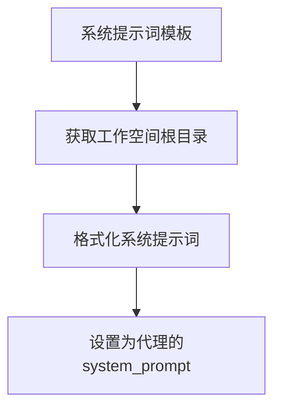
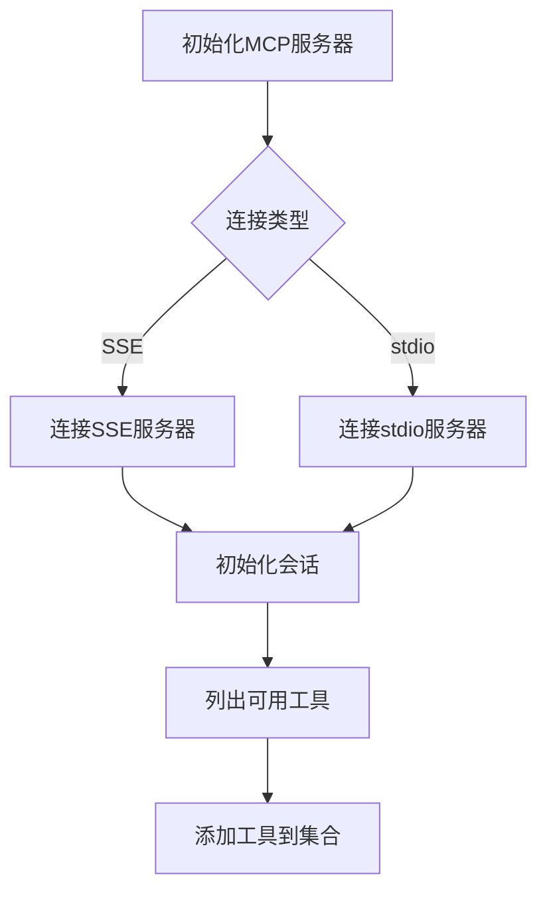
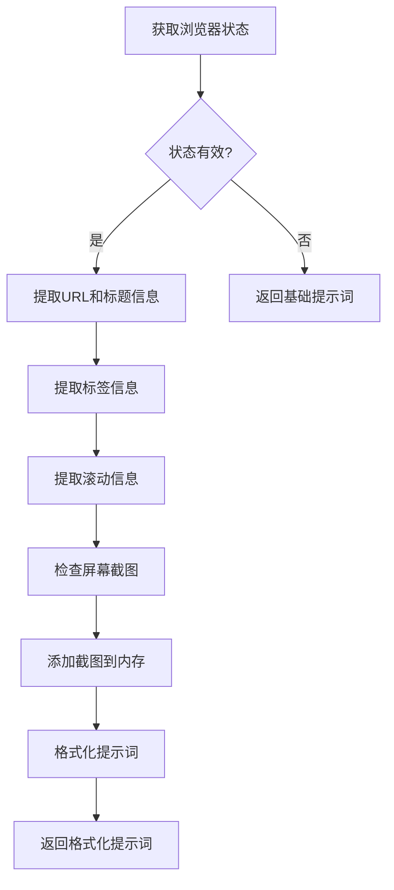
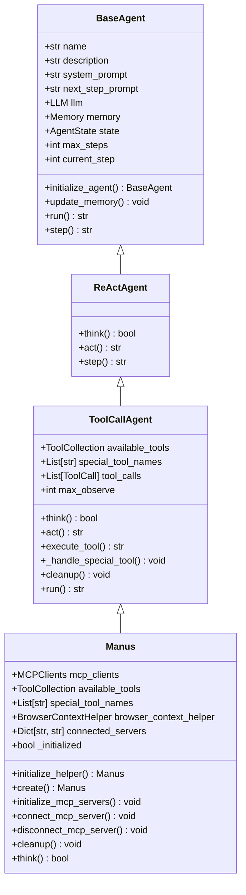

# 通用代理

<cite>
**本文档中引用的文件**  
- [manus.py](file://app/agent/manus.py)
- [toolcall.py](file://app/agent/toolcall.py)
- [python_execute.py](file://app/tool/python_execute.py)
- [browser_use_tool.py](file://app/tool/browser_use_tool.py)
- [str_replace_editor.py](file://app/tool/str_replace_editor.py)
- [ask_human.py](file://app/tool/ask_human.py)
- [terminate.py](file://app/tool/terminate.py)
- [mcp.py](file://app/tool/mcp.py)
- [browser.py](file://app/agent/browser.py)
- [manus.py](file://app/prompt/manus.py)
</cite>

## 目录
1. [简介](#简介)
2. [核心功能组件](#核心功能组件)
3. [系统提示词动态格式化](#系统提示词动态格式化)
4. [MCP服务器连接管理](#mcp服务器连接管理)
5. [代理创建工厂方法](#代理创建工厂方法)
6. [浏览器上下文辅助器](#浏览器上下文辅助器)
7. [类继承结构](#类继承结构)

## 简介
OpenManus通用代理（Manus）是一个多功能AI助手，能够通过多种工具高效完成复杂任务。该代理继承自ToolCallAgent，支持编程、信息检索、文件处理、网页浏览和人工交互等多种功能。Manus集成了Python执行、浏览器使用、字符串替换编辑器、人工交互和终止工具等核心组件，并通过MCP协议连接远程服务器，实现强大的任务处理能力。

## 核心功能组件

Manus代理集成了多个核心功能组件，包括Python执行、浏览器使用、字符串替换编辑器、人工交互和终止工具。这些组件通过ToolCollection进行管理，为代理提供了全面的任务处理能力。

### Python执行工具
PythonExecute工具允许代理执行Python代码，具有超时和安全限制。该工具使用multiprocessing模块在隔离环境中运行代码，防止潜在的安全风险。执行结果仅显示打印输出，函数返回值不会被捕获。

**组件来源**
- [python_execute.py](file://app/tool/python_execute.py#L1-L76)

### 浏览器使用工具
BrowserUseTool提供强大的浏览器自动化功能，支持页面导航、元素交互、内容提取和标签管理。该工具维护浏览器会话状态，直到显式关闭。支持的关键功能包括：
- 导航：访问特定URL、返回上一页、刷新页面或执行网络搜索
- 交互：点击元素、输入文本、选择下拉选项或发送键盘命令
- 滚动：按像素量上下滚动或滚动到特定文本
- 内容提取：基于特定目标从网页中提取和分析内容
- 标签管理：切换标签、打开新标签或关闭标签

**组件来源**
- [browser_use_tool.py](file://app/tool/browser_use_tool.py#L1-L568)

### 字符串替换编辑器
StrReplaceEditor工具用于查看、创建和编辑文件，支持沙箱环境。该工具具有以下特点：
- 状态在命令调用和用户讨论中保持持久
- 支持文件查看、创建、字符串替换、插入和撤销编辑
- 对长输出进行截断处理
- 提供精确的字符串匹配和替换功能

**组件来源**
- [str_replace_editor.py](file://app/tool/str_replace_editor.py#L1-L433)

### 人工交互工具
AskHuman工具允许代理在需要时向人类寻求帮助。当代理无法继续任务时，可以使用此工具向用户提问，获取必要的信息或指导。

**组件来源**
- [ask_human.py](file://app/tool/ask_human.py#L1-L22)

### 终止工具
Terminate工具用于在任务完成或无法继续时终止交互。当所有任务完成后，应调用此工具结束工作。

**组件来源**
- [terminate.py](file://app/tool/terminate.py#L1-L26)

## 系统提示词动态格式化

Manus代理的系统提示词（system_prompt）根据工作空间根目录动态格式化。系统提示词定义了代理的角色和能力，通过将工作空间根目录插入提示词中，使代理能够了解初始目录位置。



**图示来源**
- [manus.py](file://app/agent/manus.py#L23)
- [manus.py](file://app/prompt/manus.py#L1-L11)

**组件来源**
- [manus.py](file://app/agent/manus.py#L23)
- [manus.py](file://app/prompt/manus.py#L1-L11)

## MCP服务器连接管理

Manus代理支持通过SSE和stdio两种方式连接MCP服务器。MCP（Model Context Protocol）服务器提供远程工具访问能力，扩展了代理的功能。

### SSE连接初始化
SSE（Server-Sent Events）连接通过URL建立，代理使用sse_client创建流式连接。连接过程包括：
1. 验证服务器URL
2. 确保在新连接前清理现有连接
3. 创建异步退出栈管理资源
4. 建立SSE流并创建ClientSession
5. 初始化会话并列出可用工具

### stdio连接初始化
stdio连接通过命令行执行建立，代理使用stdio_client与服务器通信。连接过程包括：
1. 验证服务器命令
2. 确保在新连接前清理现有连接
3. 创建异步退出栈管理资源
4. 执行服务器命令并建立stdio传输
5. 创建ClientSession并初始化会话



**图示来源**
- [manus.py](file://app/agent/manus.py#L66-L88)
- [mcp.py](file://app/tool/mcp.py#L49-L68)
- [mcp.py](file://app/tool/mcp.py#L70-L94)

**组件来源**
- [manus.py](file://app/agent/manus.py#L66-L88)
- [mcp.py](file://app/tool/mcp.py#L49-L68)
- [mcp.py](file://app/tool/mcp.py#L70-L94)

## 代理创建工厂方法

Manus代理提供了异步工厂方法create用于创建和初始化实例。该方法确保代理在返回前完成必要的初始化步骤。

```python
@classmethod
async def create(cls, **kwargs) -> "Manus":
    """工厂方法创建并正确初始化Manus实例。"""
    instance = cls(**kwargs)
    await instance.initialize_mcp_servers()
    instance._initialized = True
    return instance
```

该工厂方法执行以下步骤：
1. 创建Manus类的新实例
2. 异步初始化所有配置的MCP服务器连接
3. 设置初始化标志
4. 返回完全初始化的实例

使用工厂方法可以确保代理在使用前已完成所有必要的设置，避免了手动初始化可能遗漏的步骤。

**组件来源**
- [manus.py](file://app/agent/manus.py#L59-L64)

## 浏览器上下文辅助器

BrowserContextHelper在处理浏览器操作时生成特殊的提示词。该辅助器负责获取浏览器当前状态并格式化为适合LLM理解的提示词。

### 特殊提示词生成逻辑
1. 获取浏览器当前状态，包括URL、标题、标签、交互元素等
2. 检查是否有屏幕截图需要添加到内存
3. 格式化NEXT_STEP_PROMPT，包含当前浏览器状态信息
4. 返回格式化后的提示词



**图示来源**
- [browser.py](file://app/agent/browser.py#L46-L78)

**组件来源**
- [browser.py](file://app/agent/browser.py#L18-L83)

## 类继承结构

Manus代理的类继承结构体现了其功能的层次化设计。Manus继承自ToolCallAgent，而ToolCallAgent又继承自ReActAgent，形成了清晰的继承链。



**图示来源**
- [manus.py](file://app/agent/manus.py#L17-L164)
- [toolcall.py](file://app/agent/toolcall.py#L17-L249)
- [react.py](file://app/agent/react.py#L10-L37)
- [base.py](file://app/agent/base.py#L14-L196)

**组件来源**
- [manus.py](file://app/agent/manus.py#L17-L164)
- [toolcall.py](file://app/agent/toolcall.py#L17-L249)