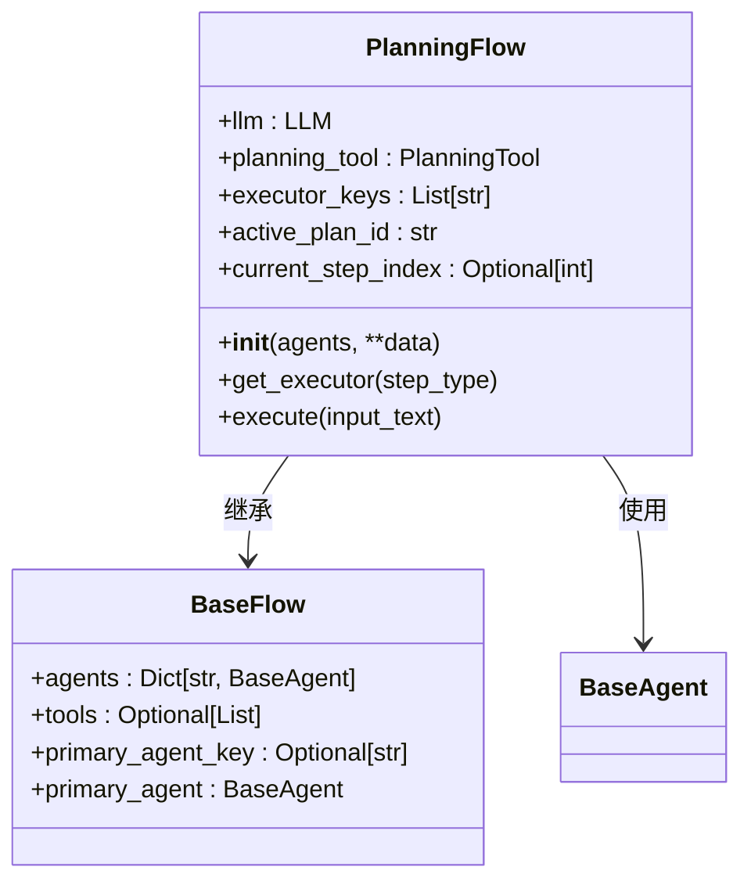
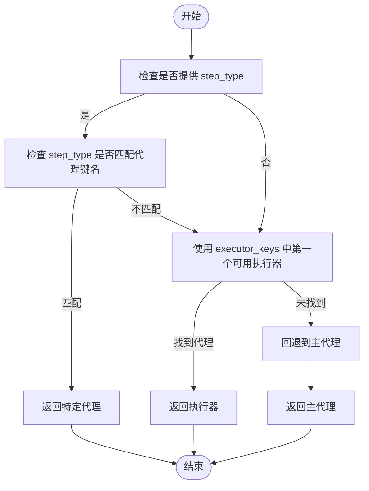
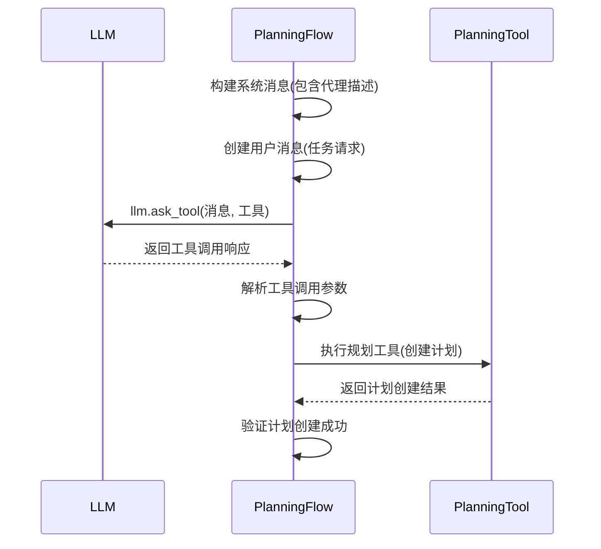
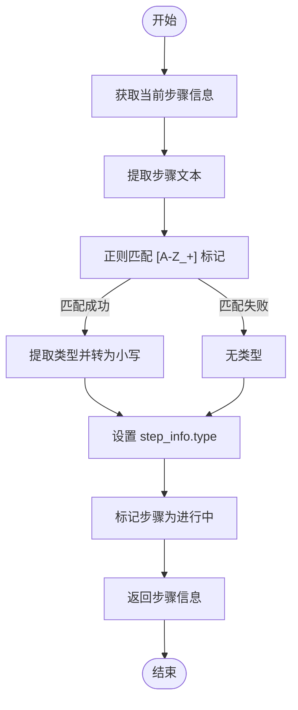
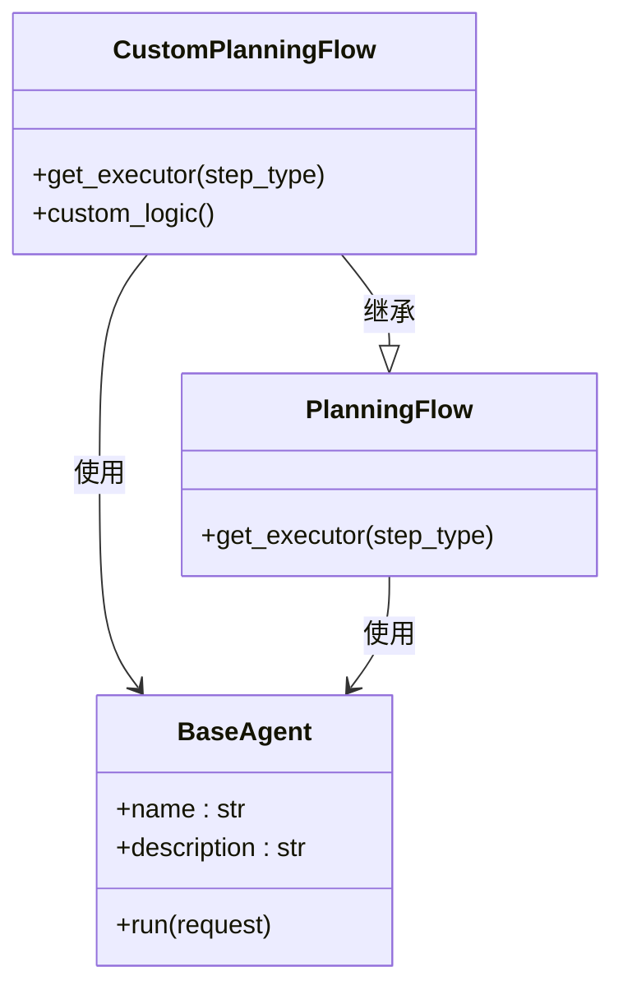

# 代理协作机制

<cite>
**本文档引用文件**  
- [planning.py](file://app/flow/planning.py)
- [base.py](file://app/flow/base.py)
- [planning.py](file://app/tool/planning.py)
- [llm.py](file://app/llm.py)
- [base.py](file://app/agent/base.py)
</cite>

## 目录
1. [引言](#引言)
2. [executor_keys与代理角色集合](#executor_keys与代理角色集合)
3. [get_executor方法的策略模式实现](#get_executor方法的策略模式实现)
4. [多代理协同生成计划流程](#多代理协同生成计划流程)
5. [任务步骤标记与专业代理调度](#任务步骤标记与专业代理调度)
6. [自定义代理协作策略扩展](#自定义代理协作策略扩展)
7. [结论](#结论)

## 引言
本文档深入解析OpenManus系统中PlanningFlow的代理协作机制。该机制通过executor_keys列表定义可执行任务的代理角色集合，利用get_executor方法实现基于step_type的代理选择策略，并通过_llm.ask_tool调用协调多个代理生成和执行计划。系统支持[SEARCH]、[CODE]等标记的任务步骤触发不同专业能力代理的调度，同时提供自定义代理协作策略的扩展接口。

## executor_keys与代理角色集合
`executor_keys`是PlanningFlow中的核心字段，用于定义可执行任务的代理角色集合。该字段在初始化时被设置，其值决定了哪些代理可以参与任务执行。

当创建PlanningFlow实例时，如果提供了`executors`参数，它会被转换为`executor_keys`；如果没有指定，则默认包含所有已注册代理的键名。这种设计允许灵活控制参与执行的代理范围，实现角色权限的精细化管理。

**图表来源**  
- [planning.py](file://app/flow/planning.py#L49-L49)
- [planning.py](file://app/flow/planning.py#L74-L74)

**本节来源**  
- [planning.py](file://app/flow/planning.py#L44-L441)

## get_executor方法的策略模式实现
`get_executor`方法实现了基于策略模式的代理选择机制，根据当前步骤类型动态选择最合适的执行器。该方法采用分层决策策略，确保任务能够被最合适的代理处理。

选择策略遵循以下优先级顺序：
1. 如果提供了`step_type`且该类型与某个代理键名匹配，则直接使用该代理
2. 否则，按`executor_keys`列表顺序选择第一个可用的执行器
3. 最后，回退到主代理（primary_agent）作为默认执行器

这种策略模式实现了灵活的代理路由机制，既支持基于任务类型的精确匹配，又保证了执行的可靠性。

**图表来源**  
- [planning.py](file://app/flow/planning.py#L76-L91)

**本节来源**  
- [planning.py](file://app/flow/planning.py#L76-L91)

## 多代理协同生成计划流程
多代理协同生成计划的交互流程始于`_create_initial_plan`方法，该方法通过`_llm.ask_tool`调用触发规划工具，协调多个代理共同生成任务计划。

流程首先构建系统消息，包含所有可用代理的描述信息，指导LLM在创建计划步骤时指定代理名称。然后调用`llm.ask_tool`方法，传入用户请求、系统消息和规划工具参数。LLM的响应包含工具调用，这些调用被解析并执行以创建实际的计划。

整个流程体现了多代理系统的协同工作模式：LLM作为协调者生成高层计划，而具体执行则由专业代理完成。

**图表来源**  
- [planning.py](file://app/flow/planning.py#L148-L214)
- [llm.py](file://app/llm.py#L698-L765)

**本节来源**  
- [planning.py](file://app/flow/planning.py#L148-L214)

## 任务步骤标记与专业代理调度
系统通过在任务步骤中使用[SEARCH]、[CODE]等标记来触发不同专业能力代理的调度。这种机制在`_get_current_step_info`方法中实现，该方法解析步骤文本以提取类型信息。

当系统识别到步骤中的方括号标记（如[SEARCH]或[CODE]）时，会将其转换为小写形式的`step_type`。这个类型信息随后被传递给`get_executor`方法，用于选择合适的执行代理。例如，[SEARCH]标记会尝试调用名为"search"的代理，[CODE]标记会尝试调用名为"code"的代理。

这种基于标记的调度机制实现了任务与代理的专业化匹配，确保不同类型的任务由最擅长处理它们的代理执行。

**图表来源**  
- [planning.py](file://app/flow/planning.py#L250-L278)

**本节来源**  
- [planning.py](file://app/flow/planning.py#L250-L278)

## 自定义代理协作策略扩展
系统提供了灵活的扩展接口，允许开发者自定义代理协作策略。主要扩展点包括重写`get_executor`方法和扩展`executor_keys`的初始化逻辑。

通过继承PlanningFlow并重写`get_executor`方法，可以实现更复杂的代理选择策略，如基于任务复杂度、代理负载或历史性能的智能路由。同时，可以通过在初始化时自定义`executors`参数来控制参与执行的代理集合。

此外，系统支持通过工具调用机制扩展新的代理类型和功能，这些新代理可以无缝集成到现有的协作框架中。

**图表来源**  
- [planning.py](file://app/flow/planning.py#L44-L441)
- [base.py](file://app/agent/base.py#L8-L196)

**本节来源**  
- [planning.py](file://app/flow/planning.py#L44-L441)

## 结论
OpenManus的代理协作机制通过executor_keys列表、get_executor策略模式和基于标记的任务调度，构建了一个灵活高效的多代理协同系统。该机制不仅支持预定义的代理角色集合和智能路由策略，还提供了可扩展的接口，允许开发者根据具体需求定制协作逻辑。通过_llm.ask_tool的协调作用，多个专业代理能够协同生成和执行复杂任务计划，实现了人工智能系统的模块化和专业化。