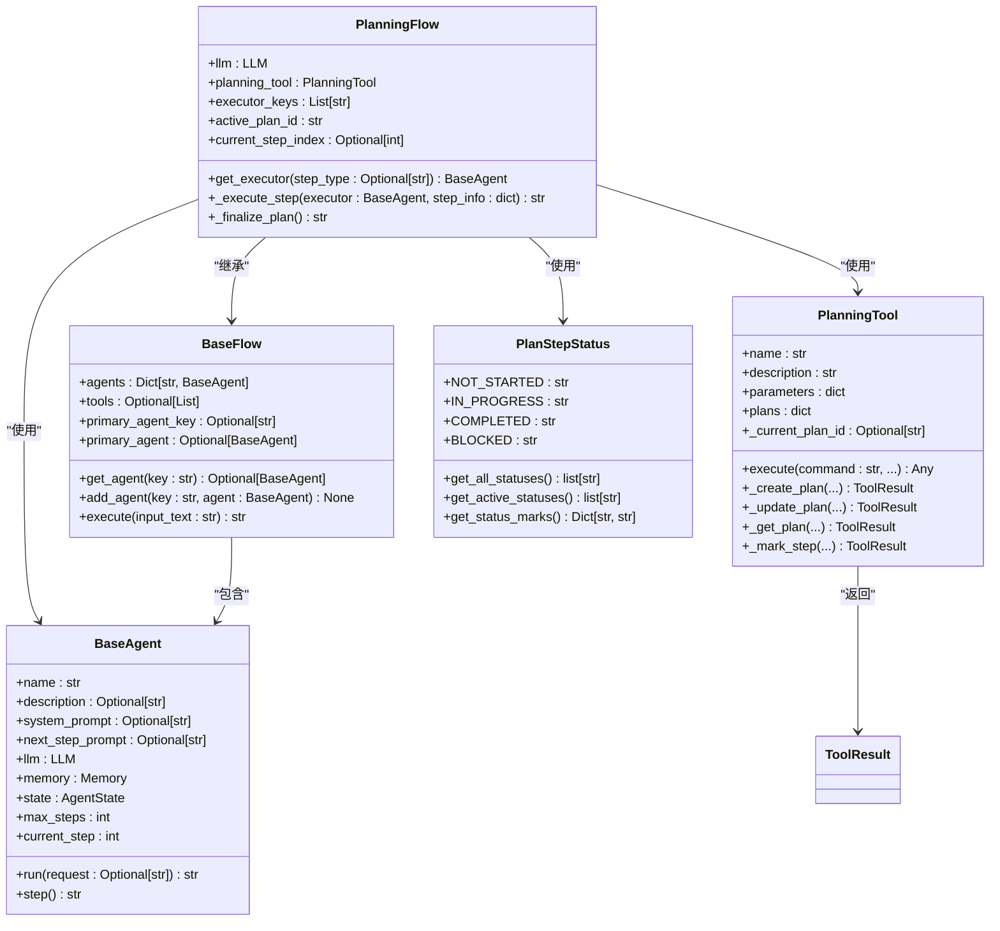

# 执行控制

<cite>
**Referenced Files in This Document**   
- [app/flow/planning.py](file://app/flow/planning.py)
- [app/agent/base.py](file://app/agent/base.py)
- [app/flow/base.py](file://app/flow/base.py)
- [app/schema.py](file://app/schema.py)
- [app/tool/planning.py](file://app/tool/planning.py)
</cite>

## 目录
1. [执行步骤上下文注入](#执行步骤上下文注入)
2. [代理选择策略](#代理选择策略)
3. [异常处理机制](#异常处理机制)
4. [计划完成与降级处理](#计划完成与降级处理)
5. [核心组件关系图](#核心组件关系图)

## 执行步骤上下文注入

`_execute_step`方法负责将当前步骤的上下文注入到代理执行环境中。该方法通过调用`_get_plan_text()`获取当前计划的完整状态文本，包括所有步骤的进度、状态和备注信息。同时，从`step_info`参数中提取当前步骤的具体任务指令。

该方法将计划状态文本和具体任务指令按照预定义的模板进行拼接，形成最终的执行提示（prompt）。这个提示包含两个关键部分：首先是"CURRENT PLAN STATUS"部分，展示整个计划的实时状态；其次是"YOUR CURRENT TASK"部分，明确指出代理当前需要执行的具体步骤。这种上下文注入机制确保了每个代理在执行任务时都能获得完整的计划背景信息和明确的当前任务指令。

**Section sources**
- [app/flow/planning.py](file://app/flow/planning.py#L276-L303)
- [app/flow/planning.py](file://app/flow/planning.py#L336-L345)

## 代理选择策略

`get_executor`方法实现了多层级的代理选择策略。该策略首先检查步骤类型（step_type）是否与任何代理的键名匹配，如果匹配则优先选择该代理。这种基于步骤类型的匹配机制允许系统根据任务性质选择最合适的专用代理。

如果步骤类型不匹配任何代理，则按照`executor_keys`列表中定义的顺序依次查找可用的执行代理。`executor_keys`在`PlanningFlow`初始化时被设置，定义了代理的优先级顺序。这种顺序选择机制提供了一种灵活的代理调度方式，可以根据配置调整执行优先级。

当上述两种策略都无法找到合适的代理时，系统会回退到主代理（primary_agent）作为最终的备选方案。主代理是`PlanningFlow`中默认的代理实例，确保了即使在没有专用代理的情况下，系统仍然能够继续执行任务。

**Section sources**
- [app/flow/planning.py](file://app/flow/planning.py#L76-L91)
- [app/flow/base.py](file://app/flow/base.py#L42-L44)

## 异常处理机制

`_execute_step`方法实现了完善的异常捕获机制。该方法使用try-except结构包裹代理执行过程，能够捕获执行过程中可能出现的任何异常。当异常发生时，系统会通过日志记录器记录详细的错误信息，包括发生错误的步骤索引和具体的异常内容。

错误信息的格式化输出遵循统一的模式："Error executing step {步骤索引}: {异常信息}"。这种标准化的错误格式便于用户快速定位问题所在。在返回错误信息的同时，系统仍然会返回一个结构化的字符串，确保调用链不会因为单个步骤的失败而中断。这种容错机制提高了系统的鲁棒性，即使在部分步骤执行失败的情况下，系统也能继续处理后续步骤或进行适当的清理工作。

**Section sources**
- [app/flow/planning.py](file://app/flow/planning.py#L276-L303)

## 计划完成与降级处理

`_finalize_plan`方法负责在计划完成后生成总结报告。该方法首先获取最终的计划状态文本，然后通过主LLM直接生成总结。系统会创建一个包含系统消息和用户消息的请求，其中系统消息指定代理的角色为"规划助手"，用户消息包含完整的计划状态。

当主LLM生成总结失败时，系统会启动降级处理机制。首先，系统会尝试使用主代理（primary_agent）来生成总结报告。这种方法利用了代理的`run`方法，将总结任务作为普通执行步骤来处理。如果主代理也无法生成总结，系统会返回一个简化的完成消息，确保即使在最坏的情况下，用户也能获得基本的执行结果反馈。

这种多层级的降级处理方案体现了系统的容错设计，通过主LLM、主代理和默认消息三个层级的备选方案，最大限度地保证了总结生成功能的可用性。

**Section sources**
- [app/flow/planning.py](file://app/flow/planning.py#L405-L441)
- [app/agent/base.py](file://app/agent/base.py#L115-L153)

## 核心组件关系图

**Diagram sources**
- [app/flow/planning.py](file://app/flow/planning.py#L44-L441)
- [app/flow/base.py](file://app/flow/base.py#L8-L56)
- [app/agent/base.py](file://app/agent/base.py#L12-L195)
- [app/tool/planning.py](file://app/tool/planning.py#L13-L362)
- [app/flow/planning.py](file://app/flow/planning.py#L15-L41)

**Section sources**
- [app/flow/planning.py](file://app/flow/planning.py#L44-L441)
- [app/flow/base.py](file://app/flow/base.py#L8-L56)
- [app/agent/base.py](file://app/agent/base.py#L12-L195)
- [app/tool/planning.py](file://app/tool/planning.py#L13-L362)
- [app/flow/planning.py](file://app/flow/planning.py#L15-L41)