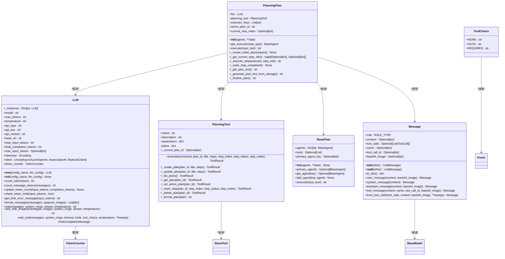
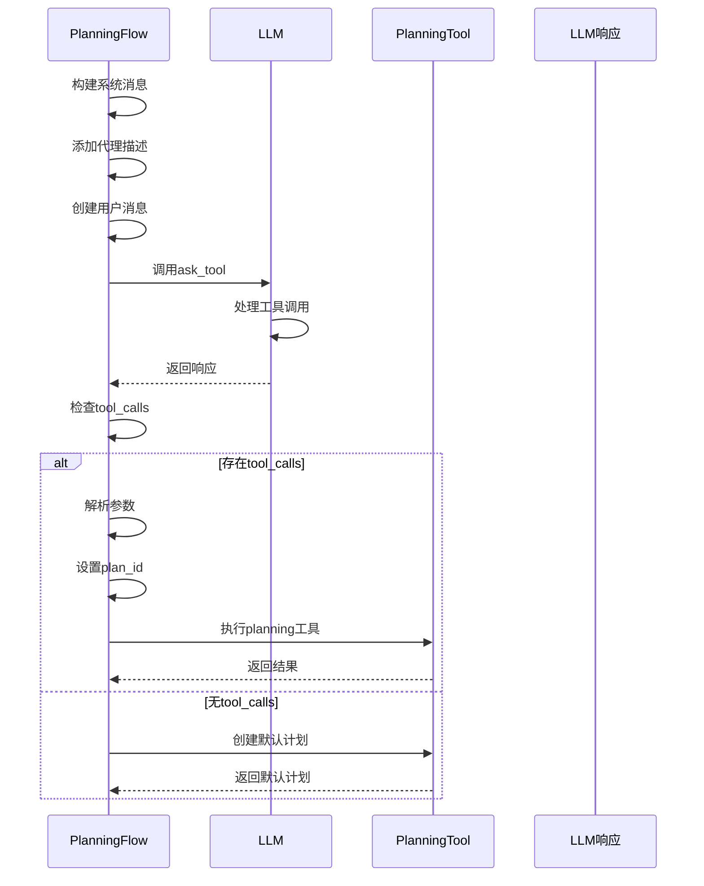
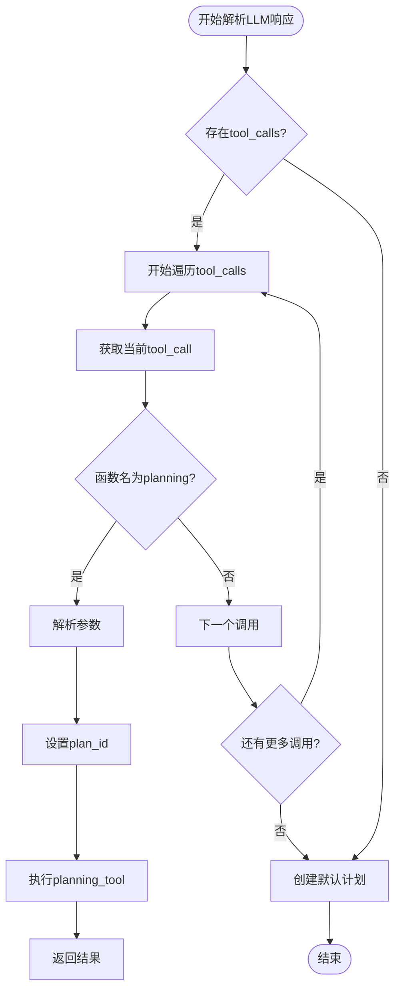
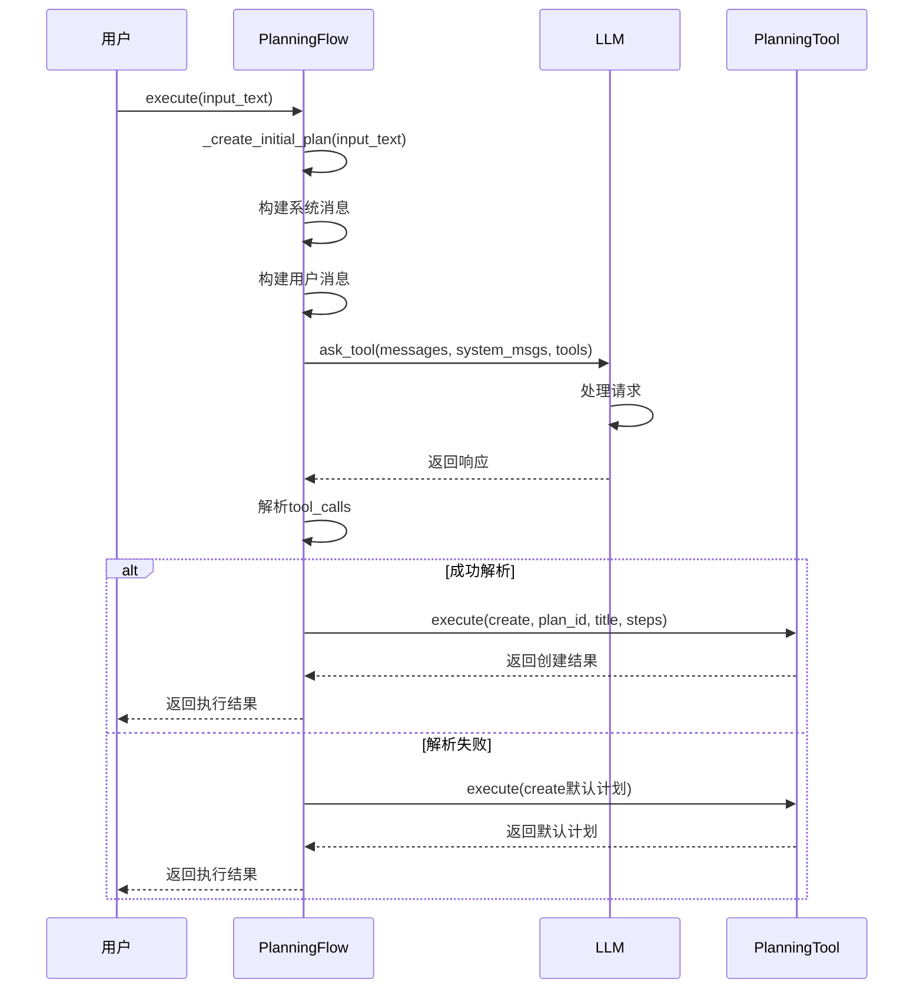

# 计划生成

<cite>
**Referenced Files in This Document**  
- [planning.py](file://app/flow/planning.py)
- [planning.py](file://app/tool/planning.py)
- [planning.py](file://app/prompt/planning.py)
- [base.py](file://app/flow/base.py)
- [llm.py](file://app/llm.py)
- [schema.py](file://app/schema.py)
</cite>

## 目录
1. [计划生成流程概述](#计划生成流程概述)
2. [核心组件分析](#核心组件分析)
3. [_create_initial_plan方法详解](#_create_initial_plan方法详解)
4. [系统提示词设计](#系统提示词设计)
5. [多代理协作与任务分配](#多代理协作与任务分配)
6. [LLM响应解析流程](#llm响应解析流程)
7. [默认计划生成策略](#默认计划生成策略)
8. [请求到计划的完整链路](#请求到计划的完整链路)
9. [plan_id生成规则与生命周期](#plan_id生成规则与生命周期)

## 计划生成流程概述

PlanningFlow系统通过结构化流程将用户请求转化为可执行的任务计划。该流程始于用户输入，经过LLM与PlanningTool的协同工作，最终生成包含明确步骤的行动计划。系统设计了完整的错误处理机制，在LLM调用失败时能够生成默认计划，确保流程的鲁棒性。

**Section sources**
- [planning.py](file://app/flow/planning.py#L135-L210)

## 核心组件分析

系统由多个核心组件构成，包括PlanningFlow、PlanningTool、LLM等，它们协同工作实现计划生成功能。



**Diagram sources**
- [planning.py](file://app/flow/planning.py#L44-L441)
- [planning.py](file://app/tool/planning.py#L13-L362)
- [llm.py](file://app/llm.py#L173-L765)
- [base.py](file://app/flow/base.py#L8-L56)
- [schema.py](file://app/schema.py#L53-L155)
- [schema.py](file://app/schema.py#L19-L24)

**Section sources**
- [planning.py](file://app/flow/planning.py#L44-L441)
- [planning.py](file://app/tool/planning.py#L13-L362)
- [llm.py](file://app/llm.py#L173-L765)

## _create_initial_plan方法详解

`_create_initial_plan`方法是计划生成的核心，它协调LLM和PlanningTool创建初始计划。该方法首先构建系统消息，包含代理描述信息，然后创建用户消息，调用LLM的`ask_tool`方法，最后处理响应并执行计划创建。



**Diagram sources**
- [planning.py](file://app/flow/planning.py#L135-L210)

**Section sources**
- [planning.py](file://app/flow/planning.py#L135-L210)

## 系统提示词设计

系统提示词设计旨在引导LLM创建简洁、可操作的计划。提示词强调关键里程碑而非详细子步骤，优化清晰度和效率。当存在多个代理时，系统会动态添加代理描述信息，指导LLM在创建步骤时指定代理名称。

```python
system_message_content = (
    "You are a planning assistant. Create a concise, actionable plan with clear steps. "
    "Focus on key milestones rather than detailed sub-steps. "
    "Optimize for clarity and efficiency."
)
```

当存在多个代理时，系统会追加以下信息：

```python
system_message_content += (
    f"\nNow we have {agents_description} agents. "
    f"The infomation of them are below: {json.dumps(agents_description)}\n"
    "When creating steps in the planning tool, please specify the agent names using the format '[agent_name]'."
)
```

**Section sources**
- [planning.py](file://app/flow/planning.py#L138-L157)

## 多代理协作与任务分配

系统支持多代理协作场景，通过`executor_keys`管理可用的执行代理。在创建计划时，系统会收集所有代理的描述信息，并将其包含在系统提示中，指导LLM在计划步骤中指定适当的代理。

代理选择机制通过`get_executor`方法实现，该方法根据步骤类型选择合适的执行代理：

```python
def get_executor(self, step_type: Optional[str] = None) -> BaseAgent:
    """
    获取当前步骤的适当执行代理。
    可以根据步骤类型/需求扩展以选择代理。
    """
    # 如果提供了步骤类型且与代理键匹配，则使用该代理
    if step_type and step_type in self.agents:
        return self.agents[step_type]

    # 否则使用第一个可用的执行器或回退到主代理
    for key in self.executor_keys:
        if key in self.agents:
            return self.agents[key]

    # 回退到主代理
    return self.primary_agent
```

**Section sources**
- [planning.py](file://app/flow/planning.py#L65-L84)

## LLM响应解析流程

LLM响应解析流程包括多个步骤：首先检查响应中是否存在`tool_calls`，然后遍历所有工具调用，识别名为"planning"的调用，解析其参数，设置正确的`plan_id`，最后通过`planning_tool.execute`执行计划创建。



**Diagram sources**
- [planning.py](file://app/flow/planning.py#L175-L210)

**Section sources**
- [planning.py](file://app/flow/planning.py#L175-L210)

## 默认计划生成策略

当LLM调用失败或未返回有效的工具调用时，系统会生成默认计划作为后备策略。默认计划包含三个通用步骤：'Analyze request'、'Execute task'、'Verify results'，确保即使在失败情况下也能继续执行。

```python
# 如果执行到达此处，创建默认计划
logger.warning("Creating default plan")

# 使用ToolCollection创建默认计划
await self.planning_tool.execute(
    **{
        "command": "create",
        "plan_id": self.active_plan_id,
        "title": f"Plan for: {request[:50]}{'...' if len(request) > 50 else ''}",
        "steps": ["Analyze request", "Execute task", "Verify results"],
    }
)
```

这些步骤的构造逻辑如下：
- **Analyze request**: 分析请求，理解任务范围和需求
- **Execute task**: 执行主要任务，使用适当的工具
- **Verify results**: 验证结果，确保任务完成质量

**Section sources**
- [planning.py](file://app/flow/planning.py#L198-L210)

## 请求到计划的完整链路

从用户请求到计划创建的完整链路涉及多个组件的协同工作。用户请求首先传递给`execute`方法，该方法调用`_create_initial_plan`来创建初始计划。



**Diagram sources**
- [planning.py](file://app/flow/planning.py#L86-L133)
- [planning.py](file://app/flow/planning.py#L135-L210)

**Section sources**
- [planning.py](file://app/flow/planning.py#L86-L133)

## plan_id生成规则与生命周期

`plan_id`的生成规则和生命周期管理是计划系统的重要组成部分。`plan_id`在`PlanningFlow`初始化时通过时间戳生成，确保唯一性。

```python
active_plan_id: str = Field(default_factory=lambda: f"plan_{int(time.time())}")
```

`plan_id`的生命周期包括以下阶段：
1. **生成**: 在`PlanningFlow`初始化时生成
2. **使用**: 在创建计划时作为`plan_id`参数传递
3. **存储**: 在`PlanningTool.plans`字典中以`plan_id`为键存储计划
4. **激活**: 创建计划时自动设置为当前活动计划
5. **删除**: 通过`delete`命令从存储中移除

`plan_id`的生成规则确保了每个计划都有唯一的标识符，便于跟踪和管理。时间戳基础的生成方式简单有效，避免了ID冲突的可能性。

**Section sources**
- [planning.py](file://app/flow/planning.py#L47-L48)
- [planning.py](file://app/tool/planning.py#L13-L362)