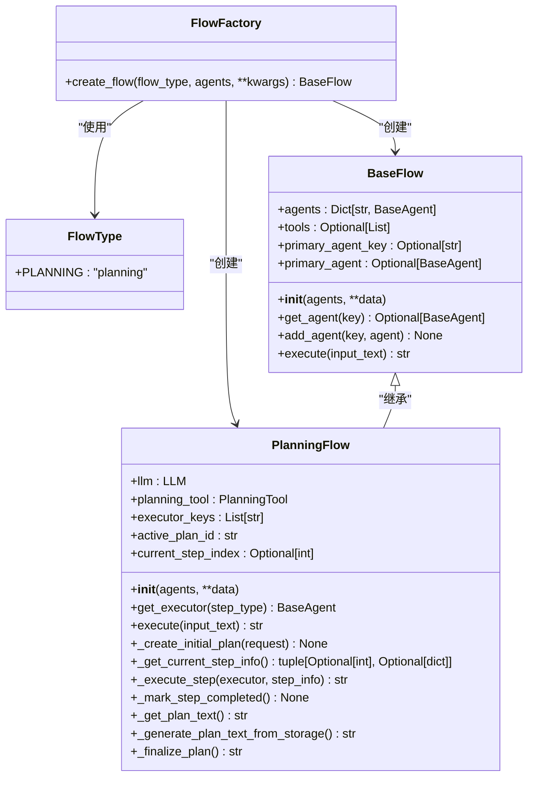
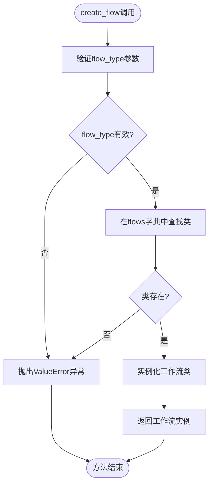
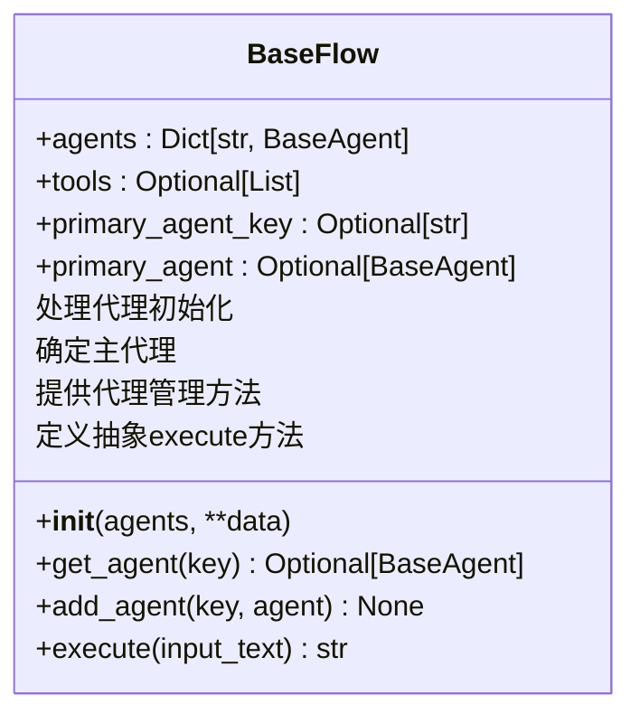
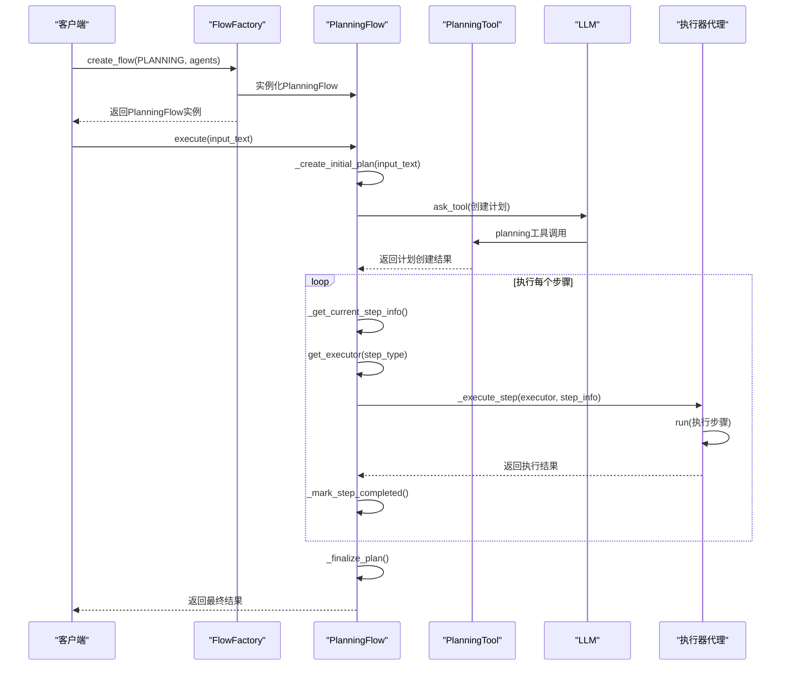
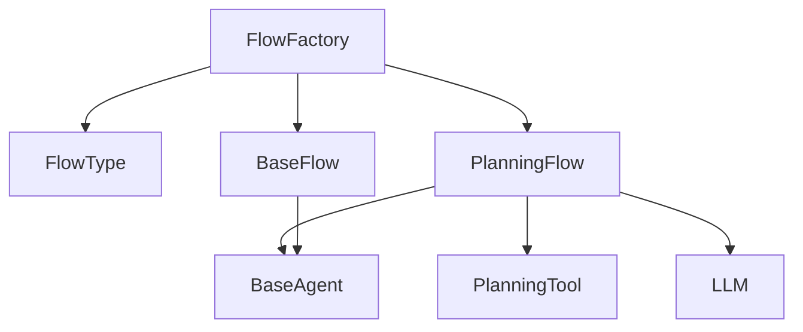

# 工作流工厂模式

<cite>
**Referenced Files in This Document**   
- [flow_factory.py](file://app/flow/flow_factory.py)
- [base.py](file://app/flow/base.py)
- [planning.py](file://app/flow/planning.py)
</cite>

## 目录
1. [简介](#简介)
2. [核心组件](#核心组件)
3. [架构概述](#架构概述)
4. [详细组件分析](#详细组件分析)
5. [依赖分析](#依赖分析)
6. [性能考虑](#性能考虑)
7. [故障排除指南](#故障排除指南)
8. [结论](#结论)

## 简介
本文档全面介绍OpenManus项目中的工作流工厂模式实现，重点阐述`FlowFactory`如何通过枚举类型`FlowType`实现不同类型工作流的创建。文档详细解析了`create_flow`静态方法基于`flow_type`参数动态实例化对应`Flow`类（如`PlanningFlow`）的工厂设计模式。同时说明该模式对扩展新工作流类型（如并行流、条件流）的架构支持能力，提供注册自定义`Flow`子类到工厂的编程接口规范和类型安全检查机制，并包含工厂模式在配置驱动工作流初始化中的实际应用案例。

## 核心组件
工作流工厂模式的核心组件包括`FlowFactory`类、`FlowType`枚举、`BaseFlow`基类以及具体的`Flow`实现类（如`PlanningFlow`）。`FlowFactory`作为创建不同工作流实例的中心工厂，通过`FlowType`枚举来区分和管理不同类型的工作流。`BaseFlow`定义了所有工作流必须遵循的接口和基础功能，而具体的`Flow`实现类则提供了特定工作流的业务逻辑。

**Section sources**
- [flow_factory.py](file://app/flow/flow_factory.py#L12-L29)
- [base.py](file://app/flow/base.py#L8-L56)
- [planning.py](file://app/flow/planning.py#L44-L441)

## 架构概述
工作流工厂模式采用经典的工厂设计模式，将工作流的创建逻辑与使用逻辑分离。`FlowFactory`类作为工厂，负责根据传入的`FlowType`参数创建相应的工作流实例。所有工作流都继承自`BaseFlow`基类，确保了接口的一致性。这种设计使得系统可以轻松扩展新的工作流类型，而无需修改现有的工厂代码。

**Diagram sources**
- [flow_factory.py](file://app/flow/flow_factory.py#L8-L29)
- [base.py](file://app/flow/base.py#L8-L56)
- [planning.py](file://app/flow/planning.py#L44-L441)

## 详细组件分析

### 工厂类分析
`FlowFactory`类是工作流创建的核心，其`create_flow`静态方法根据传入的`FlowType`参数动态选择并实例化相应的工作流类。该方法首先在内部字典中查找对应`FlowType`的类，如果找到则创建实例并返回，否则抛出`ValueError`异常。这种设计确保了类型安全和清晰的错误处理。

**Diagram sources**
- [flow_factory.py](file://app/flow/flow_factory.py#L16-L29)

**Section sources**
- [flow_factory.py](file://app/flow/flow_factory.py#L12-L29)

### 工作流基类分析
`BaseFlow`类作为所有工作流的基类，定义了工作流的基本结构和公共方法。它继承自`BaseModel`和`ABC`（抽象基类），确保了数据验证和接口强制。`BaseFlow`处理了代理（Agent）的初始化逻辑，支持单个代理、代理列表或代理字典等多种输入形式，并自动确定主代理。

**Diagram sources**
- [base.py](file://app/flow/base.py#L8-L56)

**Section sources**
- [base.py](file://app/flow/base.py#L8-L56)

### 规划工作流分析
`PlanningFlow`是`BaseFlow`的一个具体实现，专门用于规划和执行任务。它包含一个`PlanningTool`实例，用于创建和管理计划。`PlanningFlow`的执行流程包括创建初始计划、获取当前步骤、执行步骤和最终化计划等阶段。每个步骤的执行都由适当的执行器代理完成，并在执行后更新计划状态。

**Diagram sources**
- [planning.py](file://app/flow/planning.py#L44-L441)

**Section sources**
- [planning.py](file://app/flow/planning.py#L44-L441)

## 依赖分析
工作流工厂模式的组件之间存在明确的依赖关系。`FlowFactory`依赖于`FlowType`枚举和各种`Flow`实现类，而`PlanningFlow`又依赖于`PlanningTool`、`LLM`和`BaseAgent`等组件。这些依赖关系通过构造函数注入和字段定义来管理，确保了组件之间的松耦合。

**Diagram sources**
- [flow_factory.py](file://app/flow/flow_factory.py#L8-L29)
- [planning.py](file://app/flow/planning.py#L44-L441)
- [base.py](file://app/flow/base.py#L8-L56)

**Section sources**
- [flow_factory.py](file://app/flow/flow_factory.py#L8-L29)
- [planning.py](file://app/flow/planning.py#L44-L441)
- [base.py](file://app/flow/base.py#L8-L56)

## 性能考虑
工作流工厂模式在性能方面表现良好，因为实例化工作流的开销很小，主要是字典查找和对象创建。`PlanningFlow`的执行流程可能会涉及多次LLM调用和工具执行，这些是主要的性能瓶颈。为了优化性能，可以考虑缓存常用的`Flow`实例，或者对`PlanningTool`的操作进行批处理。

## 故障排除指南
当使用工作流工厂模式时，可能会遇到以下常见问题：
1. **未知的flow_type**：确保传入`create_flow`方法的`flow_type`是`FlowType`枚举中定义的有效值。
2. **代理初始化失败**：检查传入的代理对象是否正确初始化，并且符合`BaseAgent`接口。
3. **计划创建失败**：验证`PlanningTool`是否正确配置，并且LLM服务可用。

**Section sources**
- [flow_factory.py](file://app/flow/flow_factory.py#L25-L29)
- [planning.py](file://app/flow/planning.py#L135-L210)

## 结论
工作流工厂模式为OpenManus项目提供了一个灵活且可扩展的工作流创建机制。通过`FlowFactory`和`FlowType`的组合，系统能够轻松支持多种工作流类型，并且可以方便地添加新的工作流实现。`BaseFlow`基类确保了所有工作流的一致性，而具体的`Flow`实现类则提供了丰富的功能。这种设计模式不仅提高了代码的可维护性，还为未来的功能扩展奠定了坚实的基础。