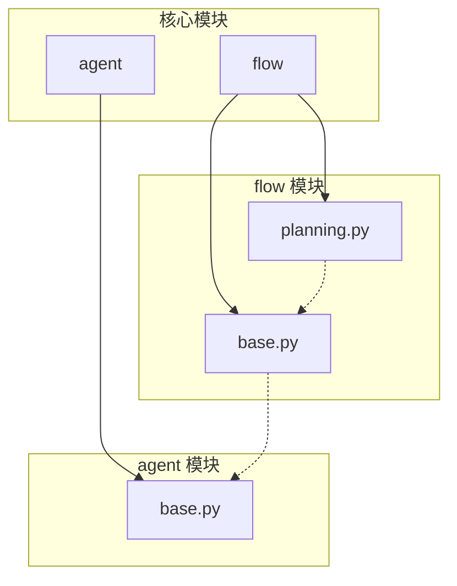
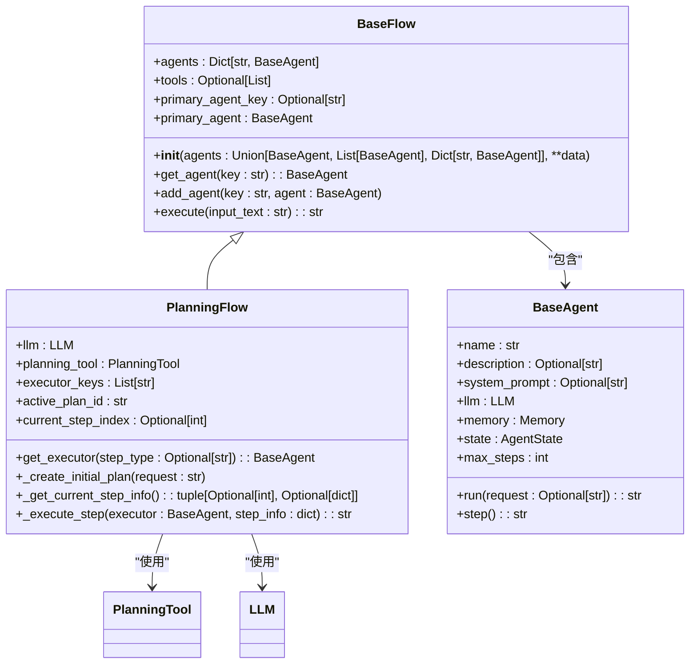
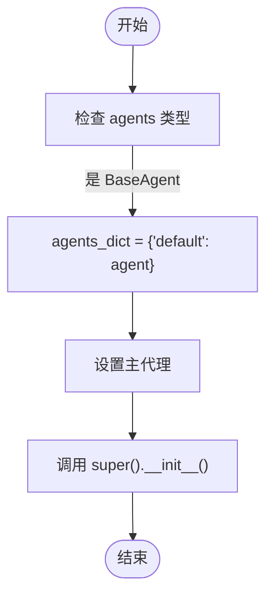
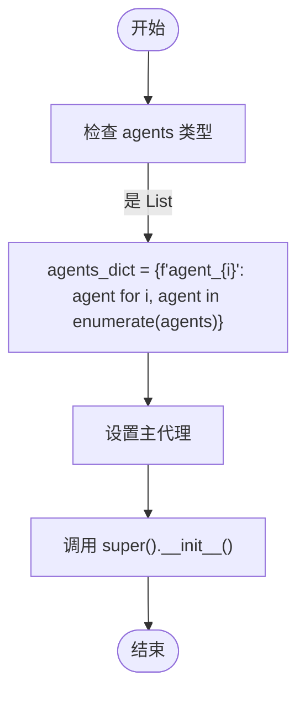
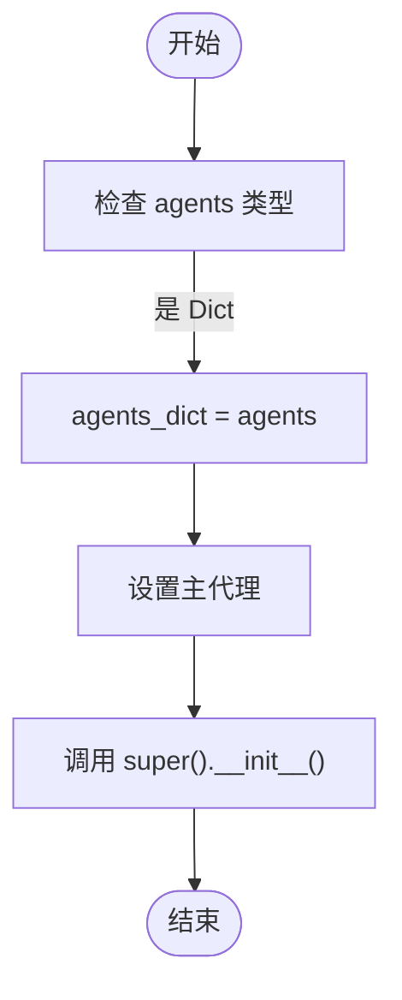
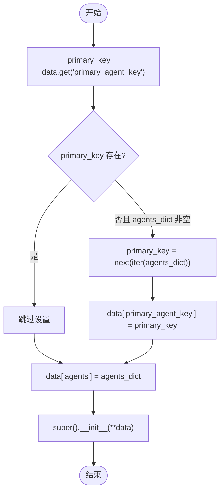
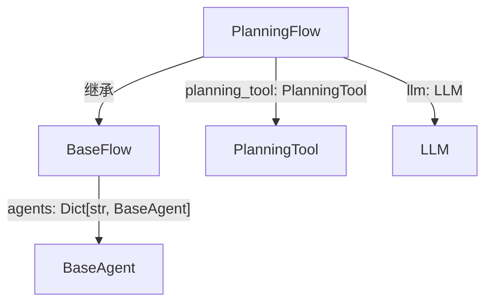

# 代理初始化策略

<cite>
**本文档中引用的文件**  
- [base.py](file://app/flow/base.py)
- [base.py](file://app/agent/base.py)
- [planning.py](file://app/flow/planning.py)
</cite>

## 目录
1. [简介](#简介)
2. [项目结构](#项目结构)
3. [核心组件](#核心组件)
4. [架构概述](#架构概述)
5. [详细组件分析](#详细组件分析)
6. [依赖分析](#依赖分析)
7. [性能考虑](#性能考虑)
8. [故障排除指南](#故障排除指南)
9. [结论](#结论)

## 简介
本文档详细说明 OpenManus 框架中 `BaseFlow` 类的代理初始化策略。重点分析其 `__init__` 方法如何处理三种不同形式的代理输入：单个代理实例、代理列表和代理字典。文档阐述了在未指定主代理时系统自动选择第一个代理的机制，并探讨了在多代理协作工作流中的最佳实践。

## 项目结构
OpenManus 项目采用模块化设计，核心功能分布在 `app` 目录下的多个子模块中。与代理初始化直接相关的核心模块是 `flow` 和 `agent`。`flow` 模块定义了工作流的基类和具体实现，而 `agent` 模块则定义了所有代理的抽象基类。

**图示来源**
- [base.py](file://app/flow/base.py)
- [planning.py](file://app/flow/planning.py)
- [base.py](file://app/agent/base.py)

**章节来源**
- [base.py](file://app/flow/base.py)
- [planning.py](file://app/flow/planning.py)

## 核心组件
`BaseFlow` 类是所有执行工作流的基类，它通过 `__init__` 方法实现了灵活的代理初始化逻辑。该类依赖于 `BaseAgent` 抽象基类来定义代理的通用行为和属性。`PlanningFlow` 是 `BaseFlow` 的一个具体实现，它继承了其代理管理能力，并在此基础上增加了规划和任务执行的功能。

**章节来源**
- [base.py](file://app/flow/base.py#L8-L56)
- [base.py](file://app/agent/base.py#L12-L195)

## 架构概述
系统的核心架构围绕 `BaseFlow` 及其子类展开。`BaseFlow` 负责管理一组代理（`agents`），并提供获取主代理（`primary_agent`）和特定代理（`get_agent`）的接口。`PlanningFlow` 在此基础上，利用 `planning_tool` 来创建和管理任务计划，并根据计划动态地将任务分派给合适的执行代理。

**图示来源**
- [base.py](file://app/flow/base.py#L8-L56)
- [planning.py](file://app/flow/planning.py#L44-L441)
- [base.py](file://app/agent/base.py#L12-L195)

## 详细组件分析
### BaseFlow 初始化逻辑分析
`BaseFlow` 类的 `__init__` 方法是代理初始化策略的核心。它通过类型检查来处理三种不同的输入形式，并将其统一转换为内部使用的字典结构。

#### 单个代理实例处理
当传入一个 `BaseAgent` 实例时，系统会创建一个键为 `"default"` 的字典，将该代理作为值存储。这种设计为只使用一个代理的简单场景提供了便利的默认配置。

**图示来源**
- [base.py](file://app/flow/base.py#L20-L22)

#### 代理列表处理
当传入一个代理列表时，系统会使用 `enumerate` 函数遍历列表，并为每个代理生成一个形如 `"agent_0"`, `"agent_1"` 的键。这种自动生成键的机制简化了批量添加代理的流程。

**图示来源**
- [base.py](file://app/flow/base.py#L22-L24)

#### 代理字典处理
当传入一个字典时，系统会直接使用该字典作为 `agents_dict`。这是最灵活的方式，允许用户完全自定义代理的键名，便于在复杂工作流中进行语义化管理。

**图示来源**
- [base.py](file://app/flow/base.py#L24-L25)

#### 主代理选择机制
如果在初始化参数中未指定 `primary_agent_key`，系统会自动将 `agents_dict` 中的第一个键作为主代理的键。这是通过 `next(iter(agents_dict))` 实现的，它获取字典迭代器的第一个元素。此机制确保了即使在最简单的配置下，系统也能明确知道哪个代理是主要的执行者。

**图示来源**
- [base.py](file://app/flow/base.py#L27-L33)

**章节来源**
- [base.py](file://app/flow/base.py#L18-L39)

## 依赖分析
`BaseFlow` 类与 `BaseAgent` 类之间存在强依赖关系。`BaseFlow` 的 `agents` 字段被定义为 `Dict[str, BaseAgent]`，这表明它管理的是 `BaseAgent` 类型的对象。`PlanningFlow` 类继承自 `BaseFlow`，因此也继承了这种依赖关系。此外，`PlanningFlow` 还引入了对 `PlanningTool` 和 `LLM` 类的依赖，以实现其规划功能。

**图示来源**
- [base.py](file://app/flow/base.py#L11)
- [planning.py](file://app/flow/planning.py#L46-L47)

**章节来源**
- [base.py](file://app/flow/base.py)
- [planning.py](file://app/flow/planning.py)

## 性能考虑
代理初始化过程主要涉及内存中的字典操作和类型检查，时间复杂度为 O(n)，其中 n 是代理的数量。对于大多数应用场景，这种开销可以忽略不计。然而，在需要动态创建和销毁大量工作流的高并发场景下，应考虑对 `BaseFlow` 的实例进行池化管理，以减少对象创建和垃圾回收的开销。

## 故障排除指南
在使用代理初始化功能时，可能遇到的常见问题包括：
1.  **类型错误**：确保传入 `agents` 参数的对象类型正确。传入非 `BaseAgent` 实例的列表或字典会导致运行时错误。
2.  **主代理缺失**：如果 `agents_dict` 为空，系统将无法设置主代理，可能导致后续执行逻辑失败。在初始化前应确保至少有一个代理被提供。
3.  **键名冲突**：当混合使用列表和字典初始化时，需注意自动生成的 `"agent_X"` 键可能与字典中已有的键发生冲突。

**章节来源**
- [base.py](file://app/flow/base.py#L20-L39)
- [base.py](file://app/agent/base.py)

## 结论
`BaseFlow` 类的初始化策略通过统一处理三种代理输入形式，为 OpenManus 框架提供了极大的灵活性和易用性。其自动选择主代理的机制简化了配置流程，而对 `BaseAgent` 的依赖则确保了类型安全和功能一致性。理解这一初始化逻辑对于有效构建和管理多代理工作流至关重要。