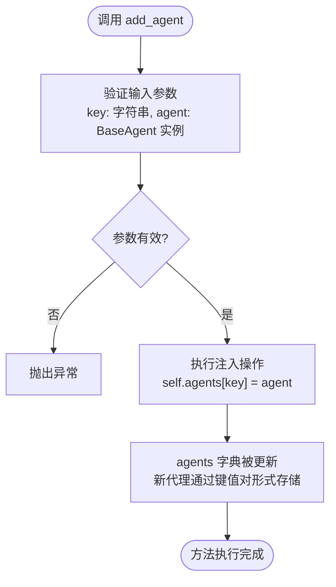
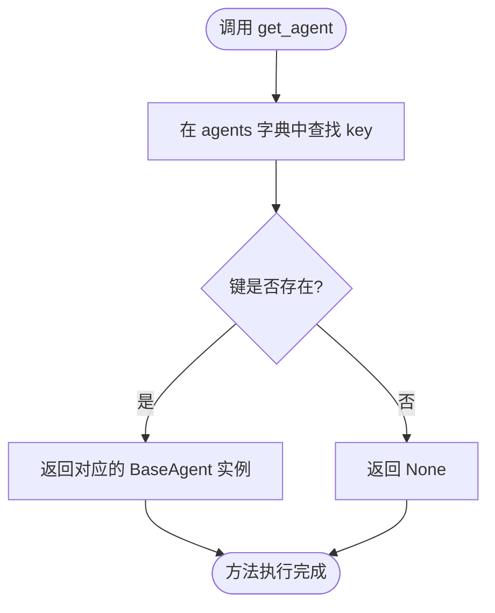

# 代理动态管理

<cite>
**Referenced Files in This Document**   
- [planning.py](file://app/flow/planning.py)
- [base.py](file://app/flow/base.py)
- [base.py](file://app/agent/base.py)
</cite>

## Table of Contents
1. [引言](#引言)
2. [核心组件](#核心组件)
3. [代理动态管理机制](#代理动态管理机制)
4. [代理选择策略](#代理选择策略)
5. [实战应用案例](#实战应用案例)
6. [生命周期与并发考量](#生命周期与并发考量)
7. [结论](#结论)

## 引言
OpenManus框架通过其灵活的代理（Agent）系统，实现了复杂任务的自动化规划与执行。本文档深入解析框架中`add_agent`和`get_agent`方法的运行时行为，重点阐述`PlanningFlow`如何利用这些机制实现动态代理管理。文档将详细说明代理的注入、检索、选择策略，并结合实际调用场景，阐明其在复杂任务规划中的核心作用。

## 核心组件

本节分析实现代理动态管理的核心类和方法。

**Section sources**
- [planning.py](file://app/flow/planning.py#L8-L441)
- [base.py](file://app/flow/base.py#L8-L56)
- [base.py](file://app/agent/base.py#L12-L195)

## 代理动态管理机制

OpenManus的代理动态管理能力主要由`BaseFlow`类中的`add_agent`和`get_agent`方法提供，`PlanningFlow`作为其子类继承了这些功能。

### add_agent方法：动态注入代理
`add_agent`方法是实现工作流执行过程中代理扩展能力的核心。该方法定义在`BaseFlow`基类中，允许在运行时向工作流的`agents`字典中注入新的代理实例。



**Diagram sources**
- [base.py](file://app/flow/base.py#L50-L52)

此方法采用键值对的形式，将一个`BaseAgent`实例与一个唯一的字符串`key`关联起来，存储在`BaseFlow`的`agents`字典中。这种设计使得工作流可以在初始化后，根据任务需求动态地添加专用代理，例如在任务执行过程中发现需要进行网络搜索时，可以即时注入一个`search`代理。

### get_agent方法：安全检索代理
`get_agent`方法提供了对`agents`字典的安全访问机制，用于根据指定的`key`检索对应的代理实例。



**Diagram sources**
- [base.py](file://app/flow/base.py#L46-L48)

该方法的实现利用了Python字典的`get()`方法，当请求的`key`不存在于字典中时，会优雅地返回`None`而非抛出`KeyError`异常。这种容错设计确保了工作流的健壮性，即使在尝试访问一个尚未添加或已被移除的代理时，程序也不会崩溃，而是可以进行相应的错误处理或降级操作。

## 代理选择策略

`PlanningFlow`类通过`get_executor`方法，将`get_agent`的检索能力与动态代理管理相结合，实现了基于策略的代理选择。

### get_executor方法：基于步骤类型的策略模式
`get_executor`方法是`PlanningFlow`中实现智能代理调度的关键。它根据当前执行步骤的类型（`step_type`）来决定使用哪个代理。

```mermaid
sequenceDiagram
participant PlanningFlow
participant get_executor
participant get_agent
participant agents_dict
PlanningFlow->>get_executor : get_executor(step_type)
get_executor->>get_executor : 检查 step_type 是否为 None 且存在于 agents 中
alt step_type 有效且存在
get_executor->>get_agent : get_agent(step_type)
get_agent->>agents_dict : 查询字典
agents_dict-->>get_agent : 返回 BaseAgent 实例
get_agent-->>get_executor : 返回代理
get_executor-->>PlanningFlow : 返回该代理
else
get_executor->>get_executor : 遍历 executor_keys 列表
loop 遍历每个 key
get_executor->>get_agent : get_agent(key)
get_agent->>agents_dict : 查询字典
alt 代理存在
agents_dict-->>get_agent : 返回 BaseAgent 实例
get_agent-->>get_executor : 返回代理
get_executor-->>PlanningFlow : 返回该代理
break
else
get_agent-->>get_executor : 返回 None
end
end
get_executor->>get_executor : 使用 primary_agent 作为最终备选
get_executor-->>PlanningFlow : 返回 primary_agent
end
```

**Diagram sources**
- [planning.py](file://app/flow/planning.py#L76-L91)

该方法的逻辑体现了典型的策略模式应用：
1.  **优先匹配**：首先检查传入的`step_type`是否不为空，并且该类型恰好是`agents`字典中的一个有效`key`。如果是，则直接返回该代理。
2.  **顺序查找**：如果第一步失败，则遍历`executor_keys`列表（一个预定义的代理执行顺序），返回列表中第一个存在于`agents`字典中的代理。
3.  **最终备选**：如果以上都失败，则返回`primary_agent`作为最终的备选执行者。

### 实际调用场景
`get_executor`方法在`PlanningFlow`的`execute`主循环中被直接调用，展示了其在工作流执行过程中的实际应用。

```mermaid
flowchart LR
A[PlanningFlow.execute] --> B[获取当前步骤信息]
B --> C{步骤信息包含<br/>step_type?}
C --> |是| D[调用 get_executor(step_type)]
C --> |否| E[调用 get_executor()]
D --> F[根据 step_type 选择代理]
E --> G[根据 executor_keys 或 primary_agent 选择代理]
F --> H[执行步骤]
G --> H
```

**Diagram sources**
- [planning.py](file://app/flow/planning.py#L93-L133)

在`execute`方法中，系统首先通过`_get_current_step_info`解析当前计划步骤，尝试从步骤描述中提取`[SEARCH]`、`[CODE]`等类型的标记作为`step_type`。随后，`execute`方法将此`step_type`作为参数传递给`get_executor`，从而实现基于步骤内容的动态代理选择。例如，一个标记为`[SEARCH]`的步骤会优先调用`search`代理来执行。

## 实战应用案例

在复杂的任务规划场景中，动态代理管理机制展现出巨大价值。设想一个用户请求“规划一次日本旅行，包括航班、酒店和景点信息”。

1.  **初始执行**：`PlanningFlow`使用其`primary_agent`（如`manus`代理）分析请求，并创建一个初步计划，其中可能包含`[SEARCH]航班信息`、`[SEARCH]酒店信息`、`[DATA_ANALYSIS]预算规划`等步骤。
2.  **动态注入**：工作流检测到需要执行搜索任务，但当前`agents`字典中没有`search`代理。此时，系统可以调用`add_agent("search", SearchAgent())`，将一个专门的搜索代理注入到工作流中。
3.  **策略选择**：当执行到`[SEARCH]航班信息`这一步时，`execute`方法提取出`step_type="search"`，并调用`get_executor("search")`。由于`search`代理已通过`add_agent`方法注入，`get_agent`能成功检索到它，`get_executor`便返回该代理用于执行搜索任务。
4.  **后续步骤**：类似地，当遇到`[DATA_ANALYSIS]`步骤时，系统可以动态注入并调用`data_analysis`代理来处理数据。

此案例清晰地展示了`add_agent`、`get_agent`和`get_executor`三者协同工作的完整流程。

## 生命周期与并发考量

### 代理生命周期
代理的生命周期与工作流的执行周期紧密耦合。通常，专用代理（如`search`、`code_execution`）会在需要时通过`add_agent`动态创建和注入，并在任务完成后，其引用可以被移除或由Python的垃圾回收机制自动清理。而`primary_agent`和核心代理则通常伴随整个`PlanningFlow`实例的生命周期。

### 并发环境下的线程安全性
当前代码分析表明，`agents`字典的访问（通过`get_agent`和`add_agent`）并未显式地使用锁或其他同步机制。这意味着在多线程或异步并发环境下，如果多个协程同时尝试修改`agents`字典（例如，一个在读，一个在写），可能会引发竞态条件（race condition），导致数据不一致或程序崩溃。在高并发的应用场景中，需要对`agents`字典的访问进行同步控制，例如使用`threading.Lock`或`asyncio.Lock`，以确保线程安全。

## 结论
OpenManus通过`BaseFlow`提供的`add_agent`和`get_agent`方法，构建了一个强大而灵活的代理动态管理系统。`PlanningFlow`通过`get_executor`方法，巧妙地运用策略模式，实现了基于步骤类型的智能代理选择。这种设计使得系统能够适应复杂多变的任务需求，在运行时动态扩展能力。然而，在并发环境下使用时，开发者需注意`agents`字典的线程安全问题，必要时应引入同步机制以保证系统的稳定性。