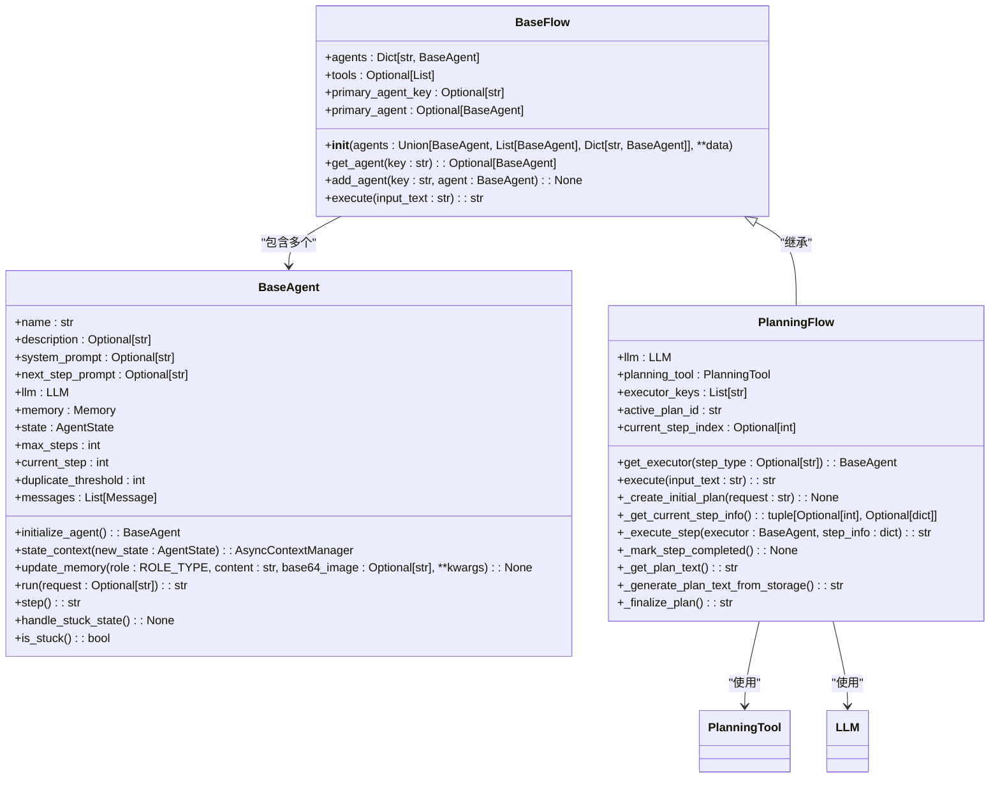
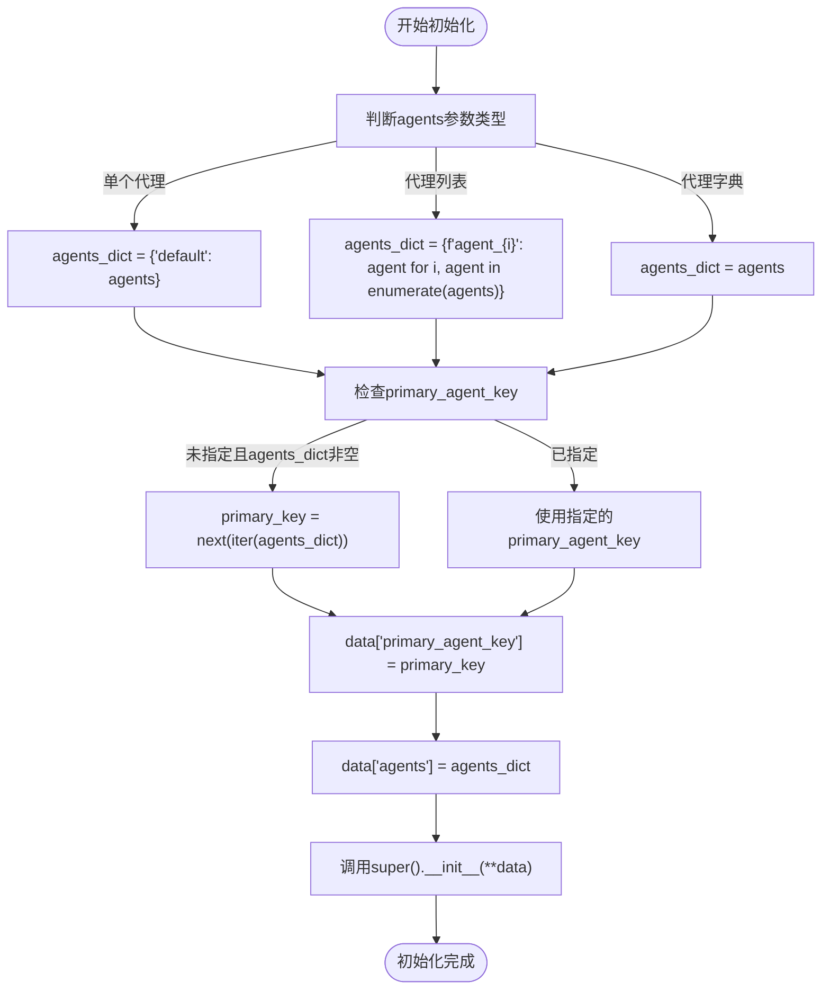
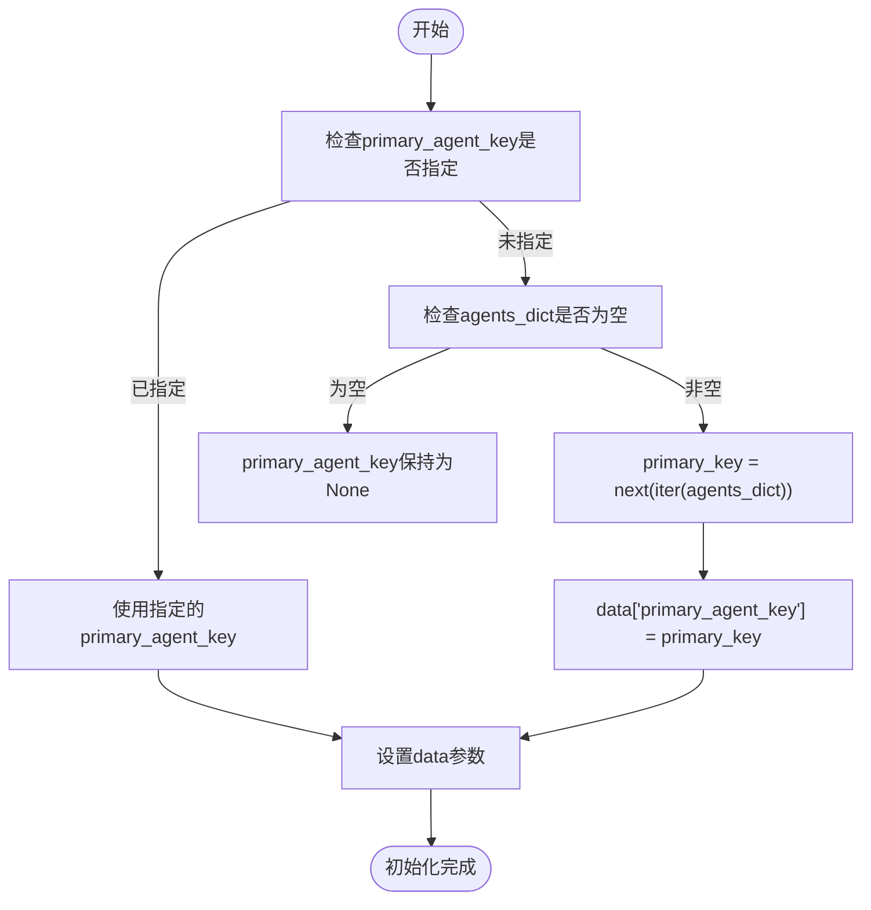
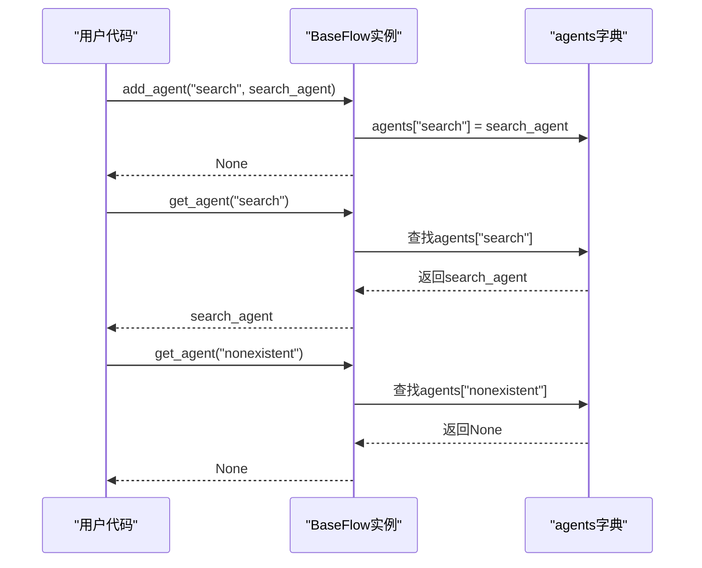

# 代理管理机制

<cite>
**Referenced Files in This Document**   
- [base.py](file://app/flow/base.py)
- [base.py](file://app/agent/base.py)
- [planning.py](file://app/flow/planning.py)
- [flow_factory.py](file://app/flow/flow_factory.py)
</cite>

## 目录
1. [简介](#简介)
2. [代理管理核心组件](#代理管理核心组件)
3. [BaseFlow类代理初始化机制](#baseflow类代理初始化机制)
4. [主代理选择逻辑](#主代理选择逻辑)
5. [运行时代理动态管理](#运行时代理动态管理)
6. [多代理注册与调用示例](#多代理注册与调用示例)
7. [代理生命周期管理最佳实践](#代理生命周期管理最佳实践)
8. [常见错误处理方案](#常见错误处理方案)
9. [结论](#结论)

## 简介
OpenManus框架提供了一套完整的代理管理机制，通过BaseFlow类实现对多个代理实例的统一管理。该机制支持灵活的代理初始化方式、主代理自动选择、运行时动态代理管理等功能，为构建复杂的多代理协作系统提供了坚实的基础。本文档详细阐述了BaseFlow类如何通过agents字典管理多个代理实例，包括初始化、选择、动态添加和检索等核心功能。

## 代理管理核心组件

OpenManus的代理管理机制由多个核心组件构成，其中BaseFlow类作为代理容器，BaseAgent类作为代理基类，共同实现了灵活的多代理管理系统。



**Diagram sources**
- [base.py](file://app/flow/base.py#L8-L56)
- [base.py](file://app/agent/base.py#L12-L195)
- [planning.py](file://app/flow/planning.py#L44-L441)

**Section sources**
- [base.py](file://app/flow/base.py#L8-L56)
- [base.py](file://app/agent/base.py#L12-L195)

## BaseFlow类代理初始化机制

BaseFlow类通过其`__init__`方法实现了灵活的代理初始化机制，能够处理单个代理、代理列表和代理字典三种不同的初始化方式。

### 单个代理初始化
当传入单个BaseAgent实例时，系统会自动将其包装为字典，使用"default"作为键名，确保统一的数据结构处理。

### 代理列表初始化
当传入代理实例列表时，系统会为每个代理生成唯一的键名（如"agent_0"、"agent_1"等），按照列表顺序进行编号，保持代理的顺序性。

### 代理字典初始化
当传入代理字典时，系统直接使用提供的键值对，允许用户自定义代理的标识符，提供最大的灵活性。



**Diagram sources**
- [base.py](file://app/flow/base.py#L18-L39)

**Section sources**
- [base.py](file://app/flow/base.py#L18-L39)

## 主代理选择逻辑

BaseFlow类通过primary_agent属性和primary_agent_key字段实现了主代理的选择机制，确保系统始终有一个默认的执行代理。

### primary_agent属性
primary_agent是一个只读属性，通过primary_agent_key从agents字典中获取对应的代理实例。如果指定的键不存在，则返回None。

### primary_agent_key默认选择逻辑
当primary_agent_key未在初始化参数中指定时，系统会自动选择agents字典中的第一个代理作为主代理。这一逻辑通过`next(iter(agents_dict))`实现，利用字典的迭代器获取第一个键。

### 主代理选择流程
主代理的选择发生在初始化过程中，系统首先检查data参数中是否提供了primary_agent_key，如果没有且agents_dict非空，则自动设置第一个代理为主代理。



**Diagram sources**
- [base.py](file://app/flow/base.py#L28-L32)
- [base.py](file://app/flow/base.py#L42-L44)

**Section sources**
- [base.py](file://app/flow/base.py#L28-L32)
- [base.py](file://app/flow/base.py#L42-L44)

## 运行时代理动态管理

BaseFlow类提供了add_agent和get_agent方法，支持在运行时动态添加和检索代理实例，增强了系统的灵活性和可扩展性。

### add_agent方法
add_agent方法允许在BaseFlow实例创建后动态添加新的代理。该方法接受代理键名和代理实例作为参数，直接将其添加到agents字典中。此操作是即时的，新添加的代理可以立即被系统识别和使用。

### get_agent方法
get_agent方法提供了一种安全的方式来检索特定的代理实例。该方法接受代理键名作为参数，返回对应的代理实例或None（如果键不存在）。这种实现避免了直接访问字典可能引发的KeyError异常。

### 动态管理流程
运行时代理管理遵循标准的字典操作模式，但通过封装的方法提供了额外的安全性和一致性检查。这种设计模式确保了代理管理的可靠性和可维护性。



**Diagram sources**
- [base.py](file://app/flow/base.py#L46-L52)

**Section sources**
- [base.py](file://app/flow/base.py#L46-L52)

## 多代理注册与调用示例

以下示例展示了如何在实际应用中使用BaseFlow类的代理管理功能。

### 代理字典构造示例
```python
# 创建代理实例
browser_agent = BrowserAgent(name="browser")
data_agent = DataAnalysisAgent(name="data_analyzer")
tool_agent = ToolCallAgent(name="tool_executor")

# 构造代理字典
agent_dict = {
    "browser": browser_agent,
    "analyzer": data_agent,
    "tools": tool_agent
}

# 创建BaseFlow实例
flow = BaseFlow(agents=agent_dict, primary_agent_key="analyzer")
```

### 类型兼容性处理
在构造agent_dict时，系统确保所有代理实例都继承自BaseAgent类，保证了类型的一致性。Pydantic的类型检查机制会在初始化时验证agents字典的类型，确保每个值都是BaseAgent的实例。

### 实际调用流程
```python
# 使用主代理执行任务
result = flow.primary_agent.run("分析网页内容")

# 动态添加新代理
new_agent = ReactAgent(name="react_agent")
flow.add_agent("react", new_agent)

# 调用特定代理
specific_result = flow.get_agent("react").run("执行React任务")
```

**Section sources**
- [base.py](file://app/flow/base.py#L18-L56)
- [base.py](file://app/agent/base.py#L12-L195)

## 代理生命周期管理最佳实践

为了确保代理系统的稳定运行，遵循以下最佳实践至关重要。

### 代理初始化最佳实践
- **明确指定主代理**：在初始化时明确指定primary_agent_key，避免依赖默认选择逻辑
- **使用描述性键名**：为代理使用有意义的键名，便于识别和管理
- **预定义代理字典**：对于复杂的多代理系统，建议预先定义代理字典结构

### 运行时管理最佳实践
- **验证代理存在性**：在调用代理前使用get_agent方法检查代理是否存在
- **有序添加代理**：按照逻辑顺序添加代理，保持系统的一致性
- **资源清理**：在代理不再需要时，考虑从系统中移除以释放资源

### 性能优化建议
- **避免频繁添加/移除**：代理的动态管理应谨慎使用，避免在高频循环中频繁修改代理集合
- **合理设置主代理**：将最常用的代理设置为主代理，减少查找开销
- **监控代理状态**：定期检查代理的状态，及时发现和处理异常情况

**Section sources**
- [base.py](file://app/flow/base.py#L18-L56)
- [base.py](file://app/agent/base.py#L12-L195)

## 常见错误处理方案

### 代理键冲突处理
当尝试添加已存在的代理键时，系统会直接覆盖原有代理。为避免意外覆盖，建议在添加代理前进行存在性检查：

```python
if flow.get_agent("new_agent") is None:
    flow.add_agent("new_agent", new_agent)
else:
    logger.warning("代理键已存在，跳过添加")
```

### 空代理列表处理
当agents字典为空时，primary_agent属性将返回None。在使用主代理前应进行空值检查：

```python
if flow.primary_agent is not None:
    result = flow.primary_agent.run(request)
else:
    raise ValueError("没有可用的主代理")
```

### 初始化异常处理
在初始化过程中可能遇到的异常包括：
- **类型错误**：确保所有代理实例都是BaseAgent的子类
- **配置错误**：检查代理的必要属性是否已正确设置
- **依赖缺失**：验证代理所需的外部依赖是否可用

**Section sources**
- [base.py](file://app/flow/base.py#L18-L56)
- [base.py](file://app/agent/base.py#L12-L195)

## 结论
OpenManus的代理管理机制通过BaseFlow类提供了一套完整、灵活且可靠的多代理管理系统。该机制支持多种初始化方式、自动主代理选择、运行时动态管理等功能，为构建复杂的AI代理协作系统提供了坚实的基础。通过遵循最佳实践和适当的错误处理，开发者可以充分利用这一机制构建高效、稳定的多代理应用。