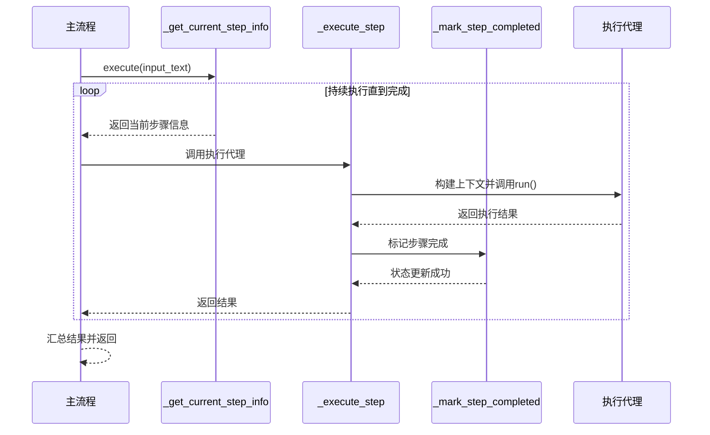
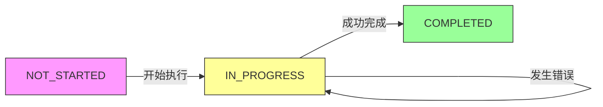

# 步骤执行与状态管理

<cite>
**Referenced Files in This Document**   
- [planning.py](file://app/flow/planning.py)
- [planning.py](file://app/tool/planning.py)
- [base.py](file://app/flow/base.py)
- [base.py](file://app/agent/base.py)
</cite>

## 目录
1. [引言](#引言)
2. [核心方法协同工作机制](#核心方法协同工作机制)
3. [_get_current_step_info 方法详解](#_get_current_step_info-方法详解)
4. [_execute_step 方法详解](#_execute_step-方法详解)
5. [_mark_step_completed 方法详解](#_mark_step_completed-方法详解)
6. [状态转换与错误恢复](#状态转换与错误恢复)
7. [性能优化建议](#性能优化建议)
8. [实际执行流程追踪](#实际执行流程追踪)

## 引言

OpenManus系统通过一套精密的步骤执行与状态管理机制来协调复杂任务的自动化处理。该机制的核心在于三个相互协作的方法：`_get_current_step_info`、`_execute_step`和`_mark_step_completed`。这些方法共同构成了一个闭环的执行流程，确保任务能够按计划有序进行。`_get_current_step_info`负责识别待执行的步骤，`_execute_step`负责调用执行代理完成具体任务，而`_mark_step_completed`则负责更新步骤的完成状态。这种设计不仅实现了任务的分步执行，还提供了清晰的状态追踪和错误恢复能力。

## 核心方法协同工作机制

这三个核心方法在`PlanningFlow`类中形成了一个完整的执行循环。当`execute`方法被调用时，它会进入一个持续的循环，首先调用`_get_current_step_info`来查找下一个待执行的步骤。一旦找到有效的步骤，系统会根据步骤类型选择合适的执行代理，然后调用`_execute_step`方法。在`_execute_step`内部，会构建包含当前计划状态的上下文提示，并调用代理的`run`方法执行任务。任务成功完成后，`_execute_step`会自动调用`_mark_step_completed`来更新步骤状态。这个循环会一直持续，直到所有步骤都完成或代理主动终止。

**Diagram sources**
- [planning.py](file://app/flow/planning.py#L93-L133)
- [planning.py](file://app/flow/planning.py#L212-L274)
- [planning.py](file://app/flow/planning.py#L276-L303)
- [planning.py](file://app/flow/planning.py#L305-L334)

**Section sources**
- [planning.py](file://app/flow/planning.py#L93-L133)

## _get_current_step_info 方法详解

`_get_current_step_info`方法是步骤执行流程的起点，其主要职责是遍历计划中的所有步骤，并识别出第一个尚未完成的步骤。该方法首先检查活动计划ID的有效性，然后直接从`planning_tool`的存储中获取计划数据。它通过比较步骤列表和状态列表的长度来确定每个步骤的当前状态：如果状态列表的长度小于步骤索引，则状态为`NOT_STARTED`；否则使用对应的状态值。一旦找到处于`NOT_STARTED`或`IN_PROGRESS`状态的步骤，该方法会立即返回其索引和信息。

该方法的一个关键特性是能够通过正则表达式提取步骤类型标签。它使用`re.search(r"\[([A-Z_]+)\]", step)`模式来匹配步骤文本中的`[SEARCH]`、`[CODE]`等标签，并将提取的类型（转换为小写）存储在`step_info`字典中。这使得系统能够根据步骤类型智能地选择执行代理。更重要的是，该方法在返回步骤信息之前，会自动将该步骤的状态标记为`IN_PROGRESS`。它通过调用`planning_tool.execute`命令来实现这一点，如果调用失败，则会直接在内存中的计划数据里更新状态，确保状态变更的可靠性。

**Section sources**
- [planning.py](file://app/flow/planning.py#L212-L274)

## _execute_step 方法详解

`_execute_step`方法负责将步骤执行的具体任务委托给合适的代理。在执行前，它会调用`_get_plan_text`方法获取当前计划的完整状态，包括所有步骤的进度和备注。然后，它会构建一个详细的上下文提示，该提示包含当前计划状态和具体的任务描述。这个提示被设计为能够引导代理专注于当前步骤，避免执行不必要的操作。

构建提示后，该方法会调用执行代理的`run`方法，并传入构建好的提示。`run`方法是`BaseAgent`类定义的抽象方法，所有具体的代理类都必须实现它。在代理执行过程中，任何异常都会被捕获并记录为错误日志，同时方法会返回一个包含错误信息的结果字符串。如果代理成功完成任务，`_execute_step`会立即调用`_mark_step_completed`方法来更新步骤状态，从而完成一个完整的执行周期。这种设计确保了状态更新与任务执行的紧密耦合，避免了状态不一致的问题。

**Section sources**
- [planning.py](file://app/flow/planning.py#L276-L303)
- [planning.py](file://app/flow/planning.py#L336-L345)

## _mark_step_completed 方法详解

`_mark_step_completed`方法是状态管理的最终环节，负责将当前步骤的状态从`IN_PROGRESS`更新为`COMPLETED`。该方法首先检查`current_step_index`是否有效，以防止对无效步骤进行操作。然后，它会调用`planning_tool.execute`方法，发送一个`mark_step`命令，指定计划ID、步骤索引和目标状态`COMPLETED`。

与`_get_current_step_info`类似，该方法也实现了双重保障机制。如果通过`planning_tool`更新状态失败（例如由于网络问题或工具异常），它会进入一个异常处理分支，直接在内存中的计划数据结构里更新状态。它会确保`step_statuses`列表的长度足够，然后将对应索引的状态设置为`COMPLETED`。这种设计极大地提高了系统的容错能力，即使在外部工具不可用的情况下，核心的状态信息也不会丢失。状态更新成功后，相关的操作会被记录为信息级别的日志，便于后续的审计和调试。

**Section sources**
- [planning.py](file://app/flow/planning.py#L305-L334)

## 状态转换与错误恢复

OpenManus的步骤状态管理遵循一个清晰的生命周期，从`NOT_STARTED`开始，经过`IN_PROGRESS`，最终到达`COMPLETED`。这个状态转换过程由`PlanStepStatus`枚举类明确定义，并通过`get_active_statuses`等辅助方法进行管理。状态转换图如下所示：

**Diagram sources**
- [planning.py](file://app/flow/planning.py#L48-L48)

系统内置了强大的错误恢复策略。当`_get_current_step_info`或`_mark_step_completed`方法无法通过`planning_tool`更新状态时，它们会直接修改内存中的状态数据。这种“直接修改内存状态”的策略是一种关键的故障转移机制，确保了核心业务逻辑的连续性。此外，`_get_plan_text`方法也实现了类似的容错设计：如果从`planning_tool`获取计划文本失败，它会调用`_generate_plan_text_from_storage`方法，直接从内存存储中生成计划文本。这种多层次的错误恢复策略共同保障了系统的高可用性。

**Section sources**
- [planning.py](file://app/flow/planning.py#L212-L274)
- [planning.py](file://app/flow/planning.py#L305-L334)
- [planning.py](file://app/flow/planning.py#L336-L345)
- [planning.py](file://app/flow/planning.py#L347-L403)

## 性能优化建议

为了确保步骤执行与状态管理的高效性，可以考虑以下优化建议。首先，`_get_current_step_info`和`_mark_step_completed`方法都实现了对`planning_tool`的异步调用，这避免了在等待I/O操作时阻塞整个执行流程，是异步编程的最佳实践。其次，状态检查逻辑被设计为在找到第一个活动步骤后立即返回，避免了对整个步骤列表的无谓遍历，这在处理大型计划时尤为重要。

另一个优化点是状态存储的设计。`planning_tool`将计划数据（包括步骤、状态和备注）存储在一个简单的字典结构中，这提供了O(1)的访问时间复杂度。同时，`_generate_plan_text_from_storage`方法的存在，使得在`planning_tool`响应缓慢或不可用时，系统仍能快速生成计划摘要，避免了性能瓶颈。建议在高并发场景下，对`planning_tool.plans`字典的访问进行适当的锁保护，以防止数据竞争。

**Section sources**
- [planning.py](file://app/flow/planning.py#L212-L274)
- [planning.py](file://app/flow/planning.py#L305-L334)
- [planning.py](file://app/flow/planning.py#L347-L403)
- [planning.py](file://app/tool/planning.py#L13-L362)

## 实际执行流程追踪

一个典型的执行流程始于用户输入。`execute`方法首先调用`_create_initial_plan`创建一个新计划，然后进入主循环。在循环中，`_get_current_step_info`被调用，它遍历步骤列表，找到第一个`NOT_STARTED`的步骤（例如`[SEARCH] 在网上搜索OpenManus项目`），提取出`search`类型，并将其状态在内存中标记为`IN_PROGRESS`。接着，`get_executor`根据`search`类型选择`browser`代理，`_execute_step`构建包含当前计划状态的提示，并调用`browser.run()`。代理执行搜索任务后返回结果，`_execute_step`捕获结果并调用`_mark_step_completed`。最后，`_mark_step_completed`通过`planning_tool`将该步骤的状态正式更新为`COMPLETED`，完成一个完整的步骤执行周期。

**Section sources**
- [planning.py](file://app/flow/planning.py#L93-L133)
- [planning.py](file://app/flow/planning.py#L212-L274)
- [planning.py](file://app/flow/planning.py#L276-L303)
- [planning.py](file://app/flow/planning.py#L305-L334)