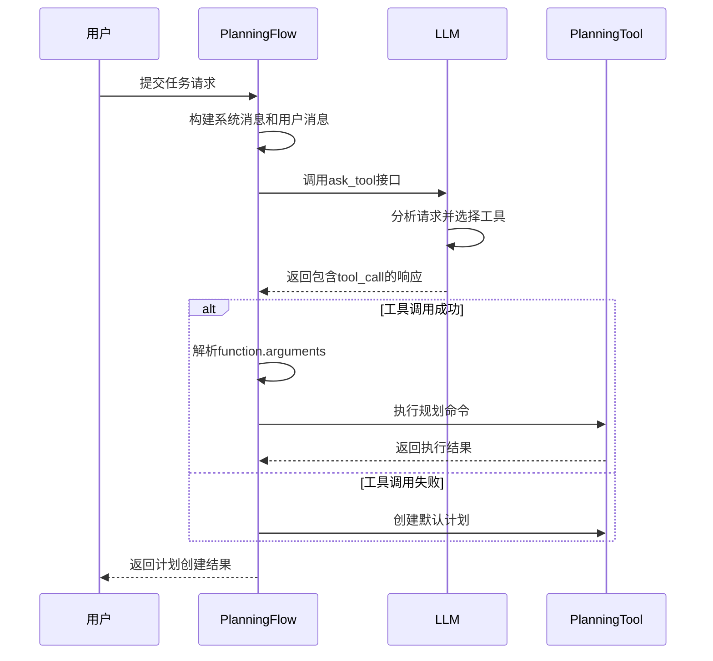
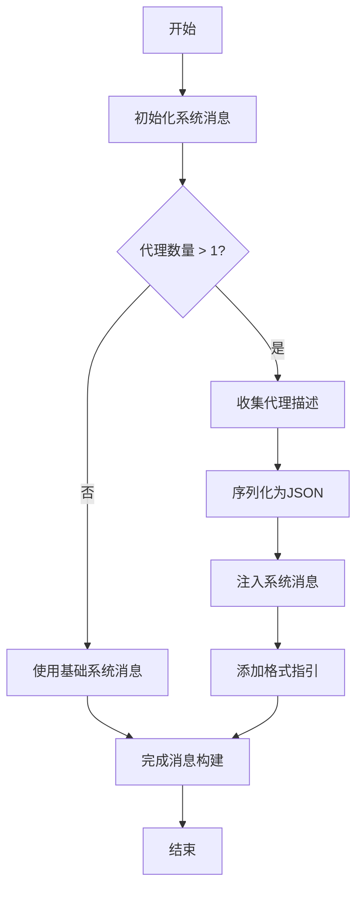
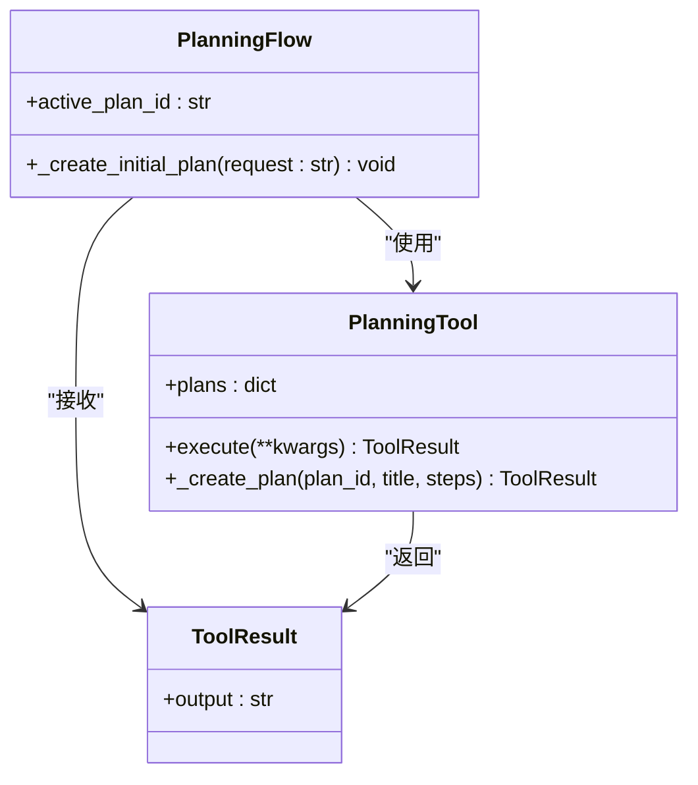
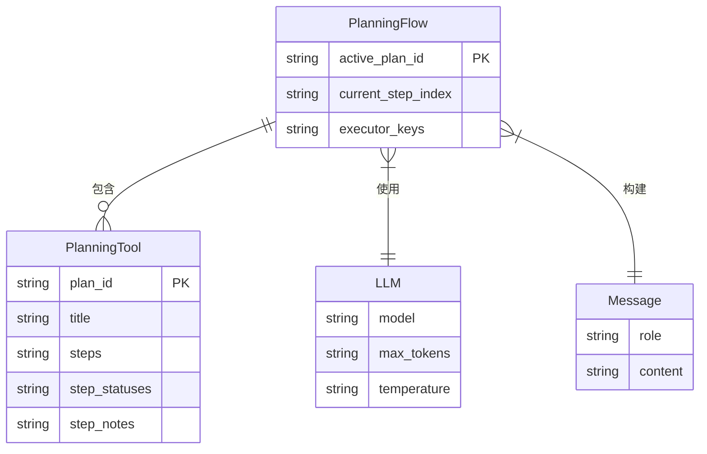

# 计划创建与初始化

<cite>
**Referenced Files in This Document**  
- [planning.py](file://app/flow/planning.py)
- [planning.py](file://app/tool/planning.py)
- [planning.py](file://app/prompt/planning.py)
- [llm.py](file://app/llm.py)
</cite>

## 目录
1. [简介](#简介)
2. [核心实现机制](#核心实现机制)
3. [系统消息构建与代理注入](#系统消息构建与代理注入)
4. [工具调用处理与计划ID传递](#工具调用处理与计划id传递)
5. [默认计划创建逻辑](#默认计划创建逻辑)
6. [日志记录与错误处理](#日志记录与错误处理)
7. [组件集成关系](#组件集成关系)
8. [多代理协作角色](#多代理协作角色)

## 简介
本文档详细阐述OpenManus系统中`PlanningFlow`类的`_create_initial_plan`方法实现机制。该方法作为任务执行流程的起点，负责将用户请求转化为可执行的初始计划。通过整合大语言模型（LLM）与规划工具（PlanningTool），该方法实现了智能化的任务分解与计划生成。文档将深入分析其工作流程、错误处理策略以及与其他核心组件的交互模式。

**Section sources**
- [planning.py](file://app/flow/planning.py#L135-L210)

## 核心实现机制
`_create_initial_plan`方法是规划流程的核心入口，其主要职责是接收用户请求并生成初始执行计划。该方法通过协调LLM与PlanningTool两个关键组件，实现了从自然语言请求到结构化计划的转换。

方法首先记录计划创建日志，使用`active_plan_id`作为唯一标识。随后构建系统消息和用户消息，通过`llm.ask_tool`接口调用大语言模型，并附带PlanningTool作为可用工具。当LLM返回包含`tool_calls`的有效响应时，方法会解析并执行规划指令；若未获得有效工具调用，则创建包含默认步骤的备用计划。

该机制体现了典型的"AI代理+工具"架构模式，其中LLM作为决策大脑，PlanningTool作为执行手臂，共同完成复杂任务的规划工作。



**Diagram sources**
- [planning.py](file://app/flow/planning.py#L135-L210)

**Section sources**
- [planning.py](file://app/flow/planning.py#L135-L210)

## 系统消息构建与代理注入
`_create_initial_plan`方法通过精心构建的系统消息来引导LLM生成高质量的计划。系统消息的核心内容是定义LLM作为"规划助手"的角色，并要求其创建简洁、可操作的计划，重点关注关键里程碑而非详细子步骤。

当系统中存在多个执行代理时，方法会动态注入代理描述信息。通过遍历`executor_keys`中的代理键，收集每个代理的名称和描述，形成代理信息列表。这些信息被序列化为JSON格式，并附加到系统消息中，同时提供格式指引："[agent_name]"。

这种动态注入机制使得LLM能够根据任务需求选择合适的执行代理，实现了智能的任务分配。例如，当需要执行搜索任务时，LLM可以指定"[SEARCH]"代理；当需要代码执行时，可以指定"[CODE]"代理。



**Diagram sources**
- [planning.py](file://app/flow/planning.py#L140-L158)

**Section sources**
- [planning.py](file://app/flow/planning.py#L135-L210)

## 工具调用处理与计划ID传递
当LLM返回包含`tool_calls`的响应时，`_create_initial_plan`方法会进行详细的解析和处理。方法首先检查`tool_call`的函数名称是否为"planning"，以确保调用的是正确的规划工具。

对于函数参数的处理，方法考虑了两种可能的格式：直接的字典对象或JSON字符串。如果参数是字符串类型，方法会尝试使用`json.loads`进行解析，并在解析失败时记录错误日志。这是为了处理不同LLM实现可能返回的不同参数格式。

最关键的一步是确保`plan_id`的正确传递。方法会强制将`active_plan_id`注入到解析后的参数字典中，覆盖任何可能存在的旧ID。这保证了所有规划操作都针对当前激活的计划实例。

最后，方法通过`planning_tool.execute(**args)`执行规划命令，并立即返回以避免创建默认计划。这种设计确保了当LLM成功生成计划时，系统会优先采用AI生成的方案。

```mermaid
flowchart TD
A[接收到LLM响应] --> B{存在tool_calls?}
B --> |否| C[创建默认计划]
B --> |是| D[遍历tool_calls]
D --> E[检查函数名称]
E --> F{名称为"planning"?}
F --> |否| D
F --> |是| G[获取参数]
G --> H{参数为字符串?}
H --> |是| I[尝试JSON解析]
I --> J{解析成功?}
J --> |否| K[记录错误日志]
J --> |是| L[使用解析结果]
H --> |否| L
L --> M[注入plan_id]
M --> N[执行规划工具]
N --> O[返回结果]
```

**Diagram sources**
- [planning.py](file://app/flow/planning.py#L169-L200)

**Section sources**
- [planning.py](file://app/flow/planning.py#L135-L210)

## 默认计划创建逻辑
当LLM未能返回有效的工具调用时，`_create_initial_plan`方法会启动默认计划创建逻辑。这一容错机制确保了系统在各种异常情况下仍能继续执行，体现了系统的健壮性设计。

默认计划的创建通过直接调用`planning_tool.execute`方法实现，传入预定义的参数字典。该字典包含三个核心字段：`command`设置为"create"表示创建新计划；`plan_id`使用当前的`active_plan_id`；`steps`包含三个标准化的步骤：["Analyze request", "Execute task", "Verify results"]。

计划标题根据用户请求生成，采用"Plan for: "前缀，并对超过50个字符的请求进行截断处理。这种设计既保持了标题的可读性，又避免了过长的标识符。

默认计划的三个步骤体现了基本的任务执行流程：首先分析请求，然后执行具体任务，最后验证结果。这种通用模板可以适应大多数任务场景，为后续的细化执行提供了基础框架。



**Diagram sources**
- [planning.py](file://app/flow/planning.py#L202-L210)
- [planning.py](file://app/tool/planning.py#L119-L157)

**Section sources**
- [planning.py](file://app/flow/planning.py#L135-L210)

## 日志记录与错误处理
`_create_initial_plan`方法实现了全面的日志记录和错误处理机制，确保了系统的可观测性和稳定性。

在正常执行路径中，方法在开始时记录INFO级别的日志，包含计划ID信息。当成功创建计划时，记录包含执行结果的INFO日志。当触发默认计划创建时，记录WARNING级别的日志，提示"Creating default plan"，这有助于运维人员识别AI规划失败的情况。

在错误处理方面，方法对JSON解析失败的情况进行了专门处理。当`json.loads`抛出`JSONDecodeError`时，方法会记录详细的错误日志，包括原始参数内容，然后继续处理下一个工具调用。这种设计避免了单个解析错误导致整个流程中断。

对于工具执行过程中的异常，虽然主要由`PlanningTool`内部处理，但`_create_initial_plan`方法通过检查`tool_calls`的存在性实现了高层次的错误检测。如果LLM未能正确调用规划工具，方法会自动降级到默认计划创建，实现了优雅的故障转移。

```mermaid
stateDiagram-v2
[*] --> 初始化
初始化 --> 构建消息
构建消息 --> 调用LLM
调用LLM --> 解析响应
解析响应 --> {存在tool_calls?}
{存在tool_calls?} --> |是| 处理工具调用
{存在tool_calls?} --> |否| 创建默认计划
处理工具调用 --> {函数名称正确?}
{函数名称正确?} --> |否| 继续遍历
{函数名称正确?} --> |是| 解析参数
解析参数 --> {参数为字符串?}
{参数为字符串?} --> |是| 尝试JSON解析
尝试JSON解析 --> {解析成功?}
{解析成功?} --> |否| 记录错误
{解析成功?} --> |是| 注入plan_id
记录错误 --> 继续遍历
注入plan_id --> 执行工具
执行工具 --> 返回结果
创建默认计划 --> 返回结果
继续遍历 --> 返回结果
返回结果 --> [*]
```

**Diagram sources**
- [planning.py](file://app/flow/planning.py#L135-L210)

**Section sources**
- [planning.py](file://app/flow/planning.py#L135-L210)

## 组件集成关系
`_create_initial_plan`方法与多个核心组件紧密集成，形成了一个协同工作的生态系统。

与LLM模块的集成通过`llm.ask_tool`接口实现。该接口允许向LLM提供可用工具列表，并接收包含工具调用的结构化响应。`PlanningFlow`中的`llm`字段通过`Field(default_factory=lambda: LLM())`实现延迟初始化，确保了组件的按需加载。

与PlanningTool的集成更为深入。`PlanningFlow`不仅将PlanningTool作为工具提供给LLM，还直接调用其`execute`方法来创建默认计划。`planning_tool`字段同样通过工厂函数初始化，实现了依赖注入。

`Message`类用于构建系统消息和用户消息，确保消息格式符合LLM接口要求。`logger`用于记录关键执行步骤和异常情况，提供了系统的可观测性。

这种集成模式体现了清晰的职责分离：LLM负责智能决策，PlanningTool负责状态管理，PlanningFlow负责流程 orchestration。



**Diagram sources**
- [planning.py](file://app/flow/planning.py#L47-L51)
- [planning.py](file://app/tool/planning.py#L19-L69)

**Section sources**
- [planning.py](file://app/flow/planning.py#L135-L210)
- [planning.py](file://app/tool/planning.py#L19-L69)
- [llm.py](file://app/llm.py#L173-L765)

## 多代理协作角色
在多代理协作场景下，`_create_initial_plan`方法扮演着协调者和初始化者的角色。通过`executor_keys`字段，方法能够识别系统中所有可用的执行代理，并在系统消息中注入这些代理的描述信息。

当LLM生成计划时，它可以基于任务需求选择最合适的代理来执行每个步骤。例如，一个包含搜索和代码执行的复杂任务可能会生成类似"[SEARCH] 查找相关信息"和"[CODE] 实现算法"的步骤。

`get_executor`方法实现了代理选择逻辑，优先使用步骤类型匹配的代理，然后回退到`executor_keys`中定义的第一个代理，最后使用主代理作为最终回退。这种分层选择策略确保了任务能够被正确分配。

通过这种设计，`_create_initial_plan`不仅创建了执行计划，还为后续的多代理协作奠定了基础，实现了从单点决策到分布式执行的平滑过渡。

**Section sources**
- [planning.py](file://app/flow/planning.py#L76-L91)
- [planning.py](file://app/flow/planning.py#L135-L210)