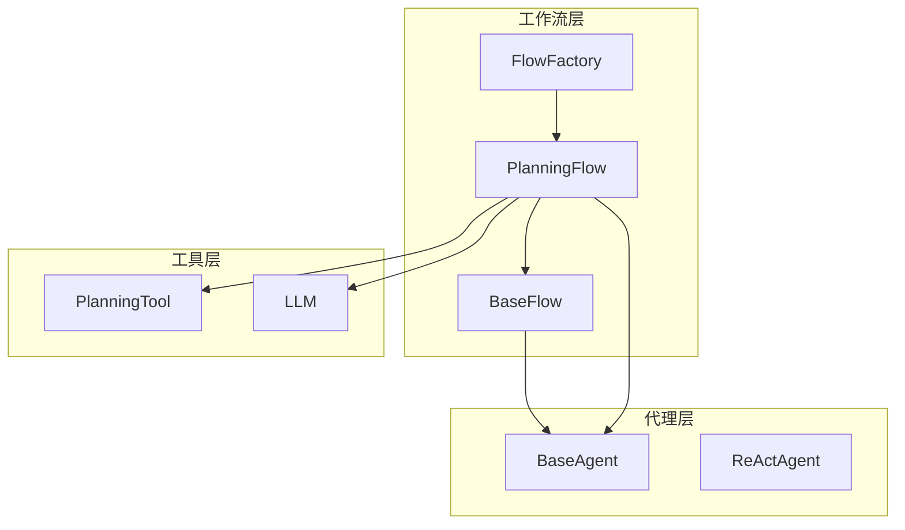
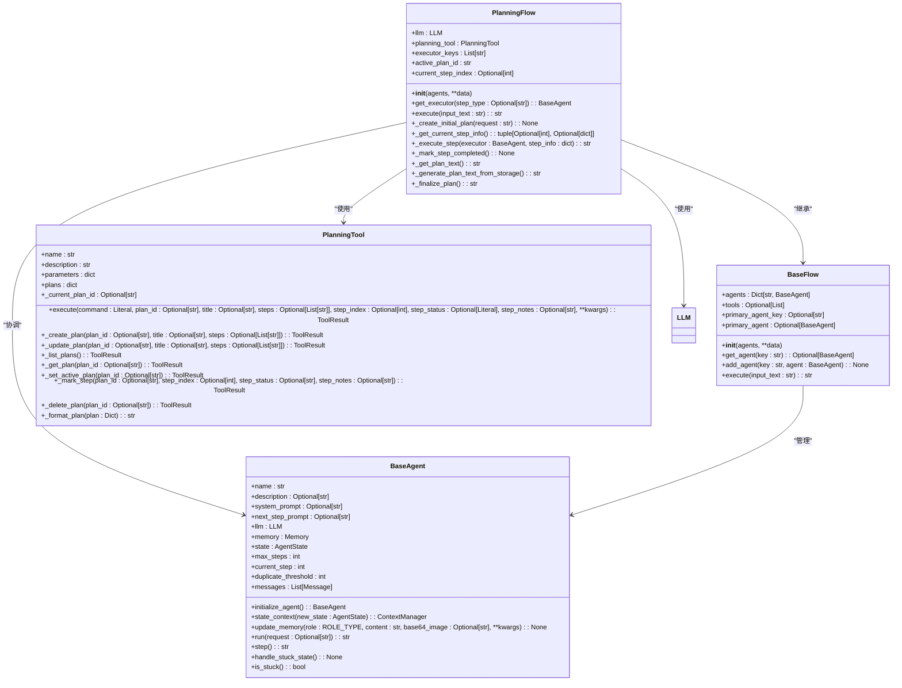
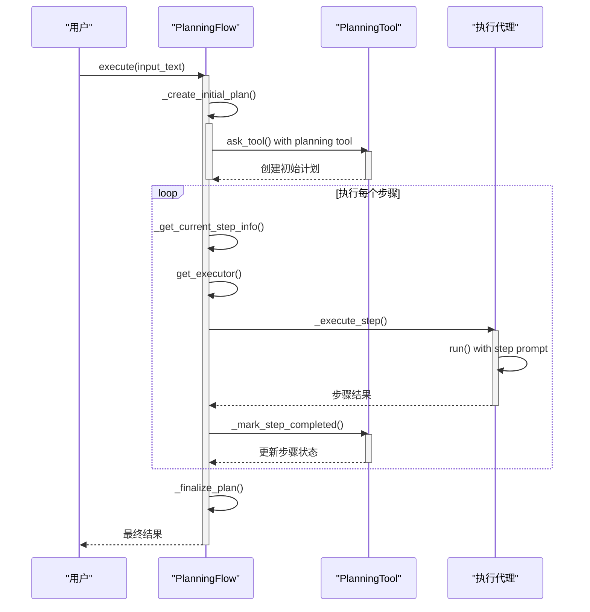
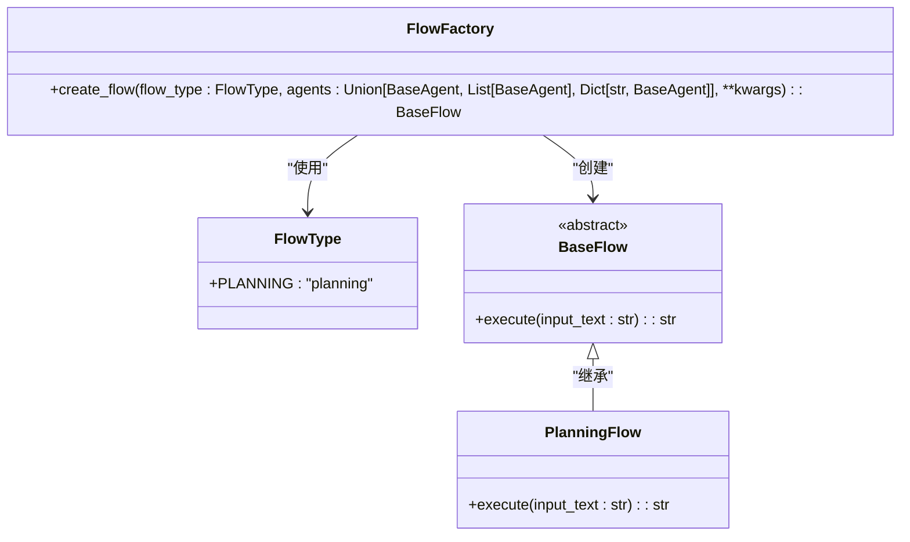
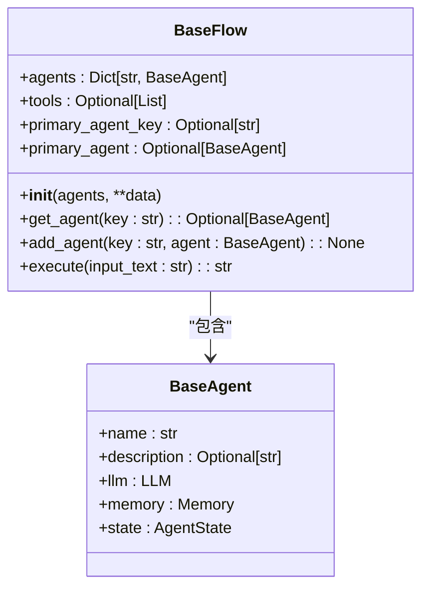
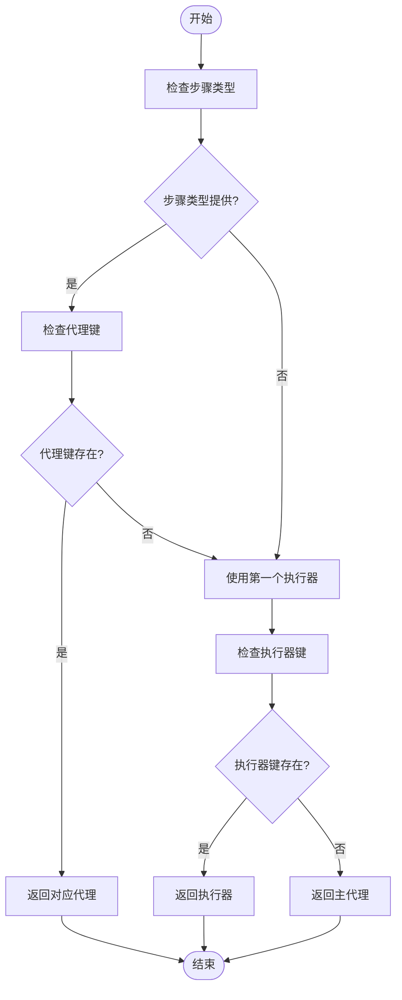
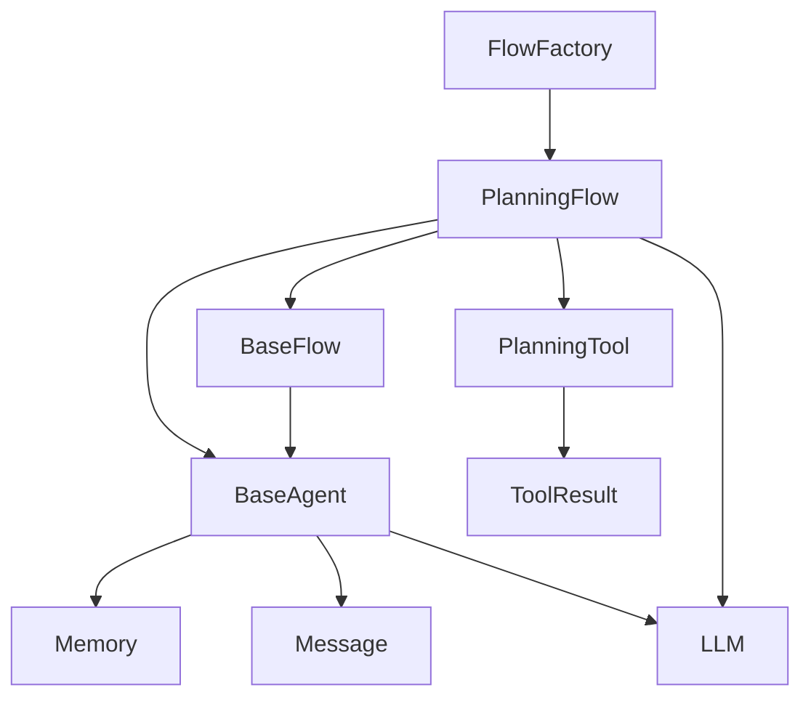

# 工作流系统架构

<cite>
**Referenced Files in This Document**   
- [planning.py](file://app/flow/planning.py)
- [flow_factory.py](file://app/flow/flow_factory.py)
- [base.py](file://app/flow/base.py)
- [planning.py](file://app/tool/planning.py)
- [base.py](file://app/agent/base.py)
- [llm.py](file://app/llm.py)
- [schema.py](file://app/schema.py)
- [base.py](file://app/tool/base.py)
</cite>

## 目录
1. [简介](#简介)
2. [项目结构](#项目结构)
3. [核心组件](#核心组件)
4. [架构概述](#架构概述)
5. [详细组件分析](#详细组件分析)
6. [依赖分析](#依赖分析)
7. [性能考虑](#性能考虑)
8. [故障排除指南](#故障排除指南)
9. [结论](#结论)

## 简介
本文档详细描述了OpenManus工作流系统的核心架构，重点分析了PlanningFlow如何实现多代理协作和任务规划。文档阐述了FlowFactory工厂模式如何创建不同类型的工作流实例，以及BaseFlow中代理管理（add_agent、get_agent）和执行器选择（get_executor）的设计机制。通过分析任务分解、步骤执行和状态跟踪的完整流程，为开发者提供了自定义工作流开发的接口规范和实现示例。

## 项目结构
OpenManus项目采用模块化设计，主要功能组件分布在不同的目录中。工作流系统的核心实现位于`app/flow`目录下，包括基础工作流类、工厂模式和规划工作流。代理系统位于`app/agent`目录，工具系统位于`app/tool`目录，而`app/schema`和`app/llm`则提供了核心数据模型和语言模型接口。

**Section sources**
- [planning.py](file://app/flow/planning.py)
- [flow_factory.py](file://app/flow/flow_factory.py)
- [base.py](file://app/flow/base.py)

## 核心组件
工作流系统由三个核心组件构成：`PlanningFlow`负责任务规划和执行，`FlowFactory`作为工厂模式创建不同类型的流程实例，而`BaseFlow`则提供了所有工作流的基类和代理管理功能。这些组件协同工作，实现了复杂的多代理协作和任务规划能力。

**Section sources**
- [planning.py](file://app/flow/planning.py#L44-L441)
- [flow_factory.py](file://app/flow/flow_factory.py#L12-L29)
- [base.py](file://app/flow/base.py#L8-L56)

## 架构概述
OpenManus工作流系统采用分层架构设计，核心是基于工厂模式的流程创建机制和基于代理的执行模型。系统通过`FlowFactory`创建`PlanningFlow`实例，该实例利用`BaseFlow`提供的代理管理功能协调多个代理完成复杂任务。

**Diagram sources **
- [planning.py](file://app/flow/planning.py#L44-L441)
- [flow_factory.py](file://app/flow/flow_factory.py#L12-L29)
- [base.py](file://app/flow/base.py#L8-L56)

## 详细组件分析

### PlanningFlow分析
`PlanningFlow`是OpenManus系统中负责任务规划和执行的核心类。它继承自`BaseFlow`，并实现了多代理协作和任务规划的完整流程。

#### 多代理协作架构
`PlanningFlow`通过精心设计的架构实现了多代理协作，其核心在于代理管理和任务调度机制。

**Diagram sources **
- [planning.py](file://app/flow/planning.py#L44-L441)
- [base.py](file://app/flow/base.py#L8-L56)
- [base.py](file://app/agent/base.py#L12-L195)
- [planning.py](file://app/tool/planning.py#L13-L362)

#### 任务规划执行序列
`PlanningFlow`的工作流程通过一个清晰的序列图展示，从任务输入到最终完成，涵盖了任务分解、步骤执行和状态跟踪的完整过程。

**Diagram sources **
- [planning.py](file://app/flow/planning.py#L93-L133)
- [planning.py](file://app/flow/planning.py#L135-L210)
- [planning.py](file://app/flow/planning.py#L276-L303)
- [planning.py](file://app/flow/planning.py#L305-L334)

### FlowFactory分析
`FlowFactory`类实现了工厂设计模式，负责创建不同类型的工作流实例。该模式通过静态方法`create_flow`根据指定的流程类型创建相应的流程对象，实现了对象创建的封装和解耦。

**Diagram sources **
- [flow_factory.py](file://app/flow/flow_factory.py#L12-L29)

### BaseFlow分析
`BaseFlow`是所有工作流的基类，提供了代理管理的核心功能。它通过字典结构管理多个代理，并提供了添加、获取和选择执行器的接口。

#### 代理管理机制
`BaseFlow`的代理管理机制通过`add_agent`、`get_agent`和`primary_agent`等方法实现，支持灵活的代理配置和访问。

**Diagram sources **
- [base.py](file://app/flow/base.py#L8-L56)

#### 执行器选择机制
`PlanningFlow`中的`get_executor`方法实现了智能的执行器选择机制，根据步骤类型和配置选择最合适的代理执行任务。

**Diagram sources **
- [planning.py](file://app/flow/planning.py#L76-L91)

## 依赖分析
工作流系统各组件之间存在明确的依赖关系。`PlanningFlow`依赖于`PlanningTool`进行计划管理，依赖于`LLM`进行决策和生成，同时通过`BaseFlow`管理多个`BaseAgent`实例。`FlowFactory`作为创建者，依赖于所有具体的流程实现。

**Diagram sources **
- [planning.py](file://app/flow/planning.py#L44-L441)
- [flow_factory.py](file://app/flow/flow_factory.py#L12-L29)
- [base.py](file://app/flow/base.py#L8-L56)
- [planning.py](file://app/tool/planning.py#L13-L362)
- [base.py](file://app/agent/base.py#L12-L195)
- [llm.py](file://app/llm.py#L173-L765)
- [schema.py](file://app/schema.py#L158-L186)
- [base.py](file://app/tool/base.py#L37-L74)

## 性能考虑
工作流系统的性能主要受LLM调用次数、代理执行步骤和计划复杂度的影响。系统通过`max_steps`限制和状态跟踪机制防止无限循环，同时利用`PlanningTool`的本地存储减少不必要的API调用。

## 故障排除指南
当工作流执行出现问题时，应首先检查`PlanningFlow`的日志输出，特别是计划创建和步骤执行阶段的错误信息。常见的问题包括代理配置错误、LLM调用失败和计划状态不一致。通过检查`planning_tool.plans`中的计划数据和代理的`memory.messages`可以诊断大多数问题。

**Section sources**
- [planning.py](file://app/flow/planning.py#L93-L133)
- [base.py](file://app/agent/base.py#L115-L153)

## 结论
OpenManus工作流系统通过`PlanningFlow`、`FlowFactory`和`BaseFlow`的协同工作，实现了强大的多代理协作和任务规划能力。系统采用清晰的分层架构和设计模式，为开发者提供了灵活的自定义接口。通过理解这些核心组件的工作原理和交互方式，开发者可以有效地扩展和定制工作流系统以满足特定需求。