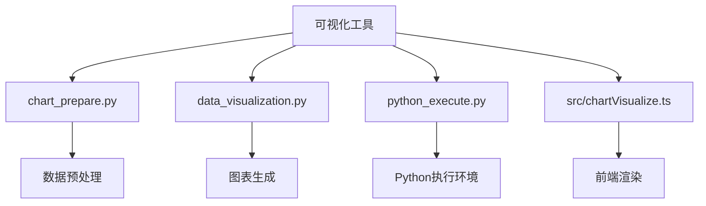
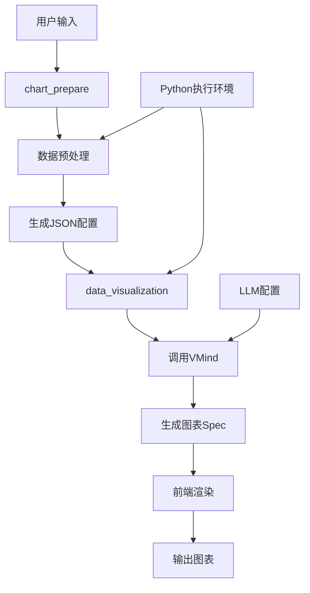
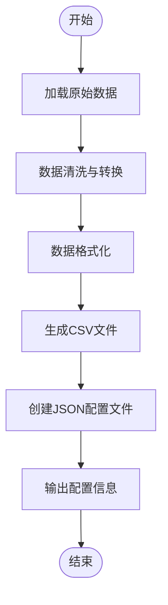
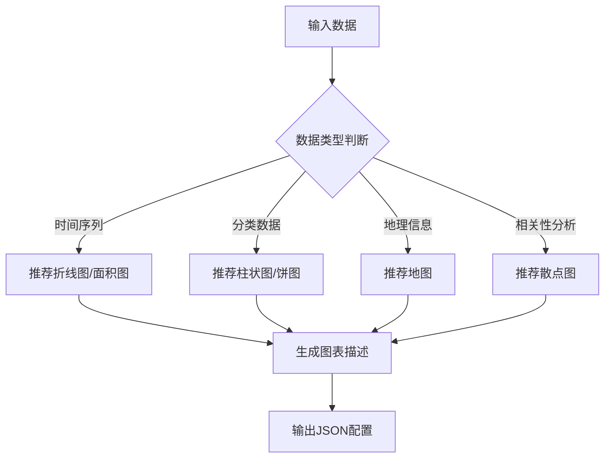
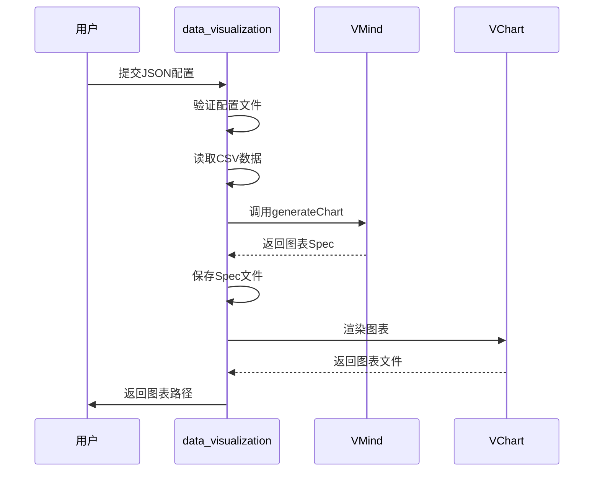
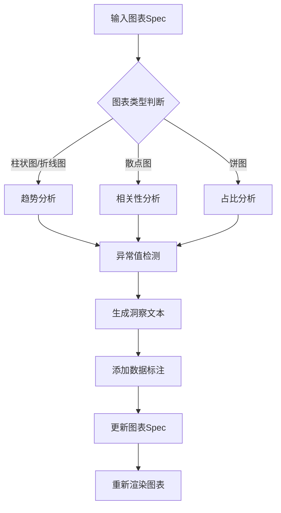
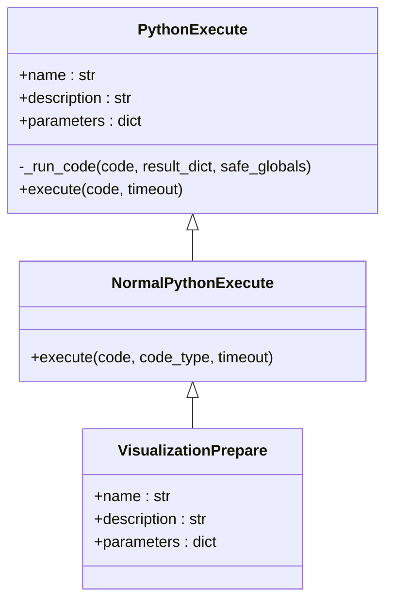
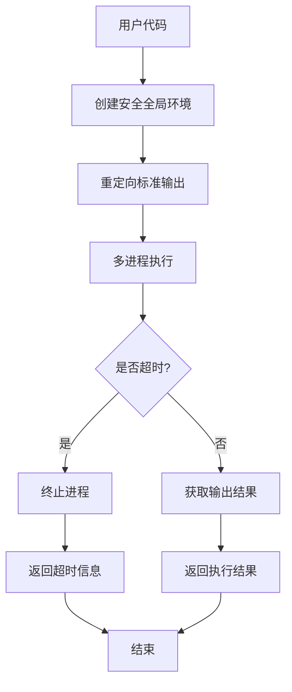
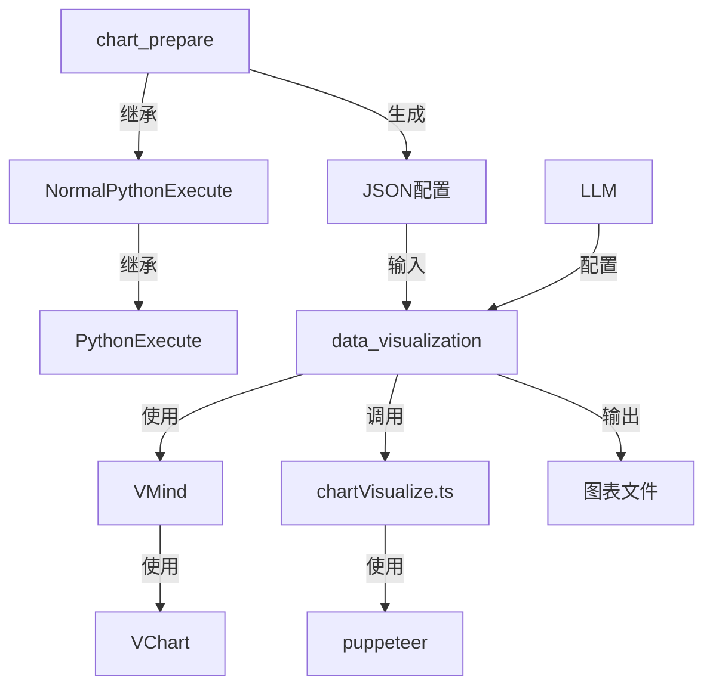

# 可视化工具

<cite>
**本文档中引用的文件**
- [data_visualization.py](file://app/tool/chart_visualization/data_visualization.py)
- [chart_prepare.py](file://app/tool/chart_visualization/chart_prepare.py)
- [python_execute.py](file://app/tool/chart_visualization/python_execute.py)
- [src/chartVisualize.ts](file://app/tool/chart_visualization/src/chartVisualize.ts)
- [README_zh.md](file://app/tool/chart_visualization/README_zh.md)
</cite>

## 目录
1. [简介](#简介)
2. [项目结构](#项目结构)
3. [核心组件](#核心组件)
4. [架构概述](#架构概述)
5. [详细组件分析](#详细组件分析)
6. [依赖分析](#依赖分析)
7. [性能考虑](#性能考虑)
8. [故障排除指南](#故障排除指南)
9. [结论](#结论)

## 简介
OpenManus可视化工具是一个集成的数据可视化系统，通过Python和Node.js技术栈实现从原始数据到交互式图表的完整转换流程。该工具利用大语言模型智能生成图表，并支持自动数据洞察分析。系统采用模块化设计，包含数据预处理、图表生成和结果渲染等核心功能，支持多种输出格式（PNG/PDF/SVG）和多语言界面。

## 项目结构
OpenManus可视化工具的项目结构采用分层设计，主要包含以下核心模块：

**图表来源**
- [chart_prepare.py](file://app/tool/chart_visualization/chart_prepare.py)
- [data_visualization.py](file://app/tool/chart_visualization/data_visualization.py)
- [python_execute.py](file://app/tool/chart_visualization/python_execute.py)
- [src/chartVisualize.ts](file://app/tool/chart_visualization/src/chartVisualize.ts)

**章节来源**
- [app/tool/chart_visualization/__init__.py](file://app/tool/chart_visualization/__init__.py)

## 核心组件
可视化工具的核心组件包括chart_prepare模块、data_visualization模块和Python执行环境。这些组件协同工作，实现从数据到可视化的完整转换流程。chart_prepare负责数据预处理和图表类型推断，data_visualization调用VMind库生成具体图表，Python执行环境提供安全的代码沙箱。

**章节来源**
- [data_visualization.py](file://app/tool/chart_visualization/data_visualization.py#L14-L262)
- [chart_prepare.py](file://app/tool/chart_visualization/chart_prepare.py#L3-L37)

## 架构概述
可视化工具采用分层架构设计，各组件之间通过清晰的接口进行通信。系统整体架构如下：

**图表来源**
- [data_visualization.py](file://app/tool/chart_visualization/data_visualization.py#L195-L214)
- [src/chartVisualize.ts](file://app/tool/chart_visualization/src/chartVisualize.ts#L323-L371)

## 详细组件分析

### chart_prepare组件分析
chart_prepare组件负责数据预处理和图表类型自动推断，是可视化流程的第一步。

#### 数据预处理流程

**图表来源**
- [chart_prepare.py](file://app/tool/chart_visualization/chart_prepare.py#L3-L37)

#### 图表类型自动推断机制

**图表来源**
- [chart_prepare.py](file://app/tool/chart_visualization/chart_prepare.py#L3-L37)
- [data_visualization.py](file://app/tool/chart_visualization/data_visualization.py#L81-L123)

### data_visualization模块分析
data_visualization模块负责将预处理后的数据转换为交互式图表。

#### 图表生成流程

**图表来源**
- [data_visualization.py](file://app/tool/chart_visualization/data_visualization.py#L145-L193)
- [src/chartVisualize.ts](file://app/tool/chart_visualization/src/chartVisualize.ts#L171-L232)

#### 数据洞察分析流程

**图表来源**
- [src/chartVisualize.ts](file://app/tool/chart_visualization/src/chartVisualize.ts#L234-L285)

### Python执行环境分析
Python执行环境在图表生成过程中扮演关键角色，提供安全的代码执行沙箱。

#### 执行环境架构

**图表来源**
- [python_execute.py](file://app/tool/chart_visualization/python_execute.py#L4-L35)
- [data_visualization.py](file://app/tool/chart_visualization/data_visualization.py#L14-L262)

#### 代码沙箱化机制

**图表来源**
- [python_execute.py](file://app/tool/python_execute.py#L0-L75)

**章节来源**
- [python_execute.py](file://app/tool/chart_visualization/python_execute.py#L4-L35)

## 依赖分析
可视化工具的依赖关系复杂但清晰，各组件之间通过明确定义的接口进行交互。

**图表来源**
- [app/tool/chart_visualization/__init__.py](file://app/tool/chart_visualization/__init__.py#L0-L5)
- [data_visualization.py](file://app/tool/chart_visualization/data_visualization.py#L14-L262)

## 性能考虑
可视化工具在性能方面进行了多项优化，确保高效处理大规模数据集。

### 图表导出性能优化
- **PNG导出**：使用puppeteer将VChart渲染的图表转换为Base64编码，然后保存为PNG文件
- **HTML导出**：直接生成包含VChart库的HTML文件，支持交互功能
- **批量处理**：使用asyncio.gather并行处理多个图表生成任务
- **缓存机制**：对已生成的图表Spec进行文件缓存，避免重复计算

### 前端集成方案
- **静态资源**：通过CDN加载VChart库，减少本地存储压力
- **按需加载**：只在需要时加载图表渲染所需的JavaScript代码
- **响应式设计**：支持不同屏幕尺寸的自适应布局
- **交互功能**：保留HTML格式图表的全部交互特性，如缩放、悬停提示等

**章节来源**
- [src/chartVisualize.ts](file://app/tool/chart_visualization/src/chartVisualize.ts#L146-L169)
- [data_visualization.py](file://app/tool/chart_visualization/data_visualization.py#L145-L193)

## 故障排除指南
### 常见问题及解决方案
- **Node.js环境问题**：确保Node.js版本>=18，并正确安装nvm
- **依赖缺失**：在app/tool/chart_visualization目录下运行npm install
- **Python代码执行超时**：检查代码复杂度，必要时增加timeout参数
- **图表生成失败**：验证JSON配置文件格式，确保CSV文件路径正确
- **LLM调用失败**：检查API密钥和基础URL配置

**章节来源**
- [README_zh.md](file://app/tool/chart_visualization/README_zh.md#L0-L147)
- [src/chartVisualize.ts](file://app/tool/chart_visualization/src/chartVisualize.ts#L0-L371)

## 结论
OpenManus可视化工具通过创新的架构设计，实现了从数据到交互式图表的无缝转换。系统采用Python和Node.js混合技术栈，充分发挥各自优势：Python用于数据处理和预处理，Node.js用于图表生成和渲染。工具支持多种可视化场景，包括时间序列分析、分类数据展示和地理信息映射，并提供完善的图表导出功能。通过安全的Python执行环境和智能的图表类型推断机制，该工具为用户提供了一个强大而易用的数据可视化解决方案。