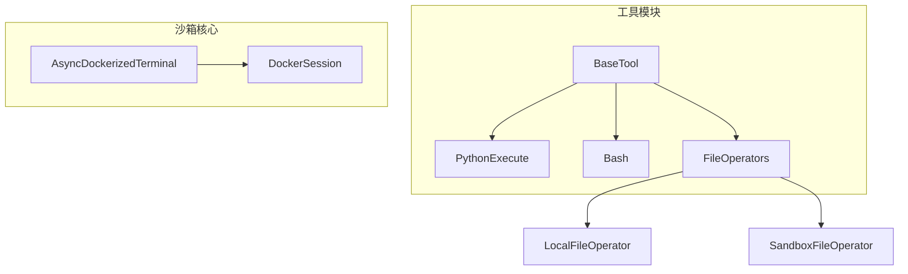
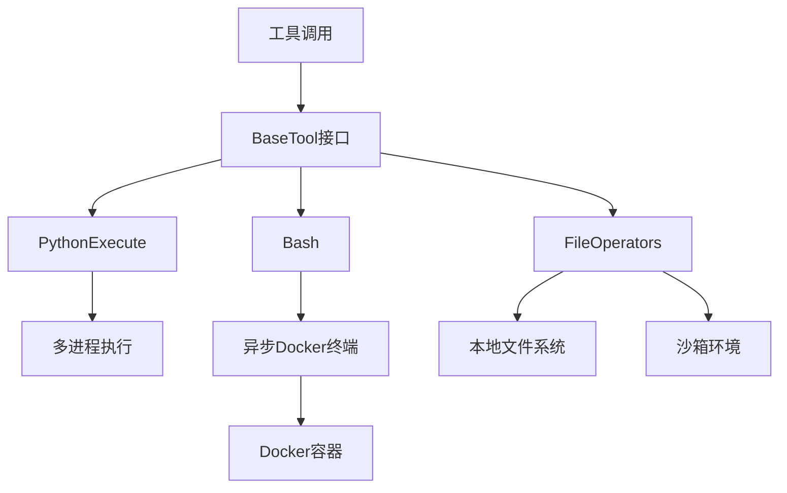
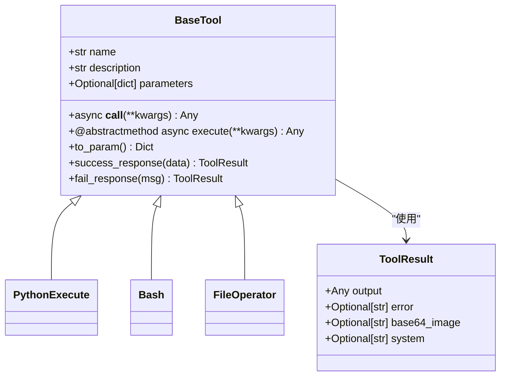
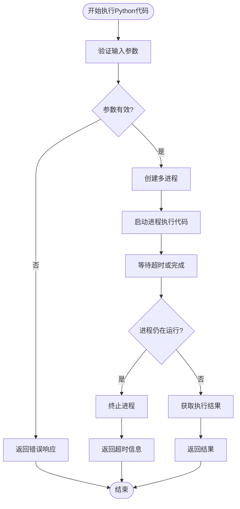
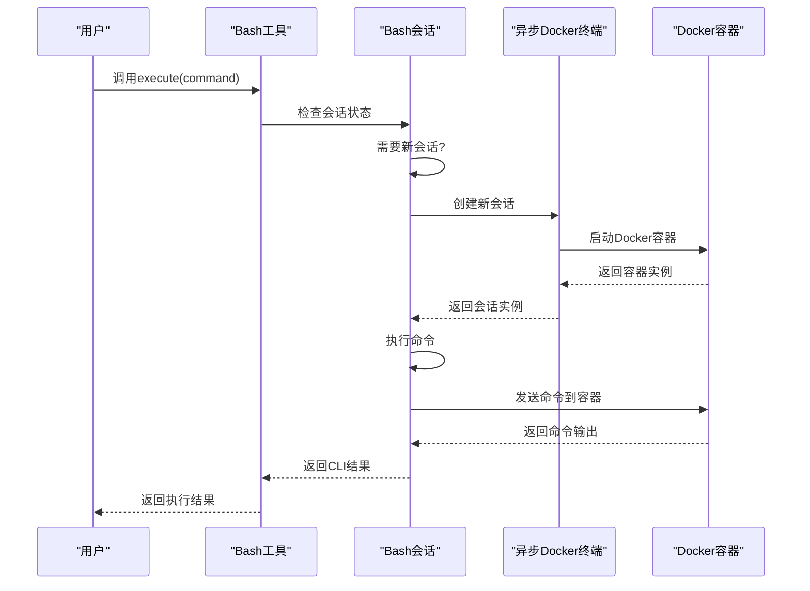
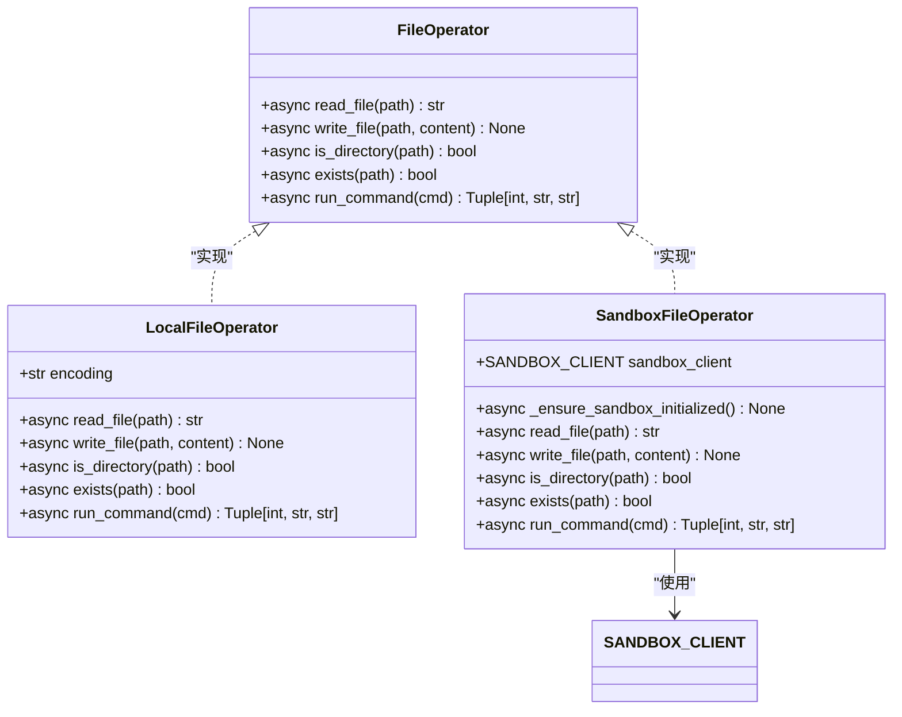
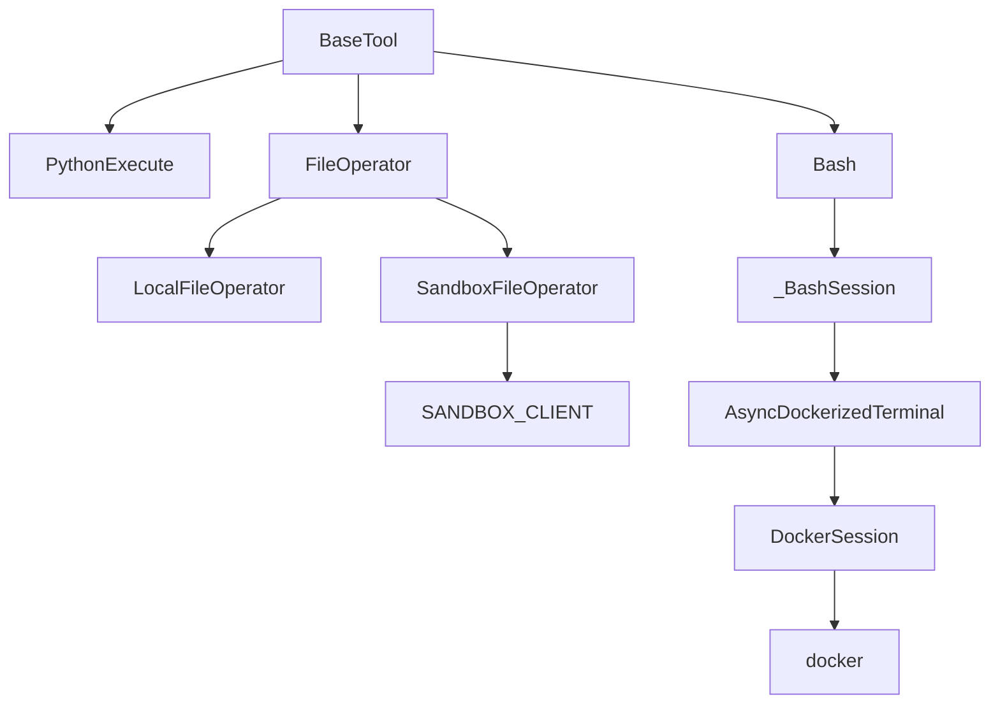

# 基础工具

<cite>
**本文档中引用的文件**  
- [base.py](file://app/tool/base.py)
- [python_execute.py](file://app/tool/python_execute.py)
- [bash.py](file://app/tool/bash.py)
- [file_operators.py](file://app/tool/file_operators.py)
- [terminal.py](file://app/sandbox/core/terminal.py)
- [files_utils.py](file://app/utils/files_utils.py)
</cite>

## 目录
1. [简介](#简介)
2. [项目结构](#项目结构)
3. [核心组件](#核心组件)
4. [架构概述](#架构概述)
5. [详细组件分析](#详细组件分析)
6. [依赖分析](#依赖分析)
7. [性能考虑](#性能考虑)
8. [故障排除指南](#故障排除指南)
9. [结论](#结论)

## 简介
本文档详细说明了OpenManus基础工具模块的实现机制，包括Python执行、Bash命令执行和文件操作工具的核心逻辑。文档解释了BaseTool抽象基类如何为这些基础工具提供统一接口和标准化结果处理，展示了工具参数验证、异步执行流程和错误传播机制。同时提供了自定义基础工具开发的完整示例，涵盖参数定义、执行逻辑和结果封装，并分析了安全控制策略，如命令注入防护和文件访问权限限制。

## 项目结构
OpenManus项目的工具模块主要位于`app/tool`目录下，其结构设计体现了模块化和可扩展性原则。核心工具类继承自`BaseTool`抽象基类，该基类定义了所有工具的统一接口和标准化结果处理机制。文件操作工具通过`FileOperator`协议实现了本地和沙箱环境的统一接口，而Bash命令执行工具则通过异步Docker终端实现了安全的命令执行环境。

**图源**  
- [base.py](file://app/tool/base.py)
- [python_execute.py](file://app/tool/python_execute.py)
- [bash.py](file://app/tool/bash.py)
- [file_operators.py](file://app/tool/file_operators.py)
- [terminal.py](file://app/sandbox/core/terminal.py)

**节源**  
- [app/tool](file://app/tool)
- [app/sandbox/core](file://app/sandbox/core)

## 核心组件
基础工具模块的核心组件包括`BaseTool`抽象基类、`PythonExecute`工具、`Bash`工具和`FileOperator`协议。这些组件共同构成了OpenManus的基础执行能力，为上层应用提供了安全、可靠和标准化的工具调用接口。

**节源**  
- [base.py](file://app/tool/base.py#L77-L172)
- [python_execute.py](file://app/tool/python_execute.py#L8-L74)
- [bash.py](file://app/tool/bash.py#L115-L151)
- [file_operators.py](file://app/tool/file_operators.py#L15-L38)

## 架构概述
OpenManus基础工具模块采用分层架构设计，从上到下分为工具接口层、执行逻辑层和底层实现层。工具接口层由`BaseTool`抽象基类定义，为所有工具提供统一的调用接口和结果处理机制。执行逻辑层实现了具体的工具功能，如Python代码执行、Bash命令执行等。底层实现层则通过Docker容器和异步I/O提供了安全的执行环境。

**图源**  
- [base.py](file://app/tool/base.py)
- [python_execute.py](file://app/tool/python_execute.py)
- [bash.py](file://app/tool/bash.py)
- [file_operators.py](file://app/tool/file_operators.py)
- [terminal.py](file://app/sandbox/core/terminal.py)

## 详细组件分析

### BaseTool抽象基类分析
`BaseTool`是所有工具的抽象基类，继承自Pydantic的`BaseModel`和Python的`ABC`（抽象基类）。它为所有工具提供了统一的接口和标准化的结果处理机制。

**图源**  
- [base.py](file://app/tool/base.py#L77-L172)

**节源**  
- [base.py](file://app/tool/base.py#L77-L172)

### Python执行工具分析
`PythonExecute`工具允许在安全的沙箱环境中执行Python代码，通过多进程机制实现了执行超时控制和异常隔离。

**图源**  
- [python_execute.py](file://app/tool/python_execute.py#L8-L74)

**节源**  
- [python_execute.py](file://app/tool/python_execute.py#L8-L74)

### Bash命令执行工具分析
`Bash`工具通过异步Docker终端在隔离的容器环境中执行Bash命令，提供了交互式命令执行能力。

**图源**  
- [bash.py](file://app/tool/bash.py#L115-L151)
- [terminal.py](file://app/sandbox/core/terminal.py)

**节源**  
- [bash.py](file://app/tool/bash.py#L115-L151)
- [terminal.py](file://app/sandbox/core/terminal.py)

### 文件操作工具分析
文件操作工具通过`FileOperator`协议为本地和沙箱环境提供了统一的文件操作接口，支持读取、写入、检查文件和目录等操作。

**图源**  
- [file_operators.py](file://app/tool/file_operators.py#L15-L157)

**节源**  
- [file_operators.py](file://app/tool/file_operators.py#L15-L157)

## 依赖分析
基础工具模块的依赖关系清晰地展示了各组件之间的交互和依赖。`BaseTool`作为所有工具的基类，被`PythonExecute`、`Bash`和`FileOperator`等具体工具类继承。文件操作工具通过`SANDBOX_CLIENT`与沙箱环境交互，而Bash工具则依赖于`AsyncDockerizedTerminal`来管理Docker容器中的命令执行。

**图源**  
- [base.py](file://app/tool/base.py)
- [python_execute.py](file://app/tool/python_execute.py)
- [bash.py](file://app/tool/bash.py)
- [file_operators.py](file://app/tool/file_operators.py)
- [terminal.py](file://app/sandbox/core/terminal.py)

**节源**  
- [base.py](file://app/tool/base.py)
- [python_execute.py](file://app/tool/python_execute.py)
- [bash.py](file://app/tool/bash.py)
- [file_operators.py](file://app/tool/file_operators.py)
- [terminal.py](file://app/sandbox/core/terminal.py)

## 性能考虑
基础工具模块在性能方面进行了多项优化。Python执行工具使用多进程机制避免了GIL限制，同时通过超时控制防止无限循环代码阻塞系统。Bash命令执行工具采用异步I/O和缓冲区直接读取技术，提高了命令输出的读取效率。文件操作工具通过协议实现，可以根据配置在本地和沙箱环境之间无缝切换，避免了不必要的网络开销。

## 故障排除指南
当基础工具出现故障时，可以按照以下步骤进行排查：

1. **检查工具初始化**：确保工具实例已正确初始化，特别是`Bash`工具的会话状态。
2. **验证参数输入**：确认传递给工具的参数符合预期格式和要求。
3. **查看错误信息**：分析`ToolResult`中的错误信息，定位问题根源。
4. **检查沙箱状态**：对于涉及沙箱环境的操作，确认沙箱已正确创建和初始化。
5. **审查安全限制**：检查是否存在安全策略（如命令注入防护）阻止了正常操作。

**节源**  
- [base.py](file://app/tool/base.py#L162-L172)
- [bash.py](file://app/tool/bash.py#L133-L151)
- [file_operators.py](file://app/tool/file_operators.py#L95-L157)

## 结论
OpenManus基础工具模块通过精心设计的架构和实现，为系统提供了安全、可靠和高效的执行能力。`BaseTool`抽象基类的统一接口设计使得新工具的开发和集成变得简单而一致。多层安全防护机制确保了在执行用户提供的代码和命令时系统的安全性。异步执行和多进程技术的应用则保证了系统的高性能和响应性。整体设计体现了模块化、可扩展和安全优先的原则，为构建复杂的自动化系统奠定了坚实的基础。