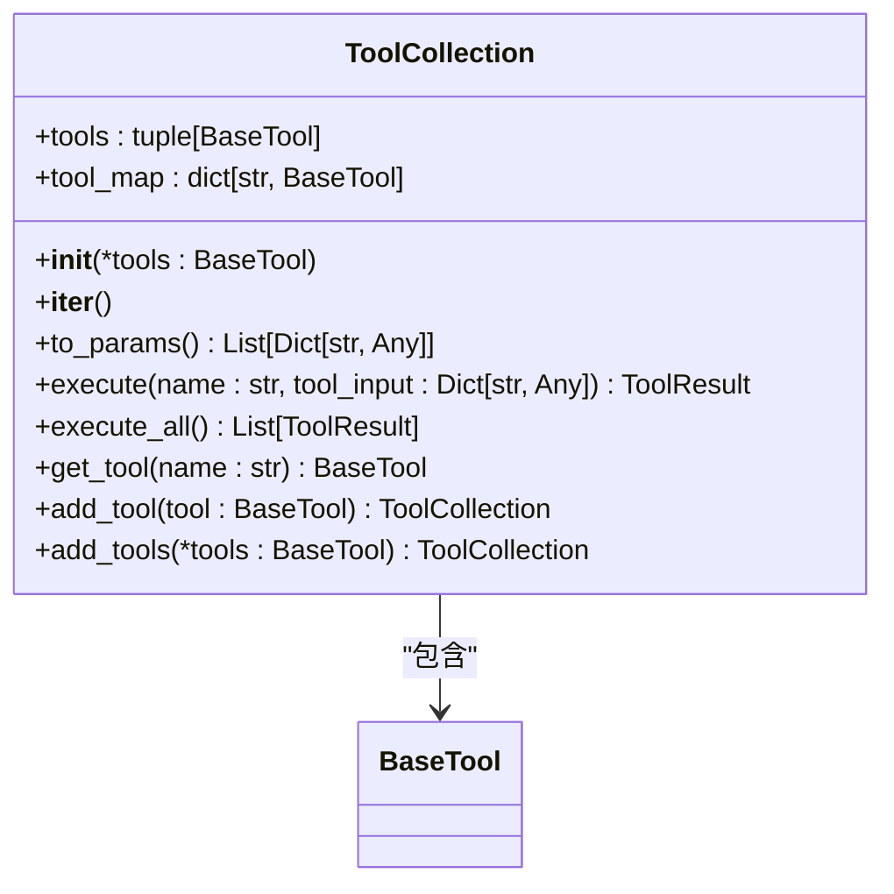
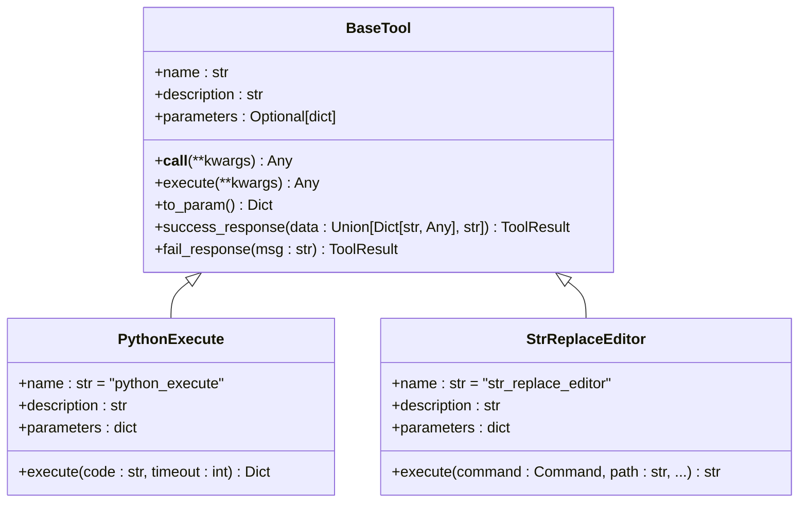
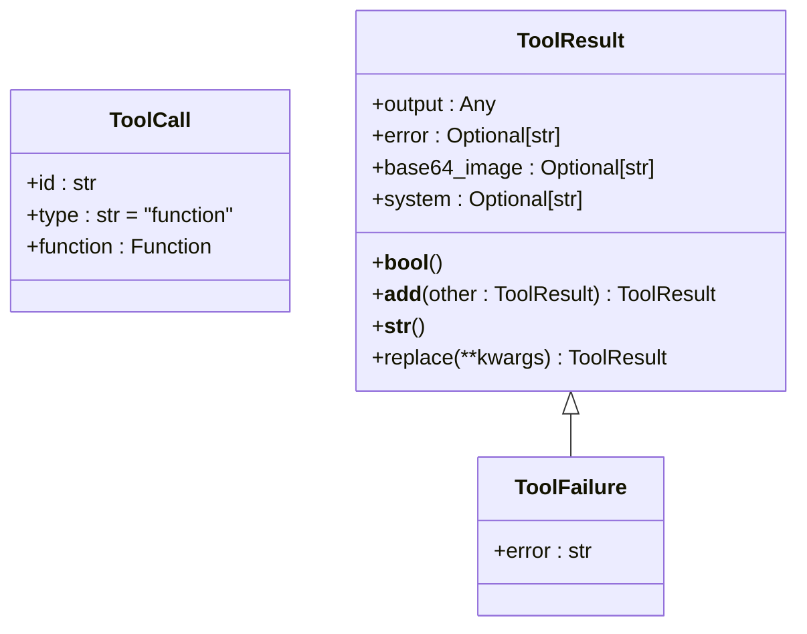
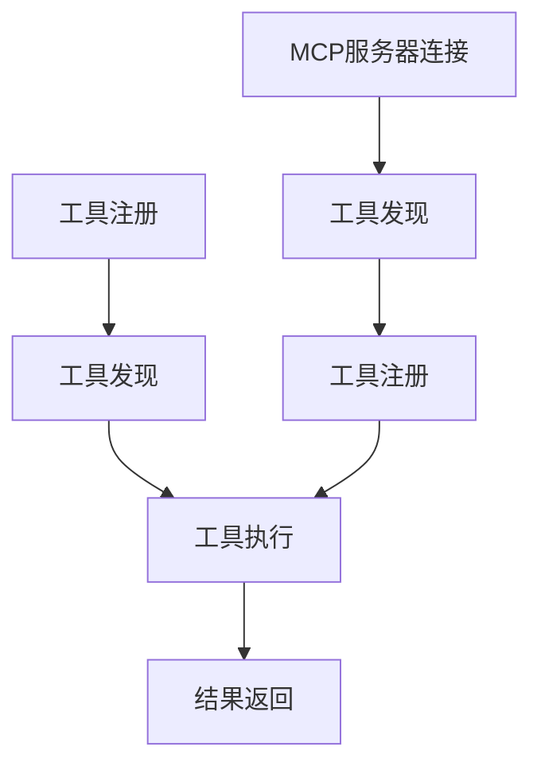
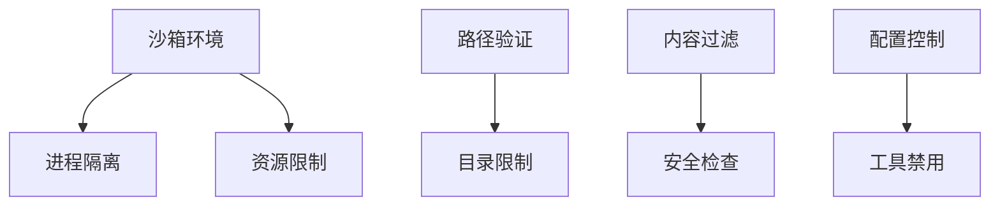
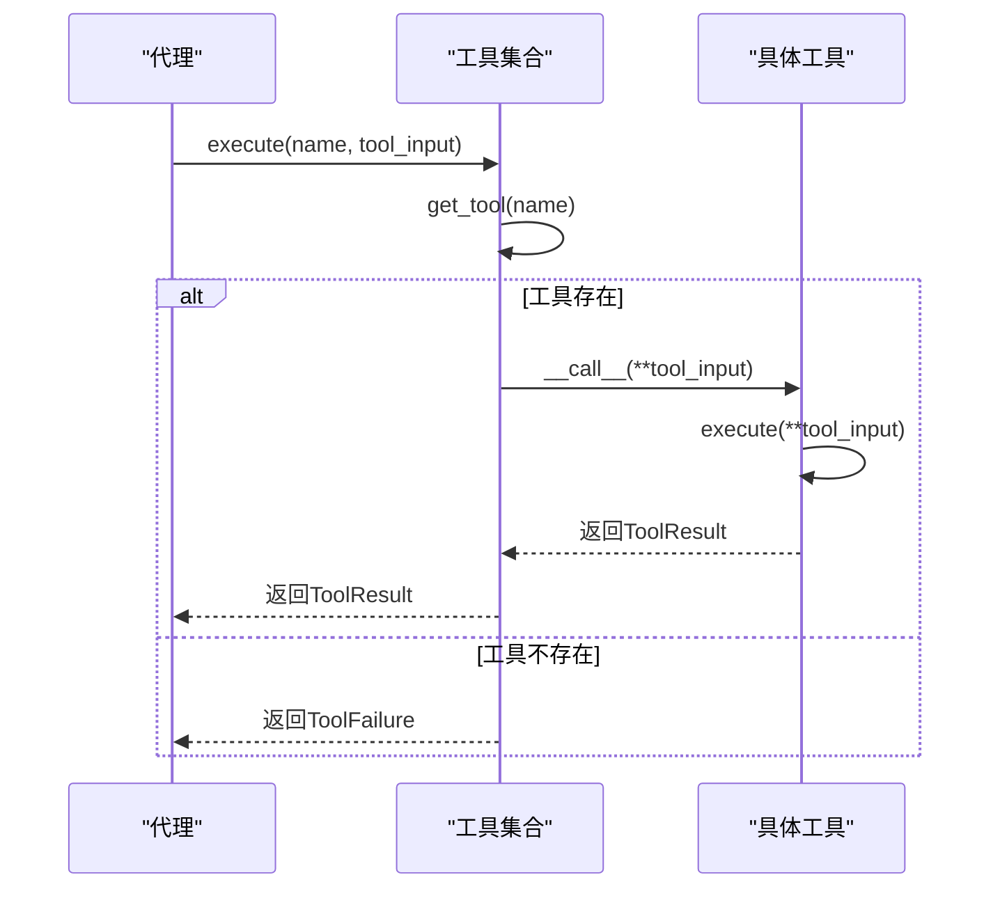
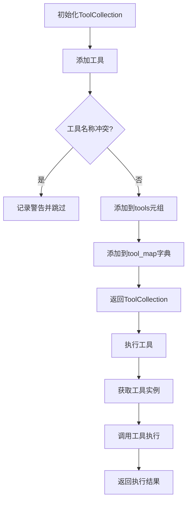

# 工具系统架构

<cite>
**本文档引用的文件**   
- [tool_collection.py](file://app/tool/tool_collection.py)
- [base.py](file://app/tool/base.py)
- [schema.py](file://app/schema.py)
- [manus.py](file://app/agent/manus.py)
- [toolcall.py](file://app/agent/toolcall.py)
- [mcp.py](file://app/tool/mcp.py)
- [python_execute.py](file://app/tool/python_execute.py)
- [str_replace_editor.py](file://app/tool/str_replace_editor.py)
- [sb_shell_tool.py](file://app/tool/sandbox/sb_shell_tool.py)
- [sb_files_tool.py](file://app/tool/sandbox/sb_files_tool.py)
- [sb_browser_tool.py](file://app/tool/sandbox/sb_browser_tool.py)
- [sb_vision_tool.py](file://app/tool/sandbox/sb_vision_tool.py)
</cite>

## 目录
1. [引言](#引言)
2. [工具集合管理](#工具集合管理)
3. [基础工具设计](#基础工具设计)
4. [工具调用与结果模型](#工具调用与结果模型)
5. [工具生命周期管理](#工具生命周期管理)
6. [权限控制与安全隔离](#权限控制与安全隔离)
7. [工具系统交互序列图](#工具系统交互序列图)
8. [工具集合管理流程图](#工具集合管理流程图)
9. [自定义工具开发指南](#自定义工具开发指南)
10. [结论](#结论)

## 引言
OpenManus工具系统是一个模块化、可扩展的架构，旨在统一管理各类工具实例。该系统通过`ToolCollection`类实现工具的集中管理，为开发者提供了一套完整的工具注册、发现和执行机制。系统设计遵循面向对象原则，通过`BaseTool`抽象基类定义了所有工具的共同接口和行为规范。工具调用（ToolCall）与工具结果（ToolResult）的数据模型设计确保了工具执行过程的标准化和可预测性。本架构文档将详细阐述工具系统的各个核心组件及其相互关系。

## 工具集合管理
`ToolCollection`类是OpenManus工具系统的核心组件，负责统一管理所有工具实例。该类通过字典映射（`tool_map`）和元组（`tools`）两种数据结构来存储和访问工具，确保了高效的查找和迭代操作。工具集合支持动态添加和移除工具，通过`add_tool`和`add_tools`方法实现工具的注册。当尝试添加同名工具时，系统会记录警告并跳过该操作，避免了工具冲突。工具集合还提供了`to_params`方法，将所有工具转换为OpenAI函数调用格式的参数列表，便于与大语言模型集成。

**图表来源**
- [tool_collection.py](file://app/tool/tool_collection.py#L8-L70)

**本节来源**
- [tool_collection.py](file://app/tool/tool_collection.py#L8-L70)

## 基础工具设计
`BaseTool`抽象基类是所有工具的共同父类，它结合了Pydantic模型验证和工具功能，为工具的标准化实现提供了基础。该类定义了工具的基本属性，包括名称（name）、描述（description）和参数模式（parameters）。通过继承`BaseModel`，`BaseTool`获得了强大的数据验证能力，确保了工具输入的正确性。`execute`方法被声明为抽象方法，强制所有子类必须实现具体的执行逻辑。`to_param`方法将工具元数据转换为OpenAI函数调用格式，便于与外部系统集成。`success_response`和`fail_response`方法提供了统一的成功和失败结果创建接口，简化了结果处理。

**图表来源**
- [base.py](file://app/tool/base.py#L77-L172)
- [python_execute.py](file://app/tool/python_execute.py#L8-L74)
- [str_replace_editor.py](file://app/tool/str_replace_editor.py#L59-L431)

**本节来源**
- [base.py](file://app/tool/base.py#L77-L172)

## 工具调用与结果模型
工具调用（ToolCall）与工具结果（ToolResult）的数据模型设计是OpenManus工具系统的关键组成部分。`ToolCall`类定义了工具调用的标准格式，包含调用ID、类型和函数信息。`ToolResult`类则表示工具执行的结果，包含输出、错误信息、base64编码的图像和系统消息等字段。`ToolResult`实现了`__bool__`和`__add__`等特殊方法，使其可以像布尔值一样进行判断，并支持结果的合并操作。`ToolFailure`类继承自`ToolResult`，专门用于表示工具执行失败的情况。这种设计使得工具结果的处理更加灵活和直观。

**图表来源**
- [schema.py](file://app/schema.py#L45-L50)
- [base.py](file://app/tool/base.py#L37-L74)

**本节来源**
- [schema.py](file://app/schema.py#L45-L50)
- [base.py](file://app/tool/base.py#L37-L74)

## 工具生命周期管理
工具的生命周期管理涵盖了从注册、发现到执行的完整过程。工具首先通过`ToolCollection`的构造函数或`add_tool`方法注册到工具集合中。工具集合通过`get_tool`方法提供工具发现功能，根据工具名称查找对应的工具实例。工具执行通过`execute`方法实现，该方法接收工具名称和输入参数，调用相应工具的`__call__`方法。`execute_all`方法则用于顺序执行集合中的所有工具。对于MCP（Model Context Protocol）工具，系统通过`MCPClients`类管理与远程服务器的连接，动态发现和注册可用工具。

**图表来源**
- [tool_collection.py](file://app/tool/tool_collection.py#L24-L34)
- [mcp.py](file://app/tool/mcp.py#L102-L144)

**本节来源**
- [tool_collection.py](file://app/tool/tool_collection.py#L24-L34)
- [mcp.py](file://app/tool/mcp.py#L102-L144)

## 权限控制与安全隔离
OpenManus工具系统通过多种机制实现权限控制和安全隔离。首先，工具执行在沙箱环境中进行，限制了工具对系统资源的访问。例如，`PythonExecute`工具使用`multiprocessing`模块在独立进程中执行代码，并设置了执行超时，防止无限循环或长时间运行的代码影响系统稳定性。`StrReplaceEditor`工具通过`validate_path`方法验证文件路径，确保操作仅限于指定目录。对于网络操作，`BrowserUseTool`和`WebSearch`工具实现了内容过滤和安全检查，防止恶意网站的访问。此外，系统还通过配置文件控制工具的可用性，管理员可以禁用潜在风险的工具。

**图表来源**
- [python_execute.py](file://app/tool/python_execute.py#L8-L74)
- [str_replace_editor.py](file://app/tool/str_replace_editor.py#L163-L193)
- [sb_shell_tool.py](file://app/tool/sandbox/sb_shell_tool.py#L137-L255)

**本节来源**
- [python_execute.py](file://app/tool/python_execute.py#L8-L74)
- [str_replace_editor.py](file://app/tool/str_replace_editor.py#L163-L193)
- [sb_shell_tool.py](file://app/tool/sandbox/sb_shell_tool.py#L137-L255)

## 工具系统交互序列图

**图表来源**
- [tool_collection.py](file://app/tool/tool_collection.py#L24-L34)
- [base.py](file://app/tool/base.py#L115-L117)

## 工具集合管理流程图

**图表来源**
- [tool_collection.py](file://app/tool/tool_collection.py#L8-L70)

## 自定义工具开发指南
开发自定义工具时，应继承`BaseTool`抽象基类并实现`execute`方法。工具的名称、描述和参数模式应在类定义中明确指定。参数模式应遵循JSON Schema规范，确保输入参数的有效性。工具执行过程中应使用`success_response`和`fail_response`方法创建结果，保持结果格式的一致性。对于需要持久化状态的工具，可以使用类属性或外部存储。工具应遵循单一职责原则，每个工具只负责一个特定的功能。在工具实现中，应充分考虑异常处理和边界情况，确保工具的健壮性。

**本节来源**
- [base.py](file://app/tool/base.py#L77-L172)
- [python_execute.py](file://app/tool/python_execute.py#L8-L74)

## 结论
OpenManus工具系统通过`ToolCollection`类实现了工具的统一管理，为开发者提供了一个灵活、可扩展的工具框架。`BaseTool`抽象基类的设计原则确保了所有工具的一致性和可预测性。工具调用（ToolCall）与工具结果（ToolResult）的数据模型设计为工具执行过程提供了标准化的接口。工具的注册、发现和执行生命周期管理机制使得工具的使用更加便捷。权限控制和安全隔离机制保障了系统的稳定性和安全性。通过遵循自定义工具开发指南，开发者可以轻松地扩展工具系统，满足各种应用场景的需求。