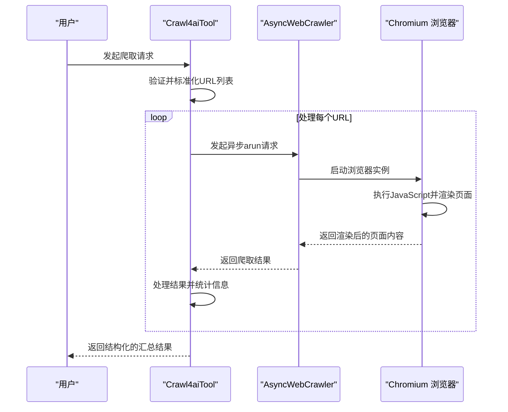
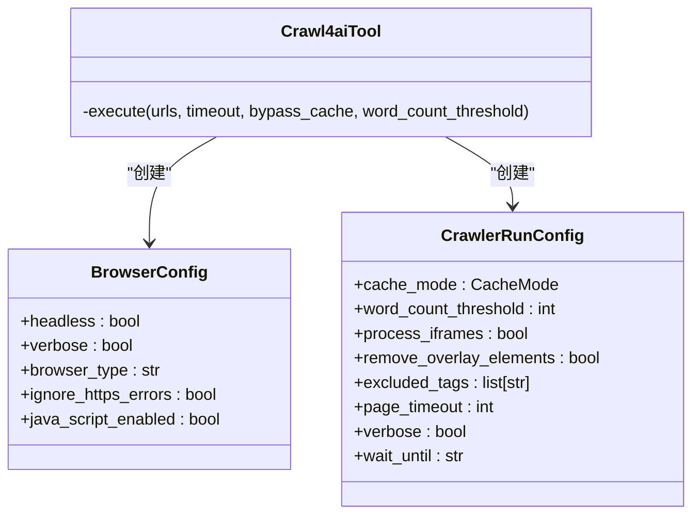
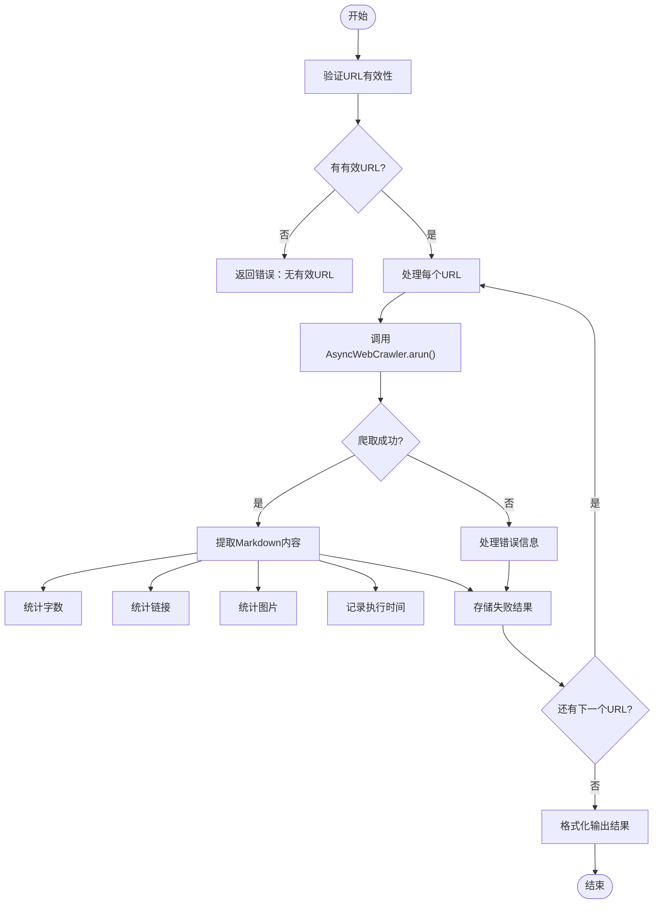

# 动态内容爬取

<cite>
**本文档引用文件**   
- [crawl4ai.py](file://app/tool/crawl4ai.py)
- [base.py](file://app/tool/base.py)
</cite>

## 目录
1. [简介](#简介)
2. [核心工作机制](#核心工作机制)
3. [配置选项详解](#配置选项详解)
4. [内容过滤与去噪技术](#内容过滤与去噪技术)
5. [批量处理与结果输出](#批量处理与结果输出)
6. [缓存策略与数据新鲜度](#缓存策略与数据新鲜度)
7. [异常处理与日志记录](#异常处理与日志记录)

## 简介
Crawl4aiTool 是一个基于 Crawl4AI 库构建的网页爬取工具，专为 AI 处理优化。该工具能够高效抓取 JavaScript 渲染的动态页面内容，并将其转换为干净的 Markdown 格式，便于后续的 AI 分析和处理。它支持单个或多个 URL 的批量抓取，具备强大的错误处理机制和灵活的配置选项。

**Section sources**
- [crawl4ai.py](file://app/tool/crawl4ai.py#L1-L31)

## 核心工作机制
Crawl4aiTool 的核心是利用 Crawl4AI 提供的 `AsyncWebCrawler` 异步爬虫实现高效抓取。通过异步编程模型，工具能够在等待网络响应的同时处理其他任务，显著提升抓取效率。爬虫在 Chromium 浏览器环境中运行，确保能够正确执行页面上的 JavaScript 代码，从而获取完整的动态内容。

爬取流程始于对输入 URL 的验证和标准化处理。有效的 URL 会被逐一提交给配置好的 `AsyncWebCrawler` 实例。每个请求都包含详细的配置参数，控制浏览器行为和内容处理方式。爬取完成后，结果会被结构化处理并汇总输出。

**Diagram sources**
- [crawl4ai.py](file://app/tool/crawl4ai.py#L64-L257)

**Section sources**
- [crawl4ai.py](file://app/tool/crawl4ai.py#L64-L257)

## 配置选项详解
Crawl4aiTool 提供了多种配置选项，通过 `BrowserConfig` 和 `CrawlerRunConfig` 两个核心配置类进行设置。

`BrowserConfig` 负责定义浏览器的运行环境：
- **headless模式**：设置为 `True`，表示在无头模式下运行浏览器，不显示图形界面，适合服务器环境。
- **JavaScript执行**：`java_script_enabled` 设置为 `True`，确保能够执行页面上的 JavaScript 代码。
- **HTTPS错误忽略**：`ignore_https_errors` 设置为 `True`，允许爬虫访问存在证书问题的 HTTPS 网站。
- **浏览器类型**：指定使用 `chromium` 作为底层浏览器引擎。

`CrawlerRunConfig` 则控制爬取过程中的具体行为：
- **超时控制**：通过 `page_timeout` 参数设置页面加载的最长时间（以毫秒为单位），防止因网络问题导致的无限等待。
- **缓存策略**：`cache_mode` 根据 `bypass_cache` 参数决定是启用缓存还是绕过缓存获取新鲜内容。
- **等待条件**：`wait_until` 设置为 `domcontentloaded`，表示在 DOM 内容加载完成后即认为页面已准备好，无需等待所有资源（如图片）完全加载，从而加快抓取速度。

**Diagram sources**
- [crawl4ai.py](file://app/tool/crawl4ai.py#L102-L150)

**Section sources**
- [crawl4ai.py](file://app/tool/crawl4ai.py#L102-L150)

## 内容过滤与去噪技术
为了提升 AI 处理的效率和质量，Crawl4aiTool 采用了两种关键技术：内容过滤和去噪。

**_word_count_threshold_ 内容过滤机制**：该机制通过设置 `word_count_threshold` 参数（默认值为10）来过滤掉字数过少的内容块。这有助于去除页面上的导航栏、页脚、广告等无关紧要的短文本，确保最终提取的 Markdown 内容主要由文章主体构成，从而提高 AI 分析的准确性和相关性。

**_remove_overlay_elements_ 去噪技术**：现代网页中常包含弹窗、悬浮广告、Cookie 提示等覆盖层元素，这些元素会干扰内容的提取。`remove_overlay_elements=True` 的配置会自动识别并移除这些覆盖层，确保爬取到的是页面的核心内容，而不是被遮挡的文本。

**Section sources**
- [crawl4ai.py](file://app/tool/crawl4ai.py#L118-L150)

## 批量处理与结果输出
Crawl4aiTool 支持同时处理多个 URL，极大地提高了工作效率。工具会遍历所有有效的 URL，依次发起爬取请求，并将每个请求的结果进行汇总。

执行结果以结构化的格式输出，包含以下关键信息：
- **Markdown内容提取**：将网页主体内容转换为干净的 Markdown 格式，保留标题、段落、列表等基本结构。
- **链接统计**：统计每个页面的内部链接和外部链接总数。
- **执行时间监控**：记录每个 URL 的爬取耗时，用于性能分析。
- **其他元数据**：包括页面标题、状态码、图片数量和字数统计。

最终的输出是一个格式化的文本摘要，清晰地展示了总 URL 数、成功/失败数量，并为每个 URL 提供详细的结果报告。

**Diagram sources**
- [crawl4ai.py](file://app/tool/crawl4ai.py#L150-L244)

**Section sources**
- [crawl4ai.py](file://app/tool/crawl4ai.py#L150-L244)

## 缓存策略与数据新鲜度
`bypass_cache` 参数是平衡数据新鲜度与性能的关键。当 `bypass_cache=False`（默认）时，爬虫会优先使用本地缓存的页面内容，如果缓存存在且未过期，则直接返回缓存结果，避免重复的网络请求，从而显著提升性能，特别适合对内容变化不敏感的场景。

当 `bypass_cache=True` 时，爬虫会强制绕过缓存，每次都从网络上重新抓取最新的页面内容。这保证了数据的绝对新鲜，适用于需要获取最新信息的场景，但会牺牲一定的性能，增加网络延迟和服务器负载。

**Section sources**
- [crawl4ai.py](file://app/tool/crawl4ai.py#L118-L150)

## 异常处理与日志记录
Crawl4aiTool 具备完善的异常处理和日志记录机制。在执行过程中，工具会捕获各种可能的异常，如无效的 URL、网络连接超时、导入 Crawl4AI 库失败等。

对于无效的 URL，工具会通过 `logger.warning` 记录警告信息并跳过该 URL。对于严重的错误，如库未安装，会通过 `logger.error` 记录错误日志，并向用户返回清晰的错误提示（如建议安装命令）。所有成功的爬取操作也会通过 `logger.info` 进行记录，便于追踪执行过程。

这种分层的日志记录方式（info、warning、error）使得问题排查变得简单高效，同时确保了工具的健壮性。

**Section sources**
- [crawl4ai.py](file://app/tool/crawl4ai.py#L64-L257)
- [base.py](file://app/tool/base.py#L37-L74)