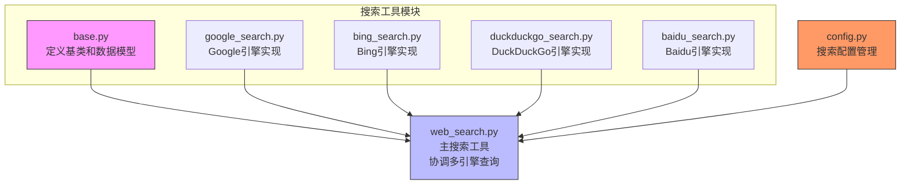
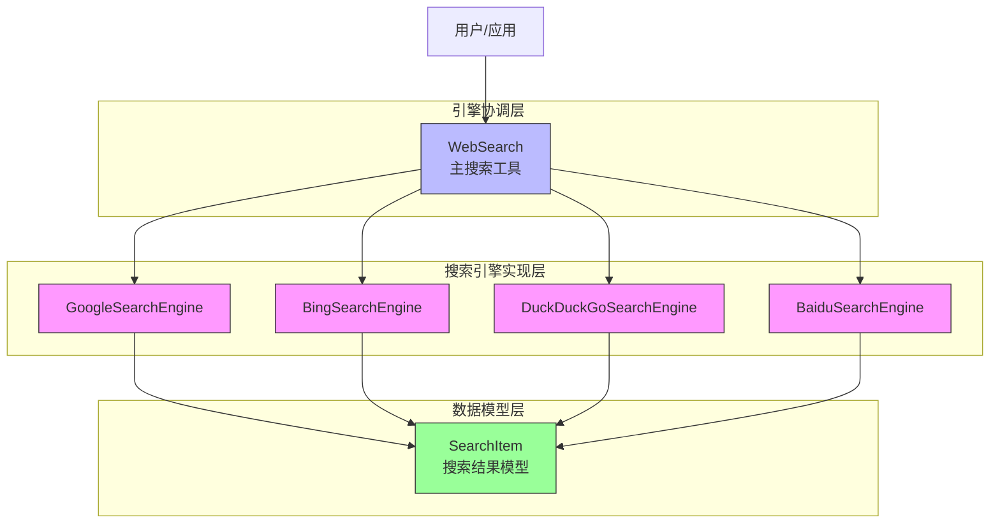
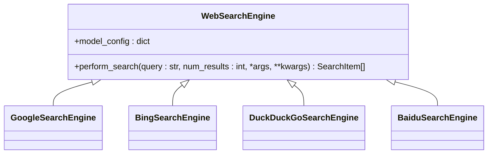
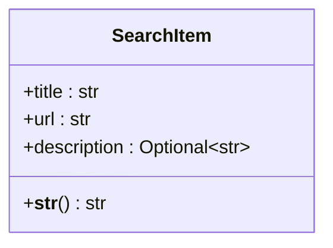
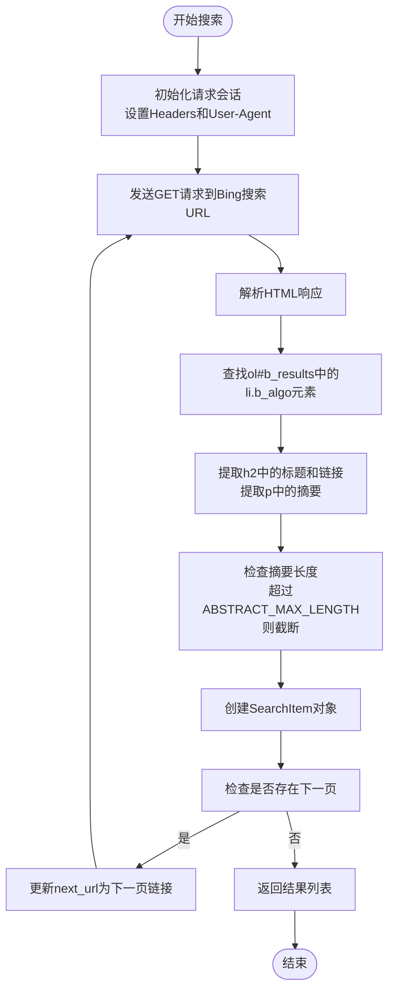
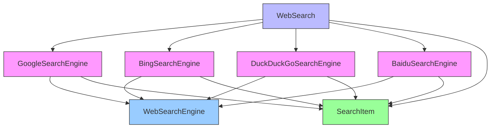

# 多引擎搜索集成

<cite>
**本文档中引用的文件**  
- [base.py](file://app/tool/search/base.py)
- [google_search.py](file://app/tool/search/google_search.py)
- [bing_search.py](file://app/tool/search/bing_search.py)
- [duckduckgo_search.py](file://app/tool/search/duckduckgo_search.py)
- [baidu_search.py](file://app/tool/search/baidu_search.py)
- [web_search.py](file://app/tool/web_search.py)
- [config.py](file://app/config.py)
</cite>

## 目录
1. [简介](#简介)
2. [项目结构](#项目结构)
3. [核心组件](#核心组件)
4. [架构概述](#架构概述)
5. [详细组件分析](#详细组件分析)
6. [依赖分析](#依赖分析)
7. [性能考虑](#性能考虑)
8. [故障排除指南](#故障排除指南)
9. [结论](#结论)

## 简介
本文档全面解析了OpenManus项目中的多引擎搜索系统，重点介绍`WebSearchEngine`基类的设计与实现，以及Google、Bing、DuckDuckGo和Baidu四种搜索引擎的具体适配方式。文档详细说明了搜索结果数据模型`SearchItem`的设计原则，阐述了同步方法`_search_sync`在异步框架中的桥接作用，并分析了各引擎的请求频率控制与错误重试策略。同时提供了自定义搜索参数的配置方法，展示了如何通过`WebSearch`工具组合不同引擎进行混合查询，包含异常处理机制说明和搜索结果去重、排序的最佳实践。

## 项目结构
多引擎搜索功能主要分布在`app/tool/search/`目录下，包含一个基类文件和四个具体搜索引擎实现文件，通过`web_search.py`进行统一调度和管理。系统采用模块化设计，各搜索引擎独立实现，便于维护和扩展。

**图示来源**  
- [base.py](file://app/tool/search/base.py)
- [google_search.py](file://app/tool/search/google_search.py)
- [bing_search.py](file://app/tool/search/bing_search.py)
- [duckduckgo_search.py](file://app/tool/search/duckduckgo_search.py)
- [baidu_search.py](file://app/tool/search/baidu_search.py)
- [web_search.py](file://app/tool/web_search.py)

**本节来源**  
- [app/tool/search/](file://app/tool/search/)
- [app/tool/web_search.py](file://app/tool/web_search.py)

## 核心组件
系统的核心组件包括`SearchItem`数据模型、`WebSearchEngine`基类、四个具体搜索引擎实现类以及`WebSearch`主工具类。`SearchItem`定义了搜索结果的标准结构，`WebSearchEngine`作为所有搜索引擎的抽象基类，规定了统一的接口。`WebSearch`类则负责协调多个搜索引擎，实现故障转移和结果聚合。

**本节来源**  
- [base.py](file://app/tool/search/base.py#L5-L39)
- [web_search.py](file://app/tool/web_search.py#L158-L198)

## 架构概述
系统采用分层架构设计，上层为`WebSearch`工具，负责接收查询请求、管理配置、协调引擎调用和处理结果；中层为具体的搜索引擎实现，各自封装了与特定搜索服务的交互逻辑；底层为`SearchItem`数据模型，确保了结果格式的统一性。系统通过配置文件灵活控制搜索引擎的优先级和行为参数。

**图示来源**  
- [web_search.py](file://app/tool/web_search.py#L192-L197)
- [base.py](file://app/tool/search/base.py#L5-L16)

## 详细组件分析

### WebSearchEngine基类分析
`WebSearchEngine`是所有搜索引擎的抽象基类，继承自Pydantic的`BaseModel`，定义了`perform_search`抽象方法作为统一接口。该基类允许任意类型，为具体的搜索引擎实现提供了灵活性。

**图示来源**  
- [base.py](file://app/tool/search/base.py#L19-L39)

**本节来源**  
- [base.py](file://app/tool/search/base.py#L19-L39)

### SearchItem数据模型分析
`SearchItem`是搜索结果的核心数据模型，采用Pydantic定义，确保了数据的类型安全和有效性。模型包含三个主要字段：`title`（标题）、`url`（链接）和可选的`description`（描述），并提供了字符串表示方法。

**图示来源**  
- [base.py](file://app/tool/search/base.py#L5-L16)

**本节来源**  
- [base.py](file://app/tool/search/base.py#L5-L16)

### 具体搜索引擎实现分析

#### GoogleSearch实现分析
Google搜索引擎通过`googlesearch`第三方库实现，调用其`search`函数获取结果。实现中区分了返回结果是字符串（仅URL）还是包含详细信息的对象，并相应地构造`SearchItem`对象。

**本节来源**  
- [google_search.py](file://app/tool/search/google_search.py#L7-L32)

#### BingSearch实现分析
Bing搜索引擎采用直接HTTP请求和HTML解析的方式实现。通过`requests`库发送请求，使用`BeautifulSoup`解析返回的HTML，提取搜索结果的标题、链接和摘要。实现了分页逻辑，通过解析“下一页”链接来获取更多结果。

**图示来源**  
- [bing_search.py](file://app/tool/search/bing_search.py#L46-L74)
- [bing_search.py](file://app/tool/search/bing_search.py#L76-L133)

**本节来源**  
- [bing_search.py](file://app/tool/search/bing_search.py#L37-L143)

#### DuckDuckGoSearch实现分析
DuckDuckGo搜索引擎使用`duckduckgo_search`库的`DDGS().text()`方法获取结果。实现中处理了三种可能的结果类型：字符串（URL）、字典和对象，并通过`getattr`和`get`方法安全地提取字段。

**本节来源**  
- [duckduckgo_search.py](file://app/tool/search/duckduckgo_search.py#L7-L56)

#### BaiduSearch实现分析
Baidu搜索引擎使用`baidusearch`库进行查询。其结果处理逻辑与DuckDuckGo类似，同样处理字符串、字典和对象三种类型的结果，并特别处理了Baidu特有的`abstract`字段作为描述。

**本节来源**  
- [baidu_search.py](file://app/tool/search/baidu_search.py#L7-L53)

### _search_sync同步方法分析
`_search_sync`方法是Bing搜索引擎中的核心同步实现，它在异步框架中扮演着关键的桥接角色。该方法通过循环请求和解析HTML来获取指定数量的结果，并处理分页逻辑。`WebSearch`主工具通过`asyncio.get_event_loop().run_in_executor()`在独立线程中执行此同步方法，避免阻塞事件循环。

**本节来源**  
- [bing_search.py](file://app/tool/search/bing_search.py#L46-L74)
- [web_search.py](file://app/tool/web_search.py#L389-L407)

## 依赖分析
系统依赖关系清晰，`WebSearch`工具直接依赖于所有具体的搜索引擎实现和`SearchItem`模型。各搜索引擎实现依赖于`WebSearchEngine`基类和`SearchItem`模型。外部依赖包括`requests`、`BeautifulSoup`、`googlesearch`、`duckduckgo_search`和`baidusearch`等库。

**图示来源**  
- [web_search.py](file://app/tool/web_search.py#L192-L197)
- [base.py](file://app/tool/search/base.py)

**本节来源**  
- [web_search.py](file://app/tool/web_search.py)
- [base.py](file://app/tool/search/base.py)

## 性能考虑
系统在性能方面进行了多项优化。首先，通过在独立线程中执行同步的搜索引擎调用，避免了阻塞主异步事件循环。其次，`WebSearch`工具实现了智能的引擎选择和故障转移策略，通过配置文件定义主引擎和备用引擎列表，提高了查询成功率。此外，系统支持获取结果页面的原始内容，但此操作是可选的，以避免不必要的网络开销。

## 故障排除指南
系统内置了完善的错误处理和重试机制。当所有搜索引擎首次调用均失败时，系统会根据配置的`retry_delay`等待一段时间后重试，最多重试`max_retries`次。在解析HTML或网络请求失败时，会记录警告日志并继续处理其他结果。用户可以通过配置文件调整`retry_delay`、`max_retries`等参数来优化错误处理行为。

**本节来源**  
- [web_search.py](file://app/tool/web_search.py#L200-L287)
- [config.py](file://app/config.py#L40-L57)

## 结论
OpenManus的多引擎搜索系统设计精良，通过清晰的分层架构和抽象基类，实现了对多种搜索引擎的统一管理和灵活调用。系统不仅提供了基本的搜索功能，还通过故障转移、重试机制和内容获取等特性，增强了其健壮性和实用性。通过配置文件，用户可以轻松定制搜索引擎的优先级、语言、国家等参数，满足多样化的搜索需求。