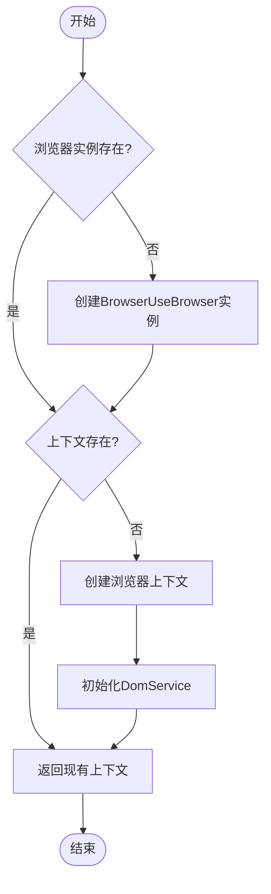
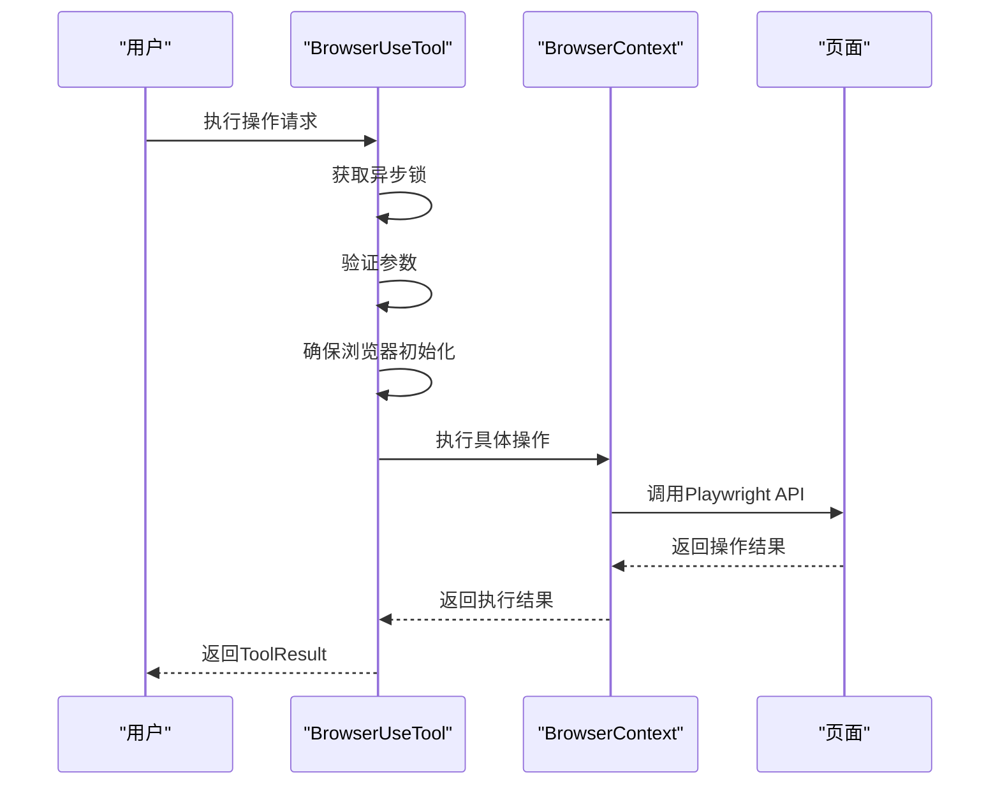
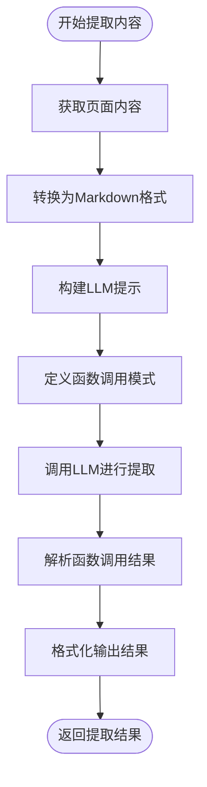
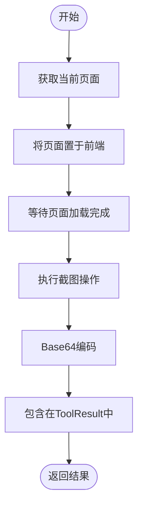

# 浏览器自动化

<cite>
**本文档引用的文件**
- [browser_use_tool.py](file://app/tool/browser_use_tool.py)
- [base.py](file://app/tool/base.py)
- [llm.py](file://app/llm.py)
- [web_search.py](file://app/tool/web_search.py)
- [browser.py](file://app/agent/browser.py)
- [manus.py](file://app/agent/manus.py)
</cite>

## 目录
1. [简介](#简介)
2. [核心组件](#核心组件)
3. [浏览器会话管理](#浏览器会话管理)
4. [DOM元素索引系统](#dom元素索引系统)
5. [核心操作执行流程](#核心操作执行流程)
6. [内容提取与LLM交互](#内容提取与llm交互)
7. [浏览器锁机制](#浏览器锁机制)
8. [截图生成与base64编码](#截图生成与base64编码)
9. [浏览器配置项](#浏览器配置项)
10. [性能优化建议](#性能优化建议)

## 简介
BrowserUseTool 是一个基于 Playwright 的浏览器自动化工具，提供了一套完整的浏览器控制功能。该工具允许通过编程方式执行各种浏览器操作，包括导航、元素交互、内容提取等。它通过 BrowserContext 管理浏览器会话状态，确保在多个操作之间保持一致的浏览环境。工具集成了 LLM（大语言模型）进行智能内容提取，能够根据指定目标从网页中提取相关信息。此外，该工具还实现了浏览器锁机制，以确保在多任务环境下的资源协调和线程安全。

**Section sources**
- [browser_use_tool.py](file://app/tool/browser_use_tool.py#L38-L566)

## 核心组件
BrowserUseTool 类是浏览器自动化功能的核心实现，继承自 BaseTool 并实现了通用功能。该工具通过 asyncio.Lock 实现线程安全，确保在并发环境下的正确执行。它集成了 BrowserUseBrowser 用于浏览器实例管理，BrowserContext 用于会话管理，以及 DomService 用于 DOM 操作。工具还包含 WebSearch 组件用于执行网络搜索，并通过 LLM 组件实现智能内容提取功能。

**Section sources**
- [browser_use_tool.py](file://app/tool/browser_use_tool.py#L38-L566)
- [base.py](file://app/tool/base.py#L77-L172)

## 浏览器会话管理
BrowserUseTool 通过 BrowserContext 管理浏览器会话状态，确保在多个操作之间保持一致的浏览环境。会话管理的核心是 _ensure_browser_initialized 方法，该方法负责初始化浏览器和上下文。当浏览器实例（browser）为空时，根据配置创建新的 BrowserUseBrowser 实例；当上下文（context）为空时，创建新的浏览器上下文并初始化 DomService。这种延迟初始化策略确保了资源的高效利用，只有在需要时才创建浏览器实例。

**Diagram sources**
- [browser_use_tool.py](file://app/tool/browser_use_tool.py#L140-L187)

## DOM元素索引系统
DOM元素索引系统通过 BrowserContext 提供的 get_dom_element_by_index 方法实现，为页面中的可交互元素分配唯一的索引号。这些索引在 get_current_state 方法中生成，并作为用户与页面元素交互的桥梁。系统通过分析页面的 DOM 结构，识别可点击元素并为其分配连续的整数索引。这种索引机制简化了用户与复杂网页的交互，用户只需引用元素的索引即可执行点击、输入等操作，而无需处理复杂的 CSS 选择器或 XPath。

**Section sources**
- [browser_use_tool.py](file://app/tool/browser_use_tool.py#L478-L538)

## 核心操作执行流程
BrowserUseTool 支持多种核心操作，包括 go_to_url、click_element、input_text 等。这些操作的执行流程由 execute 方法统一管理，通过异步锁确保线程安全。每个操作首先验证必要的参数，然后调用相应的浏览器 API 执行具体功能。例如，go_to_url 操作会验证 URL 参数，获取当前页面实例，执行页面跳转并等待加载完成。click_element 操作会根据索引获取 DOM 元素，执行点击操作，并处理可能的文件下载。input_text 操作会验证索引和文本参数，获取对应元素并输入文本内容。

**Diagram sources**
- [browser_use_tool.py](file://app/tool/browser_use_tool.py#L189-L476)

## 内容提取与LLM交互
extract_content 操作通过集成 LLM 实现智能内容提取。当执行此操作时，工具首先获取当前页面内容并转换为 Markdown 格式。然后构建一个包含提取目标和页面内容的提示（prompt），并定义一个函数调用模式来规范提取结果的结构。通过 LLM 的 ask_tool 方法，工具将提示发送给大语言模型，并要求其按照指定格式返回提取结果。这种方法不仅能够提取特定信息，还能对内容进行总结和分析，实现了从简单数据抓取到智能信息提取的转变。

**Diagram sources**
- [browser_use_tool.py](file://app/tool/browser_use_tool.py#L380-L410)

## 浏览器锁机制
BrowserUseTool 使用 asyncio.Lock 实现浏览器锁机制，确保在多任务环境下的资源协调和线程安全。锁实例作为类字段（lock: asyncio.Lock = Field(default_factory=asyncio.Lock)）被声明，所有关键操作都在异步锁的上下文中执行。execute 方法使用 async with self.lock: 语句确保同一时间只有一个协程可以执行浏览器操作。这种机制防止了多个任务同时修改浏览器状态导致的竞争条件，保证了操作的原子性和一致性。锁机制在 _ensure_browser_initialized、execute、get_current_state 和 cleanup 等方法中都有应用，形成了完整的资源保护体系。

**Section sources**
- [browser_use_tool.py](file://app/tool/browser_use_tool.py#L123-L123)

## 截图生成与base64编码
get_current_state 方法实现了截图生成与 base64 编码的集成方案。该方法首先获取当前浏览器状态，然后通过 Playwright 的 screenshot API 捕获页面截图。截图以 JPEG 格式生成，质量设置为 100%，并启用全页截图和禁用动画效果。捕获的二进制图像数据通过 base64.b64encode 进行编码，转换为文本格式以便在网络上传输和在 JSON 中嵌入。编码后的字符串作为 base64_image 字段包含在 ToolResult 中返回，同时截图信息也被整合到状态信息中，为上层应用提供完整的浏览器状态视图。

**Diagram sources**
- [browser_use_tool.py](file://app/tool/browser_use_tool.py#L498-L518)

## 浏览器配置项
BrowserUseTool 支持多种浏览器配置选项，通过 config.browser_config 从配置文件中读取设置。主要配置项包括：headless（无头模式）、proxy（代理设置）、chrome_instance_path（Chrome 实例路径）、wss_url（WebSocket URL）、cdp_url（Chrome DevTools Protocol URL）等。这些配置在 _ensure_browser_initialized 方法中被处理，根据配置值动态构建 browser_config_kwargs 字典。例如，当配置了代理时，会创建 ProxySettings 实例并将其添加到配置中。这种灵活的配置机制使得工具能够适应不同的运行环境和需求。

**Section sources**
- [browser_use_tool.py](file://app/tool/browser_use_tool.py#L145-L174)

## 性能优化建议
为了优化 BrowserUseTool 的性能，建议采取以下措施：首先，合理使用浏览器实例的生命周期，避免频繁创建和销毁浏览器实例；其次，在不需要可视化界面时启用 headless 模式以提高执行速度；再次，合理配置网络超时和等待时间，避免不必要的等待；最后，对于需要频繁访问的页面，考虑使用缓存机制减少重复加载。此外，应合理规划操作序列，尽量减少页面跳转次数，并在多任务环境中充分利用异步特性提高并发效率。

**Section sources**
- [browser_use_tool.py](file://app/tool/browser_use_tool.py#L540-L566)