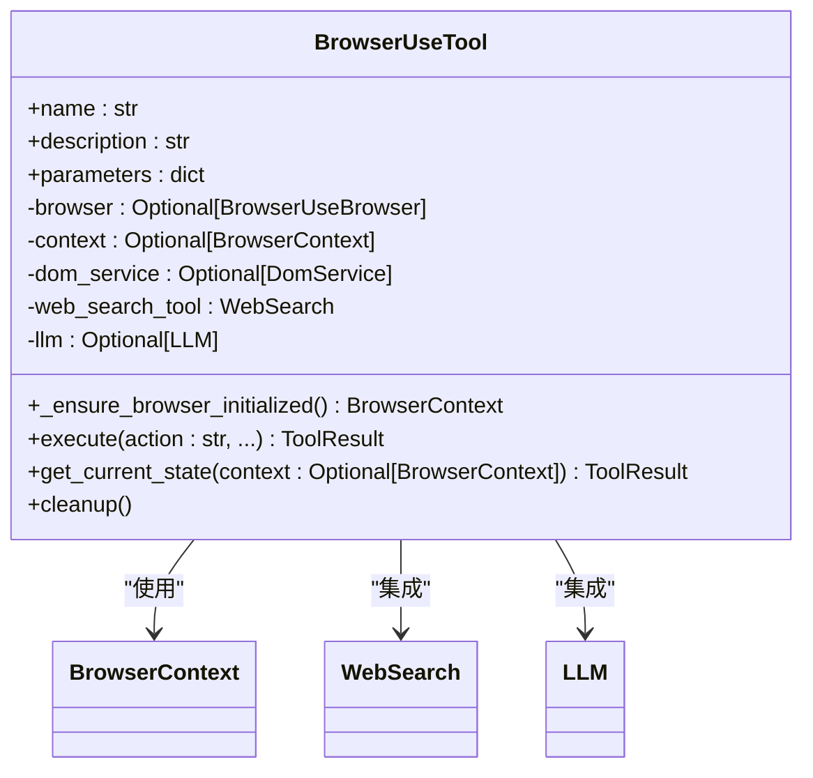
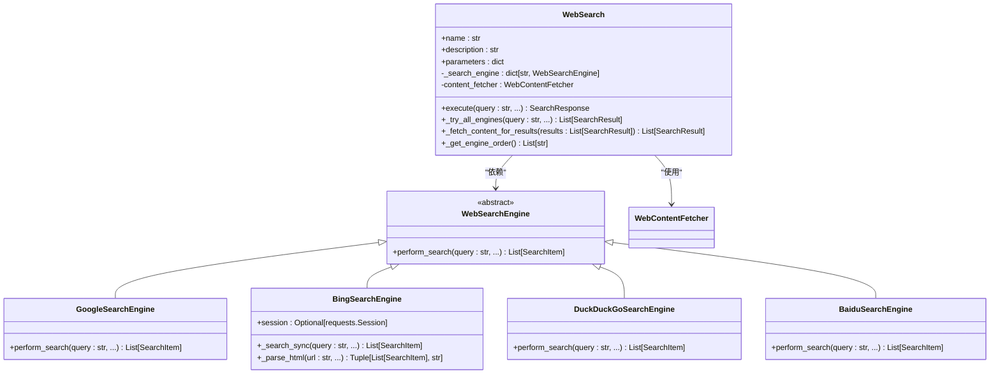
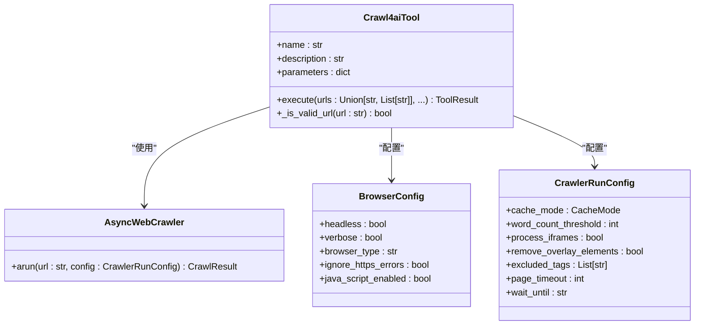
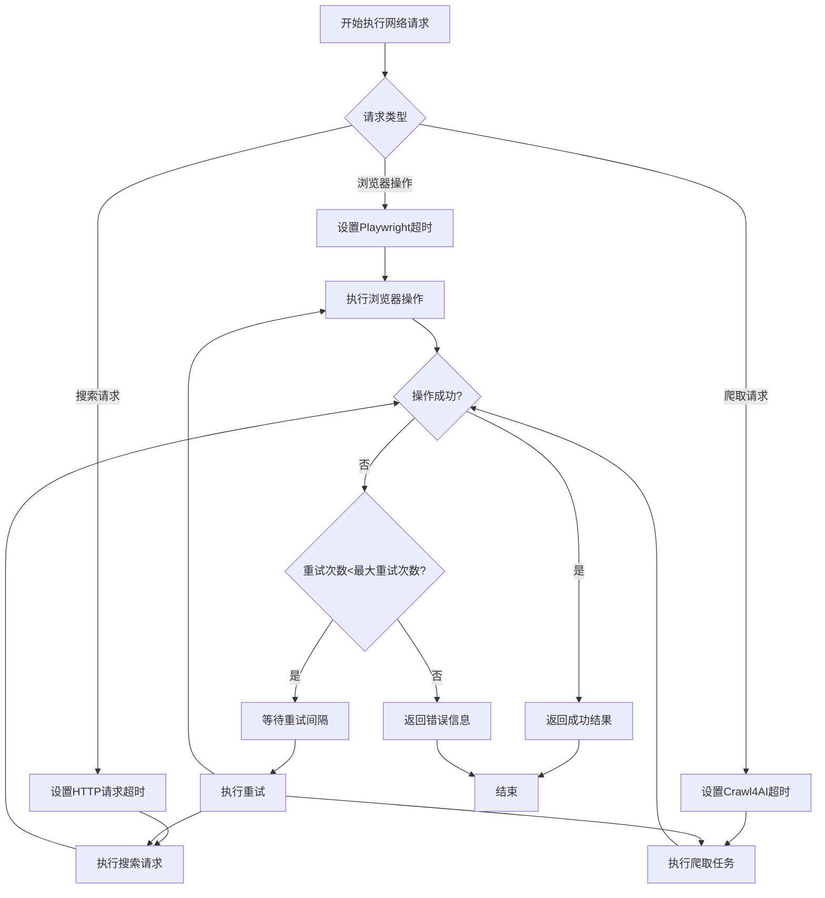
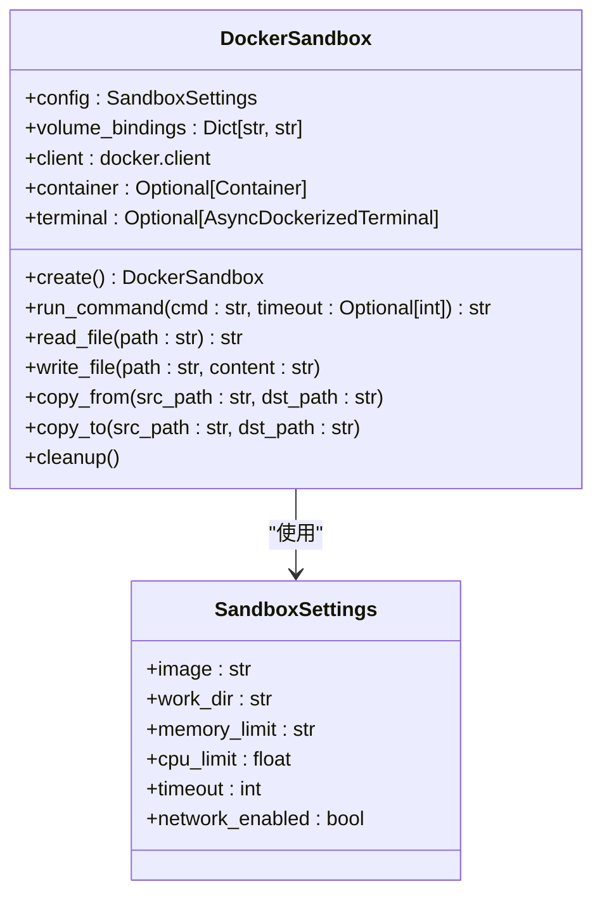

# 网络工具

<cite>
**本文档引用的文件**  
- [browser_use_tool.py](file://app/tool/browser_use_tool.py)
- [crawl4ai.py](file://app/tool/crawl4ai.py)
- [web_search.py](file://app/tool/web_search.py)
- [google_search.py](file://app/tool/search/google_search.py)
- [bing_search.py](file://app/tool/search/bing_search.py)
- [duckduckgo_search.py](file://app/tool/search/duckduckgo_search.py)
- [base.py](file://app/tool/search/base.py)
- [sandbox.py](file://app/sandbox/core/sandbox.py)
</cite>

## 目录
1. [引言](#引言)
2. [浏览器自动化实现](#浏览器自动化实现)
3. [多引擎搜索集成](#多引擎搜索集成)
4. [网络爬取功能](#网络爬取功能)
5. [网络请求控制机制](#网络请求控制机制)
6. [权限配置与隐私保护](#权限配置与隐私保护)
7. [总结](#总结)

## 引言
OpenManus网络工具集成了浏览器自动化、多引擎搜索和网络爬取三大核心功能，为AI代理提供全面的网络交互能力。该系统通过Playwright实现安全的网页交互，支持Google、Bing、DuckDuckGo等主流搜索引擎的适配，并利用Crawl4AI工具实现动态内容抓取。本文档深入解析这些功能的设计与实现，重点关注安全机制、性能优化和反爬虫规避技术。

## 浏览器自动化实现
browser_use_tool模块通过Playwright框架实现安全的网页交互功能，提供了一系列浏览器操作指令，包括导航、元素交互、滚动和内容提取等。

**图源**  
- [browser_use_tool.py](file://app/tool/browser_use_tool.py#L38-L566)

**本节源**  
- [browser_use_tool.py](file://app/tool/browser_use_tool.py#L38-L566)

## 多引擎搜索集成
搜索工具通过适配器模式实现了对Google、Bing、DuckDuckGo等服务的统一接口访问，支持自动故障转移和内容提取功能。

**图源**  
- [web_search.py](file://app/tool/web_search.py#L155-L407)
- [google_search.py](file://app/tool/search/google_search.py#L1-L33)
- [bing_search.py](file://app/tool/search/bing_search.py#L1-L144)
- [duckduckgo_search.py](file://app/tool/search/duckduckgo_search.py#L1-L57)
- [base.py](file://app/tool/search/base.py#L1-L40)

**本节源**  
- [web_search.py](file://app/tool/web_search.py#L155-L407)
- [google_search.py](file://app/tool/search/google_search.py#L1-L33)
- [bing_search.py](file://app/tool/search/bing_search.py#L1-L144)
- [duckduckgo_search.py](file://app/tool/search/duckduckgo_search.py#L1-L57)
- [base.py](file://app/tool/search/base.py#L1-L40)

## 网络爬取功能
crawl4ai工具提供了强大的动态内容抓取能力，能够处理JavaScript渲染的网页，并与沙箱环境协作实现安全的内容提取。

**图源**  
- [crawl4ai.py](file://app/tool/crawl4ai.py#L15-L268)

**本节源**  
- [crawl4ai.py](file://app/tool/crawl4ai.py#L15-L268)

## 网络请求控制机制
系统实现了完善的网络请求控制机制，包括超时控制、重试策略和反爬虫规避技术，确保网络操作的稳定性和可靠性。

**图源**  
- [browser_use_tool.py](file://app/tool/browser_use_tool.py#L189-L476)
- [web_search.py](file://app/tool/web_search.py#L200-L287)
- [crawl4ai.py](file://app/tool/crawl4ai.py#L64-L257)

**本节源**  
- [browser_use_tool.py](file://app/tool/browser_use_tool.py#L189-L476)
- [web_search.py](file://app/tool/web_search.py#L200-L287)
- [crawl4ai.py](file://app/tool/crawl4ai.py#L64-L257)

## 权限配置与隐私保护
系统通过沙箱环境和严格的权限控制机制，确保网络操作的安全性，同时提供了HTTPS拦截处理和敏感数据过滤方案。

**图源**  
- [sandbox.py](file://app/sandbox/core/sandbox.py#L1-L462)

**本节源**  
- [sandbox.py](file://app/sandbox/core/sandbox.py#L1-L462)

## 总结
OpenManus网络工具通过browser_use_tool、crawl4ai和web_search等模块的协同工作，构建了一个功能强大且安全可靠的网络交互系统。该系统不仅支持多种浏览器操作和搜索引擎适配，还通过沙箱环境确保了操作的安全性。完善的超时控制、重试策略和反爬虫规避技术保证了网络操作的稳定性，为AI代理提供了可靠的网络访问能力。