# 技术架构

<cite>
**本文档引用的文件**   
- [base.py](file://app/agent/base.py)
- [toolcall.py](file://app/agent/toolcall.py)
- [manus.py](file://app/agent/manus.py)
- [sandbox_agent.py](file://app/agent/sandbox_agent.py)
- [base.py](file://app/flow/base.py)
- [planning.py](file://app/flow/planning.py)
- [flow_factory.py](file://app/flow/flow_factory.py)
- [sandbox.py](file://app/sandbox/core/sandbox.py)
- [manager.py](file://app/sandbox/core/manager.py)
- [llm.py](file://app/llm.py)
- [tool_collection.py](file://app/tool/tool_collection.py)
- [base.py](file://app/tool/base.py)
</cite>

## 目录
1. [模块化设计与组件关系](#模块化设计与组件关系)
2. [继承与扩展关系](#继承与扩展关系)
3. [沙箱执行环境](#沙箱执行环境)
4. [数据流路径](#数据流路径)
5. [系统上下文图](#系统上下文图)
6. [组件交互图](#组件交互图)
7. [设计模式](#设计模式)
8. [总结](#总结)

## 模块化设计与组件关系

OpenManus采用高度模块化的设计，将系统划分为多个独立的组件，每个组件负责特定的功能。这种设计使得系统易于维护和扩展。

**核心组件包括**:
- **Agent模块**: 负责处理用户请求和执行任务
- **Flow模块**: 管理任务的规划和执行流程
- **Sandbox模块**: 提供安全的执行环境
- **Tool模块**: 提供各种工具功能
- **LLM模块**: 负责与语言模型的交互

**组件间关系**:
- Agent模块通过Flow模块协调任务的执行
- Agent模块使用Tool模块提供的工具来完成具体任务
- Sandbox模块为Agent模块提供安全的执行环境
- LLM模块为Agent模块提供语言理解和生成能力

**Section sources**
- [base.py](file://app/agent/base.py#L12-L195)
- [base.py](file://app/flow/base.py#L8-L56)
- [sandbox.py](file://app/sandbox/core/sandbox.py#L1-L462)

## 继承与扩展关系

OpenManus的Agent模块采用继承和扩展的设计模式，通过基类和子类的关系来实现功能的复用和扩展。

### BaseAgent

`BaseAgent`是所有Agent的基类，定义了Agent的基本属性和方法。它提供了状态管理、记忆管理和执行控制等基础功能。

**主要特性**:
- **状态管理**: 通过`state_context`上下文管理器安全地进行状态转换
- **记忆管理**: 通过`update_memory`方法管理对话历史
- **执行控制**: 通过`run`方法控制执行流程，包括最大步数限制和循环检测

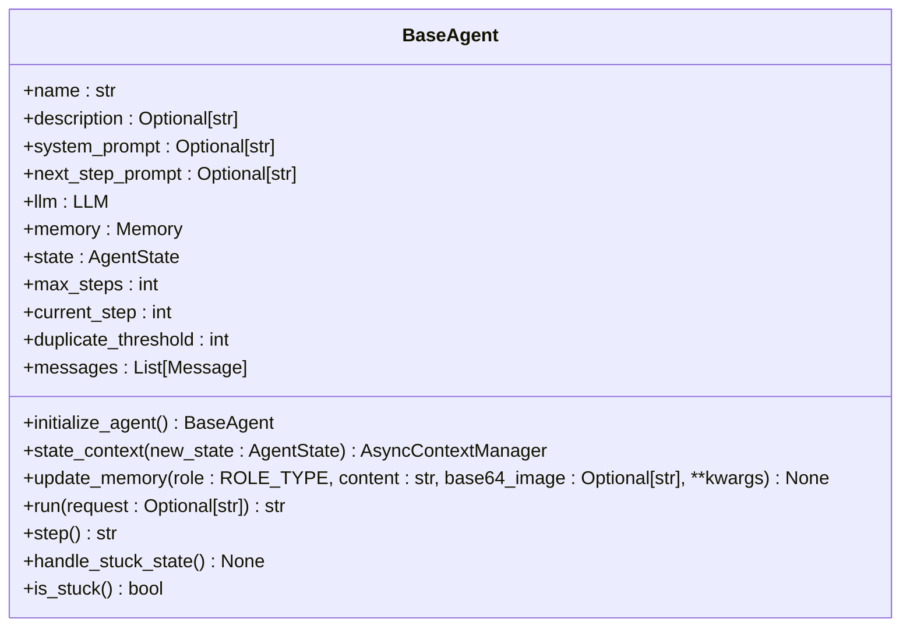

**Diagram sources**
- [base.py](file://app/agent/base.py#L12-L195)

### ToolCallAgent

`ToolCallAgent`继承自`ReActAgent`，是处理工具调用的基础类。它扩展了`BaseAgent`的功能，增加了工具调用的能力。

**主要特性**:
- **工具调用**: 通过`think`方法决定使用哪些工具
- **工具执行**: 通过`act`方法执行工具调用
- **结果处理**: 通过`execute_tool`方法处理工具执行结果

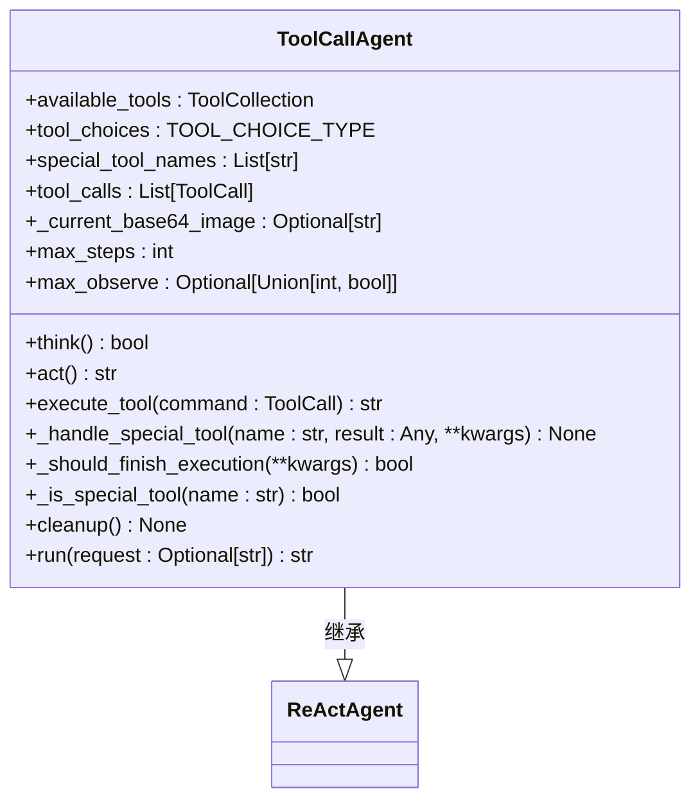

**Diagram sources**
- [toolcall.py](file://app/agent/toolcall.py#L17-L249)

### Manus

`Manus`是`ToolCallAgent`的具体实现，是一个多功能的通用Agent。它支持本地工具和MCP工具，能够解决各种任务。

**主要特性**:
- **MCP客户端**: 通过`mcp_clients`属性连接MCP服务器
- **可用工具**: 通过`available_tools`属性管理可用的工具集合
- **浏览器上下文助手**: 通过`browser_context_helper`属性管理浏览器上下文

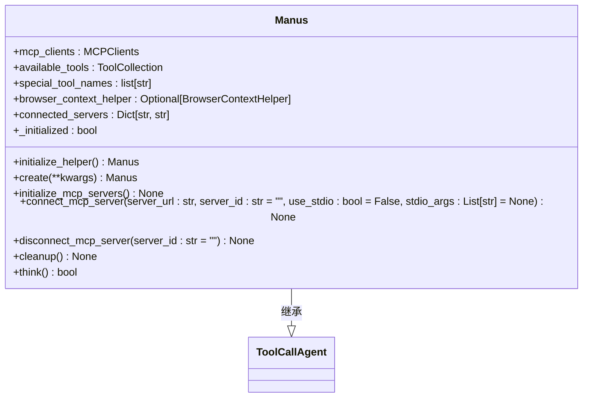

**Diagram sources**
- [manus.py](file://app/agent/manus.py#L17-L164)

### SandboxManus

`SandboxManus`是`ToolCallAgent`的另一个具体实现，专注于在沙箱环境中执行任务。它提供了额外的安全性和隔离性。

**主要特性**:
- **沙箱链接**: 通过`sandbox_link`属性管理沙箱链接
- **沙箱初始化**: 通过`initialize_sandbox_tools`方法初始化沙箱工具
- **沙箱删除**: 通过`delete_sandbox`方法删除沙箱

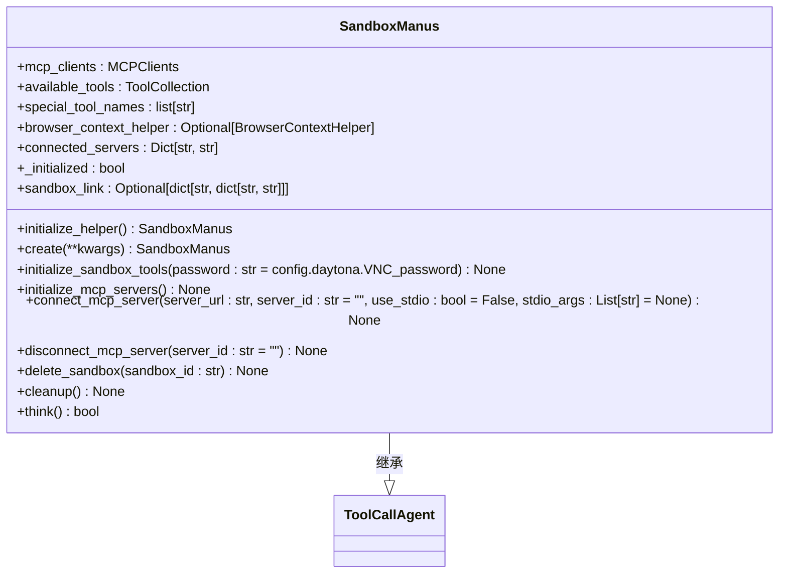

**Diagram sources**
- [sandbox_agent.py](file://app/agent/sandbox_agent.py#L20-L222)

## 沙箱执行环境

OpenManus的沙箱执行环境提供了安全性和隔离性，确保任务在受控的环境中执行。

### DockerSandbox

`DockerSandbox`是沙箱环境的核心类，使用Docker容器提供隔离的执行环境。

**主要特性**:
- **容器管理**: 通过`create`方法创建和启动容器
- **命令执行**: 通过`run_command`方法在容器中执行命令
- **文件操作**: 通过`read_file`和`write_file`方法读写容器中的文件
- **资源清理**: 通过`cleanup`方法清理沙箱资源

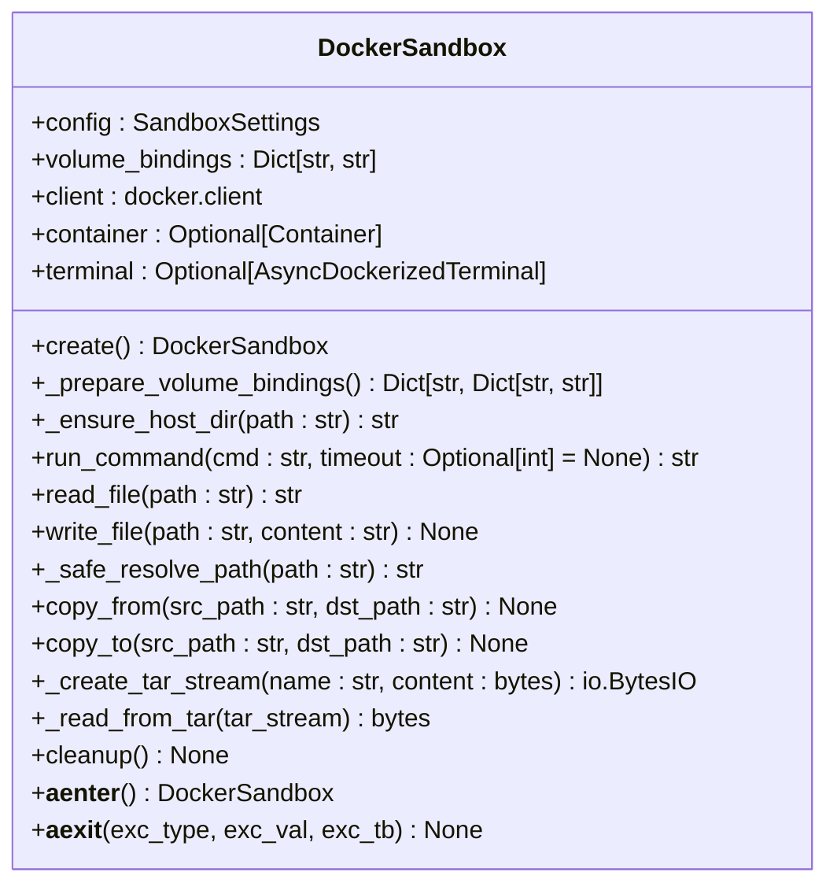

**Diagram sources**
- [sandbox.py](file://app/sandbox/core/sandbox.py#L1-L462)

### SandboxManager

`SandboxManager`是沙箱管理器，负责管理多个`DockerSandbox`实例的生命周期。

**主要特性**:
- **沙箱创建**: 通过`create_sandbox`方法创建新的沙箱实例
- **沙箱获取**: 通过`get_sandbox`方法获取沙箱实例
- **沙箱删除**: 通过`delete_sandbox`方法删除沙箱
- **资源清理**: 通过`cleanup`方法清理所有资源

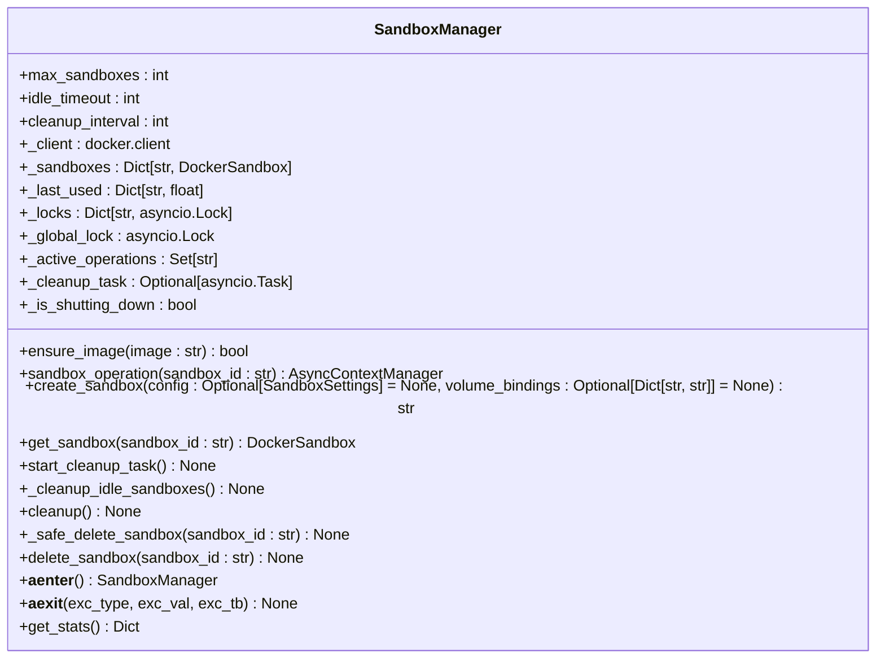

**Diagram sources**
- [manager.py](file://app/sandbox/core/manager.py#L1-L313)

## 数据流路径

OpenManus的数据流从用户请求到最终响应的完整路径如下：

### 参数解析

当用户发送请求时，系统首先解析请求参数。这包括提取用户输入的文本、图像等信息，并将其转换为内部数据结构。

### 代理实例化

根据请求类型，系统实例化相应的代理。例如，对于需要在沙箱中执行的任务，系统会实例化`SandboxManus`代理。

### 记忆管理

代理使用`Memory`类来管理对话历史。每次交互后，系统都会将新的消息添加到记忆中，以便后续步骤可以访问之前的上下文。

### LLM调用

代理通过`LLM`类与语言模型进行交互。`LLM`类提供了`ask`、`ask_with_images`和`ask_tool`等方法，用于发送请求并获取响应。

### 工具选择

在`think`方法中，代理根据当前状态和可用工具决定下一步行动。系统会调用`llm.ask_tool`方法，让语言模型选择合适的工具。

### 执行引擎

一旦选择了工具，代理就会在`act`方法中执行工具调用。`execute_tool`方法负责实际的工具执行，并处理执行结果。

### 沙箱环境

对于需要在沙箱中执行的任务，系统会使用`SandboxManager`创建一个新的`DockerSandbox`实例。任务在沙箱中执行，确保了安全性和隔离性。

### 结果返回

执行完成后，系统将结果返回给用户。这包括工具执行的输出、生成的文本或其他相关信息。

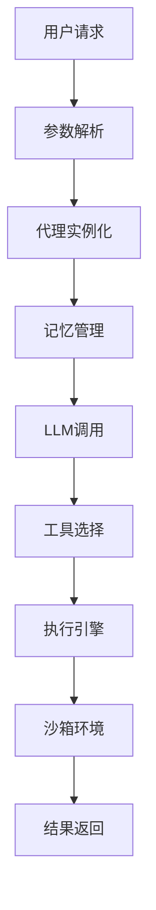

**Diagram sources**
- [base.py](file://app/agent/base.py#L12-L195)
- [toolcall.py](file://app/agent/toolcall.py#L17-L249)
- [manus.py](file://app/agent/manus.py#L17-L164)
- [sandbox_agent.py](file://app/agent/sandbox_agent.py#L20-L222)
- [sandbox.py](file://app/sandbox/core/sandbox.py#L1-L462)
- [manager.py](file://app/sandbox/core/manager.py#L1-L313)
- [llm.py](file://app/llm.py#L1-L766)

## 系统上下文图

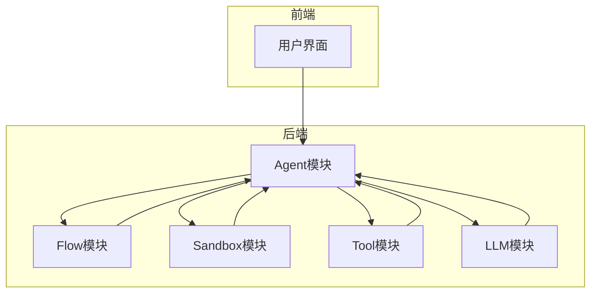

**Diagram sources**
- [base.py](file://app/agent/base.py#L12-L195)
- [base.py](file://app/flow/base.py#L8-L56)
- [sandbox.py](file://app/sandbox/core/sandbox.py#L1-L462)
- [tool_collection.py](file://app/tool/tool_collection.py#L1-L71)
- [llm.py](file://app/llm.py#L1-L766)

## 组件交互图

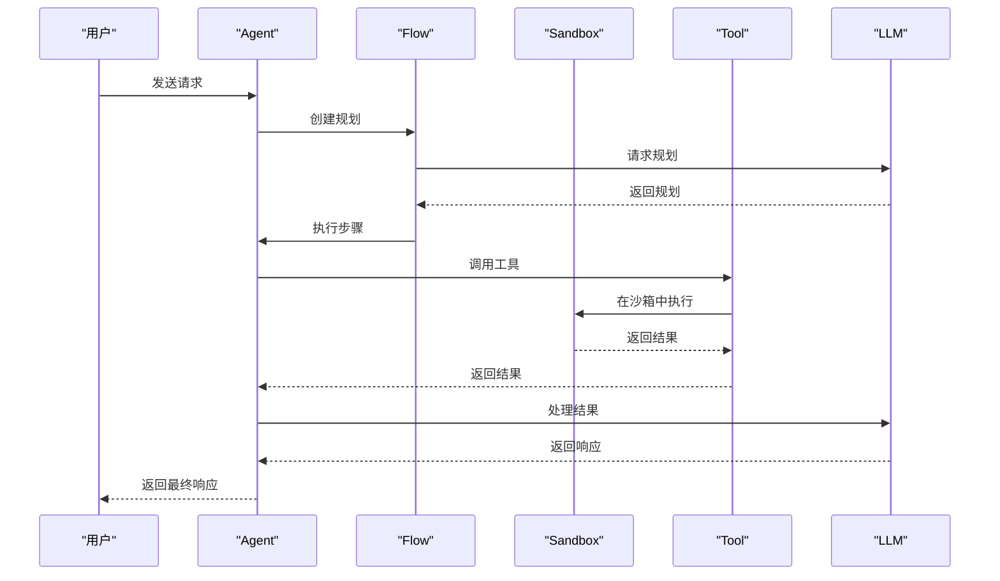

**Diagram sources**
- [base.py](file://app/agent/base.py#L12-L195)
- [base.py](file://app/flow/base.py#L8-L56)
- [planning.py](file://app/flow/planning.py#L44-L441)
- [sandbox.py](file://app/sandbox/core/sandbox.py#L1-L462)
- [tool_collection.py](file://app/tool/tool_collection.py#L1-L71)
- [llm.py](file://app/llm.py#L1-L766)

## 设计模式

OpenManus在代码中使用了多种设计模式，以提高代码的可维护性和可扩展性。

### 工厂模式

工厂模式用于创建不同类型的Flow。`FlowFactory`类根据指定的类型创建相应的Flow实例。

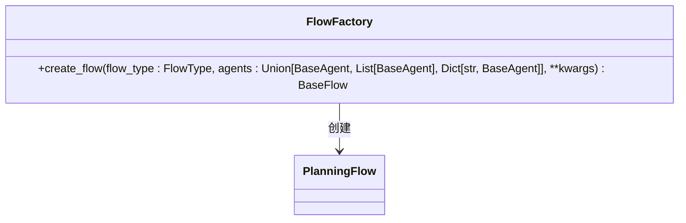

**Diagram sources**
- [flow_factory.py](file://app/flow/flow_factory.py#L12-L29)

### 策略模式

策略模式用于选择不同的执行策略。`PlanningFlow`类根据任务类型选择合适的执行器。

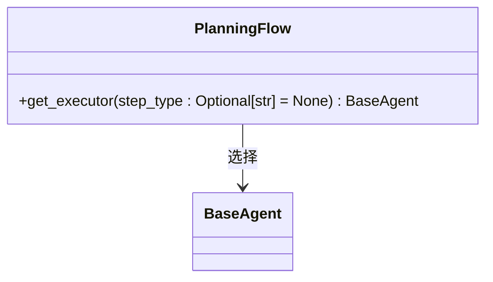

**Diagram sources**
- [planning.py](file://app/flow/planning.py#L76-L91)

### 单例模式

单例模式用于确保`LLM`类的实例在整个应用程序中是唯一的。`LLM`类使用`__new__`方法实现单例模式。

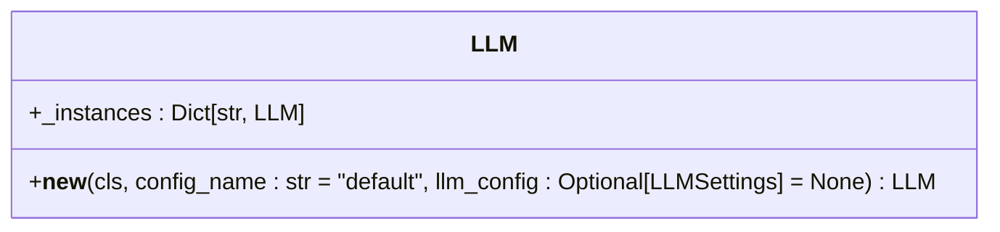

**Diagram sources**
- [llm.py](file://app/llm.py#L1-L766)

### 观察者模式

观察者模式用于管理Agent的状态变化。`BaseAgent`类使用`state_context`上下文管理器来观察和处理状态变化。

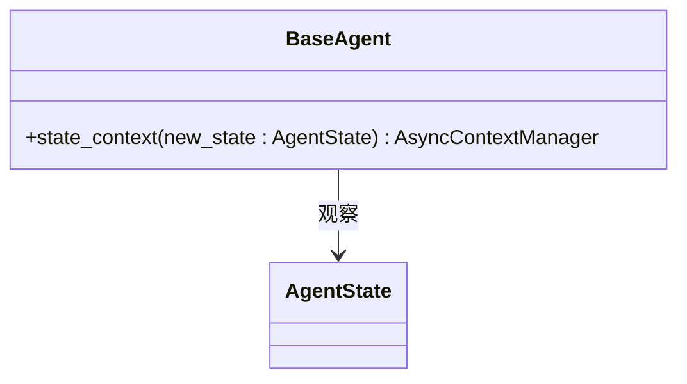

**Diagram sources**
- [base.py](file://app/agent/base.py#L58-L81)

## 总结

OpenManus通过模块化设计和多种设计模式的结合，构建了一个灵活、安全且可扩展的系统。BaseAgent、ToolCallAgent和具体代理（如Manus）之间的继承与扩展关系使得代码复用和功能扩展变得简单。沙箱执行环境通过Docker容器提供了强大的安全性和隔离性。数据流从用户请求到最终响应的完整路径清晰明了，确保了系统的可靠性和可预测性。开发者可以通过理解这些核心概念，更好地使用和扩展OpenManus系统。