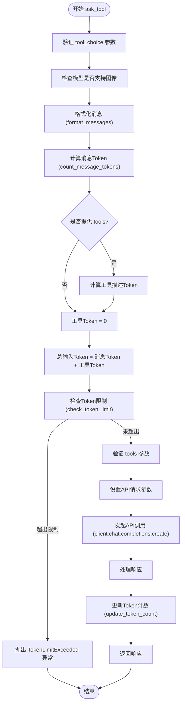
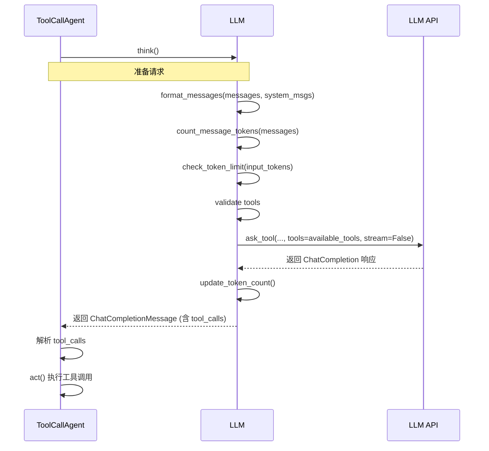
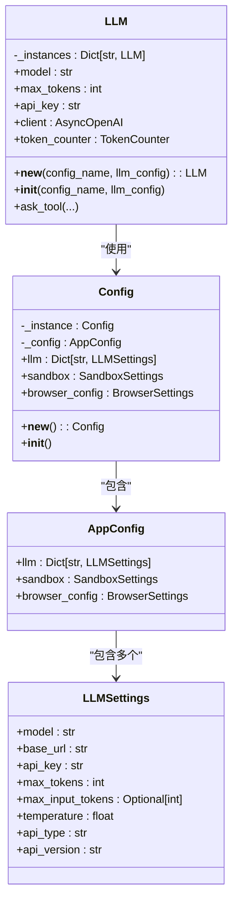

# LLM交互

<cite>
**本文档中引用的文件**  
- [llm.py](file://app/llm.py)
- [toolcall.py](file://app/agent/toolcall.py)
- [tool_collection.py](file://app/tool/tool_collection.py)
- [config.py](file://app/config.py)
</cite>

## 目录
1. [简介](#简介)
2. [LLM类与ask_tool方法概述](#llm类与ask_tool方法概述)
3. [消息格式化与token计算](#消息格式化与token计算)
4. [工具调用请求的验证与执行](#工具调用请求的验证与执行)
5. [重试机制与异常处理](#重试机制与异常处理)
6. [流式与非流式响应支持](#流式与非流式响应支持)
7. [代理中工具调用的实际应用](#代理中工具调用的实际应用)
8. [LLM实例的单例模式与配置管理](#llm实例的单例模式与配置管理)
9. [总结](#总结)

## 简介
本文档详细描述了OpenManus项目中LLM（大语言模型）交互机制的核心组件，重点分析`LLM`类中的`ask_tool`方法如何处理工具调用请求。文档涵盖了该方法在消息格式化、工具参数验证、token使用量计算和API调用执行方面的实现细节。同时，深入探讨了其重试机制、异常处理策略（如TokenLimitExceeded、OpenAIError）以及对流式/非流式响应的支持。此外，文档还通过实际代码示例说明了代理（Agent）如何发起工具调用，并阐述了LLM实例的单例模式管理机制及其配置加载方式。

## LLM类与ask_tool方法概述

`LLM`类是OpenManus项目中与大语言模型进行交互的核心封装。它提供了一个统一的接口来处理各种类型的请求，包括普通文本生成和复杂的工具调用。`ask_tool`方法是该类中专门用于处理工具调用的核心异步方法。

该方法的主要职责是接收一个消息列表、可选的系统消息、工具定义列表以及调用策略等参数，经过一系列的预处理和验证后，向底层的LLM API发起一个包含工具信息的请求。其设计目标是确保请求的格式正确、参数有效，并能妥善处理各种可能的错误情况。

**Section sources**
- [llm.py](file://app/llm.py#L643-L765)

## 消息格式化与token计算

`ask_tool`方法在发起API调用前，会进行严格的消息格式化和token使用量计算，以确保请求的有效性和成本控制。

### 消息格式化
方法首先调用静态的`format_messages`工具函数来处理输入的消息列表。此函数能够处理两种类型的消息：字典（dict）和`Message`对象。它会将`Message`对象转换为符合OpenAI API要求的字典格式。一个关键的处理逻辑是检查模型是否支持图像（通过`MULTIMODAL_MODELS`列表判断）。如果支持，且消息中包含`base64_image`字段，该函数会将消息内容转换为多模态格式，即一个包含文本和图像URL的列表，并将base64编码的图像数据嵌入到URL中。

### Token使用量计算
为了防止超出模型的token限制，`ask_tool`方法会精确计算本次请求的总输入token数。计算过程分为三步：
1.  **消息Token计算**：调用`count_message_tokens`方法，该方法内部使用`TokenCounter`类来遍历所有消息，计算角色、内容、工具调用等部分的token总和。
2.  **工具描述Token计算**：如果提供了`tools`列表，方法会遍历每个工具的定义（一个字典），将其转换为字符串后，使用`count_tokens`方法计算其token消耗，并累加到总输入token中。
3.  **总输入Token**：将消息token和工具描述token相加，得到最终的输入token总数。

计算完成后，方法会调用`check_token_limit`来检查当前累计的输入token加上本次请求的输入token是否超过了配置中设定的`max_input_tokens`上限。如果超过，则会抛出`TokenLimitExceeded`异常，阻止请求的发送。

**Diagram sources**
- [llm.py](file://app/llm.py#L643-L765)

**Section sources**
- [llm.py](file://app/llm.py#L173-L765)

## 工具调用请求的验证与执行

在确保token使用量安全后，`ask_tool`方法会对工具调用请求本身进行验证，并最终执行API调用。

### 工具参数验证
方法会对传入的`tools`列表进行验证。它会检查每个工具是否为字典类型，并且是否包含必需的`"type"`字段。如果发现任何无效的工具定义，将立即抛出`ValueError`异常，防止错误的请求被发送到API。

### API调用执行
验证通过后，方法会构建一个包含所有必要参数的`params`字典，用于发起API调用。关键参数包括：
-   `model`: 指定使用的模型。
-   `messages`: 经过格式化和token计算的对话消息。
-   `tools`: 提供给模型的工具列表。
-   `tool_choice`: 指定模型选择工具的策略（如`auto`, `none`, `required`）。
-   `timeout`: 请求超时时间。
-   `max_tokens` 或 `max_completion_tokens`: 根据模型类型（推理模型或普通模型）设置生成的最大token数。
-   `temperature`: 生成的随机性控制参数。
-   `stream`: **始终设置为`False`**，因为工具调用请求不支持流式响应。

最后，方法通过`self.client.chat.completions.create(**params)`发起非流式的API调用。调用成功后，它会检查响应的有效性（确保有选择和消息内容），然后调用`update_token_count`方法更新内部的token计数器，最后返回`ChatCompletionMessage`对象。

**Section sources**
- [llm.py](file://app/llm.py#L643-L765)

## 重试机制与异常处理

`ask_tool`方法通过装饰器和内部异常处理机制，确保了在面对网络波动或API临时错误时的鲁棒性。

### 重试机制
`ask_tool`方法本身没有直接的重试装饰器，但其调用的底层API方法（如`ask`）通常会应用`tenacity`库的`@retry`装饰器。该装饰器配置了指数退避（`wait_random_exponential`）和最多6次重试（`stop_after_attempt(6)`）。它会针对`OpenAIError`、`Exception`和`ValueError`等特定异常类型进行重试，但**不会重试`TokenLimitExceeded`异常**，因为这属于不可恢复的业务逻辑错误。

### 异常处理
方法内部使用了详尽的`try-except`块来捕获和处理不同类型的异常：
-   **TokenLimitExceeded**: 该异常被直接重新抛出，不进行日志记录，因为它是一个需要上层逻辑处理的特定错误。
-   **ValueError**: 捕获所有验证错误（如无效的`tool_choice`或消息格式），并记录错误日志后重新抛出。
-   **OpenAIError**: 这是处理所有OpenAI API相关错误的核心。根据错误的具体类型（如`AuthenticationError`、`RateLimitError`、`APIError`），方法会记录相应的错误信息（例如，认证失败、速率限制等），然后重新抛出原始异常，以便上层调用者进行处理。
-   **Exception**: 捕获所有其他未预期的异常，记录错误日志后重新抛出。

这种分层的异常处理策略确保了错误信息的清晰传达，同时允许上层应用根据不同的错误类型采取相应的恢复措施。

**Section sources**
- [llm.py](file://app/llm.py#L173-L765)

## 流式与非流式响应支持

`ask_tool`方法明确地**不支持流式响应**。这是由其设计目的决定的。

在方法的参数设置中，`params["stream"]`被硬编码为`False`。这是因为工具调用的流程是：LLM分析请求，决定调用哪个工具，并生成一个包含工具名称和参数的结构化响应（`tool_calls`）。这个响应必须是完整的、非流式的，以便上层应用能够一次性解析出所有需要调用的工具及其参数，然后并行或顺序地执行这些工具调用。

相比之下，`LLM`类中的`ask`方法则支持流式响应（`stream=True`），用于处理普通的文本生成任务，允许用户在文本生成过程中实时看到输出。`ask_tool`和`ask`方法的这种分工，清晰地划分了“决策”（工具调用）和“执行/生成”（文本流）两个不同的阶段。

**Section sources**
- [llm.py](file://app/llm.py#L643-L765)

## 代理中工具调用的实际应用

`ask_tool`方法在代理（Agent）系统中扮演着核心角色，是代理进行“思考”（think）的关键步骤。

以`ToolCallAgent`类为例，其`think`方法会调用`self.llm.ask_tool`来获取下一步的行动指令。具体流程如下：
1.  代理将当前的对话历史（`self.messages`）和系统提示（`self.system_prompt`）作为输入。
2.  代理将自己的可用工具列表（`self.available_tools.to_params()`）传递给`ask_tool`方法。
3.  通过`tool_choice`参数，代理可以控制模型的行为（例如，强制要求使用工具）。
4.  `ask_tool`方法返回一个包含`tool_calls`的响应。
5.  代理解析`tool_calls`，如果存在有效的工具调用，则进入`act`阶段去执行这些工具；如果不存在，则根据情况决定是否继续或结束。

这个过程体现了ReAct（Reasoning and Acting）模式：代理先通过`ask_tool`进行推理（Reasoning），决定需要采取的行动（即调用哪些工具），然后在`act`方法中执行（Acting）这些行动。

**Diagram sources**
- [toolcall.py](file://app/agent/toolcall.py#L30-L100)
- [llm.py](file://app/llm.py#L643-L765)

**Section sources**
- [toolcall.py](file://app/agent/toolcall.py#L30-L150)

## LLM实例的单例模式与配置管理

为了优化资源使用和确保配置一致性，`LLM`类采用了单例模式，并通过`Config`类进行集中化配置管理。

### 单例模式
`LLM`类通过重写`__new__`方法实现了单例模式。它使用一个类级别的字典`_instances`来存储不同配置名称（`config_name`）对应的LLM实例。当用户请求一个特定名称的LLM实例时，`__new__`方法会首先检查该名称的实例是否已存在。如果存在，则直接返回已有的实例；如果不存在，则创建一个新实例并存入字典。这确保了对于同一个配置名称，整个应用中只会存在一个`LLM`实例，避免了重复创建客户端连接等昂贵操作。

### 配置管理
`LLM`实例的配置来源于`config.py`文件中的`Config`单例。`Config`类在初始化时会从`config.toml`文件中加载配置，并将其解析为`AppConfig`模型。`LLM`的`__init__`方法通过`config.llm`属性获取配置。它首先尝试获取与`config_name`（如"default"）对应的配置，如果找不到，则使用"default"配置作为默认值。配置项包括`model`、`api_key`、`base_url`、`max_tokens`等，这些都直接用于初始化`LLM`实例的属性和底层的API客户端（如`AsyncOpenAI`）。

这种设计将配置的加载与解析逻辑与`LLM`类解耦，使得配置可以被多个组件共享，并且支持通过配置文件灵活地管理多个LLM配置。

**Diagram sources**
- [llm.py](file://app/llm.py#L173-L200)
- [config.py](file://app/config.py#L200-L372)

**Section sources**
- [llm.py](file://app/llm.py#L173-L250)
- [config.py](file://app/config.py#L200-L372)

## 总结
本文档全面解析了OpenManus项目中LLM的`ask_tool`方法及其相关机制。`ask_tool`方法是一个精心设计的、健壮的接口，它通过严格的消息格式化、精确的token计算、全面的参数验证和异常处理，确保了工具调用请求的可靠执行。其非流式的设计与代理的ReAct模式完美契合，成为代理进行决策的核心。同时，LLM类的单例模式和基于`Config`的集中化配置管理，保证了资源的高效利用和配置的一致性。这些机制共同构成了OpenManus智能代理系统强大而稳定的交互基础。