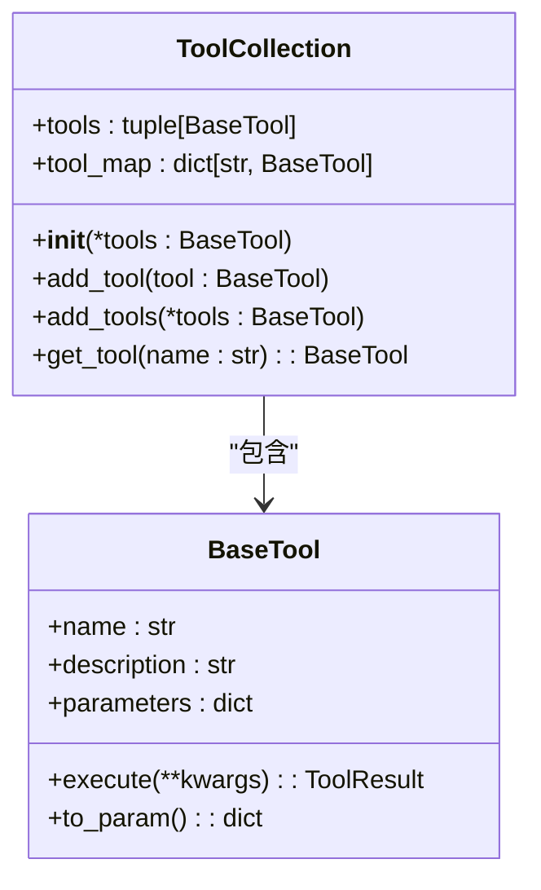
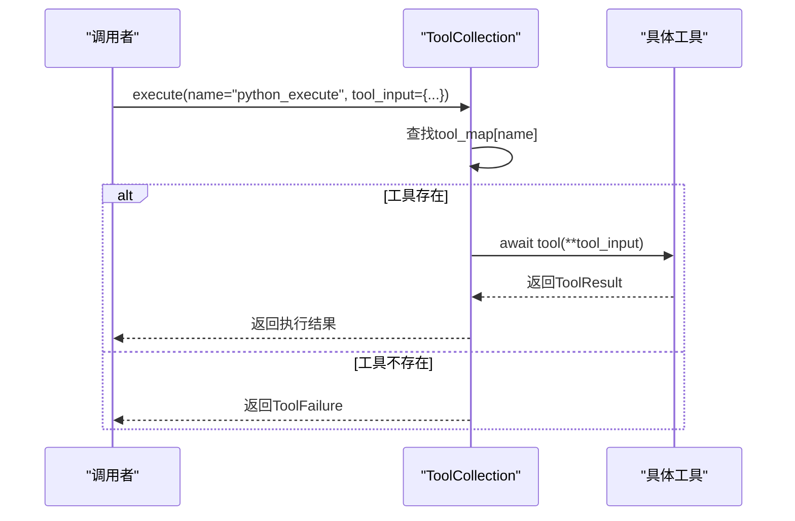
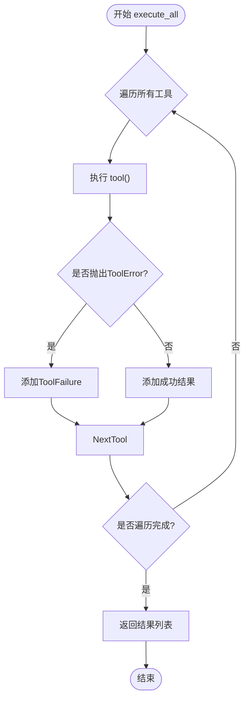
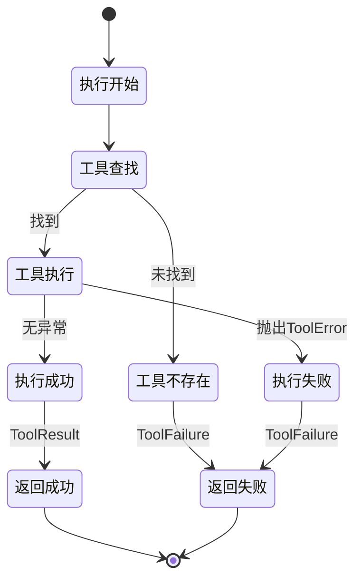
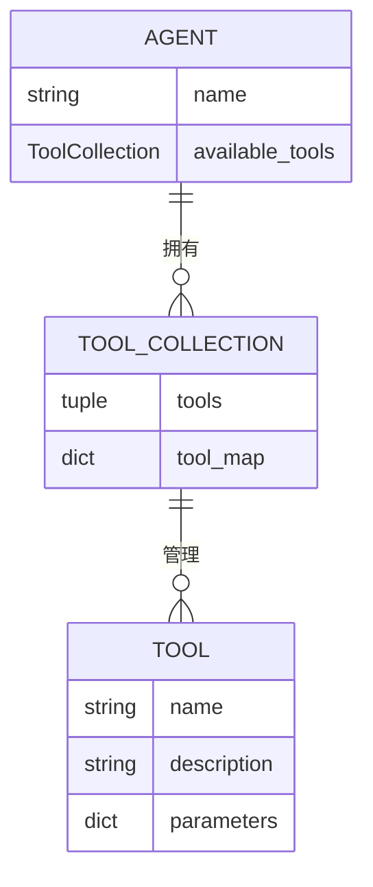
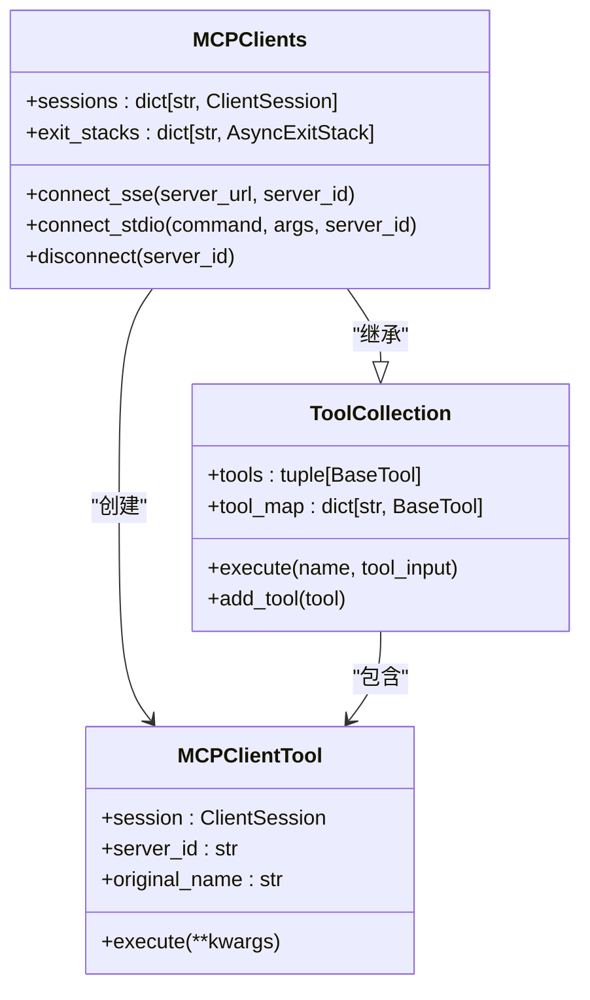

# 工具调度

<cite>
**本文档中引用的文件**
- [tool_collection.py](file://app/tool/tool_collection.py)
- [base.py](file://app/tool/base.py)
- [mcp.py](file://app/tool/mcp.py)
- [manus.py](file://app/agent/manus.py)
- [swe.py](file://app/agent/swe.py)
- [browser.py](file://app/agent/browser.py)
- [data_analysis.py](file://app/agent/data_analysis.py)
- [toolcall.py](file://app/agent/toolcall.py)
</cite>

## 目录
1. [简介](#简介)
2. [核心组件](#核心组件)
3. [工具注册与管理机制](#工具注册与管理机制)
4. [工具执行流程](#工具执行流程)
5. [批量执行与参数序列化](#批量执行与参数序列化)
6. [返回类型处理](#返回类型处理)
7. [使用示例与集成](#使用示例与集成)
8. [继承扩展：MCPClients](#继承扩展：mcpclients)
9. [结论](#结论)

## 简介
OpenManus工具调度系统通过`ToolCollection`类实现对可用工具的集中管理和协调执行。该系统为代理（Agent）提供了一套统一的接口，用于注册、查找和异步执行各种功能工具。`ToolCollection`作为核心组件，不仅维护了工具映射关系，还提供了灵活的扩展机制，支持动态添加工具以及与外部MCP服务器集成。本文档详细说明了`ToolCollection`的设计原理、内部机制及其在不同代理中的实际应用。

## 核心组件

`ToolCollection`类是OpenManus工具调度系统的核心，负责管理一组已定义的工具实例。它通过内部的数据结构和方法，实现了工具的注册、查询、执行和参数序列化等功能。该类设计简洁且功能完备，为上层代理提供了高效、可靠的工具调用支持。

**Section sources**
- [tool_collection.py](file://app/tool/tool_collection.py#L8-L70)

## 工具注册与管理机制

`ToolCollection`通过`tool_map`字典实现工具的快速查找和管理。该字典以工具名称为键，工具实例为值，确保了O(1)时间复杂度的查找性能。工具集合在初始化时接收可变数量的`BaseTool`实例，并自动构建`tool_map`。

工具注册提供了两种方式：`add_tool`用于添加单个工具，`add_tools`用于批量添加多个工具。当尝试添加同名工具时，系统会记录警告并跳过该操作，避免覆盖现有工具。这种设计保证了工具集合的稳定性和可预测性。

**Diagram sources**
- [tool_collection.py](file://app/tool/tool_collection.py#L8-L70)
- [base.py](file://app/tool/base.py#L77-L172)

**Section sources**
- [tool_collection.py](file://app/tool/tool_collection.py#L8-L70)

## 工具执行流程

`execute`方法是`ToolCollection`的核心功能之一，负责根据名称查找并异步执行指定工具。执行流程如下：首先通过`tool_map.get(name)`查找目标工具，若未找到则返回`ToolFailure`错误；若找到工具，则使用提供的输入参数调用工具的`__call__`方法，并捕获可能抛出的`ToolError`异常。

该方法采用异步编程模型，确保了高并发场景下的性能表现。同时，通过异常处理机制，将执行过程中的错误统一转换为`ToolFailure`对象，为上层调用者提供了清晰的错误反馈。

**Diagram sources**
- [tool_collection.py](file://app/tool/tool_collection.py#L24-L34)

**Section sources**
- [tool_collection.py](file://app/tool/tool_collection.py#L24-L34)

## 批量执行与参数序列化

`ToolCollection`提供了`execute_all`方法，用于按顺序执行集合中的所有工具。该方法遍历`tools`元组，依次调用每个工具的无参`__call__`方法，并收集所有结果。对于执行失败的工具，系统会捕获`ToolError`异常并将其转换为`ToolFailure`对象，确保结果列表的完整性。

`to_params`方法实现了工具参数的序列化功能，将集合中所有工具的元数据转换为符合OpenAI函数调用格式的字典列表。这对于向LLM提供可用工具列表至关重要，使模型能够根据任务需求选择合适的工具。

**Diagram sources**
- [tool_collection.py](file://app/tool/tool_collection.py#L36-L45)
- [tool_collection.py](file://app/tool/tool_collection.py#L21-L22)

**Section sources**
- [tool_collection.py](file://app/tool/tool_collection.py#L21-L22)
- [tool_collection.py](file://app/tool/tool_collection.py#L36-L45)

## 返回类型处理

`ToolCollection`的执行方法返回`ToolResult`或其子类`ToolFailure`。`ToolResult`是一个Pydantic模型，包含`output`、`error`、`base64_image`和`system`四个可选字段，能够表示各种类型的执行结果。

当工具执行成功时，返回包含输出数据的`ToolResult`；当执行失败或工具不存在时，返回包含错误信息的`ToolFailure`。这种类型系统设计清晰地区分了成功与失败状态，便于上层逻辑进行条件判断和错误处理。

**Diagram sources**
- [base.py](file://app/tool/base.py#L37-L74)
- [tool_collection.py](file://app/tool/tool_collection.py#L24-L34)

**Section sources**
- [base.py](file://app/tool/base.py#L37-L74)

## 使用示例与集成

在OpenManus系统中，多个代理类通过`available_tools`字段集成`ToolCollection`。例如，`Manus`代理初始化时创建包含`PythonExecute`、`BrowserUseTool`等工具的集合；`SWEAgent`则包含`Bash`和`StrReplaceEditor`等编程相关工具。

这些工具集合通常作为代理的属性进行声明，并在运行时通过`execute`方法调用。代理的`think`和`act`方法协同工作，先由LLM决定使用哪个工具，再由`ToolCollection`执行具体操作，形成完整的决策-执行循环。

**Diagram sources**
- [manus.py](file://app/agent/manus.py#L33-L41)
- [swe.py](file://app/agent/swe.py#L18-L20)
- [tool_collection.py](file://app/tool/tool_collection.py#L8-L70)

**Section sources**
- [manus.py](file://app/agent/manus.py#L33-L41)
- [swe.py](file://app/agent/swe.py#L18-L20)
- [browser.py](file://app/agent/browser.py#L104-L106)
- [data_analysis.py](file://app/agent/data_analysis.py#L29-L36)
- [toolcall.py](file://app/agent/toolcall.py#L26-L28)

## 继承扩展：MCPClients

`MCPClients`类继承自`ToolCollection`，扩展了与MCP（Model Context Protocol）服务器交互的能力。它不仅管理本地工具，还能动态连接到远程MCP服务器，获取并注册服务器提供的工具。

通过`connect_sse`和`connect_stdio`方法，`MCPClients`可以建立与MCP服务器的连接，并在`_initialize_and_list_tools`中将远程工具封装为`MCPClientTool`实例，添加到`tool_map`中。工具名称会根据服务器ID和原始名称生成，如`mcp_server1_python_execute`，避免命名冲突。

**Diagram sources**
- [mcp.py](file://app/tool/mcp.py#L36-L193)

**Section sources**
- [mcp.py](file://app/tool/mcp.py#L36-L193)
- [manus.py](file://app/agent/manus.py#L30-L30)
- [mcp.py](file://app/agent/mcp.py#L26-L27)

## 结论
`ToolCollection`类为OpenManus系统提供了一个强大而灵活的工具调度框架。其基于字典的快速查找机制、异步执行模型和清晰的错误处理策略，确保了系统的高效性和可靠性。通过`add_tool`/`add_tools`的动态注册能力，系统具备良好的扩展性；而`to_params`和`execute_all`等辅助方法，则进一步增强了其实用性。`MCPClients`的继承实现展示了该设计的可扩展性，能够无缝集成远程工具服务。整体而言，这一工具调度系统为构建复杂的AI代理应用奠定了坚实的基础。