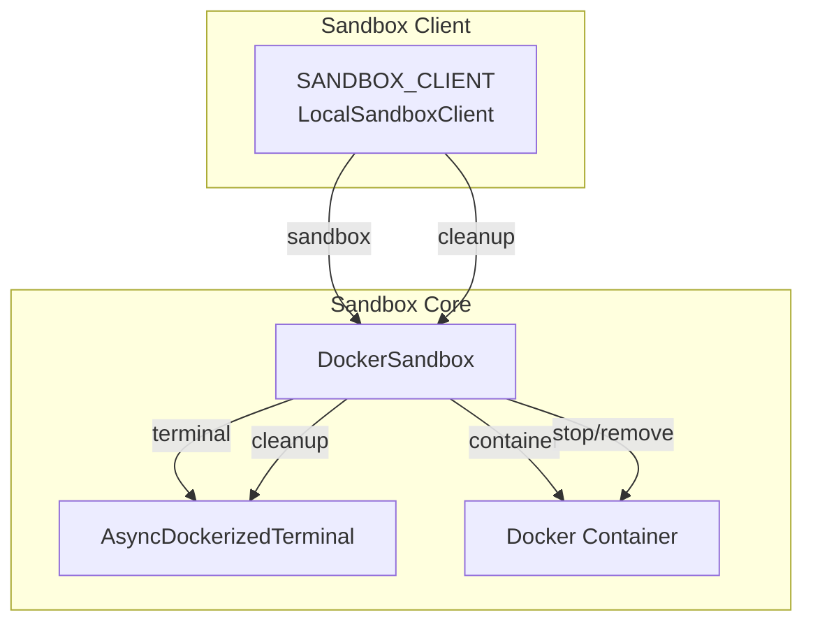
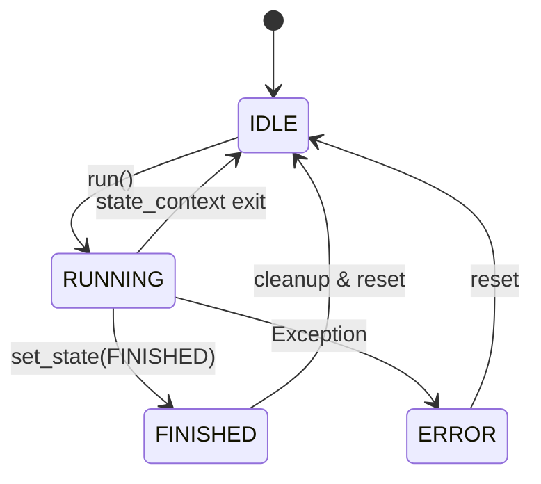

# 执行控制

<cite>
**本文档中引用的文件**  
- [base.py](file://app/agent/base.py)
- [schema.py](file://app/schema.py)
- [client.py](file://app/sandbox/client.py)
- [manager.py](file://app/sandbox/core/manager.py)
- [sandbox.py](file://app/sandbox/core/sandbox.py)
- [manus.py](file://app/agent/manus.py)
</cite>

## 目录
1. [简介](#简介)
2. [执行流程控制](#执行流程控制)
3. [状态上下文管理器](#状态上下文管理器)
4. [步进机制与最大步数限制](#步进机制与最大步数限制)
5. [循环状态检测与处理](#循环状态检测与处理)
6. [沙箱资源清理机制](#沙箱资源清理机制)
7. [状态转换图](#状态转换图)
8. [结论](#结论)

## 简介
OpenManus 是一个基于代理（Agent）架构的自动化任务执行系统，其核心设计围绕安全、可控和可恢复的执行流程展开。本文档深入解析 `BaseAgent` 类中的 `run` 方法如何通过状态上下文管理器（`state_context`）协调整个执行生命周期。我们将详细探讨其 step-by-step 循环机制、最大步数限制（`max_steps`）和当前步数追踪（`current_step`）的实现逻辑。此外，文档还将分析 `is_stuck` 方法如何通过检测记忆中重复的助手消息来识别循环状态，以及 `handle_stuck_state` 如何注入提示以改变策略。最后，我们将说明执行完成后沙箱资源的清理机制，并提供一个状态转换图来展示 `IDLE`、`RUNNING`、`FINISHED` 和 `ERROR` 等状态之间的流转关系。

## 执行流程控制
`BaseAgent` 的 `run` 方法是整个代理执行流程的控制中心。它定义了一个异步的主循环，负责协调代理的每一步操作。该方法首先检查代理的当前状态是否为 `IDLE`，以确保执行的起点是安全的。如果提供了初始请求，该请求将被添加到代理的记忆中。随后，方法进入一个由 `state_context` 上下文管理器包裹的 `while` 循环。这个循环的执行条件是当前步数小于最大步数且代理状态未达到 `FINISHED`。在循环内部，每执行一步，`current_step` 计数器递增，并调用抽象的 `step` 方法（由子类实现）来执行具体的业务逻辑。执行结果被记录下来，并在每次迭代后检查是否陷入循环状态。当循环因达到最大步数或任务完成而退出后，系统会执行沙箱资源的清理工作并返回执行摘要。

**Section sources**
- [base.py](file://app/agent/base.py#L115-L153)

## 状态上下文管理器
`state_context` 是一个关键的上下文管理器，用于确保代理状态转换的安全性和原子性。它接收一个目标状态作为参数。当进入上下文时，它会先保存当前状态，然后将代理的状态设置为新的目标状态（例如 `RUNNING`）。在 `try` 块中，允许执行上下文内的代码。如果在执行过程中发生任何异常，`except` 块会捕获该异常，并立即将代理状态设置为 `ERROR`，从而准确地反映执行失败的状态。无论是否发生异常，`finally` 块都会确保在退出上下文时，代理的状态被恢复到进入上下文之前的状态。这种设计模式保证了状态变更的“事务性”，即状态的改变要么完全成功，要么在发生错误时能够回滚，从而维护了系统的稳定性和可预测性。

**Section sources**
- [base.py](file://app/agent/base.py#L58-L81)

## 步进机制与最大步数限制
执行流程的核心是一个受控的步进循环。`current_step` 字段用于追踪当前正在执行的是第几步，它在每次循环迭代开始时递增。`max_steps` 字段则定义了整个执行流程允许的最大步数，这是一个防止代理无限循环或执行时间过长的关键安全机制。在 `run` 方法的 `while` 循环条件中，`self.current_step < self.max_steps` 确保了循环不会超过预设的上限。一旦 `current_step` 达到或超过 `max_steps`，循环将终止，代理会将自身状态重置为 `IDLE`，并生成一条“已终止：达到最大步数”的结果信息。这种机制为长时间运行的任务提供了明确的终止条件，保障了系统的资源不会被无限占用。

**Section sources**
- [base.py](file://app/agent/base.py#L39-L40)
- [base.py](file://app/agent/base.py#L115-L153)

## 循环状态检测与处理
为了防止代理在执行过程中陷入无效的重复行为，系统实现了循环状态检测机制。`is_stuck` 方法通过分析代理的记忆（`memory`）来判断是否处于“卡住”状态。其逻辑是：如果记忆中的消息少于两条，则不可能有重复，返回 `False`。否则，它会获取最后一条消息的内容，并向前遍历之前的消息，统计角色为 `assistant` 且内容完全相同的消息数量。如果这个重复计数达到了预设的阈值（`duplicate_threshold`，默认为2），则认为代理已陷入循环，方法返回 `True`。当 `run` 方法检测到 `is_stuck()` 返回 `True` 时，会立即调用 `handle_stuck_state` 方法。该方法会向 `next_step_prompt`（决定下一步行动的提示词）的开头注入一条特定的警告信息，提示代理“已观察到重复响应，请考虑新的策略并避免重复无效路径”。这为代理提供了一个改变策略的机会，从而有可能跳出循环。

**Section sources**
- [base.py](file://app/agent/base.py#L169-L185)
- [base.py](file://app/agent/base.py#L162-L167)
- [base.py](file://app/agent/base.py#L42-L42)

## 沙箱资源清理机制
为了确保执行环境的隔离性和资源的及时释放，OpenManus 使用了沙箱（Sandbox）技术。`SANDBOX_CLIENT` 是一个全局的沙箱客户端实例，它负责与底层的 Docker 容器进行交互。在 `run` 方法的最后，无论执行是成功完成还是因达到最大步数而终止，都会调用 `await SANDBOX_CLIENT.cleanup()`。这个 `cleanup` 方法会触发一系列清理操作：它会停止并移除正在运行的 Docker 容器，关闭与容器的终端连接，并清理相关的临时文件和网络资源。这一机制确保了每次代理执行结束后，其占用的计算资源（如内存、CPU、磁盘空间）都能被彻底回收，防止了资源泄漏，保证了后续任务的稳定运行。

**Diagram sources**
- [client.py](file://app/sandbox/client.py#L200-L200)
- [sandbox.py](file://app/sandbox/core/sandbox.py#L17-L461)
- [manager.py](file://app/sandbox/core/manager.py#L17-L313)

## 状态转换图
下图展示了 `BaseAgent` 的核心状态（`AgentState`）及其之间的转换关系。代理的生命周期始于 `IDLE` 状态。当调用 `run` 方法时，通过 `state_context` 进入 `RUNNING` 状态。在 `RUNNING` 状态下，代理通过 `step` 方法执行任务。如果任务成功完成，代理会将状态设置为 `FINISHED`。如果在执行过程中发生未捕获的异常，`state_context` 的 `except` 块会将其状态设置为 `ERROR`。当 `run` 方法正常结束（无论是完成任务还是达到最大步数），`finally` 块会将状态恢复到 `IDLE`，允许代理接受新的任务。从 `ERROR` 状态也可以通过重置或重新初始化回到 `IDLE` 状态。

**Diagram sources**
- [base.py](file://app/agent/base.py#L58-L81)
- [schema.py](file://app/schema.py#L31-L37)

## 结论
OpenManus 的执行控制机制通过 `BaseAgent` 类的精心设计，实现了对代理生命周期的全面管理。`state_context` 上下文管理器确保了状态转换的安全与可靠，`run` 方法中的步进循环结合 `max_steps` 和 `current_step` 提供了清晰的执行流程控制。`is_stuck` 和 `handle_stuck_state` 方法共同构成了一个有效的防循环机制，提升了代理的智能性和鲁棒性。最后，通过 `SANDBOX_CLIENT.cleanup()` 实现的沙箱资源清理，保证了执行环境的纯净和系统资源的高效利用。这些组件协同工作，共同构建了一个稳定、安全且可扩展的自动化代理执行框架。