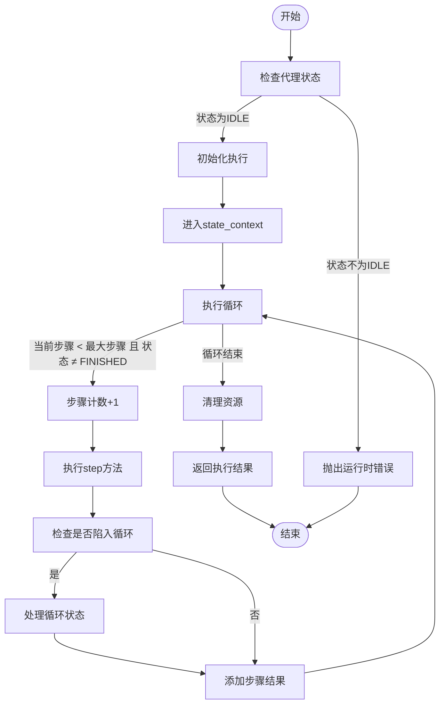
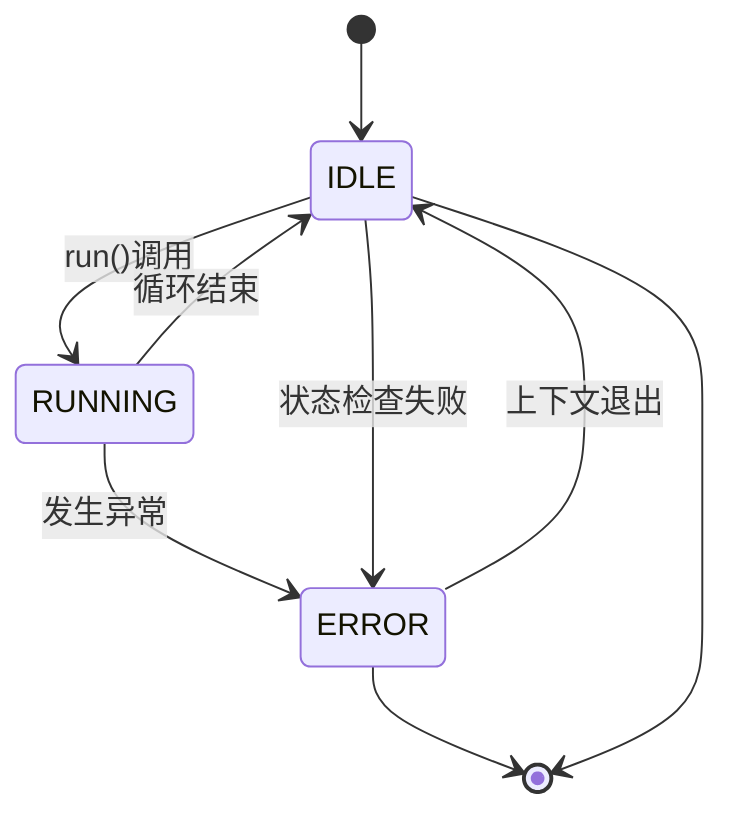
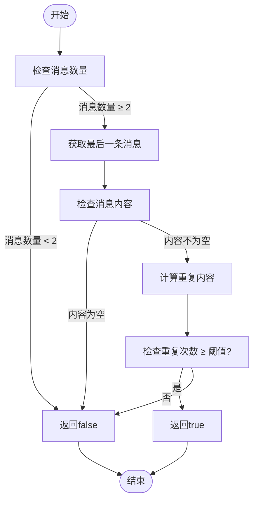
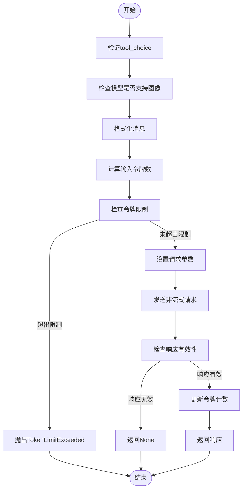
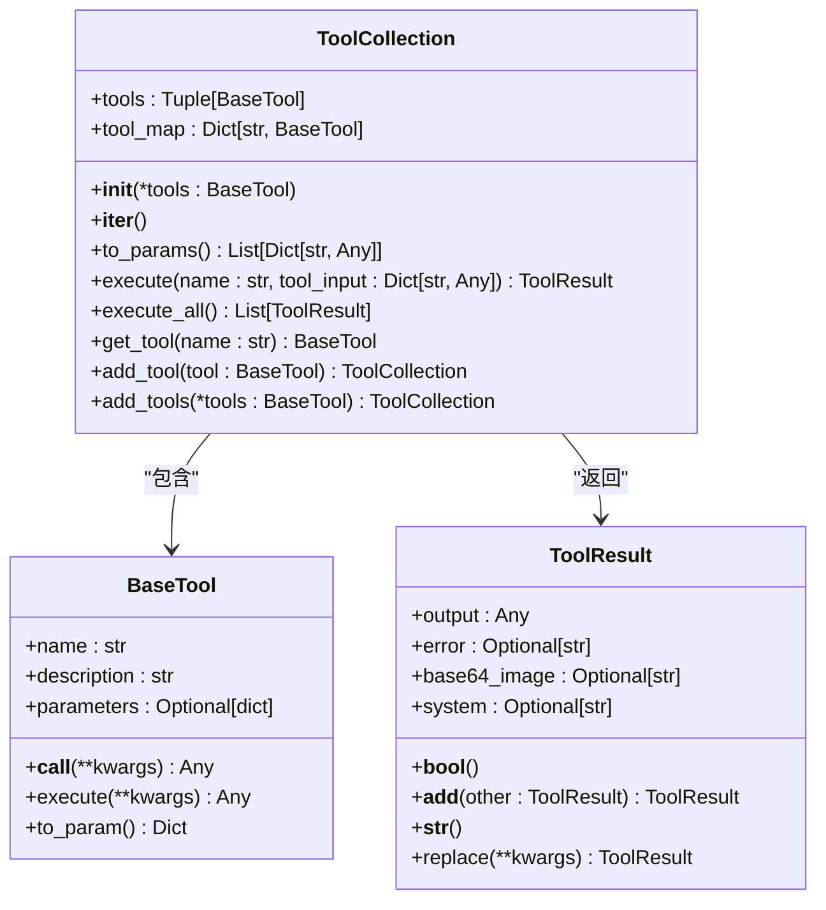
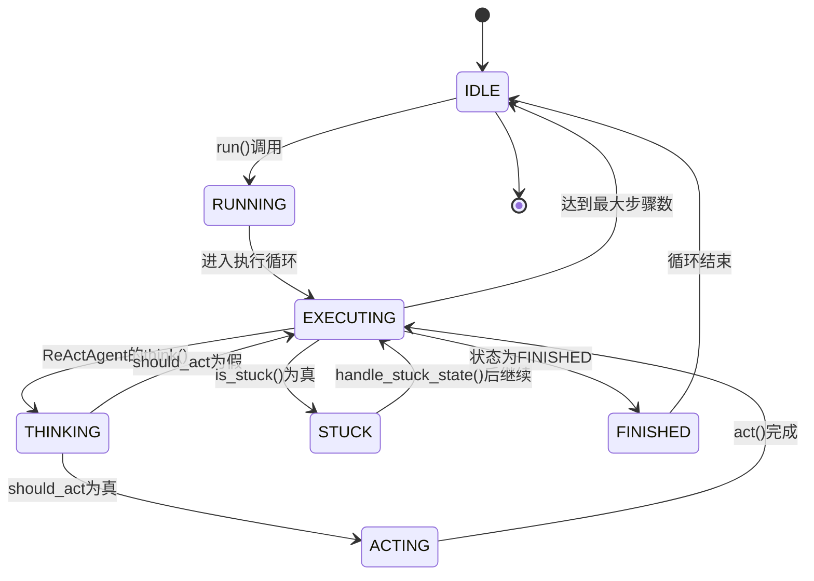
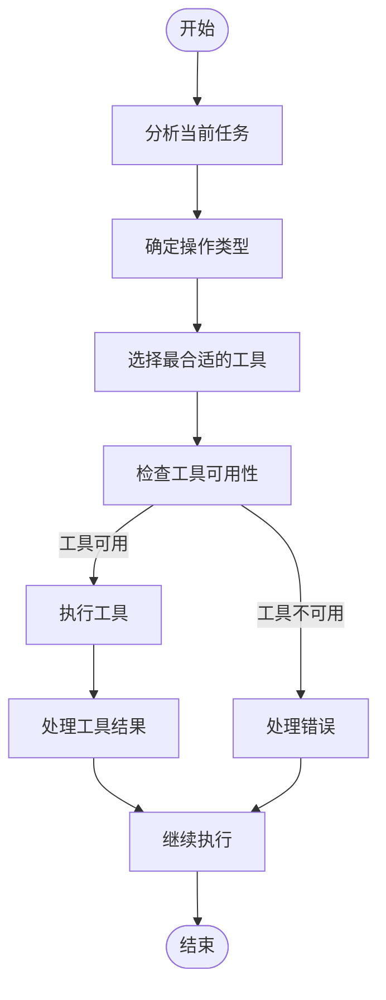

# 执行流程

<cite>
**本文档引用的文件**   
- [base.py](file://app/agent/base.py)
- [llm.py](file://app/llm.py)
- [tool_collection.py](file://app/tool/tool_collection.py)
</cite>

## 目录
1. [简介](#简介)
2. [核心执行机制](#核心执行机制)
3. [状态上下文管理](#状态上下文管理)
4. [循环状态检测与处理](#循环状态检测与处理)
5. [工具调用处理机制](#工具调用处理机制)
6. [工具协调与执行](#工具协调与执行)
7. [执行流程状态转换](#执行流程状态转换)
8. [工具选择决策](#工具选择决策)

## 简介
OpenManus代理系统采用基于步骤的执行机制，通过循环执行`step`方法来完成复杂任务。该系统集成了状态管理、循环检测、工具调用和决策机制，确保代理能够高效、可靠地执行任务。本文档详细描述了代理的执行流程，包括`BaseAgent`的`run`方法如何在状态上下文管理器中循环执行`step`方法，以及如何通过`is_stuck`和`handle_stuck_state`方法检测和处理循环状态。同时，文档还阐述了LLM模块的`ask_tool`方法如何处理工具调用请求，以及`ToolCollection`如何协调可用工具的执行。

## 核心执行机制

`BaseAgent`类的`run`方法是代理执行的核心，它实现了基于步骤的异步执行循环。该方法首先检查代理的当前状态，确保代理处于空闲状态（IDLE）才能开始执行。如果提供了初始用户请求，该请求将被添加到代理的记忆中。

执行循环在`state_context`上下文管理器中运行，代理状态被设置为运行中（RUNNING）。循环持续执行，直到达到最大步骤数或代理状态变为完成（FINISHED）。在每个步骤中，代理调用`step`方法执行单个步骤，并检查是否陷入循环状态。如果检测到循环状态，将调用`handle_stuck_state`方法进行处理。

**Diagram sources**
- [base.py](file://app/agent/base.py#L115-L153)

**Section sources**
- [base.py](file://app/agent/base.py#L115-L153)

## 状态上下文管理

`state_context`是一个异步上下文管理器，用于安全地管理代理的状态转换。当进入上下文时，代理状态被设置为新的状态，同时保存当前状态作为前一个状态。在上下文中执行代码时，如果发生异常，代理状态将被设置为错误（ERROR），并重新抛出异常。无论是否发生异常，退出上下文时，代理状态都将恢复为前一个状态。

这种机制确保了状态转换的安全性，即使在执行过程中发生错误，代理状态也能正确恢复，避免了状态不一致的问题。

**Diagram sources**
- [base.py](file://app/agent/base.py#L58-L81)

**Section sources**
- [base.py](file://app/agent/base.py#L58-L81)

## 循环状态检测与处理

`is_stuck`方法用于检测代理是否陷入循环状态。该方法通过检查记忆中的消息来判断是否存在重复的响应。如果最后一条消息的内容与之前的消息内容相同，且重复次数达到或超过`duplicate_threshold`（默认为2），则认为代理陷入了循环状态。

`handle_stuck_state`方法用于处理检测到的循环状态。该方法通过向`next_step_prompt`添加一个提示，建议代理考虑新的策略，避免重复无效的路径。这有助于代理跳出循环，尝试不同的解决方案。

**Diagram sources**
- [base.py](file://app/agent/base.py#L169-L185)
- [base.py](file://app/agent/base.py#L162-L167)

**Section sources**
- [base.py](file://app/agent/base.py#L169-L185)
- [base.py](file://app/agent/base.py#L162-L167)

## 工具调用处理机制

`LLM`类的`ask_tool`方法用于处理工具调用请求。该方法首先验证`tool_choice`参数，然后检查模型是否支持图像。接着，消息被格式化为LLM可以理解的格式，并计算输入令牌数。如果存在工具，还将计算工具描述的令牌数。

在检查令牌限制后，方法设置完成请求的参数，包括模型、消息、工具、工具选择策略和超时时间。请求以非流式方式发送，以确保能够正确处理工具调用。如果响应有效，将更新令牌计数并返回模型的响应。

**Diagram sources**
- [llm.py](file://app/llm.py#L643-L765)

**Section sources**
- [llm.py](file://app/llm.py#L643-L765)

## 工具协调与执行

`ToolCollection`类用于管理一组工具。它提供了一个工具映射（`tool_map`），通过工具名称快速查找工具。`execute`方法根据名称执行单个工具，如果工具不存在，则返回工具失败结果。`execute_all`方法按顺序执行所有工具。

`add_tool`和`add_tools`方法允许向集合中添加工具。如果工具名称已存在，将跳过该工具并记录警告。`to_params`方法将所有工具转换为参数格式，以便传递给LLM。

**Diagram sources**
- [tool_collection.py](file://app/tool/tool_collection.py#L8-L70)

**Section sources**
- [tool_collection.py](file://app/tool/tool_collection.py#L8-L70)

## 执行流程状态转换

代理的执行流程涉及多个状态的转换。从空闲状态开始，代理进入运行状态，执行步骤循环。在每个步骤中，代理调用`step`方法，该方法的具体实现由子类定义。如果代理陷入循环状态，将触发循环处理机制。当达到最大步骤数或代理状态变为完成时，循环结束，代理返回空闲状态。

**Diagram sources**
- [base.py](file://app/agent/base.py#L115-L153)
- [react.py](file://app/agent/react.py#L32-L37)

**Section sources**
- [base.py](file://app/agent/base.py#L115-L153)
- [react.py](file://app/agent/react.py#L32-L37)

## 工具选择决策

工具选择决策树描述了代理如何根据任务需求选择合适的工具。首先，代理分析当前任务，确定需要执行的操作类型。然后，根据操作类型从可用工具中选择最合适的工具。如果存在多个候选工具，代理将根据工具的描述和参数进行选择。

**Diagram sources**
- [tool_collection.py](file://app/tool/tool_collection.py#L24-L34)
- [llm.py](file://app/llm.py#L643-L765)

**Section sources**
- [tool_collection.py](file://app/tool/tool_collection.py#L24-L34)
- [llm.py](file://app/llm.py#L643-L765)