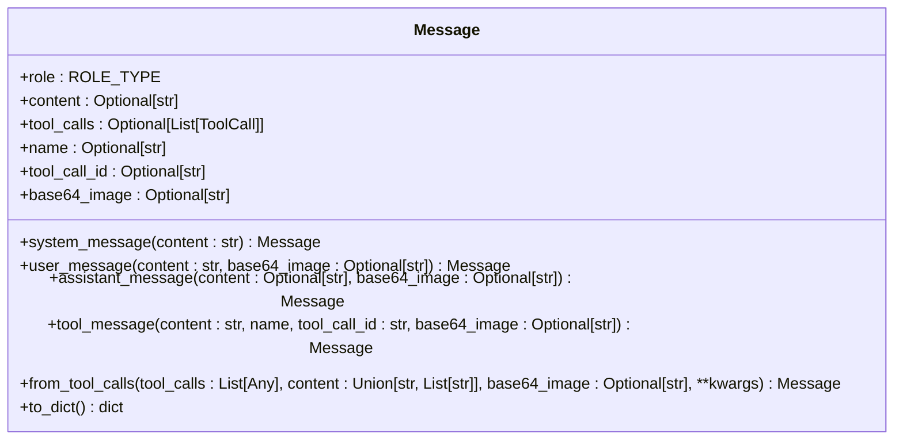
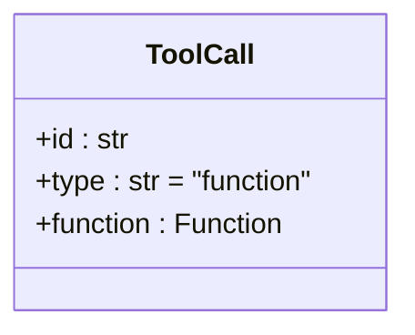
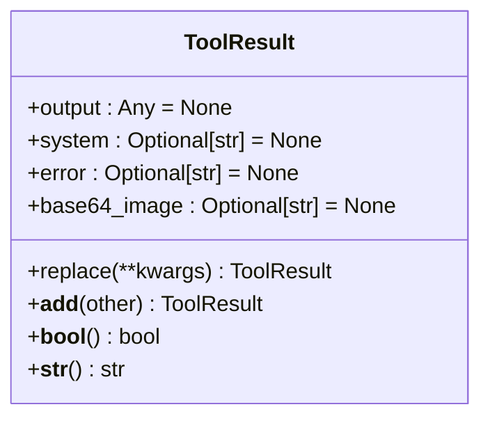
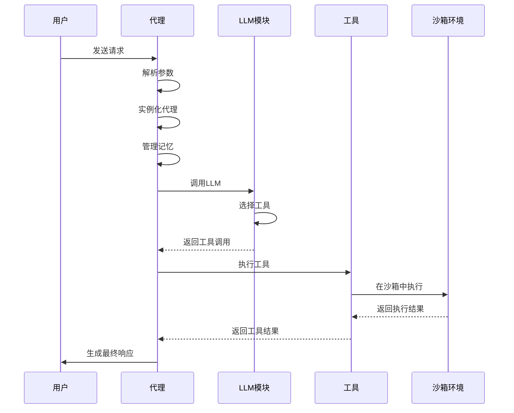
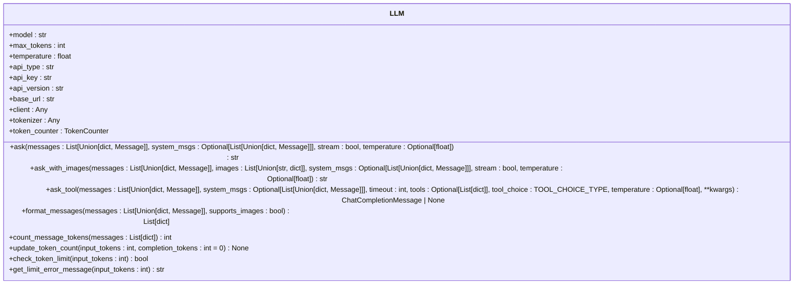
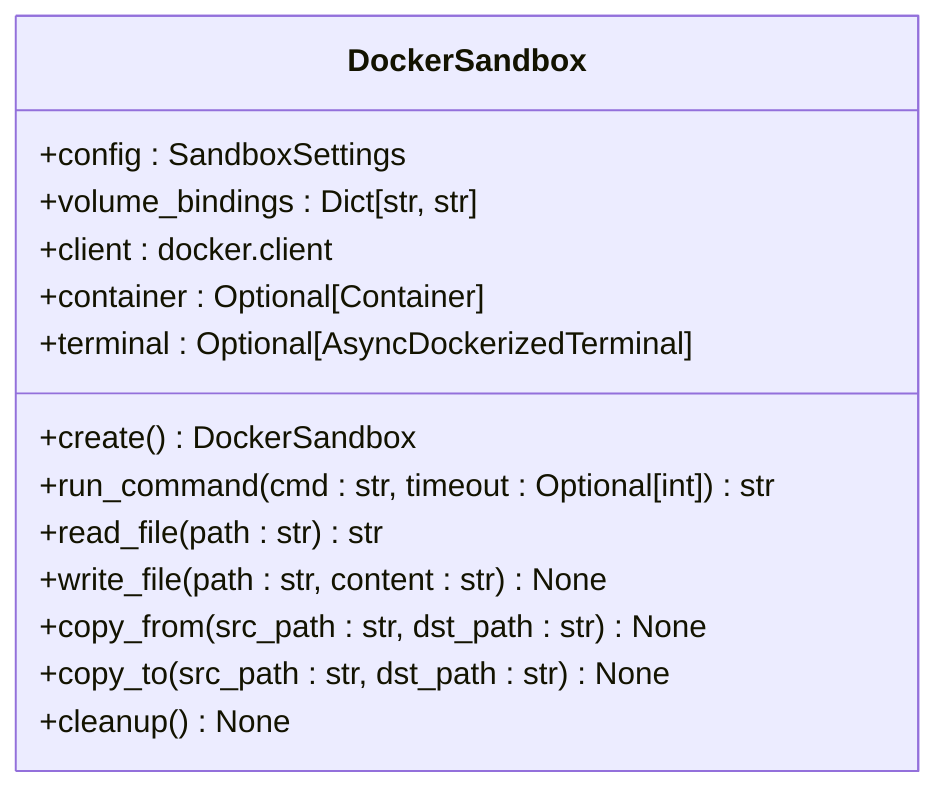
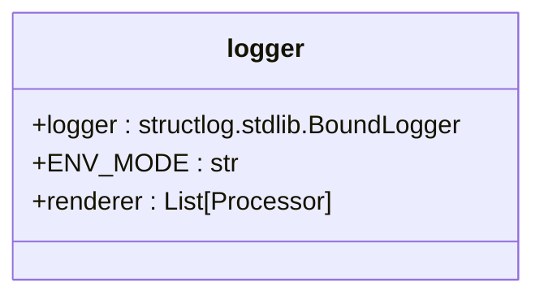
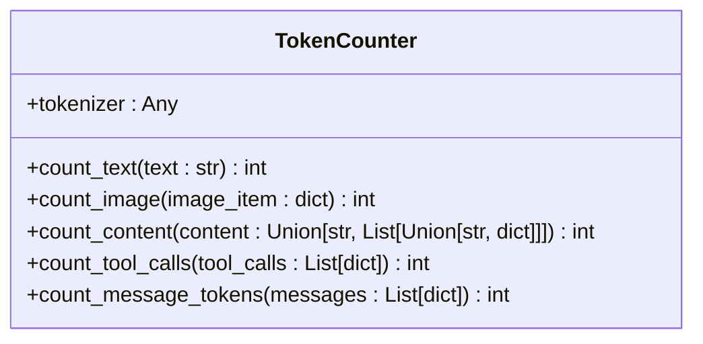

# 数据流架构

<cite>
**本文档引用的文件**  
- [llm.py](file://app/llm.py)
- [schema.py](file://app/schema.py)
- [toolcall.py](file://app/agent/toolcall.py)
- [sandbox.py](file://app/sandbox/core/sandbox.py)
- [sb_browser_tool.py](file://app/tool/sandbox/sb_browser_tool.py)
- [sb_files_tool.py](file://app/tool/sandbox/sb_files_tool.py)
- [sb_shell_tool.py](file://app/tool/sandbox/sb_shell_tool.py)
- [sb_vision_tool.py](file://app/tool/sandbox/sb_vision_tool.py)
- [planning.py](file://app/flow/planning.py)
- [toolcall.py](file://app/prompt/toolcall.py)
- [logger.py](file://app/utils/logger.py)
</cite>

## 目录
1. [引言](#引言)
2. [核心数据模型](#核心数据模型)
3. [端到端数据流](#端到端数据流)
4. [LLM模块封装](#llm模块封装)
5. [沙箱环境执行](#沙箱环境执行)
6. [开发者工具](#开发者工具)
7. [结论](#结论)

## 引言
OpenManus 是一个基于代理的智能系统，能够通过调用工具和执行复杂任务来响应用户请求。本架构文档详细描述了从用户请求到最终响应的完整数据流路径，涵盖参数解析、代理实例化、记忆管理、LLM调用、工具选择、执行引擎、沙箱环境和结果返回等关键环节。文档重点说明了 Message、ToolCall、ToolResult 等核心数据模型的结构和转换关系，并阐述了 LLM 模块如何封装不同提供商（如 Anthropic、OpenAI）的 API 调用。通过端到端数据流图和核心数据模型关系图，为开发者提供清晰的系统视图，并包含用于数据流监控和性能分析的实用工具。

## 核心数据模型

### Message 消息模型
`Message` 模型是系统中对话消息的核心表示，定义了消息的角色、内容、工具调用等属性。

**图源**  
- [schema.py](file://app/schema.py#L53-L155)

**节源**  
- [schema.py](file://app/schema.py#L53-L155)

### ToolCall 工具调用模型
`ToolCall` 模型表示消息中的工具或函数调用，包含调用的 ID、类型和函数信息。

**图源**  
- [schema.py](file://app/schema.py#L45-L50)

**节源**  
- [schema.py](file://app/schema.py#L45-L50)

### ToolResult 工具结果模型
`ToolResult` 模型表示工具执行的结果，包含输出、系统信息、错误和 base64 编码的图像。

**图源**  
- [base.py](file://app/tool/base.py#L37-L74)

**节源**  
- [base.py](file://app/tool/base.py#L37-L74)

## 端到端数据流

### 数据流概述
从用户请求到最终响应的完整数据流路径如下：
1. **参数解析**：解析用户请求，生成初始消息。
2. **代理实例化**：根据请求实例化相应的代理（如 ToolCallAgent）。
3. **记忆管理**：代理使用 Memory 模型管理对话历史。
4. **LLM调用**：代理调用 LLM 模块，生成工具调用或响应。
5. **工具选择**：LLM 根据可用工具和工具选择策略决定是否调用工具。
6. **执行引擎**：代理执行选定的工具调用。
7. **沙箱环境**：工具在沙箱环境中安全执行。
8. **结果返回**：工具执行结果返回给代理，代理生成最终响应。

### 数据流图

**图源**  
- [toolcall.py](file://app/agent/toolcall.py#L32-L32)
- [planning.py](file://app/flow/planning.py#L32-L32)

**节源**  
- [toolcall.py](file://app/agent/toolcall.py#L32-L32)
- [planning.py](file://app/flow/planning.py#L32-L32)

## LLM模块封装

### LLM模块设计
`LLM` 类封装了与不同 LLM 提供商（如 OpenAI、Anthropic）的 API 调用，提供统一的接口。

**图源**  
- [llm.py](file://app/llm.py#L1-L767)

**节源**  
- [llm.py](file://app/llm.py#L1-L767)

### 多提供商支持
`LLM` 类通过配置不同的 `api_type`（如 "azure"、"aws"）来支持多种 LLM 提供商。例如，当 `api_type` 为 "azure" 时，使用 `AsyncAzureOpenAI` 客户端；当 `api_type` 为 "aws" 时，使用 `BedrockClient`。

## 沙箱环境执行

### 沙箱环境设计
`DockerSandbox` 类提供了一个容器化的执行环境，确保工具在安全的沙箱中运行。

**图源**  
- [sandbox.py](file://app/sandbox/core/sandbox.py#L1-L463)

**节源**  
- [sandbox.py](file://app/sandbox/core/sandbox.py#L1-L463)

### 工具执行
工具在沙箱环境中执行，确保系统的安全性和隔离性。例如，`SandboxFilesTool` 在沙箱中创建、读取和写入文件，`SandboxShellTool` 在沙箱中执行 shell 命令。

## 开发者工具

### 日志记录
系统使用 `structlog` 进行日志记录，提供详细的日志信息，便于调试和监控。

**图源**  
- [logger.py](file://app/utils/logger.py#L1-L33)

**节源**  
- [logger.py](file://app/utils/logger.py#L1-L33)

### 性能分析
通过 `TokenCounter` 类计算消息和工具调用的 token 数量，帮助开发者监控和优化性能。

**图源**  
- [llm.py](file://app/llm.py#L1-L767)

**节源**  
- [llm.py](file://app/llm.py#L1-L767)

## 结论
OpenManus 的数据流架构设计清晰，通过核心数据模型和模块化设计，实现了从用户请求到最终响应的高效处理。LLM 模块的封装使得系统能够灵活支持多种 LLM 提供商，沙箱环境确保了工具执行的安全性。开发者工具提供了详细的日志记录和性能分析功能，便于系统的调试和优化。通过本文档，开发者可以全面了解 OpenManus 的数据流架构，为系统的开发和维护提供有力支持。