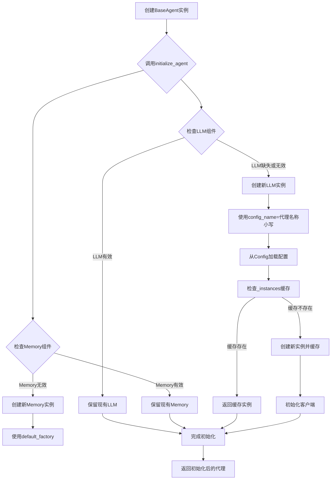

# 代理初始化

<cite>
**本文档中引用的文件**   
- [base.py](file://app/agent/base.py)
- [llm.py](file://app/llm.py)
- [config.py](file://app/config.py)
- [schema.py](file://app/schema.py)
</cite>

## 目录
1. [简介](#简介)
2. [核心组件分析](#核心组件分析)
3. [LLM与Memory初始化机制](#llm与memory初始化机制)
4. [配置命名规则与工厂模式](#配置命名规则与工厂模式)
5. [代理状态与去重阈值](#代理状态与去重阈值)
6. [依赖注入流程图](#依赖注入流程图)
7. [异常处理与恢复机制](#异常处理与恢复机制)

## 简介
本文件详细描述了OpenManus代理系统中BaseAgent类的initialize_agent模型验证器方法。该方法在代理实例化过程中起着关键作用，负责验证和初始化核心组件，确保代理能够正确启动并执行任务。文档将深入分析该方法如何检查并初始化语言模型（LLM）和记忆（Memory）组件，解释配置参数的命名规则和默认工厂模式的应用，并说明代理状态的初始设置和去重阈值的配置原理。

## 核心组件分析

BaseAgent类是OpenManus代理系统的核心基类，定义了代理的基本结构和行为。initialize_agent方法作为模型验证器，在代理实例化后自动调用，确保所有必需的组件都已正确初始化。该方法主要关注两个核心依赖组件：LLM（语言模型）和Memory（记忆存储）。

**Section sources**
- [base.py](file://app/agent/base.py#L49-L55)

## LLM与Memory初始化机制

initialize_agent方法通过条件检查确保LLM和Memory组件的正确初始化。对于LLM组件，方法首先检查self.llm是否为None或不是LLM类的实例。如果是，则创建一个新的LLM实例，并将代理名称的小写形式作为config_name参数传递。对于Memory组件，方法检查self.memory是否不是Memory类的实例，如果是，则创建一个新的Memory实例。

这种初始化机制确保了即使在代理创建时未显式提供这些组件，系统也能自动创建默认实例，从而保证代理的可用性。LLM的初始化依赖于外部配置，而Memory的初始化则使用简单的默认工厂模式。

**Section sources**
- [base.py](file://app/agent/base.py#L49-L55)
- [llm.py](file://app/llm.py#L173-L765)
- [schema.py](file://app/schema.py#L158-L186)

## 配置命名规则与工厂模式

LLM组件的初始化采用了基于名称的配置查找策略。config_name参数使用代理名称的小写形式，这遵循了配置文件中定义的命名约定。系统通过config.py中的Config类加载配置，该类实现了单例模式，确保配置在整个应用中的一致性。

LLM类自身实现了实例缓存模式（通过_instances字典），确保相同config_name的配置只创建一个LLM实例，实现了轻量级的工厂模式。当请求一个已存在的config_name时，直接返回缓存的实例，避免了重复创建和资源浪费。这种设计既保证了配置的灵活性，又优化了资源使用。

**Section sources**
- [base.py](file://app/agent/base.py#L49-L55)
- [llm.py](file://app/llm.py#L173-L765)
- [config.py](file://app/config.py#L192-L237)

## 代理状态与去重阈值

BaseAgent的初始状态在类定义中被设置为AgentState.IDLE，这是通过字段的默认值实现的。AgentState是一个枚举类，定义了代理可能处于的各种状态，包括IDLE、RUNNING、FINISHED和ERROR。这种设计使得状态管理清晰且类型安全。

duplicate_threshold参数被设置为2，用于检测代理是否陷入循环。当代理的最后一条消息内容在历史消息中出现的次数达到或超过此阈值时，系统认为代理可能陷入了重复响应的循环。这个阈值的选择是一个平衡点：太低可能导致误判，太高则可能无法及时发现真正的循环问题。

**Section sources**
- [base.py](file://app/agent/base.py#L34-L36)
- [base.py](file://app/agent/base.py#L42-L42)
- [schema.py](file://app/schema.py#L31-L37)

## 依赖注入流程图

**Diagram sources**
- [base.py](file://app/agent/base.py#L49-L55)
- [llm.py](file://app/llm.py#L173-L765)
- [schema.py](file://app/schema.py#L158-L186)

## 异常处理与恢复机制

当LLM配置无效时，系统会在LLM类的__init__方法中抛出异常。由于LLM实例的创建是在initialize_agent方法中进行的，任何配置错误都会导致初始化失败。系统通过捕获这些异常并提供有意义的错误信息来处理此类问题。

对于恢复机制，系统设计了重试策略。在LLM的ask、ask_with_images和ask_tool方法中，使用了tenacity库的@retry装饰器，实现了指数退避重试。当遇到API错误、认证错误或速率限制错误时，系统会自动重试最多6次。此外，当检测到代理陷入循环（is_stuck方法返回True）时，系统会调用handle_stuck_state方法，向next_step_prompt添加提示，引导代理改变策略，从而实现从卡住状态的恢复。

**Section sources**
- [base.py](file://app/agent/base.py#L162-L185)
- [llm.py](file://app/llm.py#L580-L765)