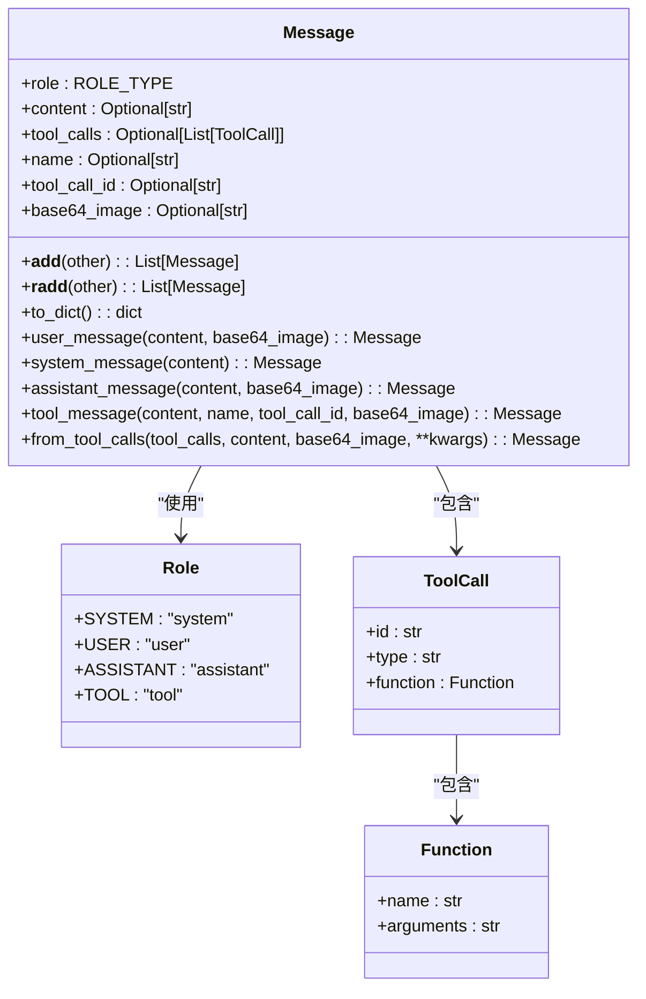
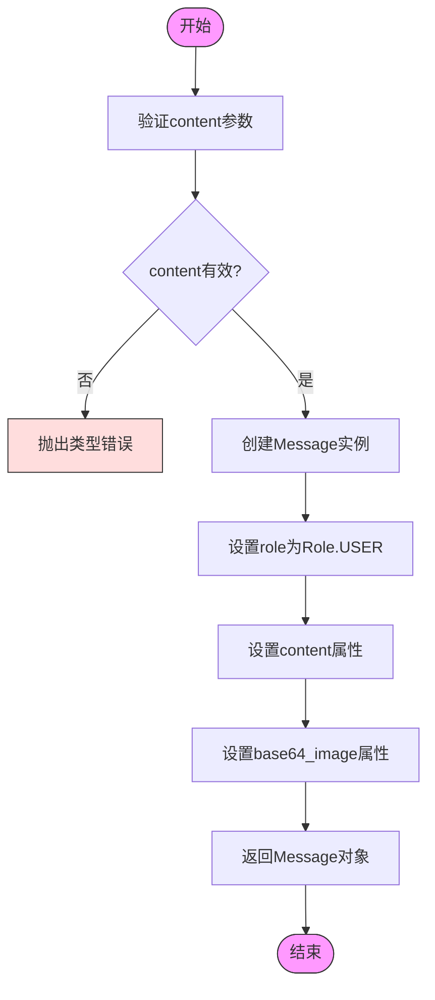
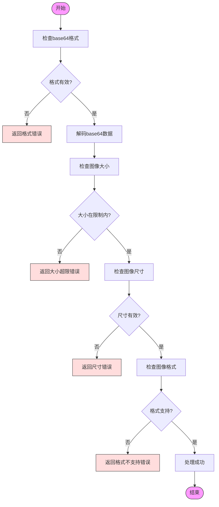
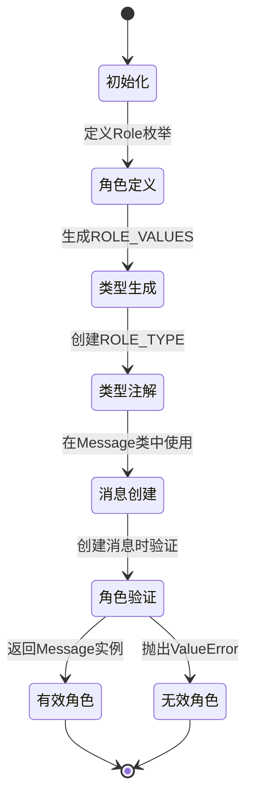
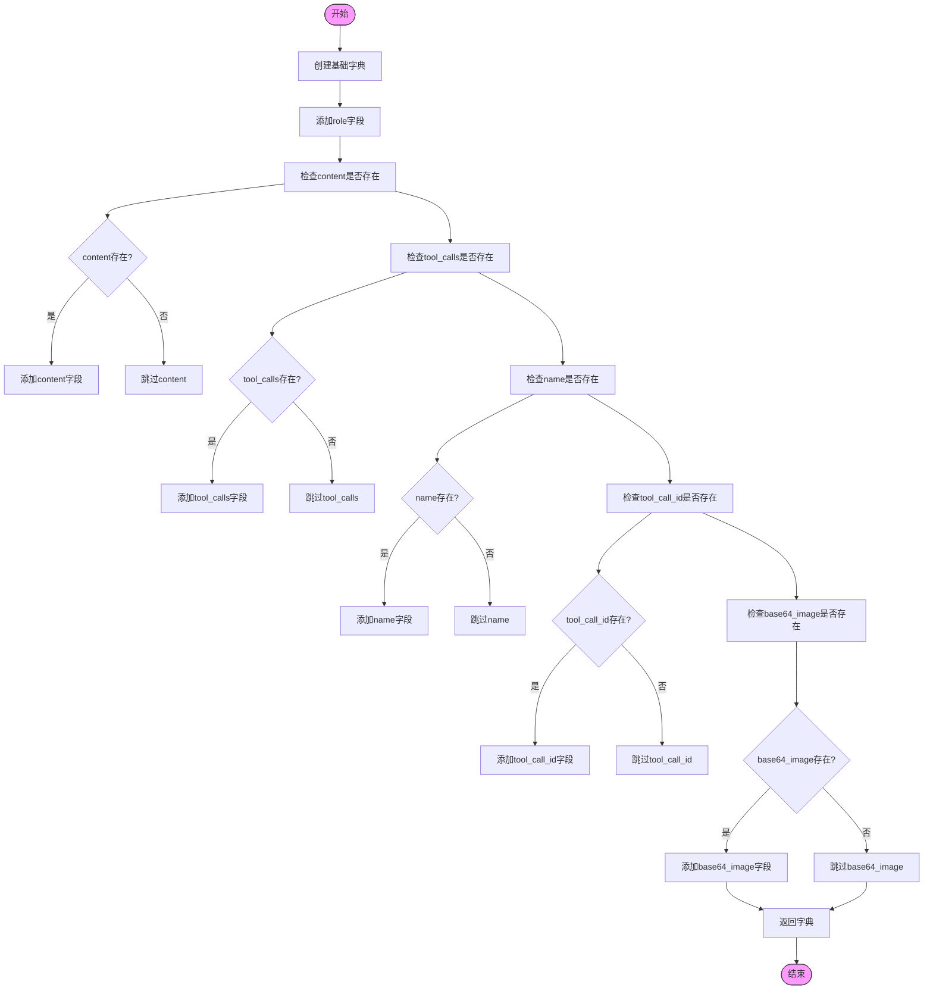
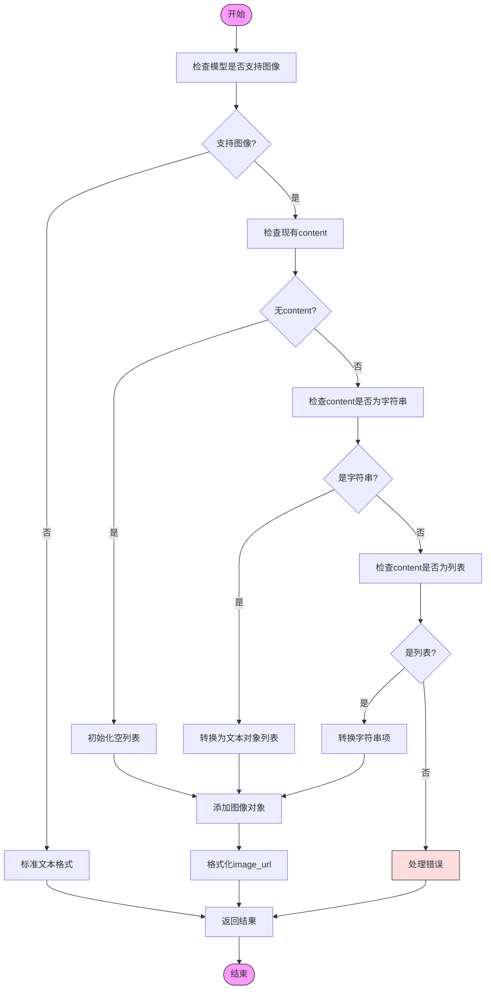
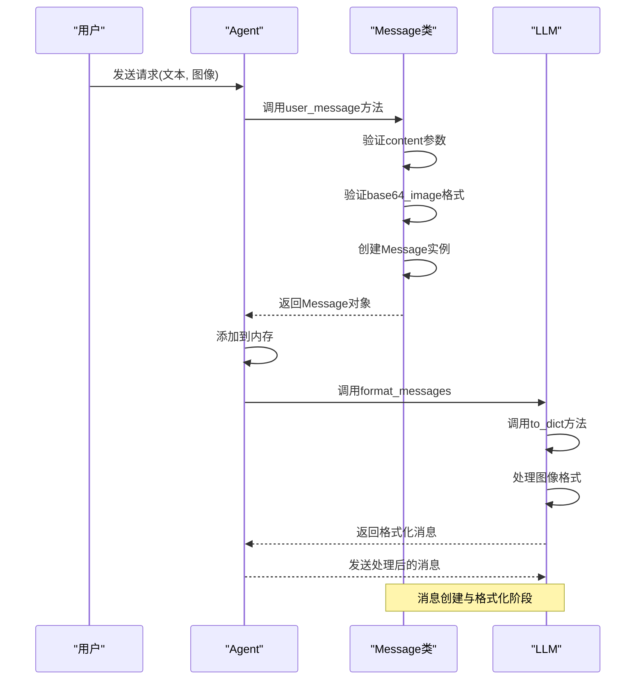
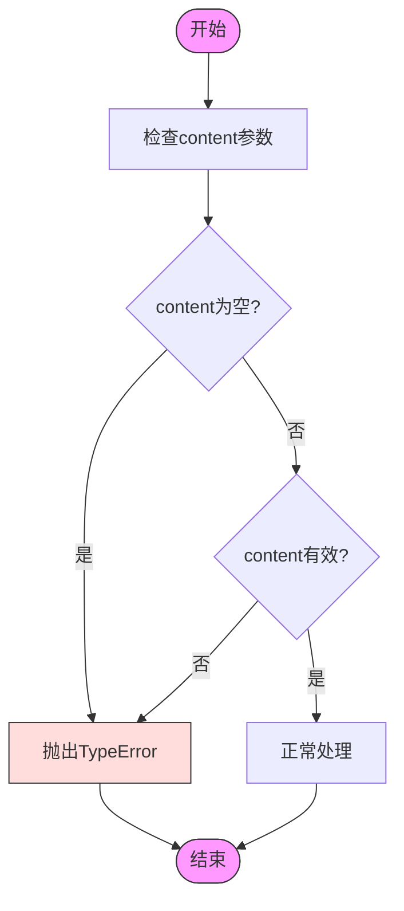
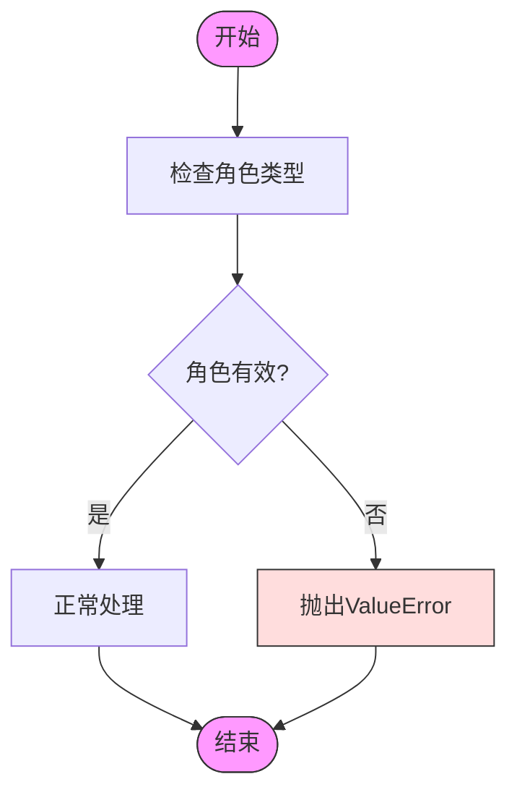
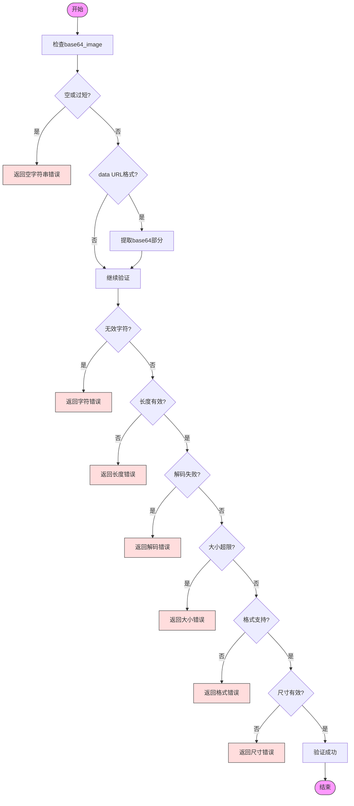

# 请求解析

<cite>
**本文档引用的文件**
- [schema.py](file://app/schema.py)
- [base.py](file://app/agent/base.py)
- [llm.py](file://app/llm.py)
- [sb_browser_tool.py](file://app/tool/sandbox/sb_browser_tool.py)
</cite>

## 目录
1. [简介](#简介)
2. [Message类结构](#message类结构)
3. [用户消息创建机制](#用户消息创建机制)
4. [角色类型定义与验证](#角色类型定义与验证)
5. [消息转换为字典](#消息转换为字典)
6. [完整转换流程](#完整转换流程)
7. [错误处理机制](#错误处理机制)

## 简介
本文档详细描述OpenManus系统中用户请求的参数解析机制，重点分析Message类如何处理用户输入、创建消息对象以及进行格式转换。文档涵盖了从原始用户输入到Message对象的完整转换流程，包括content和base64_image参数的处理、角色类型验证、字典格式转换以及错误处理机制。

## Message类结构
Message类是OpenManus系统中表示对话消息的核心数据结构，继承自Pydantic的BaseModel。该类定义了消息的基本属性和操作方法。



**图表来源**
- [schema.py](file://app/schema.py#L53-L155)

**本节来源**
- [schema.py](file://app/schema.py#L53-L155)

## 用户消息创建机制
Message类提供了user_message工厂方法来创建用户消息，该方法是处理用户请求的核心入口。

### user_message工厂方法
user_message是一个类方法，用于创建具有用户角色的消息实例。该方法接收content和可选的base64_image参数，返回一个Message对象。



**图表来源**
- [schema.py](file://app/schema.py#L99-L103)

**本节来源**
- [schema.py](file://app/schema.py#L99-L103)

### content参数处理
content参数是用户消息的主要文本内容，必须为字符串类型。在创建消息时，系统会直接将传入的content值赋给Message对象的content字段。

### base64_image参数处理
base64_image参数用于处理图像数据，其处理流程如下：

1. 接收base64编码的图像字符串
2. 验证base64格式的有效性
3. 检查图像大小限制（最大10MB）
4. 验证图像尺寸（最大8192x8192像素）
5. 确认支持的图像格式（JPEG、PNG、GIF、BMP、WEBP、TIFF）



**图表来源**
- [sb_browser_tool.py](file://app/tool/sandbox/sb_browser_tool.py#L113-L156)
- [sb_browser_tool.py](file://app/tool/sandbox/sb_browser_tool.py#L158-L182)

**本节来源**
- [schema.py](file://app/schema.py#L99-L103)
- [sb_browser_tool.py](file://app/tool/sandbox/sb_browser_tool.py#L113-L182)

## 角色类型定义与验证
Message类的role字段定义了消息发送者的角色类型，系统通过枚举和类型注解确保角色值的有效性。

### 角色类型定义
系统定义了四种角色类型，通过Role枚举类实现：

```python
class Role(str, Enum):
    SYSTEM = "system"
    USER = "user"
    ASSISTANT = "assistant"
    TOOL = "tool"
```

### 角色验证规则
角色验证通过以下机制实现：

1. 使用Python的Enum类确保角色值的枚举性
2. 通过Literal类型注解限制可接受的字符串值
3. 在创建消息时进行角色值验证



**图表来源**
- [schema.py](file://app/schema.py#L6-L12)
- [schema.py](file://app/schema.py#L15-L16)

**本节来源**
- [schema.py](file://app/schema.py#L6-L16)

## 消息转换为字典
Message类提供了to_dict方法，用于将消息对象转换为字典格式，以便与外部系统交互。

### to_dict方法实现
to_dict方法将Message对象转换为符合OpenAI消息格式的字典：



**图表来源**
- [schema.py](file://app/schema.py#L83-L96)

**本节来源**
- [schema.py](file://app/schema.py#L83-L96)

### 图像消息格式转换
当消息包含base64_image时，系统会将其转换为特定格式：



**图表来源**
- [llm.py](file://app/llm.py#L303-L331)

**本节来源**
- [llm.py](file://app/llm.py#L303-L331)

## 完整转换流程
从原始用户输入到Message对象的完整转换流程如下：



**图表来源**
- [schema.py](file://app/schema.py#L99-L103)
- [schema.py](file://app/schema.py#L83-L96)
- [llm.py](file://app/llm.py#L283-L301)

**本节来源**
- [schema.py](file://app/schema.py#L83-L103)
- [llm.py](file://app/llm.py#L283-L301)

## 错误处理机制
系统实现了全面的错误处理机制，确保对无效输入的正确响应。

### 空内容处理
当content参数为空或无效时，系统会抛出类型错误：



### 错误角色类型处理
当提供无效的角色类型时，系统会抛出ValueError：



### 图像验证错误处理
图像验证过程中可能遇到多种错误情况：



**图表来源**
- [sb_browser_tool.py](file://app/tool/sandbox/sb_browser_tool.py#L113-L156)
- [sb_browser_tool.py](file://app/tool/sandbox/sb_browser_tool.py#L158-L182)

**本节来源**
- [sb_browser_tool.py](file://app/tool/sandbox/sb_browser_tool.py#L113-L182)