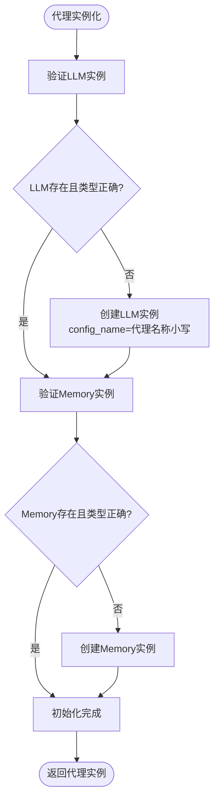
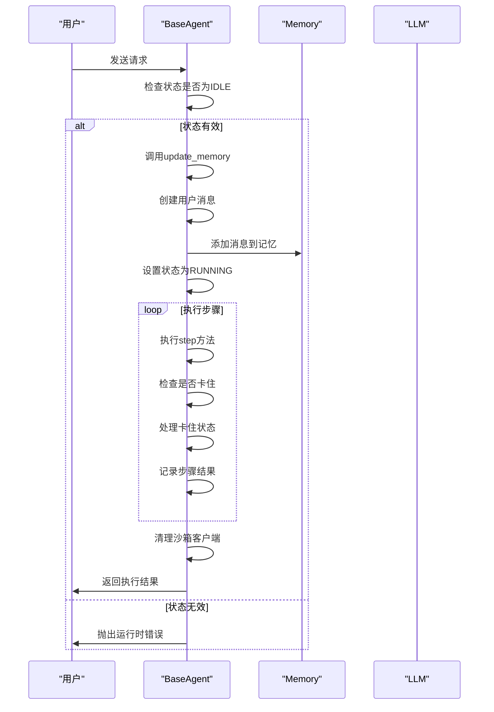
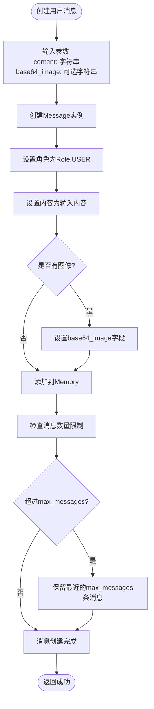
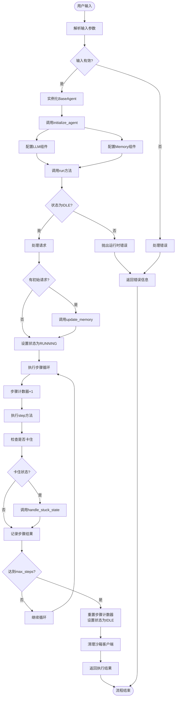

# 输入处理

<cite>
**本文档引用的文件**   
- [base.py](file://app/agent/base.py)
- [schema.py](file://app/schema.py)
</cite>

## 目录
1. [简介](#简介)
2. [核心组件](#核心组件)
3. [代理初始化流程](#代理初始化流程)
4. [请求处理与记忆更新](#请求处理与记忆更新)
5. [用户消息创建流程](#用户消息创建流程)
6. [完整流程图](#完整流程图)
7. [错误处理机制](#错误处理机制)

## 简介
本文档详细描述了OpenManus系统中用户请求的参数解析和代理实例化过程。重点解释了BaseAgent类的initialize_agent方法如何初始化LLM和Memory组件，以及run方法如何处理初始请求并更新记忆。同时说明了Message类的user_message工厂方法如何创建用户消息并添加到记忆中。文档提供了从用户输入到代理状态转换的完整流程，并包含了处理空请求或无效请求的错误处理机制。

## 核心组件

**Section sources**
- [base.py](file://app/agent/base.py#L12-L195)
- [schema.py](file://app/schema.py#L53-L155)

## 代理初始化流程

BaseAgent类的`initialize_agent`方法负责在代理实例化时初始化其核心组件。该方法使用Pydantic的`@model_validator`装饰器，在模型验证后自动执行，确保LLM和Memory组件的正确初始化。

当创建BaseAgent实例时，如果LLM实例未提供或类型不正确，系统会创建一个新的LLM实例，并使用代理名称的小写形式作为配置名称。同样，如果Memory实例不存在或类型不正确，系统会创建一个新的Memory实例。

**Diagram sources **
- [base.py](file://app/agent/base.py#L49-L55)

**Section sources**
- [base.py](file://app/agent/base.py#L49-L55)

## 请求处理与记忆更新

BaseAgent的`run`方法是代理执行主循环的核心，负责处理用户请求并管理执行流程。该方法首先检查代理是否处于IDLE状态，然后处理可选的初始用户请求。

`update_memory`方法负责将消息添加到代理的记忆存储中。它根据消息角色（用户、系统、助手、工具）使用相应的工厂方法创建消息，并将其添加到Memory组件中。

**Diagram sources **
- [base.py](file://app/agent/base.py#L115-L153)
- [base.py](file://app/agent/base.py#L83-L113)

**Section sources**
- [base.py](file://app/agent/base.py#L115-L153)
- [base.py](file://app/agent/base.py#L83-L113)

## 用户消息创建流程

Message类提供了多个类方法作为工厂方法，用于创建不同角色的消息。其中`user_message`方法专门用于创建用户消息，它接受内容和可选的base64编码图像作为参数。

当调用`user_message`方法时，它会创建一个Message实例，将角色设置为USER，内容设置为提供的文本，并可选择性地包含base64编码的图像数据。创建的消息随后被添加到Memory组件的消息列表中。

**Diagram sources **
- [schema.py](file://app/schema.py#L99-L103)
- [schema.py](file://app/schema.py#L162-L167)

**Section sources**
- [schema.py](file://app/schema.py#L99-L103)
- [schema.py](file://app/schema.py#L162-L167)

## 完整流程图

以下流程图展示了从用户输入到代理状态转换的完整过程，包括参数解析、代理实例化、请求处理和记忆更新的全过程。

**Diagram sources **
- [base.py](file://app/agent/base.py#L12-L195)
- [schema.py](file://app/schema.py#L53-L155)

## 错误处理机制

系统实现了多层次的错误处理机制，确保在各种异常情况下都能正确响应。当代理不在IDLE状态时尝试运行，会抛出RuntimeError。对于不支持的消息角色，会抛出ValueError。

此外，系统还实现了卡住状态检测机制。通过`is_stuck`方法检查最近的助手消息是否存在重复内容，如果重复次数超过`duplicate_threshold`阈值（默认为2），则认为代理处于卡住状态。此时，`handle_stuck_state`方法会向`next_step_prompt`添加提示，引导代理改变策略。

对于空请求或无效请求的处理主要体现在：
1. 当请求为空时，`run`方法会跳过`update_memory`调用，直接进入执行循环
2. 当消息角色不支持时，`update_memory`方法会抛出ValueError
3. 当代理状态不为IDLE时，`run`方法会抛出RuntimeError

这些机制共同确保了系统的健壮性和稳定性。

**Section sources**
- [base.py](file://app/agent/base.py#L115-L153)
- [base.py](file://app/agent/base.py#L83-L113)
- [base.py](file://app/agent/base.py#L156-L167)