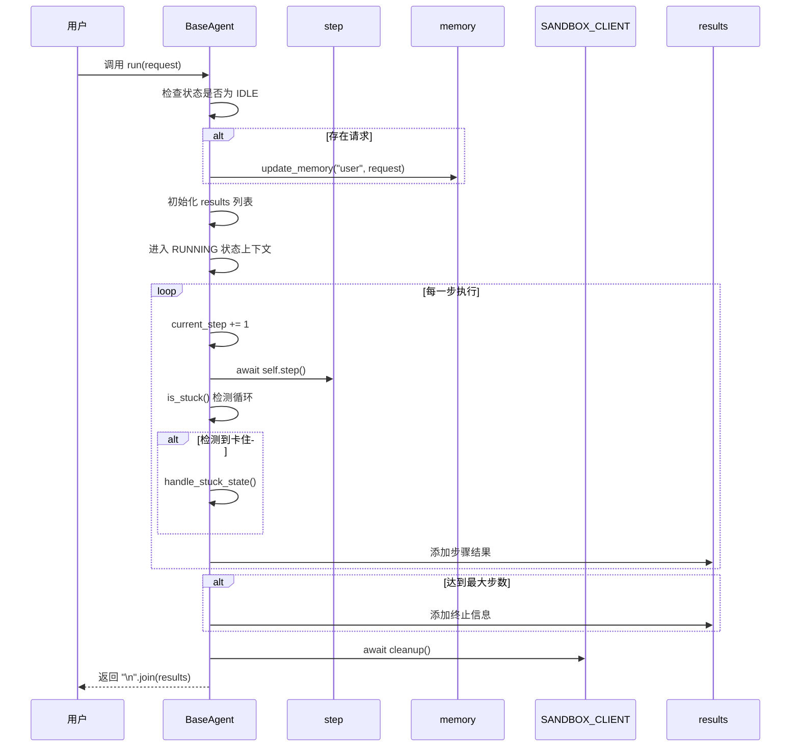
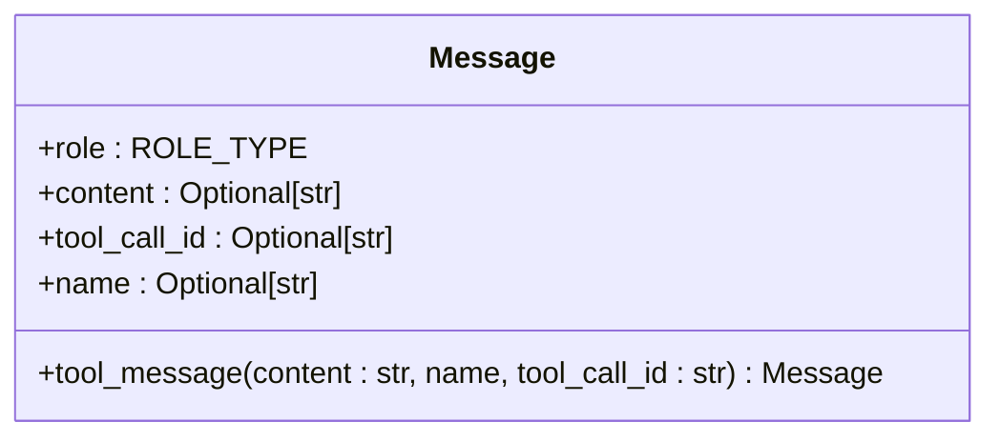
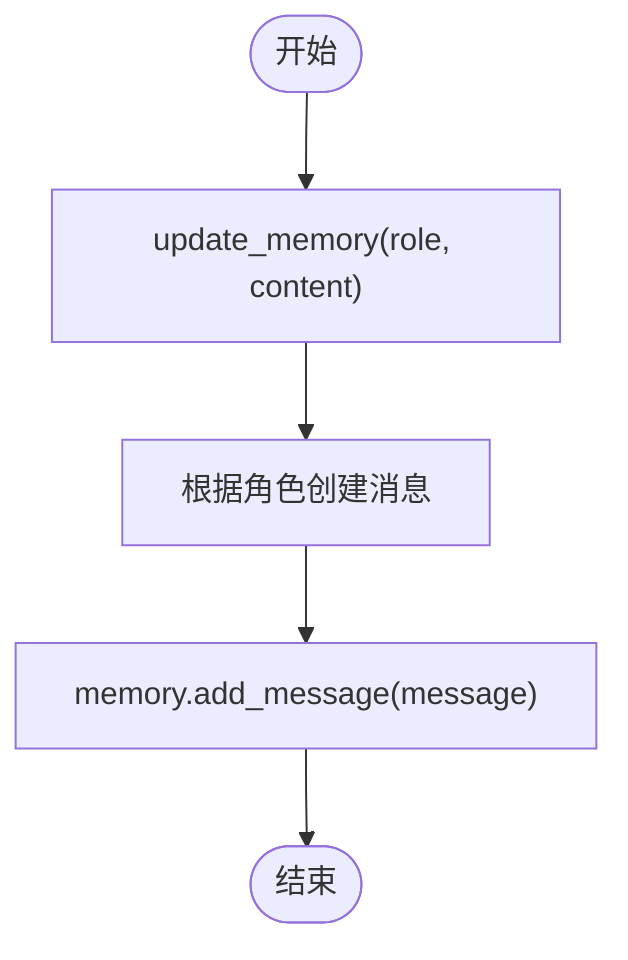

# 响应生成

<cite>
**本文档中引用的文件**  
- [base.py](file://app/agent/base.py)
- [schema.py](file://app/schema.py)
- [client.py](file://app/sandbox/client.py)
- [tool_collection.py](file://app/tool/tool_collection.py)
- [logger.py](file://app/utils/logger.py)
</cite>

## 目录
1. [简介](#简介)
2. [核心组件分析](#核心组件分析)
3. [响应生成流程](#响应生成流程)
4. [结果聚合机制](#结果聚合机制)
5. [工具消息转换](#工具消息转换)
6. [记忆系统作用](#记忆系统作用)
7. [性能优化建议](#性能优化建议)
8. [结论](#结论)

## 简介
本文档深入解析OpenManus框架中`BaseAgent.run`方法如何协调并聚合多个执行步骤的结果，以生成最终响应。重点说明`results`列表的构建过程、`Message.tool_message`工厂方法在对话消息转换中的作用、`memory`系统在状态管理中的角色，并提供关键性能优化策略。

## 核心组件分析

**Section sources**
- [base.py](file://app/agent/base.py#L1-L197)
- [schema.py](file://app/schema.py#L1-L188)

## 响应生成流程

**Diagram sources**
- [base.py](file://app/agent/base.py#L115-L153)

## 结果聚合机制

`BaseAgent.run`方法通过一个异步循环执行多个步骤，每个步骤的返回结果被格式化为字符串并追加到`results`列表中。该列表在循环结束后通过`"\n".join(results)`连接成最终的响应字符串。若未执行任何步骤，则返回默认消息“No steps executed”。

**Section sources**
- [base.py](file://app/agent/base.py#L115-L153)

## 工具消息转换

`Message.tool_message`是`Message`类的类方法，用于创建角色为`tool`的对话消息。它接收工具执行结果的内容、工具名称`name`和`tool_call_id`，并将其封装为符合对话协议的`Message`对象，确保工具输出能被后续步骤正确解析和处理。

**Diagram sources**
- [schema.py](file://app/schema.py#L118-L128)

## 记忆系统作用

`memory`系统通过`Memory`类管理对话历史，存储所有`Message`对象。`BaseAgent`通过`update_memory`方法向`memory`中添加消息，确保上下文信息在多步执行中持续可用。`is_stuck`方法利用`memory`中的消息历史检测重复响应，防止陷入无限循环。

**Diagram sources**
- [base.py](file://app/agent/base.py#L83-L113)
- [schema.py](file://app/schema.py#L140-L187)

## 性能优化建议

### 结果截断策略
可通过设置`max_steps`限制最大执行步数，防止无限循环。`is_stuck`方法通过检测连续重复的`assistant`消息来识别卡顿状态，并调用`handle_stuck_state`注入新提示以改变策略。

### 内存清理机制
`SANDBOX_CLIENT.cleanup()`在`run`方法末尾被调用，确保沙箱资源被及时释放，避免内存泄漏和资源占用。建议在长时间运行的代理中定期调用此方法。

**Section sources**
- [base.py](file://app/agent/base.py#L156-L185)
- [client.py](file://app/sandbox/client.py#L190-L195)

## 结论
`BaseAgent.run`方法通过结构化的步骤执行、结果聚合和状态管理，实现了可靠的响应生成。`memory`系统和`SANDBOX_CLIENT.cleanup`机制共同保障了系统的稳定性和性能。通过合理配置`max_steps`和利用`is_stuck`检测，可有效优化代理行为。