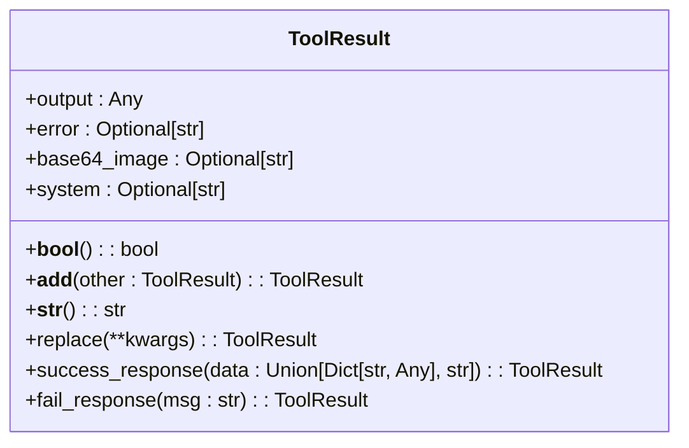
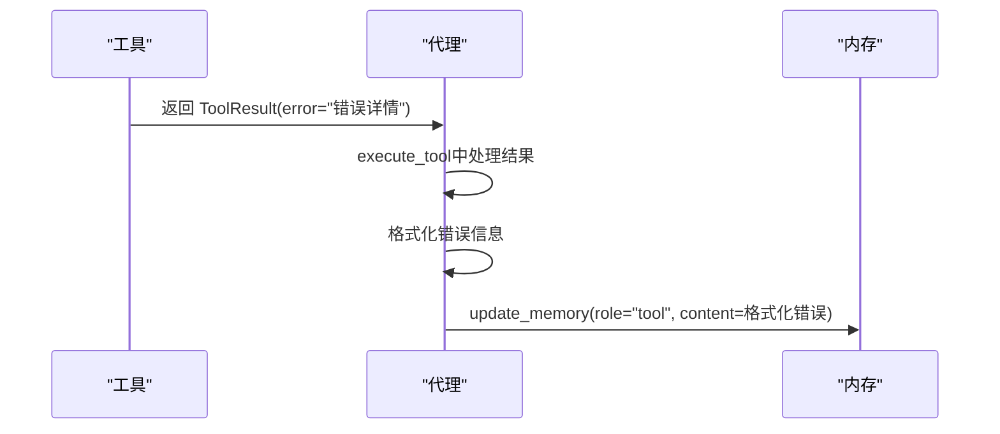
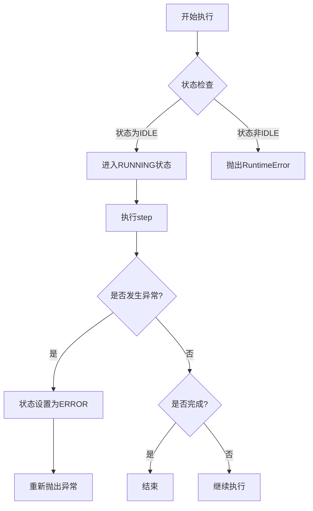

# 异常传播

<cite>
**本文档中引用的文件**  
- [app/agent/base.py](file://app/agent/base.py)
- [app/tool/base.py](file://app/tool/base.py)
- [app/schema.py](file://app/schema.py)
- [app/exceptions.py](file://app/exceptions.py)
- [app/agent/toolcall.py](file://app/agent/toolcall.py)
- [app/flow/planning.py](file://app/flow/planning.py)
</cite>

## 目录
1. [简介](#简介)
2. [工具层错误传播](#工具层错误传播)
3. [代理层错误处理](#代理层错误处理)
4. [状态转换逻辑](#状态转换逻辑)
5. [错误日志记录](#错误日志记录)
6. [完整错误传播路径](#完整错误传播路径)

## 简介
本文档详细描述了OpenManus框架中的异常传播机制。该机制从工具执行层开始，通过`ToolResult.error`字段向上传递错误信息，经过代理层的内存管理，最终影响代理的状态转换。文档重点分析了`BaseAgent.update_memory`方法如何处理错误消息的存储，`run`方法在遇到连续错误时的状态转换逻辑，以及`AgentState.ERROR`状态的触发条件和恢复机制。同时提供了错误日志记录的最佳实践，并对从工具层到代理层的完整错误传播路径进行了系统性分析。

## 工具层错误传播

工具层的错误传播机制以`ToolResult`类为核心，该类定义了工具执行结果的统一数据结构。当工具执行失败时，错误信息通过`error`字段进行封装和传递。

`ToolResult`类提供了`fail_response`方法来创建失败的执行结果。该方法接收一个错误消息字符串，并将其封装到`ToolResult`实例的`error`字段中。这种设计确保了所有工具的错误信息都遵循统一的格式，便于上层组件进行一致的处理。

**Diagram sources**
- [app/tool/base.py](file://app/tool/base.py#L37-L74)

**Section sources**
- [app/tool/base.py](file://app/tool/base.py#L37-L74)

## 代理层错误处理

代理层通过`BaseAgent.update_memory`方法处理来自工具层的错误消息。该方法负责将不同角色的消息（包括工具错误）存储到代理的内存中，为后续的决策提供上下文。

当工具执行返回包含错误信息的`ToolResult`时，`ToolCallAgent.execute_tool`方法会捕获这个结果，并通过`update_memory`方法将其作为工具角色的消息添加到内存中。具体来说，错误信息会被格式化为"Observed output of cmd `{name}` executed:\n{str(result)}"的形式，其中`result`就是`ToolResult`对象的字符串表示，会优先显示`error`字段的内容。

这种设计确保了错误信息能够被完整地记录在对话历史中，使得语言模型在后续的推理过程中能够感知到之前的失败，并据此调整策略。

**Diagram sources**
- [app/agent/base.py](file://app/agent/base.py#L83-L113)
- [app/agent/toolcall.py](file://app/agent/toolcall.py#L200-L225)

**Section sources**
- [app/agent/base.py](file://app/agent/base.py#L83-L113)
- [app/agent/toolcall.py](file://app/agent/toolcall.py#L17-L249)

## 状态转换逻辑

代理的状态转换逻辑由`run`方法和`state_context`上下文管理器共同控制。`AgentState`枚举定义了代理的四种状态：`IDLE`、`RUNNING`、`FINISHED`和`ERROR`。

`run`方法是代理的主执行循环，它在`state_context(AgentState.RUNNING)`的保护下运行。`state_context`是一个关键的上下文管理器，它确保了状态转换的安全性。当在`RUNNING`状态下发生任何异常时，`state_context`的`except`块会被触发，将代理的状态立即设置为`AgentState.ERROR`，然后重新抛出异常。

这种设计实现了错误的快速捕获和状态标记。一旦发生错误，代理就会进入`ERROR`状态，这可以防止系统在已知错误状态下继续执行，避免了错误的累积和扩散。

**Diagram sources**
- [app/agent/base.py](file://app/agent/base.py#L115-L153)
- [app/agent/base.py](file://app/agent/base.py#L60-L78)
- [app/schema.py](file://app/schema.py#L31-L37)

**Section sources**
- [app/agent/base.py](file://app/agent/base.py#L115-L153)
- [app/agent/base.py](file://app/agent/base.py#L60-L78)

## 错误日志记录

OpenManus框架采用了分层的日志记录策略，确保错误信息在不同层面都能被有效捕获。

在工具层，`execute_tool`方法使用`logger.exception`来记录工具执行过程中的异常。`exception`级别的日志不仅会记录错误消息，还会附带完整的堆栈跟踪信息，这对于调试和问题定位至关重要。

在代理层，`think`和`act`等核心方法使用`logger.error`来记录处理过程中的错误。这些日志提供了更高层次的上下文，例如"Oops! The {self.name}'s thinking process hit a snag: {e}"，帮助开发者理解错误发生的业务场景。

最佳实践建议：
1.  **使用适当的日志级别**：对于可恢复的警告使用`warning`，对于需要立即关注的严重错误使用`error`或`exception`。
2.  **提供丰富的上下文**：在日志消息中包含代理名称、工具名称、步骤编号等信息，便于追踪。
3.  **利用结构化日志**：`logger.info`被用于记录详细的执行信息，如输入/输出的token计数，这有助于性能分析和成本监控。

**Section sources**
- [app/agent/toolcall.py](file://app/agent/toolcall.py#L230-L235)
- [app/agent/toolcall.py](file://app/agent/toolcall.py#L145-L150)
- [app/llm.py](file://app/llm.py#L750-L755)

## 完整错误传播路径

从工具执行失败到代理状态变更，整个错误传播路径是一个清晰的、自下而上的过程。

1.  **工具执行失败**：工具在执行过程中遇到问题，调用`fail_response("错误详情")`方法，创建一个`ToolResult`实例，其`error`字段被设置为具体的错误信息。
2.  **错误返回**：`execute_tool`方法捕获到这个`ToolResult`，并将其作为字符串化的结果返回。
3.  **内存更新**：`act`方法调用`update_memory`，将包含错误信息的工具消息添加到代理的内存中。
4.  **异常抛出**：如果错误导致了Python异常（如`ValueError`），`execute_tool`会捕获并重新抛出，或者`think`方法在处理LLM响应时抛出异常。
5.  **状态变更**：异常传播到`run`方法的`state_context`，触发`except`块，将`self.state`设置为`AgentState.ERROR`。
6.  **清理与终止**：`state_context`的`finally`块确保状态被恢复，但此时代理已处于`ERROR`状态，主循环会因异常而终止。

这个路径确保了错误信息不仅被记录在对话历史中供LLM感知，同时也通过状态机被系统核心逻辑所识别，实现了双重的错误处理机制。

**Diagram sources**
- [app/tool/base.py](file://app/tool/base.py#L37-L74)
- [app/agent/toolcall.py](file://app/agent/toolcall.py#L200-L235)
- [app/agent/base.py](file://app/agent/base.py#L60-L78)

**Section sources**
- [app/tool/base.py](file://app/tool/base.py#L37-L74)
- [app/agent/toolcall.py](file://app/agent/toolcall.py#L17-L249)
- [app/agent/base.py](file://app/agent/base.py#L1-L196)
- [app/flow/planning.py](file://app/flow/planning.py#L44-L441)