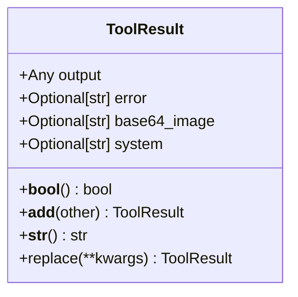
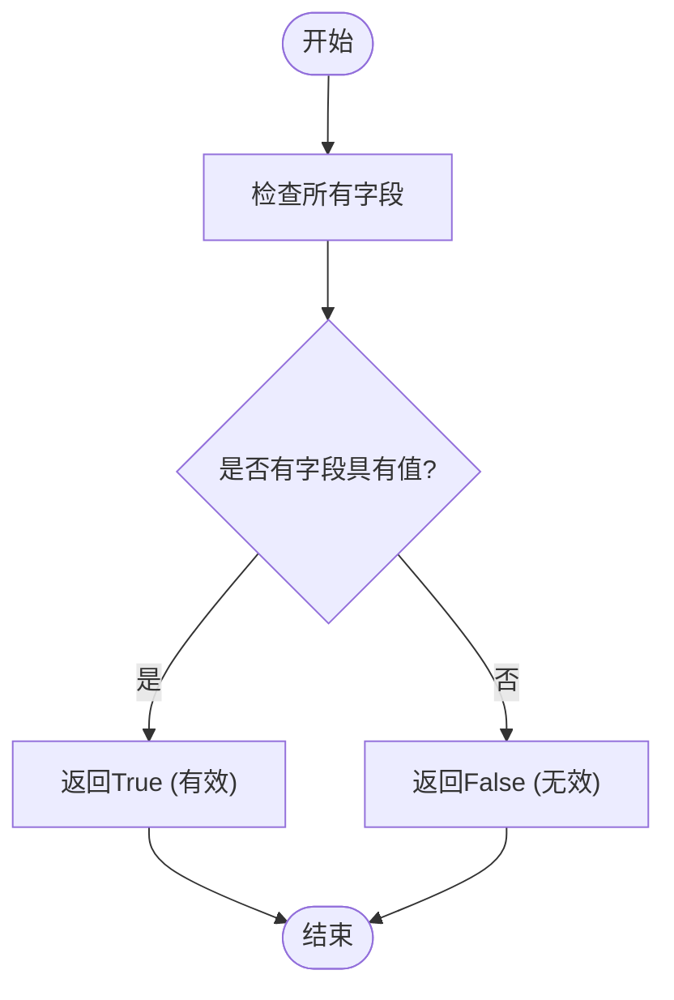
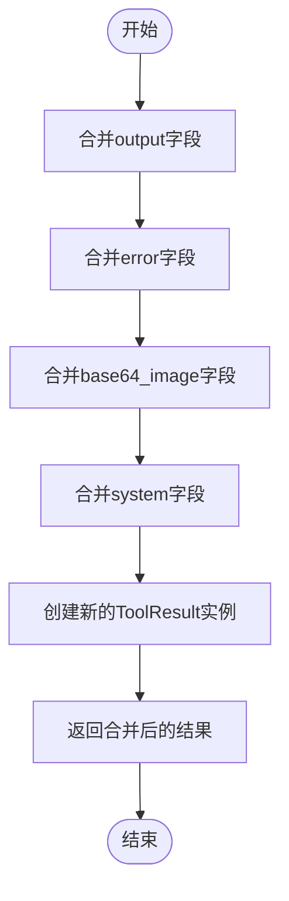
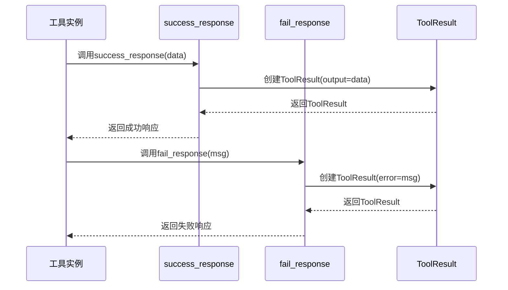
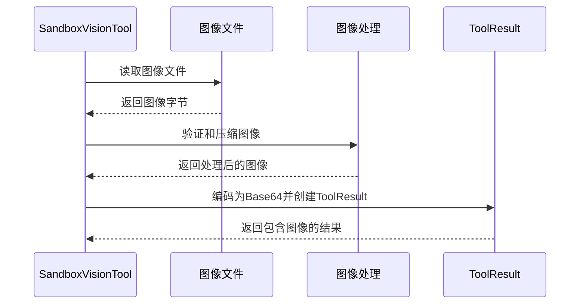

# 结果处理

<cite>
**Referenced Files in This Document**   
- [app/tool/base.py](file://app/tool/base.py)
- [app/tool/sandbox/sb_vision_tool.py](file://app/tool/sandbox/sb_vision_tool.py)
- [app/tool/chart_visualization/data_visualization.py](file://app/tool/chart_visualization/data_visualization.py)
</cite>

## 目录
1. [简介](#简介)
2. [核心组件](#核心组件)
3. [ToolResult类详解](#toolresult类详解)
4. [结果有效性判断](#结果有效性判断)
5. [结果合并机制](#结果合并机制)
6. [成功与失败响应创建](#成功与失败响应创建)
7. [视觉工具中的图像处理](#视觉工具中的图像处理)
8. [序列化与反序列化最佳实践](#序列化与反序列化最佳实践)

## 简介
OpenManus框架中的结果处理机制是其核心功能之一，负责封装和管理工具执行的输出、错误和图像数据。本文档详细说明了`ToolResult`类的设计与实现，该类作为所有工具执行结果的统一数据结构，提供了结果有效性判断、结果合并、序列化等关键功能。通过标准化的结果处理方式，OpenManus确保了不同工具之间的结果可以被一致地处理和传递。

## 核心组件
OpenManus的结果处理系统由多个核心组件构成，其中`ToolResult`类是基础数据结构，定义了工具执行结果的标准格式。`BaseTool`类作为所有工具的基类，提供了创建成功和失败响应的便捷方法。视觉工具（如`SandboxVisionTool`）则展示了如何在特定场景下使用`ToolResult`来处理图像数据。这些组件共同构成了一个健壮的结果处理体系，支持从简单文本输出到复杂图像数据的全面处理。

**Section sources**
- [app/tool/base.py](file://app/tool/base.py#L37-L74)
- [app/tool/sandbox/sb_vision_tool.py](file://app/tool/sandbox/sb_vision_tool.py#L106-L177)

## ToolResult类详解
`ToolResult`类是OpenManus中用于封装工具执行结果的核心数据结构。该类继承自Pydantic的`BaseModel`，确保了数据的类型安全和验证。`ToolResult`包含四个主要字段：`output`用于存储工具执行的正常输出，可以是任何类型的数据；`error`用于存储错误信息，为可选字符串类型；`base64_image`用于存储图像数据的Base64编码，支持视觉工具的图像传递；`system`用于存储系统级信息，为可选字符串类型。

**Diagram sources**
- [app/tool/base.py](file://app/tool/base.py#L37-L74)

**Section sources**
- [app/tool/base.py](file://app/tool/base.py#L37-L74)

## 结果有效性判断
`ToolResult`类通过实现`__bool__`方法来判断结果的有效性。该方法检查`ToolResult`实例的任何字段是否具有非空值，只要有一个字段包含数据，就认为结果是有效的。这种设计允许灵活的结果判断，无论是输出数据、错误信息还是图像数据的存在都表示结果具有意义。`__bool__`方法的实现简洁高效，通过遍历所有字段并检查其值，确保了结果有效性的准确判断。

**Diagram sources**
- [app/tool/base.py](file://app/tool/base.py#L48-L49)

**Section sources**
- [app/tool/base.py](file://app/tool/base.py#L48-L49)

## 结果合并机制
`ToolResult`类通过实现`__add__`方法支持结果的合并操作。该方法允许将两个`ToolResult`实例合并为一个新的实例，合并策略根据字段类型有所不同。对于`output`、`error`和`system`字段，采用字符串连接的方式进行合并；而对于`base64_image`字段，由于图像数据不能简单连接，采用"存在即优先"的策略，优先保留第一个结果中的图像数据。这种设计确保了结果合并的合理性和实用性，同时避免了不兼容数据的错误合并。

**Diagram sources**
- [app/tool/base.py](file://app/tool/base.py#L51-L66)

**Section sources**
- [app/tool/base.py](file://app/tool/base.py#L51-L66)

## 成功与失败响应创建
`BaseTool`类提供了`success_response`和`fail_response`两个便捷方法，用于创建标准化的成功和失败响应。`success_response`方法接受字符串或字典数据，将其转换为`ToolResult`实例，其中数据被格式化为JSON字符串存储在`output`字段中。`fail_response`方法则创建包含错误信息的`ToolResult`实例，将错误消息存储在`error`字段中。这些方法简化了工具开发者的响应创建过程，确保了结果的一致性和可预测性。

**Diagram sources**
- [app/tool/base.py](file://app/tool/base.py#L146-L172)

**Section sources**
- [app/tool/base.py](file://app/tool/base.py#L146-L172)

## 视觉工具中的图像处理
在视觉工具中，`base64_image`字段发挥着关键作用，用于传递和处理图像数据。以`SandboxVisionTool`为例，该工具在执行`see_image`操作时，会读取指定路径的图像文件，进行必要的压缩处理，然后将图像数据编码为Base64字符串，存储在`ToolResult`的`base64_image`字段中。这种设计使得图像数据可以方便地在不同组件间传递，同时保持了与文本数据相同的处理流程。图像处理过程中还包含了格式验证、大小限制和压缩优化等安全措施，确保了系统的稳定性和性能。

**Diagram sources**
- [app/tool/sandbox/sb_vision_tool.py](file://app/tool/sandbox/sb_vision_tool.py#L106-L177)

**Section sources**
- [app/tool/sandbox/sb_vision_tool.py](file://app/tool/sandbox/sb_vision_tool.py#L106-L177)

## 序列化与反序列化最佳实践
在处理`ToolResult`实例的序列化和反序列化时，应遵循以下最佳实践：首先，利用Pydantic模型的内置序列化功能，通过`dict()`方法将`ToolResult`实例转换为字典，然后使用`json.dumps()`进行JSON序列化；反序列化时，使用`ToolResult(**data)`构造函数从字典数据重建实例。对于包含图像数据的结果，应注意Base64编码的完整性，避免在序列化过程中损坏数据。此外，建议在序列化前后进行数据验证，确保结果的完整性和正确性。

**Section sources**
- [app/tool/base.py](file://app/tool/base.py#L37-L74)
- [app/tool/sandbox/sb_vision_tool.py](file://app/tool/sandbox/sb_vision_tool.py#L106-L177)