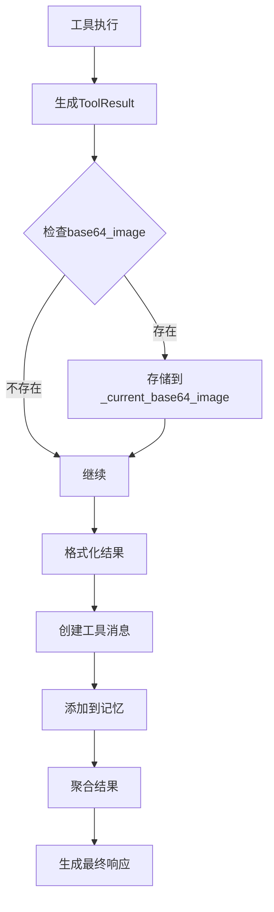

# 输出生成

<cite>
**本文档引用的文件**
- [ToolResult类定义](file://app/tool/base.py#L37-L74)
- [BaseAgent类定义](file://app/agent/base.py#L12-L195)
- [Message类定义](file://app/schema.py#L53-L155)
- [ToolCallAgent类定义](file://app/agent/toolcall.py#L17-L249)
- [ToolCollection类定义](file://app/tool/tool_collection.py#L24-L34)
</cite>

## 目录
1. [工具执行结果封装](#工具执行结果封装)
2. [工具结果到消息的转换](#工具结果到消息的转换)
3. [结果聚合与最终响应生成](#结果聚合与最终响应生成)
4. [数据流图](#数据流图)

## 工具执行结果封装

`ToolResult` 类用于封装工具执行的输出和错误信息。该类包含四个主要字段：`output` 用于存储工具执行的输出内容，`error` 用于存储错误信息，`base64_image` 用于存储图像数据，`system` 用于存储系统级信息。当工具执行成功时，`output` 字段会被填充；当执行失败时，`error` 字段会被填充。`__bool__` 方法通过检查这些字段是否为空来判断工具执行是否成功。`__add__` 方法允许将多个 `ToolResult` 对象合并，通过 `combine_fields` 函数处理各个字段的合并逻辑，其中 `output`、`error` 和 `system` 字段会被连接，而 `base64_image` 字段则不会被连接。

**Section sources**
- [app/tool/base.py](file://app/tool/base.py#L37-L74)

## 工具结果到消息的转换

`BaseAgent` 类通过 `update_memory` 方法将工具结果作为工具消息添加到记忆中。`Message` 类的 `tool_message` 工厂方法用于创建工具消息，该方法接收 `content`、`name`、`tool_call_id` 和可选的 `base64_image` 参数，并创建一个角色为 `TOOL` 的消息对象。在 `ToolCallAgent` 的 `act` 方法中，工具执行结果被格式化为字符串，并通过 `Message.tool_message` 方法创建工具消息，然后使用 `memory.add_message` 方法将其添加到记忆中。`_current_base64_image` 字段用于临时存储工具执行结果中的图像数据，以便在创建工具消息时使用。

**Section sources**
- [app/agent/base.py](file://app/agent/base.py#L83-L113)
- [app/schema.py](file://app/schema.py#L118-L128)
- [app/agent/toolcall.py](file://app/agent/toolcall.py#L130-L163)

## 结果聚合与最终响应生成

`run` 方法负责收集各步骤结果并生成最终响应。在 `ToolCallAgent` 的 `run` 方法中，`results` 列表用于收集每个工具调用的执行结果。`execute_tool` 方法执行单个工具调用，并返回格式化的结果字符串。`max_observe` 参数用于限制结果字符串的长度。所有工具调用的结果通过 `"\n\n".join(results)` 聚合为一个最终响应字符串。`cleanup` 方法确保在执行完成后清理资源。`_handle_special_tool` 方法用于处理特殊工具的执行，如 `Terminate` 工具，当检测到特殊工具时，会将代理状态设置为 `FINISHED`。

**Section sources**
- [app/agent/toolcall.py](file://app/agent/toolcall.py#L17-L249)
- [app/tool/tool_collection.py](file://app/tool/tool_collection.py#L24-L34)

## 数据流图

**Diagram sources**
- [app/tool/base.py](file://app/tool/base.py#L37-L74)
- [app/agent/toolcall.py](file://app/agent/toolcall.py#L17-L249)
- [app/schema.py](file://app/schema.py#L118-L128)