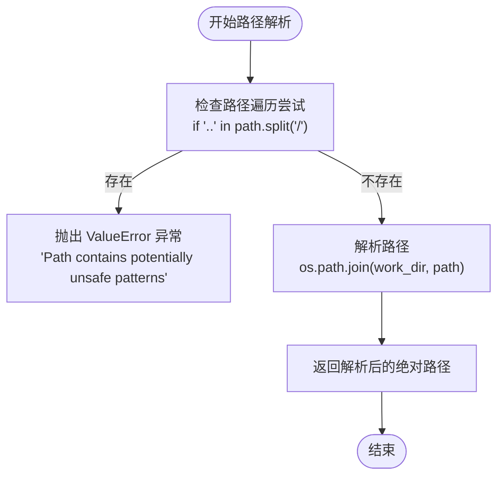
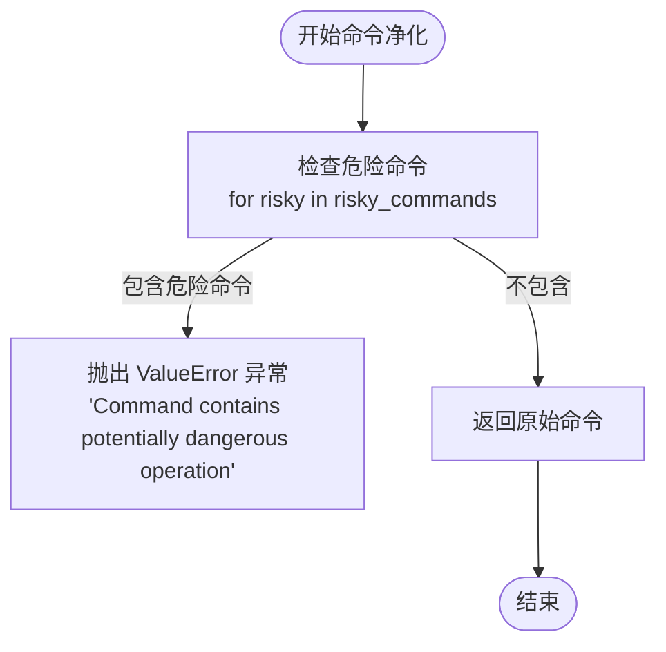
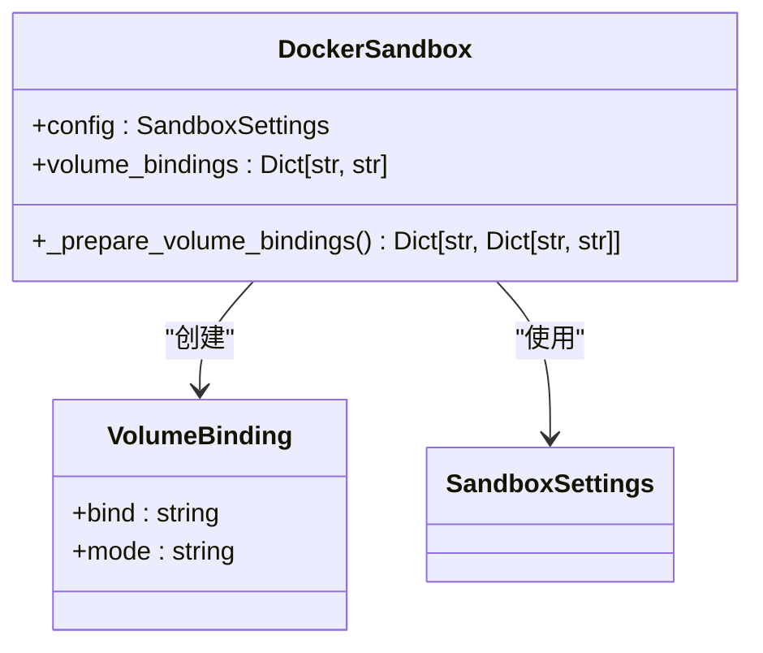
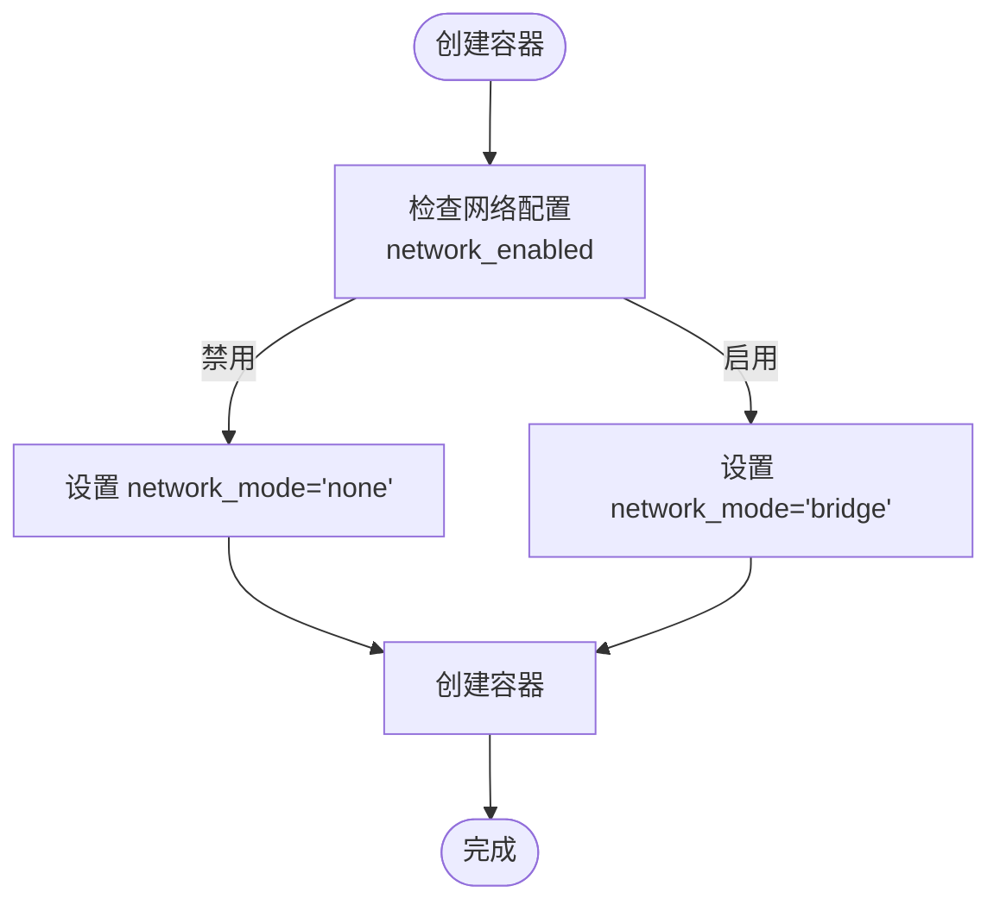

# 安全控制机制

<cite>
**本文档引用的文件**  
- [Dockerfile](file://Dockerfile)
- [sandbox.py](file://app/sandbox/core/sandbox.py)
- [terminal.py](file://app/sandbox/core/terminal.py)
- [manager.py](file://app/sandbox/core/manager.py)
- [config.py](file://app/config.py)
- [sb_shell_tool.py](file://app/tool/sandbox/sb_shell_tool.py)
- [sb_files_tool.py](file://app/tool/sandbox/sb_files_tool.py)
</cite>

## 目录
1. [引言](#引言)
2. [路径遍历防护机制](#路径遍历防护机制)
3. [环境变量与命令注入防护](#环境变量与命令注入防护)
4. [文件系统权限与挂载控制](#文件系统权限与挂载控制)
5. [网络隔离模式](#网络隔离模式)
6. [Docker基础镜像安全配置](#docker基础镜像安全配置)
7. [安全审计检查清单](#安全审计检查清单)
8. [结论](#结论)

## 引言

OpenManus沙箱系统通过多层安全机制保障代码执行环境的安全性。该系统基于Docker容器技术，实现了从路径访问控制、命令注入防护、文件系统权限管理到网络隔离的完整安全策略。本文档深入分析其核心安全控制机制，包括路径遍历防护、shell命令注入防御、文件系统挂载策略、网络隔离模式以及基础镜像的安全配置。通过这些机制，OpenManus确保了在自动化任务执行过程中能够有效防范各类安全威胁，为用户提供一个安全可靠的执行环境。

## 路径遍历防护机制

### _safe_resolve_path实现原理

OpenManus通过`_safe_resolve_path`方法实现路径遍历攻击的防护。该机制的核心在于对用户提供的路径进行严格的安全检查，防止攻击者通过`../`等路径遍历序列访问或修改容器内受保护的文件。



**Diagram sources**  
- [sandbox.py](file://app/sandbox/core/sandbox.py#L231-L252)

该方法首先将路径按`/`分割，检查是否存在`..`字符串。如果发现潜在的路径遍历模式，则立即抛出`ValueError`异常，阻止不安全的路径操作。对于合法路径，方法会将其与工作目录（`work_dir`）结合，生成容器内的绝对路径。这种实现方式简单而有效，能够阻止常见的路径遍历攻击，同时保持了路径解析的性能。

**Section sources**  
- [sandbox.py](file://app/sandbox/core/sandbox.py#L231-L252)

## 环境变量与命令注入防护

### 环境变量注入策略

OpenManus在创建Docker会话时注入了关键的环境变量`PYTHONUNBUFFERED=1`，确保Python程序的输出不会被缓冲，能够实时显示在终端中。这一设置通过`AsyncDockerizedTerminal`类的初始化过程实现，作为环境变量字典的一部分传递给容器。

```python
# 环境变量注入示例
env_vars={"PYTHONUNBUFFERED": "1"}
```

这种环境变量注入策略不仅提高了调试和监控的便利性，还通过标准化的环境配置减少了因环境差异导致的安全问题。

### Shell命令注入防护

系统通过`_sanitize_command`方法实现shell命令注入防护。该机制采用黑名单策略，检测并阻止执行已知的危险命令。



**Diagram sources**  
- [terminal.py](file://app/sandbox/core/terminal.py#L217-L247)

方法中定义了一个包含多个危险操作的黑名单，包括：
- `rm -rf /` 和 `rm -rf /*`：递归删除根目录
- `mkfs`：磁盘格式化命令
- `dd if=/dev/zero`：数据销毁命令
- `:(){:|:&};:`：Bash fork炸弹
- `chmod -R 777 /`：递归修改根目录权限
- `chown -R`：递归更改文件所有者

当检测到命令中包含这些危险模式时，系统会立即抛出异常，阻止命令执行。这种基于内容的检测机制能够有效防范常见的破坏性命令，但需要注意的是，它可能无法防御所有形式的命令注入攻击，特别是经过编码或混淆的攻击。

**Section sources**  
- [terminal.py](file://app/sandbox/core/terminal.py#L217-L247)
- [sb_shell_tool.py](file://app/tool/sandbox/sb_shell_tool.py)

## 文件系统权限与挂载控制

### 只读/读写权限控制

OpenManus通过Docker的卷绑定（volume bindings）机制实现文件系统的权限控制。在`_prepare_volume_bindings`方法中，系统为每个挂载点明确指定了访问模式。



**Diagram sources**  
- [sandbox.py](file://app/sandbox/core/sandbox.py#L146-L169)

系统默认为工作目录和自定义挂载点设置`rw`（读写）模式。这种显式的权限声明确保了文件系统访问的透明性和可控性。通过`volume_bindings`参数，用户可以灵活地将主机目录挂载到容器中，同时系统通过路径解析防护机制确保挂载操作的安全性。

### 隔离边界实现

文件系统隔离通过临时目录创建和卷绑定实现。`_ensure_host_dir`方法为每个沙箱创建唯一的临时目录，确保不同沙箱实例之间的文件系统隔离。

```python
# 临时目录创建逻辑
host_path = os.path.join(
    tempfile.gettempdir(),
    f"sandbox_{os.path.basename(path)}_{os.urandom(4).hex()}"
)
```

这种基于随机后缀的命名策略有效防止了目录冲突和潜在的跨沙箱访问，构建了严格的隔离边界。

**Section sources**  
- [sandbox.py](file://app/sandbox/core/sandbox.py#L146-L169)
- [sb_files_tool.py](file://app/tool/sandbox/sb_files_tool.py)

## 网络隔离模式

### network_mode="none"的实际效果

OpenManus通过设置`network_mode="none"`实现网络隔离。在`DockerSandbox.create`方法中，根据`network_enabled`配置决定网络模式。



**Diagram sources**  
- [sandbox.py](file://app/sandbox/core/sandbox.py#L78-L84)

当`network_enabled`为`False`时，容器将运行在完全隔离的网络环境中，无法访问外部网络，也无法被外部访问。这种配置有效防止了：
- 外部攻击者通过网络渗透沙箱
- 沙箱内恶意代码外泄数据
- 内部服务被意外暴露

网络隔离是纵深防御策略的重要组成部分，即使其他安全机制被绕过，网络隔离仍能限制攻击者的横向移动能力。

**Section sources**  
- [sandbox.py](file://app/sandbox/core/sandbox.py#L78-L84)
- [config.py](file://app/config.py#L103-L104)

## Docker基础镜像安全配置

### 最小化系统依赖

OpenManus采用`python:3.12-slim`作为基础镜像，这是一个经过精简的Python运行环境。Dockerfile中通过以下策略实现最小化依赖：

```dockerfile
FROM python:3.12-slim

WORKDIR /app/OpenManus

RUN apt-get update && apt-get install -y --no-install-recommends git curl \
    && rm -rf /var/lib/apt/lists/* \
    && (command -v uv >/dev/null 2>&1 || pip install --no-cache-dir uv)
```

这种配置具有以下安全优势：
- **减少攻击面**：精简的镜像包含更少的软件包，降低了因漏洞软件被利用的风险
- **快速更新**：较小的镜像体积使得安全更新和部署更加高效
- **明确依赖**：只安装必要的工具（git、curl），避免了不必要的服务和守护进程

### 非特权用户执行策略

虽然当前配置在Docker会话中以`root`用户执行命令，但系统通过其他机制实现权限控制：

```python
# 会话创建时的用户设置
environment={**env_vars, "TERM": "dumb", "PS1": "$ ", "PROMPT_COMMAND": ""},
user="root"
```

尽管使用了root用户，但系统的安全模型依赖于：
- **容器隔离**：Docker容器本身提供了进程和文件系统的隔离
- **资源限制**：通过`memory_limit`和`cpu_limit`参数限制容器资源使用
- **网络隔离**：默认禁用网络访问
- **执行超时**：通过`timeout`参数防止无限循环或拒绝服务攻击

这种设计在便利性和安全性之间取得了平衡，允许执行需要系统权限的操作，同时通过容器边界限制其影响范围。

**Section sources**  
- [Dockerfile](file://Dockerfile)
- [terminal.py](file://app/sandbox/core/terminal.py#L200-L205)
- [config.py](file://app/config.py#L96-L97)

## 安全审计检查清单

为确保OpenManus沙箱系统的安全性，建议定期进行以下审计检查：

### 路径遍历防护
- [ ] 验证`_safe_resolve_path`方法是否有效阻止`../`路径遍历
- [ ] 检查路径解析逻辑是否覆盖所有可能的绕过技术
- [ ] 确认工作目录配置是否合理

### 命令注入防护
- [ ] 更新危险命令黑名单以包含新发现的攻击模式
- [ ] 测试经过编码或混淆的危险命令是否能被正确检测
- [ ] 验证环境变量注入的安全性

### 文件系统控制
- [ ] 检查卷绑定配置是否遵循最小权限原则
- [ ] 验证临时目录创建的随机性是否足够强
- [ ] 确保文件操作工具的路径清理逻辑正确

### 网络隔离
- [ ] 确认`network_mode="none"`配置正确应用
- [ ] 测试容器是否无法发起外部网络连接
- [ ] 验证网络配置的可配置性

### 基础镜像安全
- [ ] 定期更新基础镜像以包含最新的安全补丁
- [ ] 扫描镜像依赖是否存在已知漏洞
- [ ] 评估是否可以进一步减少安装的软件包

### 潜在漏洞规避指南
1. **避免绝对路径暴露**：不要在错误消息中泄露容器内的绝对路径结构
2. **限制资源使用**：合理配置内存和CPU限制，防止拒绝服务攻击
3. **定期清理**：确保沙箱实例在使用后被正确清理，防止资源泄露
4. **日志监控**：监控沙箱操作日志，及时发现异常行为
5. **权限最小化**：在不影响功能的前提下，尽量降低执行权限

## 结论

OpenManus沙箱系统通过多层次的安全机制构建了一个相对安全的代码执行环境。其路径遍历防护、命令注入防御、文件系统控制和网络隔离等机制共同作用，有效降低了自动化任务执行过程中的安全风险。然而，安全是一个持续的过程，需要定期审计和更新防护策略。建议在实际部署中结合具体使用场景，进一步强化安全配置，特别是在生产环境中，应考虑实施更严格的权限控制和更全面的监控机制。