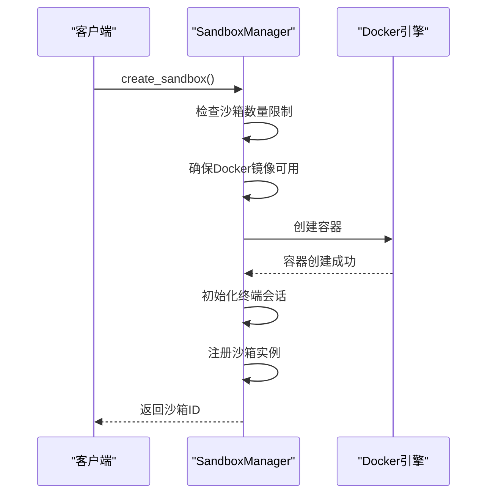
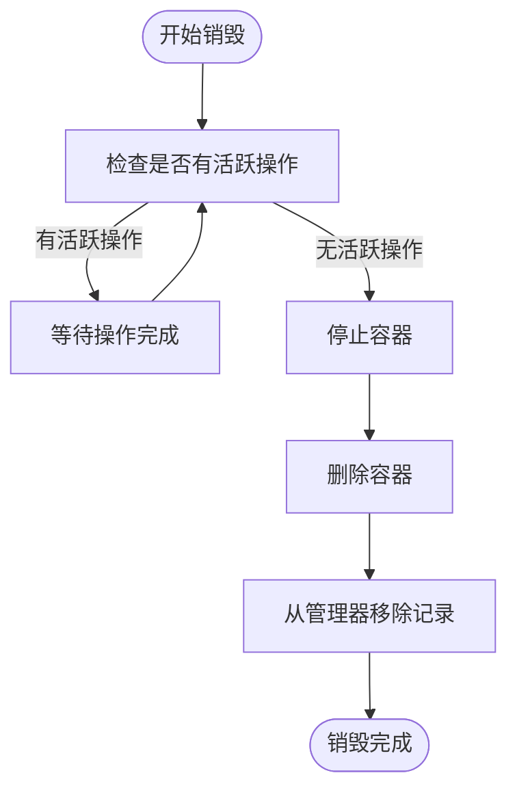
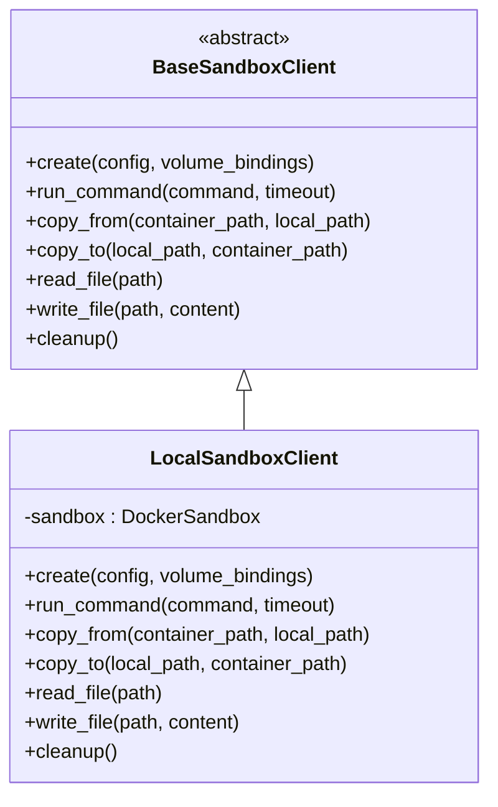
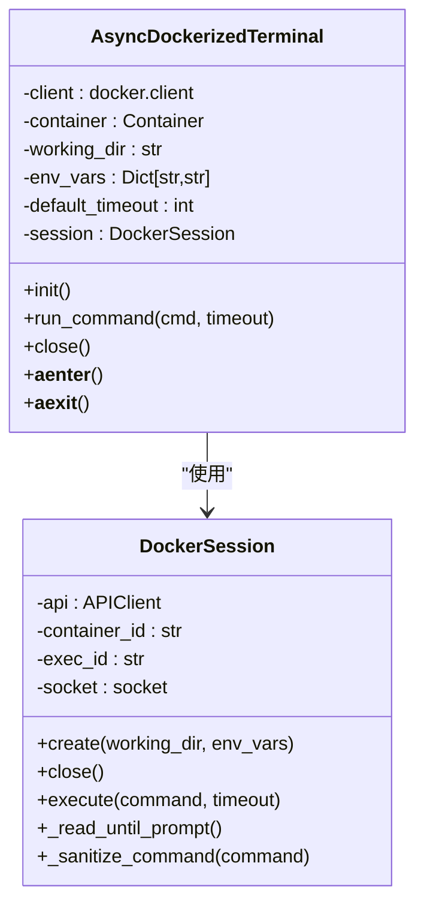
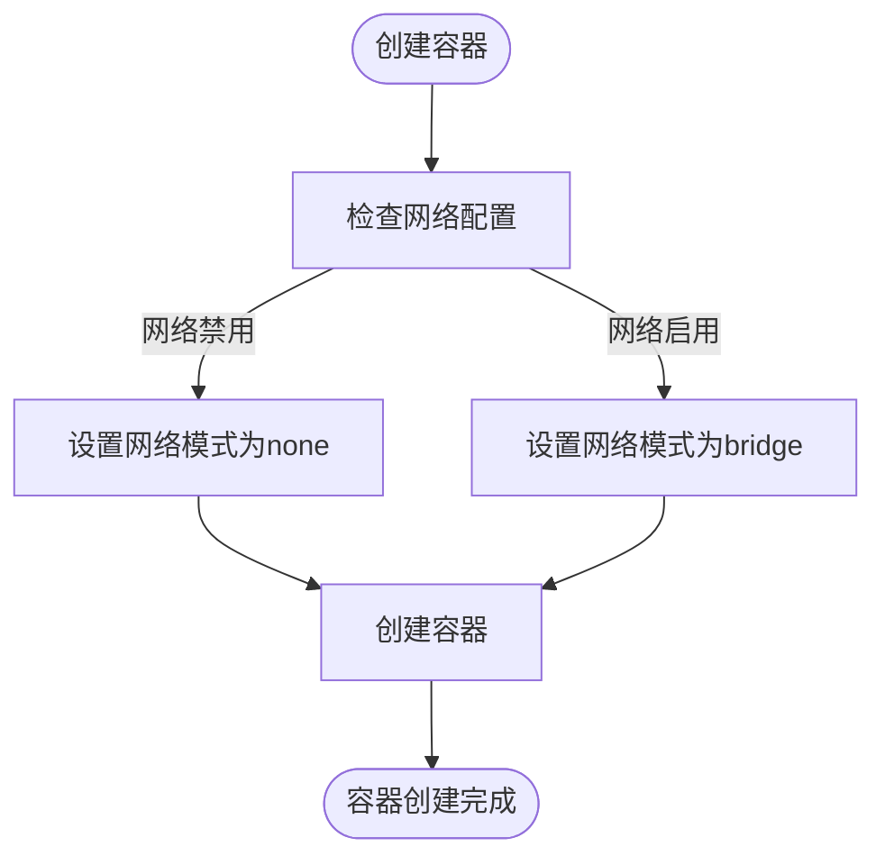
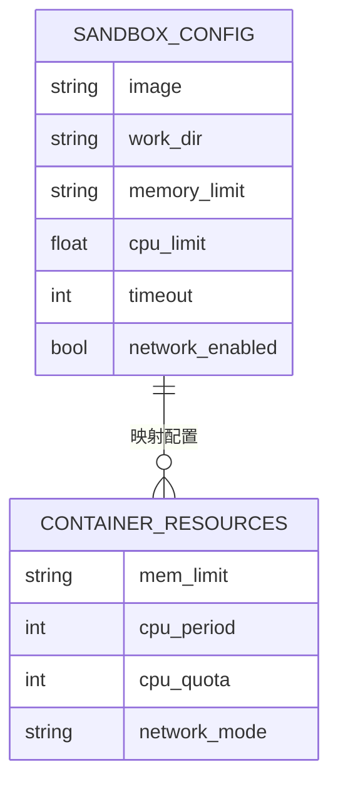
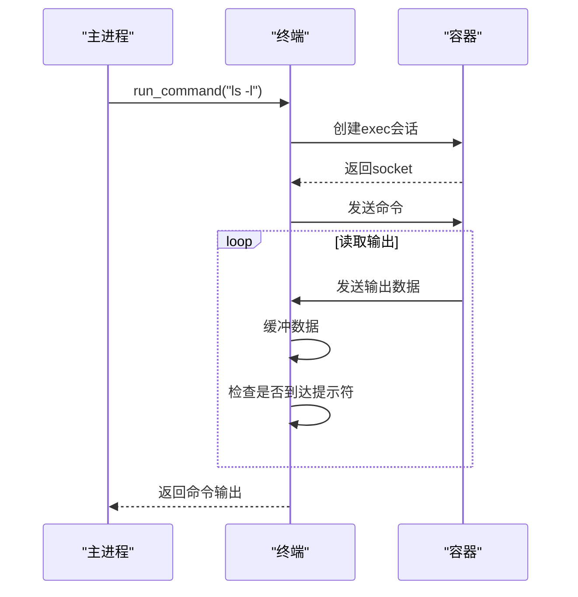
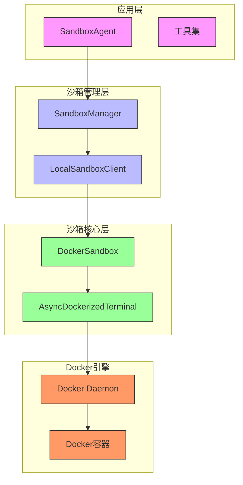
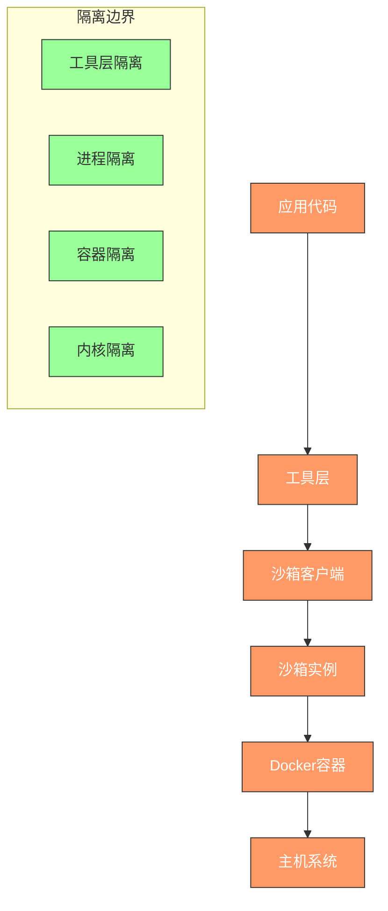

# 沙箱执行架构

<cite>
**本文档引用的文件**   
- [manager.py](file://app/sandbox/core/manager.py)
- [sandbox.py](file://app/sandbox/core/sandbox.py)
- [terminal.py](file://app/sandbox/core/terminal.py)
- [client.py](file://app/sandbox/client.py)
- [config.py](file://app/config.py)
- [sandbox_agent.py](file://app/agent/sandbox_agent.py)
</cite>

## 目录
1. [简介](#简介)
2. [沙箱管理器生命周期管理](#沙箱管理器生命周期管理)
3. [终端接口抽象与实现](#终端接口抽象与实现)
4. [安全控制机制](#安全控制机制)
5. [通信协议与数据交换](#通信协议与数据交换)
6. [沙箱架构部署图](#沙箱架构部署图)
7. [安全隔离层次图](#安全隔离层次图)
8. [性能优化与故障排查](#性能优化与故障排查)

## 简介
OpenManus沙箱执行架构基于Docker容器技术，为代码执行提供安全隔离的运行环境。该架构通过SandboxManager统一管理沙箱生命周期，利用Docker容器实现资源隔离和限制，并通过Terminal接口与容器进行交互。系统支持文件系统挂载、网络隔离和资源限制等安全控制机制，确保沙箱环境的安全性和稳定性。

## 沙箱管理器生命周期管理

SandboxManager是沙箱生命周期管理的核心组件，负责沙箱的创建、运行和销毁。它通过Docker API与容器引擎交互，管理多个DockerSandbox实例的生命周期。

### 沙箱创建流程
沙箱创建流程由`create_sandbox`方法实现，主要步骤包括：
1. 检查最大沙箱数量限制
2. 确保Docker镜像可用
3. 创建DockerSandbox实例
4. 启动容器并初始化终端
5. 注册沙箱实例到管理器



**Diagram sources**
- [manager.py](file://app/sandbox/core/manager.py#L113-L156)
- [sandbox.py](file://app/sandbox/core/sandbox.py#L88-L130)

### 沙箱销毁机制
沙箱销毁通过`delete_sandbox`方法实现，包含安全删除和自动清理两种机制：

1. **主动销毁**：通过`delete_sandbox`方法主动删除指定沙箱
2. **自动清理**：通过`_cleanup_idle_sandboxes`方法定期清理空闲沙箱
3. **全局清理**：通过`cleanup`方法在系统关闭时清理所有沙箱资源



**Diagram sources**
- [manager.py](file://app/sandbox/core/manager.py#L243-L275)
- [manager.py](file://app/sandbox/core/manager.py#L186-L203)

**Section sources**
- [manager.py](file://app/sandbox/core/manager.py#L243-L275)
- [manager.py](file://app/sandbox/core/manager.py#L186-L203)

## 终端接口抽象与实现

沙箱架构采用分层设计，通过Terminal接口实现与容器的交互，提供了清晰的抽象与具体实现分离。

### 接口抽象设计
系统定义了`BaseSandboxClient`抽象基类，规范了沙箱客户端的基本操作接口：



**Diagram sources**
- [client.py](file://app/sandbox/client.py#L52-L101)

### Docker终端实现
`AsyncDockerizedTerminal`是Docker终端的具体实现，通过`DockerSession`与容器进行交互：



**Diagram sources**
- [terminal.py](file://app/sandbox/core/terminal.py#L100-L346)

**Section sources**
- [terminal.py](file://app/sandbox/core/terminal.py#L100-L346)

## 安全控制机制

沙箱架构通过多层次的安全控制机制确保执行环境的安全性。

### 文件系统挂载
文件系统挂载通过`_prepare_volume_bindings`方法实现，将主机临时目录挂载到容器工作目录：

```python
def _prepare_volume_bindings(self) -> Dict[str, Dict[str, str]]:
    bindings = {}
    # 创建并添加工作目录映射
    work_dir = self._ensure_host_dir(self.config.work_dir)
    bindings[work_dir] = {"bind": self.config.work_dir, "mode": "rw"}
    # 添加自定义卷绑定
    for host_path, container_path in self.volume_bindings.items():
        bindings[host_path] = {"bind": container_path, "mode": "rw"}
    return bindings
```

**Section sources**
- [sandbox.py](file://app/sandbox/core/sandbox.py#L198-L212)

### 网络隔离
网络隔离通过Docker的网络模式配置实现，在容器创建时根据配置决定是否启用网络：



**Section sources**
- [sandbox.py](file://app/sandbox/core/sandbox.py#L98-L105)

### 资源限制
资源限制通过Docker的资源控制参数实现，包括内存和CPU限制：



**Section sources**
- [sandbox.py](file://app/sandbox/core/sandbox.py#L95-L98)

## 通信协议与数据交换

沙箱与主进程之间的通信通过异步API实现，支持命令执行和文件操作。

### 命令执行协议
命令执行通过终端会话实现，包含命令发送、输出读取和超时控制：



**Diagram sources**
- [terminal.py](file://app/sandbox/core/terminal.py#L200-L250)

### 文件数据交换
文件数据交换通过Docker的存档功能实现，使用tar格式在主机和容器之间传输文件：


**Diagram sources**
- [sandbox.py](file://app/sandbox/core/sandbox.py#L370-L420)

**Section sources**
- [sandbox.py](file://app/sandbox/core/sandbox.py#L370-L420)

## 沙箱架构部署图



**Diagram sources**
- [sandbox_agent.py](file://app/agent/sandbox_agent.py#L71-L106)
- [manager.py](file://app/sandbox/core/manager.py#L13-L312)
- [sandbox.py](file://app/sandbox/core/sandbox.py#L13-L462)
- [terminal.py](file://app/sandbox/core/terminal.py#L1-L346)

## 安全隔离层次图



**Diagram sources**
- [sandbox.py](file://app/sandbox/core/sandbox.py#L13-L462)
- [manager.py](file://app/sandbox/core/manager.py#L13-L312)

## 性能优化与故障排查

### 性能优化建议
1. **连接池优化**：复用Docker客户端连接，减少连接创建开销
2. **批量操作**：合并多个文件操作为单个tar包传输
3. **资源预分配**：预创建常用沙箱实例，减少启动延迟
4. **缓存机制**：缓存常用Docker镜像，避免重复拉取

### 故障排查指南
1. **沙箱创建失败**：
   - 检查Docker服务是否正常运行
   - 验证Docker镜像是否可访问
   - 检查系统资源是否充足

2. **命令执行超时**：
   - 检查命令是否陷入死循环
   - 增加`timeout`配置值
   - 优化命令执行逻辑

3. **文件操作失败**：
   - 验证文件路径是否正确
   - 检查目录权限
   - 确认容器是否正常运行

4. **网络连接问题**：
   - 检查网络配置
   - 验证防火墙设置
   - 确认DNS解析正常

**Section sources**
- [manager.py](file://app/sandbox/core/manager.py#L64-L85)
- [sandbox.py](file://app/sandbox/core/sandbox.py#L174-L216)
- [terminal.py](file://app/sandbox/core/terminal.py#L200-L250)