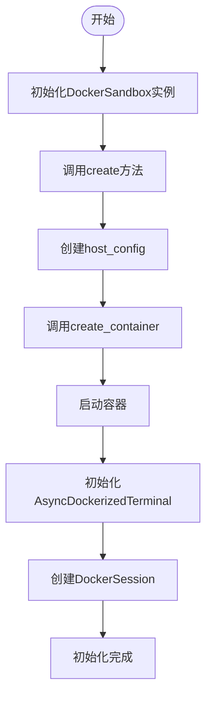
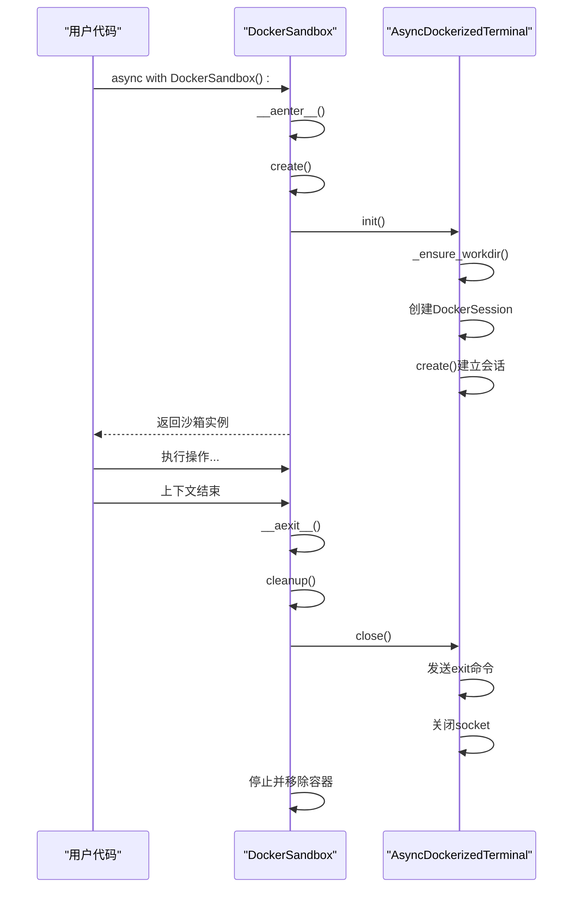
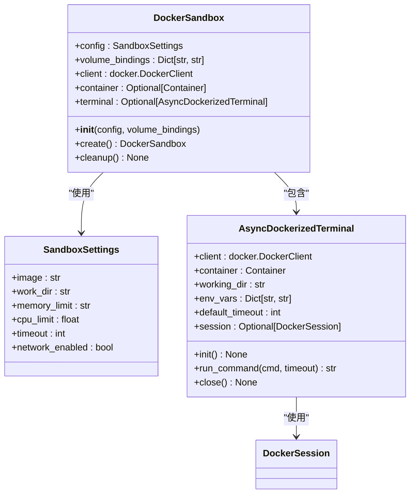
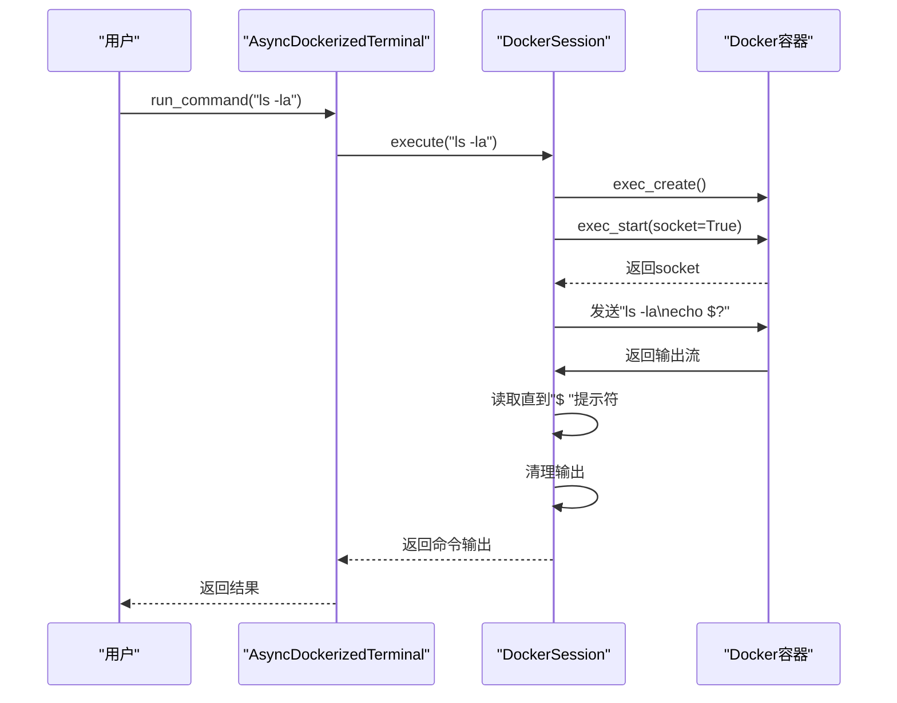
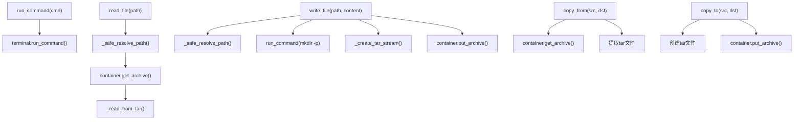
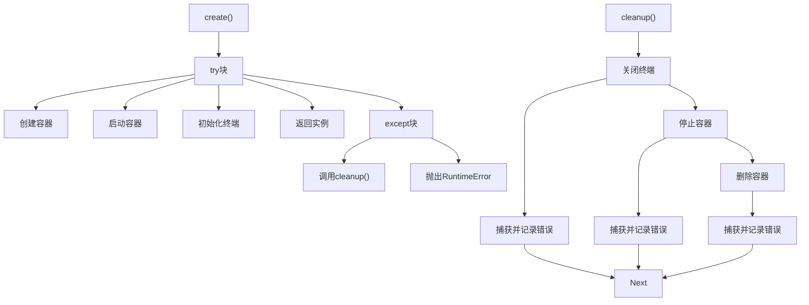

# 沙箱核心机制

<cite>
**本文档引用文件**  
- [sandbox.py](file://app/sandbox/core/sandbox.py)
- [terminal.py](file://app/sandbox/core/terminal.py)
- [client.py](file://app/sandbox/client.py)
- [exceptions.py](file://app/sandbox/core/exceptions.py)
- [test_sandbox.py](file://tests/sandbox/test_sandbox.py)
</cite>

## 目录
1. [简介](#简介)
2. [DockerSandbox初始化流程](#dockersandbox初始化流程)
3. [异步上下文管理器实现](#异步上下文管理器实现)
4. [容器安全配置](#容器安全配置)
5. [Terminal接口交互逻辑](#terminal接口交互逻辑)
6. [核心方法调用链路](#核心方法调用链路)
7. [异常处理与资源清理](#异常处理与资源清理)
8. [调试指南](#调试指南)

## 简介
OpenManus沙箱系统提供了一个安全的容器化执行环境，用于隔离和运行不受信任的代码。该系统基于Docker技术，通过`DockerSandbox`类实现完整的生命周期管理，包括容器创建、命令执行、文件操作和资源清理。本文档详细说明其核心机制，重点关注初始化流程、异步上下文管理、安全配置和异常处理策略。

## DockerSandbox初始化流程

`DockerSandbox`类的初始化过程始于`__init__`方法，该方法接收可选的`SandboxSettings`配置和卷绑定映射。在初始化阶段，系统会创建Docker客户端实例，并将容器和终端实例初始化为`None`。真正的容器创建发生在`create`方法中，该方法通过`asyncio.to_thread`异步调用Docker API来创建和启动容器。

容器创建过程中，系统首先使用`create_host_config`方法配置资源限制，然后生成唯一的容器名称，最后通过`create_container`API创建容器实例。容器启动后，系统会初始化`AsyncDockerizedTerminal`终端接口，建立与容器的交互式会话。

**Diagram sources**
- [sandbox.py](file://app/sandbox/core/sandbox.py#L48-L102)
- [terminal.py](file://app/sandbox/core/terminal.py#L277-L288)

**Section sources**
- [sandbox.py](file://app/sandbox/core/sandbox.py#L31-L46)
- [sandbox.py](file://app/sandbox/core/sandbox.py#L48-L102)

## 异步上下文管理器实现

`DockerSandbox`类实现了异步上下文管理器协议，通过`__aenter__`和`__aexit__`方法提供资源的自动管理。当使用`async with`语句进入上下文时，`__aenter__`方法会调用`create`方法创建并返回沙箱实例。在退出上下文时，`__aexit__`方法会自动调用`cleanup`方法清理所有资源。

这种设计确保了即使在发生异常的情况下，沙箱资源也能被正确释放，避免了资源泄漏问题。`AsyncDockerizedTerminal`类同样实现了异步上下文管理器，确保终端会话的正确初始化和关闭。

**Diagram sources**
- [sandbox.py](file://app/sandbox/core/sandbox.py#L455-L461)
- [terminal.py](file://app/sandbox/core/terminal.py#L338-L345)

**Section sources**
- [sandbox.py](file://app/sandbox/core/sandbox.py#L455-L461)
- [terminal.py](file://app/sandbox/core/terminal.py#L338-L345)

## 容器安全配置

在容器创建过程中，`host_config`配置了多项安全和资源限制参数，确保沙箱环境的安全隔离。内存限制通过`mem_limit`参数设置，CPU使用率通过`cpu_period`和`cpu_quota`参数控制，网络隔离通过`network_mode`参数实现。

当`network_enabled`配置为`False`时，容器将运行在`none`网络模式下，完全隔离网络访问；当为`True`时，则使用`bridge`模式允许有限的网络连接。此外，系统通过`_safe_resolve_path`方法防止路径遍历攻击，确保文件操作的安全性。

**Diagram sources**
- [sandbox.py](file://app/sandbox/core/sandbox.py#L60-L78)
- [sandbox.py](file://app/sandbox/core/sandbox.py#L231-L252)

**Section sources**
- [sandbox.py](file://app/sandbox/core/sandbox.py#L60-L78)
- [sandbox.py](file://app/sandbox/core/sandbox.py#L231-L252)

## Terminal接口交互逻辑

`Terminal`接口通过`AsyncDockerizedTerminal`类实现与容器的交互。系统首先创建`DockerSession`实例，该实例通过Docker API的`exec_create`和`exec_start`方法建立与容器的交互式会话。会话创建时，系统会执行一个启动命令，设置工作目录和环境变量，并启动一个无配置的bash shell。

命令执行通过`execute`方法实现，该方法将命令发送到容器的socket，然后读取输出直到遇到提示符。系统会自动处理命令的退出状态，并通过正则表达式清理输出中的提示符标记。`_sanitize_command`方法会对命令进行安全检查，防止执行危险操作。

**Diagram sources**
- [terminal.py](file://app/sandbox/core/terminal.py#L250-L345)
- [terminal.py](file://app/sandbox/core/terminal.py#L315-L331)

**Section sources**
- [terminal.py](file://app/sandbox/core/terminal.py#L250-L345)
- [terminal.py](file://app/sandbox/core/terminal.py#L315-L331)

## 核心方法调用链路

`run_command`、`read_file`和`write_file`等核心方法构成了沙箱系统的主要功能接口。`run_command`方法通过`AsyncDockerizedTerminal`的`run_command`方法执行命令，实现了超时控制和输出处理。`read_file`和`write_file`方法则通过Docker的`get_archive`和`put_archive`API实现文件的读写操作。

`copy_from`和`copy_to`方法提供了主机与容器之间的文件复制功能，它们使用tar格式进行数据传输。`_create_tar_stream`和`_read_from_tar`静态方法负责tar流的创建和解析，确保了文件传输的可靠性。

**Diagram sources**
- [sandbox.py](file://app/sandbox/core/sandbox.py#L139-L163)
- [sandbox.py](file://app/sandbox/core/sandbox.py#L165-L195)
- [sandbox.py](file://app/sandbox/core/sandbox.py#L197-L229)

**Section sources**
- [sandbox.py](file://app/sandbox/core/sandbox.py#L139-L229)

## 异常处理与资源清理

系统实现了全面的异常处理机制，`exceptions.py`文件定义了`SandboxError`基类及其子类`SandboxTimeoutError`和`SandboxResourceError`。当命令执行超时时，系统会捕获`TimeoutError`并抛出`SandboxTimeoutError`异常。

`cleanup`方法负责清理沙箱资源，它会按顺序关闭终端会话、停止容器和删除容器实例。该方法实现了容错处理，即使在清理过程中发生错误，也会继续执行后续的清理步骤。`create`方法中的异常处理确保了在初始化失败时能够自动调用`cleanup`，防止资源泄漏。

**Diagram sources**
- [sandbox.py](file://app/sandbox/core/sandbox.py#L424-L453)
- [exceptions.py](file://app/sandbox/core/exceptions.py#L0-L16)

**Section sources**
- [sandbox.py](file://app/sandbox/core/sandbox.py#L424-L453)
- [exceptions.py](file://app/sandbox/core/exceptions.py#L0-L16)

## 调试指南

为了调试沙箱生命周期问题，开发者可以使用`test_sandbox.py`中的测试用例作为参考。这些测试覆盖了工作目录配置、文件操作、Python执行、网络访问和清理过程等各个方面。通过分析测试输出，可以快速定位问题所在。

建议的调试方法包括：检查Docker守护进程状态、验证容器配置参数、监控资源使用情况、查看清理过程中的错误日志。对于超时问题，可以调整`timeout`配置参数；对于文件操作问题，可以检查路径解析和tar流处理逻辑。

**Section sources**
- [test_sandbox.py](file://tests/sandbox/test_sandbox.py#L0-L152)