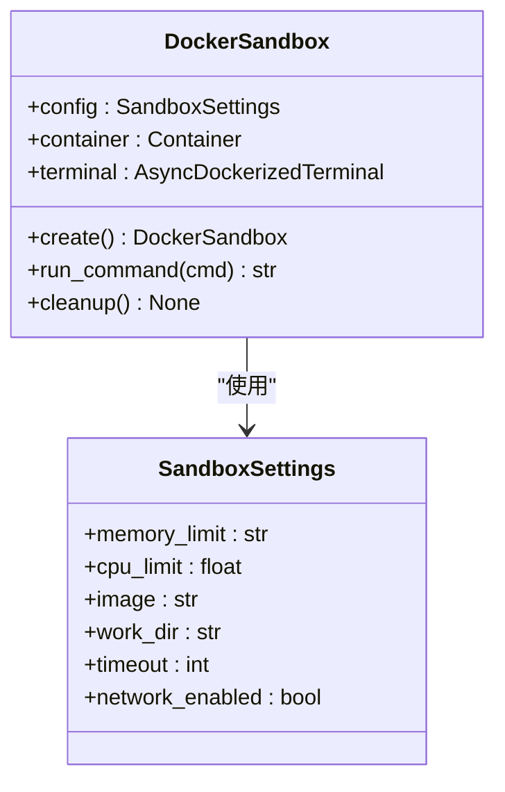
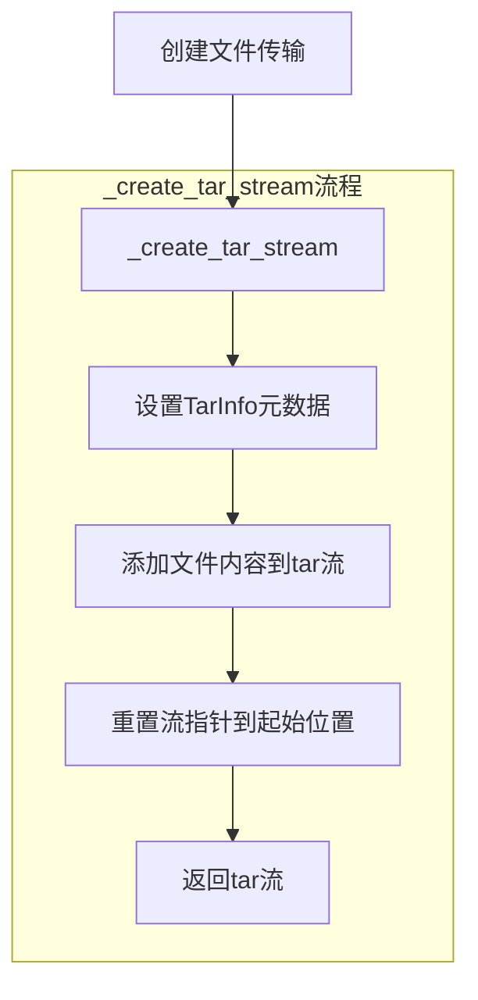
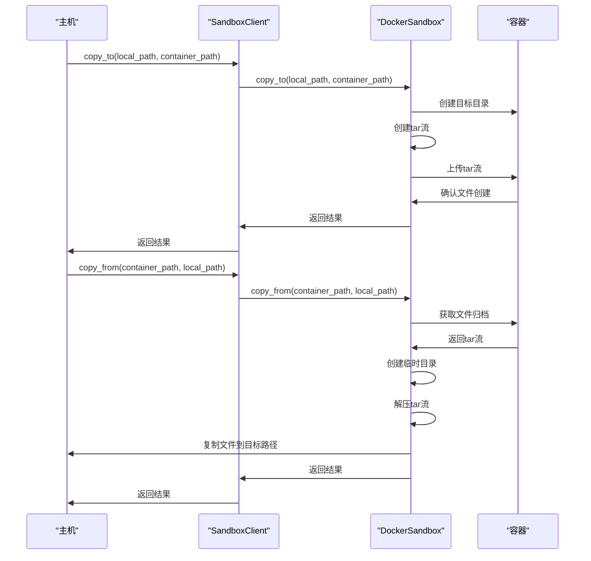
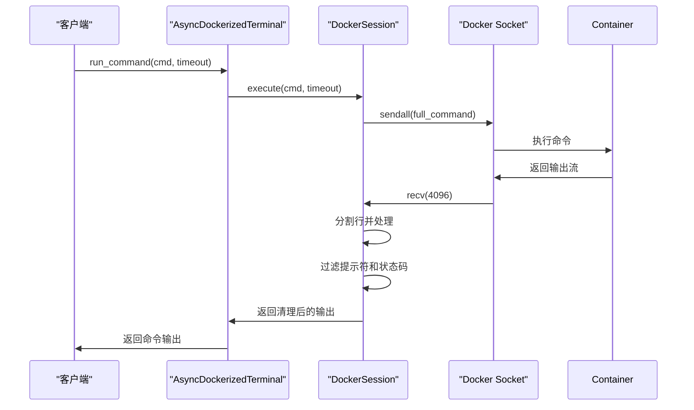
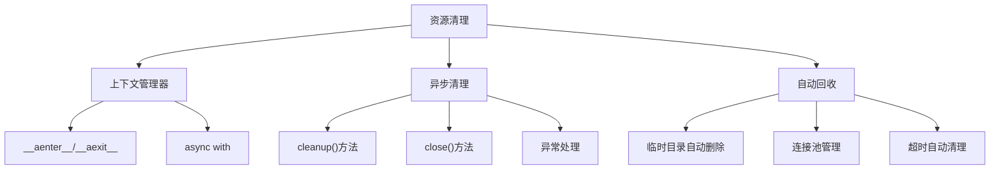

# 资源管理与通信

<cite>
**本文档引用文件**  
- [sandbox.py](file://app/sandbox/core/sandbox.py)
- [manager.py](file://app/sandbox/core/manager.py)
- [terminal.py](file://app/sandbox/core/terminal.py)
- [client.py](file://app/sandbox/client.py)
- [files_utils.py](file://app/utils/files_utils.py)
</cite>

## 目录
1. [简介](#简介)
2. [项目结构](#项目结构)
3. [核心组件](#核心组件)
4. [资源限制配置](#资源限制配置)
5. [文件传输机制](#文件传输机制)
6. [容器内外文件复制](#容器内外文件复制)
7. [异步Socket通信](#异步socket通信)
8. [资源泄漏预防与性能优化](#资源泄漏预防与性能优化)
9. [结论](#结论)

## 简介
本文档详细描述OpenManus沙箱系统的资源管理与通信机制。重点分析基于Docker API的资源限制配置、文件传输中的tar流处理、容器内外文件复制的双向数据流，以及异步socket通信在命令执行中的应用。同时提供资源泄漏预防措施和性能优化建议。

## 项目结构
OpenManus沙箱系统主要由核心沙箱模块、管理器、终端通信和客户端接口组成。核心功能位于`app/sandbox/core`目录下，包括沙箱容器管理、终端通信和异常处理。客户端接口提供统一的沙箱操作API。

**Section sources**
- [sandbox.py](file://app/sandbox/core/sandbox.py#L1-L463)
- [manager.py](file://app/sandbox/core/manager.py#L1-L314)
- [terminal.py](file://app/sandbox/core/terminal.py#L1-L347)

## 核心组件
系统核心组件包括Docker沙箱容器、沙箱管理器、异步终端会话和客户端接口。DockerSandbox类提供容器化执行环境，SandboxManager管理多个沙箱实例的生命周期，AsyncDockerizedTerminal处理异步命令执行，客户端接口提供统一的操作API。

**Section sources**
- [sandbox.py](file://app/sandbox/core/sandbox.py#L17-L461)
- [manager.py](file://app/sandbox/core/manager.py#L13-L312)
- [terminal.py](file://app/sandbox/core/terminal.py#L250-L345)

## 资源限制配置
### Docker资源限制实现
系统通过Docker API配置容器的内存和CPU限制，确保沙箱环境的资源隔离和安全性。

**Diagram sources**
- [sandbox.py](file://app/sandbox/core/sandbox.py#L48-L102)
- [sandbox.py](file://app/sandbox/core/sandbox.py#L31-L46)

### 内存与CPU限制配置
系统在创建容器时通过`create_host_config`方法设置资源限制：

- **memory_limit**: 设置容器内存限制，防止内存耗尽攻击
- **cpu_quota**: 基于cpu_period计算CPU使用配额，实现CPU资源限制
- **network_mode**: 根据network_enabled配置网络模式

资源限制在`DockerSandbox.create()`方法中应用，确保每个沙箱容器在指定的资源范围内运行。

**Section sources**
- [sandbox.py](file://app/sandbox/core/sandbox.py#L48-L102)
- [sandbox.py](file://app/sandbox/core/sandbox.py#L104-L120)

## 文件传输机制
### tar_stream构建与解析
系统使用tar格式在主机和容器之间传输文件，通过流式处理提高效率和安全性。

**Diagram sources**
- [sandbox.py](file://app/sandbox/core/sandbox.py#L377-L393)
- [sandbox.py](file://app/sandbox/core/sandbox.py#L396-L422)

### _create_tar_stream实现
`_create_tar_stream`静态方法创建tar文件流：

1. 创建内存中的BytesIO流
2. 使用tarfile模块打开流进行写入
3. 创建TarInfo对象并设置文件名和大小
4. 将文件内容添加到tar归档
5. 重置流指针到起始位置以便读取

该方法确保文件传输的安全性和效率，避免临时文件的创建。

**Section sources**
- [sandbox.py](file://app/sandbox/core/sandbox.py#L377-L393)

### _read_from_tar解析
`_read_from_tar`静态方法解析tar流：

1. 创建临时文件存储tar流数据
2. 将流数据写入临时文件
3. 使用tarfile模块打开临时文件
4. 读取第一个成员文件
5. 提取并返回文件内容

该方法处理tar流的解析，确保文件内容正确提取。

**Section sources**
- [sandbox.py](file://app/sandbox/core/sandbox.py#L396-L422)

## 容器内外文件复制
### 双向数据流
系统实现容器与主机之间的双向文件复制，支持文件和目录的传输。

**Diagram sources**
- [sandbox.py](file://app/sandbox/core/sandbox.py#L314-L374)
- [sandbox.py](file://app/sandbox/core/sandbox.py#L254-L312)
- [client.py](file://app/sandbox/client.py#L140-L152)

### copy_to实现
`copy_to`方法将文件从主机复制到容器：

1. 验证源文件存在
2. 在容器内创建目标目录
3. 创建临时目录用于构建tar文件
4. 使用tarfile模块创建tar归档
5. 支持单个文件和目录的复制
6. 上传tar数据到容器
7. 验证文件创建成功

该方法处理了文件复制的完整流程，包括错误处理和验证。

**Section sources**
- [sandbox.py](file://app/sandbox/core/sandbox.py#L314-L374)

### copy_from实现
`copy_from`方法将文件从容器复制到主机：

1. 确保目标目录存在
2. 从容器获取文件归档流
3. 创建临时目录存储tar文件
4. 将流数据写入临时tar文件
5. 解压tar文件
6. 根据目标路径类型处理文件提取
7. 处理目录和文件的不同情况

该方法实现了从容器到主机的安全文件复制。

**Section sources**
- [sandbox.py](file://app/sandbox/core/sandbox.py#L254-L312)

### 临时目录管理
系统使用Python的tempfile模块管理临时目录：

- **TemporaryDirectory**: 用于`copy_to`操作，创建临时目录构建tar文件
- **NamedTemporaryFile**: 用于`_read_from_tar`，创建临时文件存储tar流数据
- **自动清理**: 上下文管理器确保临时目录在使用后自动删除

临时目录管理确保了文件传输过程中的资源安全和自动清理。

**Section sources**
- [sandbox.py](file://app/sandbox/core/sandbox.py#L314-L374)
- [sandbox.py](file://app/sandbox/core/sandbox.py#L254-L312)
- [sandbox.py](file://app/sandbox/core/sandbox.py#L396-L422)

## 异步socket通信
### 命令执行流程
系统使用异步socket通信实现非阻塞的命令执行和输出读取。

**Diagram sources**
- [terminal.py](file://app/sandbox/core/terminal.py#L138-L215)
- [terminal.py](file://app/sandbox/core/terminal.py#L315-L331)

### 非阻塞读写
系统通过socket的非阻塞模式实现异步通信：

- **setblocking(False)**: 设置socket为非阻塞模式
- **EWOULDBLOCK处理**: 捕获EWOULDBLOCK错误并进行重试
- **asyncio.sleep(0.1)**: 在重试前短暂休眠，避免忙等待

非阻塞读写确保了高并发环境下的通信效率。

**Section sources**
- [terminal.py](file://app/sandbox/core/terminal.py#L30-L72)
- [terminal.py](file://app/sandbox/core/terminal.py#L116-L136)

### 超时控制
系统实现多层次的超时控制：

- **命令级超时**: 通过`asyncio.wait_for`设置命令执行超时
- **会话级超时**: 在`execute`方法中应用超时参数
- **默认超时**: 配置default_timeout作为后备值

超时控制防止了长时间运行的命令占用资源。

**Section sources**
- [terminal.py](file://app/sandbox/core/terminal.py#L138-L215)
- [terminal.py](file://app/sandbox/core/terminal.py#L315-L331)

### 输出流解复用（demux）
系统通过Docker API的demux功能分离stdout和stderr：

- **stream=True, demux=True**: 在exec_start调用中启用流式传输和解复用
- **socket接收**: 从socket接收混合的输出流
- **行分割处理**: 按换行符分割输出并逐行处理
- **提示符过滤**: 移除命令提示符"$ "和状态码

输出流解复用确保了命令输出的清晰和可读性。

**Section sources**
- [terminal.py](file://app/sandbox/core/terminal.py#L30-L72)
- [terminal.py](file://app/sandbox/core/terminal.py#L138-L215)

## 资源泄漏预防与性能优化
### 资源泄漏预防
系统通过多种机制预防资源泄漏：

**Diagram sources**
- [sandbox.py](file://app/sandbox/core/sandbox.py#L424-L453)
- [terminal.py](file://app/sandbox/core/terminal.py#L74-L114)

### 连接池复用
系统通过连接池机制优化Docker连接：

- **docker.from_env()**: 复用Docker客户端连接
- **AsyncDockerizedTerminal**: 复用终端会话
- **长连接**: 保持socket连接用于多次命令执行
- **连接管理**: 通过上下文管理器确保连接正确关闭

连接池复用减少了连接创建的开销，提高了性能。

**Section sources**
- [sandbox.py](file://app/sandbox/core/sandbox.py#L44-L44)
- [terminal.py](file://app/sandbox/core/terminal.py#L266-L266)

### 批量文件操作
系统优化批量文件操作的性能：

- **单次tar传输**: 将多个文件打包到单个tar流中传输
- **目录递归处理**: 支持整个目录的复制
- **批量验证**: 在传输后验证文件创建
- **错误聚合**: 收集并报告多个清理错误

批量操作减少了Docker API调用次数，提高了文件传输效率。

**Section sources**
- [sandbox.py](file://app/sandbox/core/sandbox.py#L314-L374)
- [sandbox.py](file://app/sandbox/core/sandbox.py#L254-L312)

## 结论
OpenManus沙箱系统通过Docker API实现了安全的资源限制、高效的文件传输和可靠的异步通信。系统采用异步编程模型，支持高并发操作，同时通过完善的资源管理和错误处理机制确保了稳定性和安全性。建议在生产环境中合理配置资源限制，利用连接池复用和批量操作优化性能，并定期监控沙箱实例的资源使用情况。