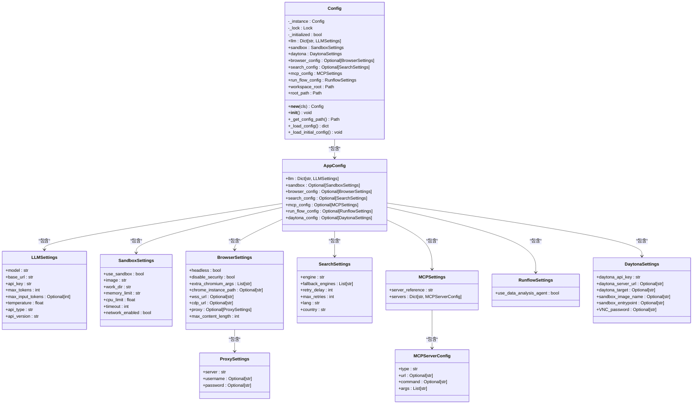

# 单例模式

<cite>
**Referenced Files in This Document**   
- [config.py](file://app/config.py)
- [config.example.toml](file://config/config.example.toml)
</cite>

## 目录
1. [引言](#引言)
2. [核心组件分析](#核心组件分析)
3. [单例模式实现原理](#单例模式实现原理)
4. [配置加载与懒加载机制](#配置加载与懒加载机制)
5. [UML类图](#uml类图)
6. [线程安全与性能保障](#线程安全与性能保障)
7. [开发者使用指南](#开发者使用指南)
8. [结论](#结论)

## 引言
在OpenManus项目中，`Config`类采用单例模式实现全局配置管理，确保系统中仅存在一个配置实例。这种设计模式对于维护配置一致性、避免资源浪费和保证线程安全至关重要。本文将深入分析`Config`类如何通过双重检查锁定（Double-Checked Locking）实现线程安全的单例模式，并探讨其与配置文件的映射关系。

## 核心组件分析

`Config`类是OpenManus项目的核心配置管理组件，负责加载和管理应用程序的各种配置参数。该类通过单例模式确保全局唯一性，避免了多个实例导致的配置不一致问题。

**Section sources**
- [config.py](file://app/config.py#L196-L368)

## 单例模式实现原理

`Config`类通过经典的双重检查锁定机制实现了线程安全的单例模式。其核心在于`__new__`方法中的双重检查逻辑：

```python
def __new__(cls):
    if cls._instance is None:
        with cls._lock:
            if cls._instance is None:
                cls._instance = super().__new__(cls)
    return cls._instance
```

这种实现方式结合了性能优化和线程安全：
1. 第一次检查避免了在实例已存在时获取锁的开销
2. 获取锁后进行第二次检查，确保在多线程环境下不会创建多个实例
3. 使用`threading.Lock()`保证临界区的互斥访问

`_instance`类变量存储唯一的实例引用，而`_lock`确保了初始化过程的线程安全。`_initialized`标志位则用于防止`__init__`方法被重复执行。

**Section sources**
- [config.py](file://app/config.py#L196-L206)

## 配置加载与懒加载机制

`Config`类实现了懒加载（lazy loading）策略，仅在首次访问时才加载配置文件，提高了启动性能。配置加载过程遵循以下优先级：
1. 首先尝试加载`config/config.toml`
2. 若不存在，则加载`config/config.example.toml`
3. 如果两者都不存在，则抛出`FileNotFoundError`

`_get_config_path`方法实现了这一逻辑，而`_load_config`方法使用`tomllib`解析TOML格式的配置文件。整个加载过程在`_load_initial_config`方法中完成，将原始配置数据转换为结构化的`AppConfig`对象。

**Section sources**
- [config.py](file://app/config.py#L217-L230)
- [config.example.toml](file://config/config.example.toml#L1-L106)

## UML类图



**Diagram sources**
- [config.py](file://app/config.py#L196-L368)

## 线程安全与性能保障

`Config`类的设计充分考虑了线程安全和性能优化：
- **双重检查锁定**：在保证线程安全的同时，最小化了同步开销
- **懒加载**：延迟配置文件的读取和解析，加快应用启动速度
- **全局唯一实例**：通过`_instance`静态变量确保整个应用生命周期中只有一个配置实例
- **初始化保护**：使用`_initialized`标志位防止多次初始化

这种设计确保了在多线程环境下，配置管理既安全又高效，避免了竞态条件和资源浪费。

**Section sources**
- [config.py](file://app/config.py#L196-L206)

## 开发者使用指南

开发者可以通过以下方式安全地访问和修改全局配置：

```python
from app.config import config

# 访问LLM配置
llm_config = config.llm

# 访问沙箱配置
sandbox_config = config.sandbox

# 访问浏览器配置
browser_config = config.browser_config

# 获取项目根路径
root_path = config.root_path

# 获取工作区根路径
workspace_root = config.workspace_root
```

由于`Config`类实现了单例模式，所有模块导入的`config`实例都是同一个对象，确保了配置的一致性。修改配置时需谨慎，因为这些更改会影响整个应用。

**Section sources**
- [config.py](file://app/config.py#L371-L371)

## 结论

`Config`类通过精巧的单例模式设计，为OpenManus项目提供了可靠、高效的配置管理机制。双重检查锁定确保了线程安全，懒加载优化了性能，而清晰的属性访问接口则简化了开发者的使用。这种设计模式不仅保证了配置的全局一致性，还为系统的可维护性和可扩展性奠定了坚实基础。