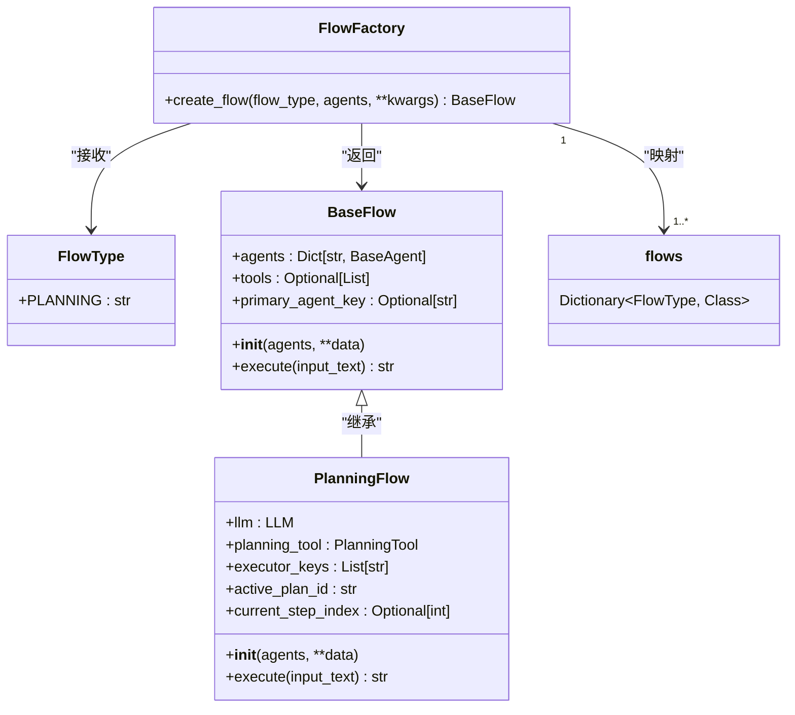

# 工厂模式

<cite>
**Referenced Files in This Document**   
- [flow_factory.py](file://app/flow/flow_factory.py)
- [base.py](file://app/flow/base.py)
- [planning.py](file://app/flow/planning.py)
- [base.py](file://app/agent/base.py)
- [planning.py](file://app/tool/planning.py)
</cite>

## 目录
1. [引言](#引言)
2. [工厂模式核心实现](#工厂模式核心实现)
3. [FlowType枚举与映射机制](#flowtype枚举与映射机制)
4. [UML类图：工厂与工作流关系](#uml类图工厂与工作流关系)
5. [创建自定义Flow的最佳实践](#创建自定义flow的最佳实践)
6. [结论](#结论)

## 引言
在OpenManus系统中，工厂模式被广泛应用于解耦对象的创建逻辑与使用逻辑，显著提升了系统的可扩展性和维护性。本文档重点阐述`FlowFactory`类如何通过`create_flow`方法实现不同工作流（如`PlanningFlow`）的动态创建。该设计模式允许系统在运行时根据配置或用户需求灵活地实例化具体的工作流类型，而无需在客户端代码中硬编码具体的类名。通过分析`FlowType`枚举和映射字典的实现，我们将深入理解其背后的类型安全和异常处理机制，并为开发者提供创建自定义工作流的指导。

## 工厂模式核心实现

`FlowFactory`类是工厂模式的核心实现，它提供了一个静态方法`create_flow`来封装工作流对象的创建过程。该方法接收一个`flow_type`参数，该参数是`FlowType`枚举的一个实例，用于指定需要创建的工作流类型。

`create_flow`方法的实现逻辑清晰：它维护一个字典`flows`，该字典将`FlowType`枚举值映射到对应的具体工作流类（如`PlanningFlow`）。当方法被调用时，它首先根据传入的`flow_type`在字典中查找对应的类。如果找到，则使用传入的`agents`参数和额外的关键字参数（`**kwargs`）来实例化该类并返回。如果未找到匹配的类型，则抛出一个`ValueError`异常，提示未知的流程类型。

这种设计将工作流的“使用”与“创建”完全分离。客户端代码只需知道`FlowFactory`和`FlowType`，而无需了解`PlanningFlow`等具体类的实现细节或构造函数签名。这极大地降低了代码的耦合度，使得添加新的工作流类型变得非常简单——只需在`flows`字典中添加一个新的映射，而无需修改任何现有的客户端代码。

**Section sources**
- [flow_factory.py](file://app/flow/flow_factory.py#L12-L29)
- [planning.py](file://app/flow/planning.py#L44-L441)

## FlowType枚举与映射机制

`FlowType`枚举是实现类型安全和清晰API的关键。它继承自`str`和`Enum`，定义了系统中所有可用的工作流类型。目前，系统只定义了`PLANNING = "planning"`这一种类型。使用枚举而非字符串字面量的好处在于，它提供了编译时的类型检查，防止了拼写错误，并且使代码更具可读性。

映射机制通过`FlowFactory`类中的`flows`字典实现。该字典的键是`FlowType`枚举成员，值是具体的工作流类。这种设计确保了类型安全，因为只有预定义的`FlowType`值才能作为键来查找对应的类。如果尝试使用一个不存在的`FlowType`，`get`方法将返回`None`，随后的`if not flow_class`检查会触发异常，从而在运行时捕获错误。

**Diagram sources**
- [flow_factory.py](file://app/flow/flow_factory.py#L8-L29)
- [base.py](file://app/flow/base.py#L8-L56)
- [planning.py](file://app/flow/planning.py#L44-L441)

**Section sources**
- [flow_factory.py](file://app/flow/flow_factory.py#L8-L9)
- [flow_factory.py](file://app/flow/flow_factory.py#L20-L23)

## UML类图：工厂与工作流关系

上图的UML类图清晰地展示了工厂模式中各组件的关系。`FlowFactory`类通过一个名为`flows`的字典（在图中表示为关联）将`FlowType`枚举与具体的工作流类（如`PlanningFlow`）关联起来。`FlowFactory`的`create_flow`方法是客户端代码的入口点，它依赖于`FlowType`和`BaseFlow`。

`BaseFlow`是一个抽象基类，定义了所有工作流必须实现的公共接口，特别是`execute`方法。`PlanningFlow`是`BaseFlow`的一个具体实现，它继承了基类的属性和方法，并提供了`execute`方法的具体逻辑。这种继承关系确保了所有由`FlowFactory`创建的工作流都遵循相同的接口，从而保证了客户端代码的兼容性。

## 创建自定义Flow的最佳实践

为OpenManus系统创建自定义的`Flow`类，开发者应遵循以下最佳实践：

1.  **继承`BaseFlow`**: 新的工作流类必须继承自`BaseFlow`抽象基类。这确保了新类具有`agents`、`tools`等核心属性，并且必须实现`execute`方法，从而保证了与系统其他部分的契约一致性。

2.  **实现`execute`方法**: `execute`方法是工作流的执行入口。开发者需要在此方法中定义具体的业务逻辑。建议将复杂的逻辑分解为多个私有方法（如`_create_initial_plan`、`_execute_step`），以提高代码的可读性和可维护性。

3.  **异常处理**: 在`execute`方法中，应使用`try...except`块来捕获和处理可能发生的异常。如`PlanningFlow`所示，捕获异常后应记录错误日志，并向调用者返回一个有意义的错误信息字符串，而不是让异常直接向上抛出。

4.  **类型安全**: 在类的属性定义中，应尽可能使用明确的类型注解（如`llm: LLM`），这有助于静态类型检查工具发现潜在的错误。

5.  **注册到工厂**: 创建完新的`Flow`类后，必须将其注册到`FlowFactory`的`flows`字典中。例如，如果创建了一个`ResearchFlow`，则需要在`flows`字典中添加`FlowType.RESEARCH: ResearchFlow`。同时，需要在`FlowType`枚举中定义`RESEARCH = "research"`。

6.  **利用依赖注入**: `BaseFlow`的`__init__`方法支持多种方式传入`agents`（单个Agent、Agent列表或字典），这为客户端提供了极大的灵活性。自定义的`Flow`类可以重写`__init__`方法来处理特定的初始化逻辑，如`PlanningFlow`中对`executors`和`plan_id`参数的处理。

7.  **状态管理**: 对于有状态的工作流，应定义清晰的状态字段（如`current_step_index`）来跟踪执行进度，并在执行过程中妥善更新这些状态。

**Section sources**
- [planning.py](file://app/flow/planning.py#L44-L441)
- [base.py](file://app/flow/base.py#L8-L56)
- [flow_factory.py](file://app/flow/flow_factory.py#L20-L23)

## 结论
工厂模式在OpenManus中的应用是解耦和可扩展性设计的典范。通过`FlowFactory`和`FlowType`的组合，系统实现了工作流创建的集中化和类型安全。`PlanningFlow`作为具体实现，展示了如何构建一个功能完整、健壮的工作流。对于开发者而言，遵循继承基类、实现核心方法、妥善处理异常和正确注册到工厂的最佳实践，可以轻松地为系统扩展新的工作流能力，而不会破坏现有的代码结构。这种设计模式是构建大型、可维护软件系统的重要基石。